# Production Deployment Guide

**Version**: 1.0  
**Owner**: `ml-validation-suite-agent`  
**Updated**: 2026-05-27  
**D2 exit criteria**: #4 — rollback procedure documented and tested

---

## Purpose

This guide documents the full deployment lifecycle for ML models and the Codex platform,
including rollback procedures, health checks, and escalation paths.

---

## Deployment Pipeline

```mermaid
flowchart LR
    subgraph TRAIN["Train & Evaluate"]
        T1["nox -s ml_tests\ntrain + eval"]
        T2["mlflow run\nlog metrics + artifacts"]
        T3["Model Registry\nregister versioned entry"]
    end

    subgraph CI["CI Gate"]
        C1["ml-lifecycle-gate.yml\nreproducibility check"]
        C2["serving smoke test\ntest_serving_smoke.py"]
        C3["coverage-ratchet.yml\n≥80% coverage"]
    end

    subgraph DEPLOY["Deploy"]
        D1["Tag release\ngit tag v{major}.{minor}.{patch}"]
        D2["SBOM generation\nnox -s sbom → artifacts/sbom/"]
        D3["Serve endpoint\nnox -s serve or docker compose up"]
    end

    subgraph VERIFY["Verify"]
        V1["Health check\nGET /health → 200"]
        V2["Canary request\nPOST /infer with golden fixture"]
        V3["Metrics spike check\nlatency P95 < 600ms"]
    end

    TRAIN --> CI
    CI --> DEPLOY
    DEPLOY --> VERIFY
```



---

## Rollback Procedure

### Trigger Conditions

Rollback is triggered when ANY of:
- Serving endpoint returns non-2xx for > 5 % of requests over 5 minutes
- P95 latency > 1 200 ms (2× SLO budget)
- Critical exception rate > 0.1 % in serving logs
- Manual decision by @mbaetiong

### Steps

1. **Identify last known-good version**
   ```bash
   mlflow models list --name codex_model | head -5
   # or
   git tag --sort=-version:refname | head -5
   ```

2. **Restore previous model version**
   ```bash
   # Point serving at previous model URI
   export MLFLOW_MODEL_URI="models:/codex_model/<previous_version>"
   nox -s serve
   ```

3. **Verify rollback health**
   ```bash
   curl -f http://localhost:8000/health
   python -m pytest tests/integration/test_serving_smoke.py -x -q
   ```

4. **Create incident issue**
   - Title: `[ROLLBACK] v{version} serving degradation`
   - Label: `incident`, `ml-serving`
   - Assign: @mbaetiong + `performance-monitor-agent`

5. **Root cause analysis**
   - Pull serving logs: `docker logs codex_serve 2>&1 | tail -200`
   - Check mlflow run metrics for the failed version
   - Review `reports/ml/serving_metrics_latest.json`

---

## Reproducibility Requirements (D2 #1)

All model training runs must be reproducible:

| Requirement | Implementation | Verified by |
|-------------|---------------|-------------|
| Fixed random seed | `PYTHONHASHSEED=42` + `torch.manual_seed(42)` | `reports/reproducibility.md` |
| Frozen dependencies | `requirements/lock.txt` + `uv.lock` | `nox -s sbom` |
| Dataset checksums | `tests/data/` manifest hashes | `pytest tests/data/` |
| Hydra config logged | `config.yaml` saved to each run dir | `scripts/ml/validate_ml_lifecycle.py` |
| Artifact checksums | `dvc repro` or equivalent | `nox -s ml_tests` |
| Environment metadata | Python version + platform captured | `scripts/ml/validate_ml_lifecycle.py` |

To verify reproducibility end-to-end:
```bash
python scripts/ml/validate_ml_lifecycle.py --check reproducibility
```

---

## E2E Gate (D2 #5)

CI enforces the full E2E pipeline via `.github/workflows/ml-lifecycle-gate.yml`:

| Check | Workflow job | Passes when |
|-------|-------------|-------------|
| Reproducibility | `reproducibility-check` | ≥5/6 items ✅ |
| Serving smoke | `serving-smoke` | pytest exit 0 |
| Model registry | `model-registry-audit` | Registry path exists |

Run locally:
```bash
python scripts/ml/validate_ml_lifecycle.py --check all
```

---

## Change Log

| Date | Version | Change |
|------|---------|--------|
| 2026-05-27 | 1.0 | Initial version — D2 #4 rollback procedure + E2E gate wiring |
