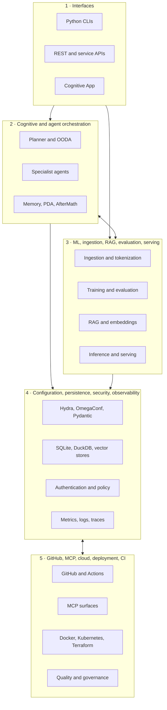
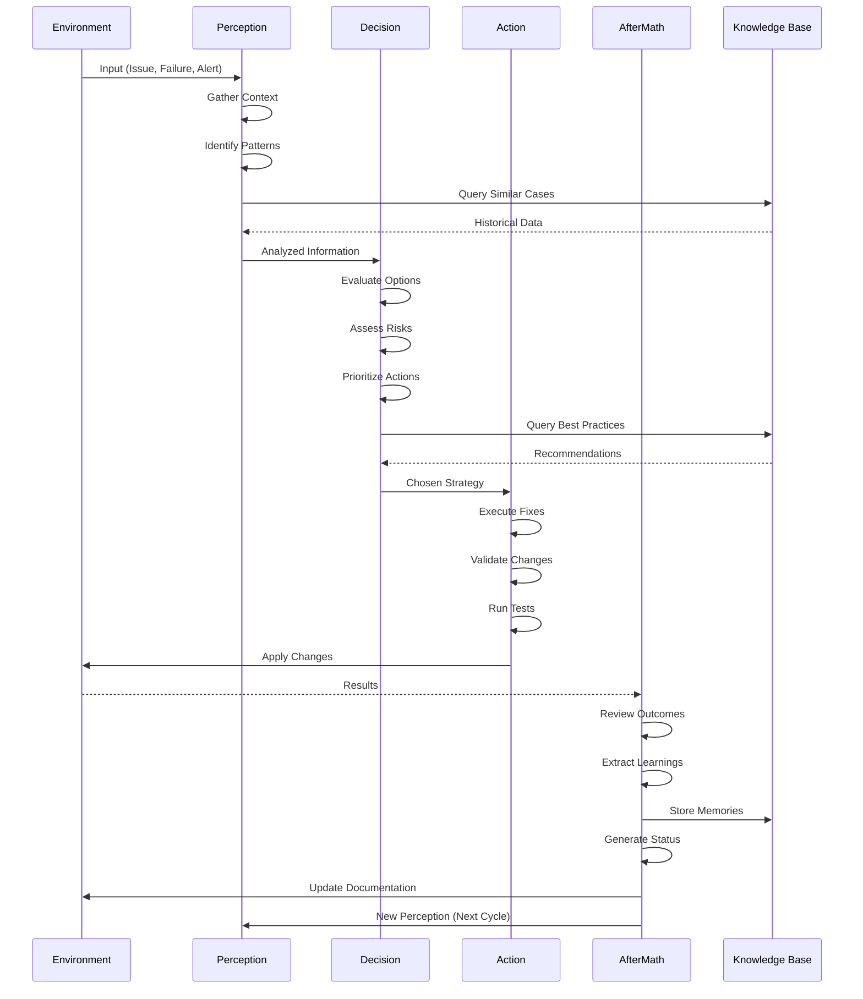
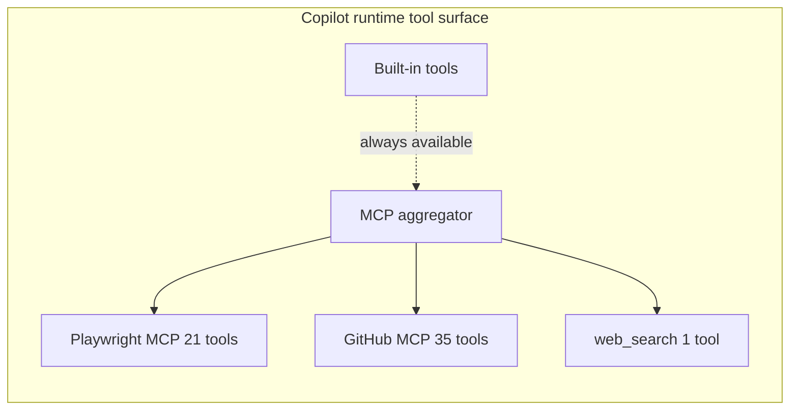

# `_codex_` Repository Explanation

> **Package:** `codex-ml` 0.3.0  
> **Python:** >=3.12  
> **License:** MIT  
> **Document owner:** built-in Copilot coding agent  
> **Authority:** canonical manifests and source code, not historical status reports  
> **Last source audit:** 2026-08-02  

This document explains the structure, goals, technologies, and organization of the `Aries-Serpent/_codex_` repository. It is written for new contributors, agents, and maintainers. Counts that change at runtime are dated. A component marked **implemented** exists in source; that label alone does not prove that it is deployed or enabled.

For accelerated orientation, use the concise [repository map](REPOSITORY_MAP.md)
and [role-based onboarding](onboarding/README.md).

The repository narrative uses these boundaries consistently:

- `src/` is the canonical boundary for new Python implementation.
- Selected root packages are historical compatibility or packaging bridges unless
  `pyproject.toml` explicitly says otherwise.
- `docs/` contains human-facing guidance and architecture.
- `.codex/` and `.github/workflows/` are the operational-intelligence and governance
  layers, supported by `scripts/ci/`.

---

## 1. Status vocabulary

| Label | Meaning |
|---|---|
| **Implemented** | Source, configuration, or a runnable entry point exists. |
| **Optional** | Implemented behind an extra dependency profile, service, or explicit configuration. |
| **Experimental** | A prototype, scaffold, experiment, or non-default integration. |
| **Compatibility** | Retained to support an older import, layout, or configuration path. |
| **Historical** | Evidence about an earlier state; not a current contract. |
| **Aspirational** | A design or roadmap statement without a complete implementation contract. |

Authoritative package facts come from [`pyproject.toml`](../pyproject.toml), frontend facts from [`cognitive_app/package.json`](../cognitive_app/package.json), Rust facts from [`Cargo.toml`](../Cargo.toml), and test discovery from [`pytest.ini`](../pytest.ini).

## Active runtime policy

- Python: `>=3.12` is the primary project runtime baseline.
- Node.js: active code and workflows are on `Node.js 22+`.
- Live manifests in `package.json`, `cognitive_app/package.json`, and `copilot/extension/package.json` all declare `>=22.0.0`.
- Active workflows under `.github/workflows/` use `actions/setup-node` with `node-version: '22'` or a repo-variable default that resolves to 22.
- Node.js 20 references are historical and archival only; they appear in disabled or archived workflow copies and are not current policy unless explicitly re-enabled.

---

## 2. What the repository is for

`_codex_` combines an ML platform with repository automation and a persistent decision-and-learning layer. Its implemented surfaces support these journeys:

| Journey | Principal path | Status |
|---|---|---|
| Train or evaluate a model | CLI → Hydra/OmegaConf config → ingestion/tokenization → `codex_ml` training/evaluation | Implemented; heavy ML packages are optional |
| Run inference or serve a model | `codex_ml` serving/inference → FastAPI or Ray Serve integration | Optional runtime profile |
| Ingest and retrieve knowledge | ingestion → chunking/embedding → `rag` retrieval and evaluation | Implemented; vector backends vary by profile |
| Process repository signals | GitHub/CI/security observation → logging, recommendation, or specialist tooling | Partly operational; there is no unified autonomous OODA runtime |
| Preserve operational learning | CI failure/fix records, session records, and several independent memory engines | Fragmented; JSONL logging is operational, adaptive policy learning is experimental |
| Expose repository tools | internal `src/mcp` JSON-RPC/HTTP server or Copilot runtime MCP aggregator | Two distinct implemented surfaces |
| Operate the dashboard | React/Vite Cognitive App → API and telemetry surfaces | Implemented frontend; deployment is environment-specific |
| Govern delivery | pytest/nox/pre-commit/Ruff/mypy plus GitHub Actions and CodeQL declarations | Implemented tooling and workflow definitions |

The repository is therefore both a Python distribution and an agent-operated engineering workspace. It is **not** one monolithic service.

---

## 3. Claims vs. actual findings

The README and some docs contain marketing-style claims that diverge from on-disk evidence. The explanation below uses neutral, evidence-based wording.

| Claim (where seen) | Actual finding (2026-08-02) | Recommended neutral wording |
|---|---|---|
| "1,247 tests" (README badge) | 2,903 `test_*.py` files; 5,496 `test_*` functions; internal docs claim 21,500+ tests. Counts are inconsistent and unverified in this session. | "The repository contains thousands of test files and test functions across `tests/`; see `pytest.ini` and CI artifacts for current collection results." |
| "90.2% coverage" (README badge) | `pyproject.toml` `fail_under = 34`; internal docs report 10.7%; 139/943 `src/` modules have no import reference in tests. | "Coverage baseline is 34% (locked 2026-07-02); 80%+ is an aspirational target. See `.codex/COVERAGE_GAP_REPORT.md`." |
| "0 CVEs" / "zero known vulnerabilities" (README) | Security status changes over time and is tracked by repository alerts and audit records. | "Dependencies are audited; see `SECURITY.md`, current security alerts, and `pyproject.toml` for the active dependency policy." |
| "145 active autonomous agents" (README badge) | `agents/AGENT_CONSOLIDATION_MATRIX.md` shows 159 registry entries, 145 active after Phase 5, **131 active after Phase 6** (14 archived/deprecated). | "The agent registry contains 159 entries; 131 are active after Phase 6 consolidation." |
| Fixed workflow counts (`CODEBASE_COGNITIVE_MAP.md`) | Workflow inventory changes frequently as definitions are consolidated or restored. | "Active workflows live under `.github/workflows/`; use a current filesystem or API inventory for counts." |
| "fully production-certified MLOps platform" / "100% production readiness" (README) | Coverage is 34% baseline, 139 modules untested, multiple roadmap phases unstarted, Genesis Protocol disabled by default. | "v0.3.0 provides stable core functionality; production deployment should review `.codex/COVERAGE_GAP_REPORT.md` and readiness checklists." |
| "continuous autonomous maintenance" (README) | Genesis Protocol is in pre-token state; workflows disabled by default; `SAFE_MODE = True`; `autonomous_actions_enabled: false`. | "Autonomous automation templates exist but are disabled by default; human admin setup is required." |
| Local MCP aggregator on `:2301` (`.codex/docs/COPILOT_MCP_TOOL_REFERENCE.md`) | `copilot/extension/server/index.js` is an Express proxy to an ITA service on port 3978; no JSON-RPC, tool aggregation, Playwright subprocess, or GitHub MCP client code was found. | "The Copilot runtime exposes tools through a runtime aggregator (environment-provided); repository code includes an ITA proxy shim, not an MCP aggregator." |

---

## 4. Canonical five-layer architecture



| Layer | Primary owner(s) | Main evidence |
|---|---|---|
| Interfaces | `cognitive-brain-cli-agent`, `github-pages-manager` | `src/codex_ml/cli/`, `src/codex_cli/`, `services/`, `cognitive_app/` |
| Cognitive/orchestration | `cognitive-brain-session-injector`, `orchestrator-agent` | `src/cognitive_brain/`, `src/aries_serpent_core/brain/`, `agents/` |
| ML/RAG | `ml-validation-suite-agent`, `rag-module-management-agent` | `src/codex_ml/`, `src/rag/`, `src/training/` |
| Platform controls | `config-validator`, `bridge-security-monitor`, `performance-monitor-agent` | `configs/`, memory backends, `src/security/`, observability modules |
| Integrations/delivery | `github-guru-agent`, `workflow-management-agent`, `INFRA_LINTER_AGENT_PROMPT` | `src/mcp/`, `.github/workflows/`, `docker/`, `k8s/`, `infrastructure/` |

---

## 5. Repository map

The short, navigable version is maintained in
[`docs/REPOSITORY_MAP.md`](REPOSITORY_MAP.md). The tables below provide the detailed
component inventory.

### Canonical and primary locations

| Path | Responsibility |
|---|---|
| `src/codex_ml/` | Main ML distribution: CLI, data, training, evaluation, plugins, inference, and serving. |
| `src/cognitive_brain/` | Shared cognitive contracts plus standalone analytics, uncertainty, learning, memory, and coordination experiments. |
| `src/aries_serpent_core/brain/` | Optional OODA demonstration, pattern/checkpoint utilities, session resume, and independent STM→LTM engines. |
| `src/aries_serpent_core/skills/` | Active Cognitive Brain skill manifests and handlers. |
| `src/mcp/` | Repository-owned MCP implementation and supporting adapters/workers. |
| `src/rag/` | Retrieval, embedding, indexing, evaluation, and experimental retrieval pipelines. |
| `agents/` | Root-packaged orchestration primitives and autonomous agent logic. |
| `services/` | Root-packaged API and service applications, including optional FastAPI surfaces. |
| `cognitive_app/` | React 19/TypeScript/Vite dashboard. |
| `configs/` | Primary configuration profiles, schemas, and development configuration. |
| `scripts/` | Validation, CI, packaging, audit, maintenance, and operational commands. |
| `tests/` | Default pytest discovery root and cross-subsystem regression suites. |
| `docs/` | Human-facing architecture, operations, API, and contributor guidance. |
| `.codex/` | Agent runtime state, policy, dated analyses, and Cognitive Brain artifacts. |
| `docker/`, `k8s/`, `deploy/`, `infrastructure/` | Deployment declarations for containers, Kubernetes/Helm, and cloud infrastructure. |

### Compatibility, split, and experimental locations

| Path | Classification | Current interpretation |
|---|---|---|
| `conf/` | Compatibility/split | Some minimal loaders still read it; `configs/` is the primary profile tree. |
| `training/`, `tokenization/` | Root-package compatibility | Explicit setuptools mappings coexist with `src/` implementations. New imports should use installed package names, never `src.*`. |
| `codex_utils/`, `src/codex_utils/` | Compatibility | The `src` package proxies the root implementation. |
| `config_legacy/`, `yaml_legacy/`, `src/hydra_extra/` | Compatibility | Legacy or placeholder configuration surfaces. |
| `cli/` | Historical | Excluded from package discovery; packaged CLIs live under `src/codex_ml/cli/` and `src/codex_cli/`. |
| `src/quantum/` and `src/cognitive_brain/quantum/` | Experimental/implemented mix | Classical uncertainty and alternative-scoring code; not quantum hardware integration. |
| Root `Cargo.toml` and Rust sources | Experimental companion runtime | PyO3-based swarm engine built separately with Maturin. |

---

## 6. The `src/` import boundary

Installed code imports top-level packages such as `codex_ml`, `codex`, `mcp`, `rag`, or `cognitive_brain`; it does **not** import them through `src.*`.

`pytest.ini` deliberately sets:

```ini
pythonpath = src
```

The repository root was removed from pytest's explicit Python path so root compatibility packages cannot silently shadow packages under `src/`, especially `training` and `tokenization`. Setuptools still has explicit root mappings for a small compatibility set, so packaging and test isolation are related but not identical contracts. Contributors should:

1. Put new Python implementation code under the appropriate `src/` package.
2. Import by installed package name.
3. Treat root mirrors as compatibility surfaces unless the package manifest says otherwise.
4. Run tests under the configured `src` boundary rather than adding the repository root to `PYTHONPATH`.

---

## 7. Cognitive Brain objectives

The Cognitive Brain is a decision-and-learning layer, not a single service. Its objectives are:

- **OODA loops**: Observe → Orient → Decide → Act (`src/cognitive_brain/base.py`).
- **PDA loop**: Perception → Decision → Action → AfterMath (`docs/cognitive_brain/architecture/COGNITIVE_BRAIN_ARCHITECTURE_PHASE_11.md`).
- **Memory**: short-term and long-term memory, pattern libraries, and knowledge bases.
- **Self-healing**: discovery → identify → prioritize → implement → validate → optimize → review.
- **Agent orchestration**: route tasks to specialist agents and persist learnings across sessions.



The agent registry contains 159 entries; 131 are active after Phase 6 consolidation. Unified entry points include `unified-coverage-agent`, `unified-doc-agent`, `unified-security-scanner`, `ci-testing-agent`, `ci-emergency-response-agent`, and `cache-management-agent`. See `agents/AGENT_CONSOLIDATION_MATRIX.md` for the full merge/archive map.

---

## 8. Key technologies

### Core Python stack
- **Python** >=3.12
- **CLI**: Typer, Click
- **Configuration/validation**: Hydra, OmegaConf, Pydantic, pydantic-settings, PyYAML, marshmallow
- **Code analysis**: libcst, parso, radon, Jinja2, tree-sitter, sqlparse

### ML / AI
- **Data**: pandas, numpy, scikit-learn, sentencepiece
- **Training/inference**: torch, transformers, datasets, accelerate, PEFT
- **RAG/embedding**: sentence-transformers, chromadb, faiss-cpu

### Web / serving
- **Frameworks**: FastAPI, Litestar, Starlette, SlowAPI
- **Distributed serving**: Ray Serve
- **HTTP client**: httpx

### Data / storage
- **Analytic**: DuckDB
- **Structured**: SQLite
- **Vector**: ChromaDB, FAISS
- **Tracking**: MLflow, Weights & Biases (optional)

### Security
- cryptography, PyJWT, PyNaCl, pyOpenSSL, certifi, urllib3, requests, defusedxml

### Frontend
- React 19, TypeScript, Vite, Tailwind CSS (`cognitive_app/`)

### CI / quality
- GitHub Actions, nox, pytest, Black, Ruff, isort, mypy, pre-commit
- Security: CodeQL, Semgrep, Bandit, Gitleaks

### Optional Rust companion
- PyO3/Maturin swarm engine (`Cargo.toml`, `rust_swarm/`)

---

## 9. MCP Server capabilities

The repository has two distinct MCP-related surfaces.

### 9.1 Internal MCP (`src/mcp/`)

A repository-owned Model Context Protocol implementation with:

- `registry.py` — tool registration and checksums
- `auth.py` — authentication/authorization primitives
- `rate_limit.py` / `middleware/` — rate limiting
- `versioning.py` — semantic version negotiation
- `lifecycle.py` — lifecycle state machine
- `observability.py` — metrics, tracing, structured logging
- `server/` — HTTP/JSON-RPC transport, middleware, health routes, safety checks
- `adapters/` — Pinecone, mock, Zendesk backends
- `workers/` — embedding and checkpoint workers
- `errors.py`, `config.py`, `tools/`

Status: **implemented** with tests under `tests/mcp/`, though some modules have no test references (see `.codex/COVERAGE_GAP_REPORT.md` §3.1).

### 9.2 Copilot runtime MCP

The Copilot coding agent runtime exposes a merged tool set through an environment-provided MCP aggregator. The repository documents this surface in `.codex/docs/COPILOT_MCP_TOOL_REFERENCE.md` and captures an inventory in `.codex/mcp/runtime_inventory_2026-08-01.json`:



| Surface | Count | Notes |
|---|---|---|
| `playwright-browser_*` | 21 | Browser automation: navigate, click, type, snapshot, evaluate, etc. |
| `github-mcp-server-*` | 35 | Read-only GitHub MCP: Actions, Issues, PRs, commits, code, releases, security, discussions, discovery |
| `web_search` | 1 | Standalone research companion tool |
| Built-in tools | many | `view`, `edit`, `bash`, `report_progress`, `task`, `code_review`, `codeql_checker`, etc. |

**Important**: The repository's own `copilot/extension/server/index.js` is an Express proxy to an ITA service, not an MCP aggregator. The runtime aggregator is provided by the Copilot Cloud Agent environment, not by code in this repository.

---

## 10. Packaged entry points and dependency profiles

`pyproject.toml` declares five console scripts:

| Command | Target |
|---|---|
| `codex` | `codex_ml.cli.main:cli` |
| `codex-ml` | `codex_ml.cli.main:cli` |
| `codex-ml-cli` | `codex_ml.cli.main:cli` |
| `codex-cli` | `codex_ml.cli.simple_cli:main` |
| `codex-smoke` | `codex_cli.app:app` |

The supported install model is:

| Profile | Meaning |
|---|---|
| Base | Configuration, validation, CLI, code analysis, security, and utilities. |
| `core` | Lightweight offline-oriented feature set; overlaps intentionally with base. |
| `runtime` | Numeric/ML inference, FastAPI/Litestar, Ray Serve, telemetry, DuckDB, and RAG dependencies. |
| `full` | Runtime plus training, evaluation, tracking, data validation, testing, and developer tools. |
| `all`, `dev`, `ml`, `train`, `test-core` | Compatibility aliases declared for older installers. |

Heavy technologies (torch, transformers, ray, etc.) are **not** base requirements; they are optional behind the `runtime`/`full` profiles.

---

## 11. Where to start by task

| Contributor task | Start here | Deeper guide | Owner |
|---|---|---|---|
| Training/evaluation | `src/codex_ml/training/`, `src/codex_ml/eval/`, `configs/` | [Training workflow](training/TRAINING_WORKFLOW.md) | `ml-validation-suite-agent` |
| Inference/serving | `src/codex_ml/serving/`, `src/codex_ml/cli/infer.py`, `services/` | [Inference serving guide](INFERENCE_SERVING_GUIDE.md) | `performance-monitor-agent` |
| RAG and ingestion | `src/rag/`, ingestion modules, embedding registries | [RAG quickstart](rag/RAG_QUICKSTART.md) | `rag-module-management-agent` |
| Cognitive Brain | `src/cognitive_brain/`, `src/aries_serpent_core/brain/` | [Cognitive architecture](cognitive_brain/architecture/COGNITIVE_BRAIN_ARCHITECTURE_PHASE_11.md) | `cognitive-brain-session-injector` |
| Internal MCP | `src/mcp/` | [MCP capability reference](mcp/MCP_CAPABILITIES_REFERENCE.md) | `skills-master-agent` |
| Copilot MCP runtime | `.codex/docs/COPILOT_MCP_TOOL_REFERENCE.md` | [Exact GitHub inventory](../.codex/docs/MCP_GITHUB_CAPABILITIES.md) | `github-guru-agent` |
| Custom agents | profile registry, `scripts/validate_agent_specs.py` | [Custom-agent index](agent/CUSTOM_AGENT_DOCUMENTATION_INDEX.md) | `skills-master-agent` |
| Cognitive App | `cognitive_app/src/`, `cognitive_app/package.json` | [Connection guide](agent/COGNITIVE_APP_CONNECTION_GUIDE.md) | `github-pages-manager` |
| CI/security/governance | `.github/workflows/`, `scripts/ci/`, `src/security/` | [Copilot Agent API reference](ci/GITHUB_API_COPILOT_AGENT_REFERENCE.md) | `workflow-compliance-guardian` |

### Quick-start commands by task

Run these from the repository root after `pip install -e .` (add `[runtime]` or `[full]` extras when ML/Ray packages are needed).

```bash
# Training/evaluation — list training configs and start a tiny offline training smoke test
codex train --config-name=training/offline/tiny_functional max_steps=10

# Inference/serving — local stub-model inference via the console entry point
codex-ml infer --model-name stub --prompt "hello codex" --max-new-tokens 16
# Or start the FastAPI inference server (requires runtime/full profile)
export CODEX_MODEL_TYPE=stub
python -m codex_ml.serving.inference_server

# RAG and ingestion — run the RAG retrieval smoke tests (imports require the `src` path context set by pytest.ini)
pytest tests/rag -k "retrieval or embedding" -q --no-header

# Cognitive Brain — start the CLI API server from the repo root (auto-started in Copilot sessions by copilot-setup-steps.yml)
PYTHONPATH=. uvicorn cognitive_app.server.cli_api_server:app --host 0.0.0.0 --port 8765 &
curl -s http://localhost:8765/api/health

# Internal MCP — validate that the local MCP server class is importable
PYTHONPATH=src python -c "from mcp.server import MCPServer; print('OK')"

# Custom agents — validate all registered agent specs
python scripts/validate_agent_specs.py --check

# Cognitive App — install dependencies and start the Vite dev server
cd cognitive_app
npm install
npm run dev

# CI/security/governance — run lint/format and the test suite on changed files
pre-commit run --files $(git diff --name-only)
nox -s tests
```

### Important boundaries

- **Internal MCP (`src/mcp/`)** is the repository's own JSON-RPC/FastAPI MCP server. It is separate from the **Copilot MCP runtime**, which is provided by the Copilot environment and documented in `.codex/docs/COPILOT_MCP_TOOL_REFERENCE.md`.
- **`copilot/extension/server/index.js`** is an ITA proxy shim, not an MCP aggregator. The actual GitHub MCP tools are surfaced by the runtime aggregator.
- **Autonomous workflows** (Genesis Protocol) are disabled by default. Set `autonomous_actions_enabled: true` and inject admin secrets only after following [`docs/admin/GENESIS_SETUP_GUIDE.md`](admin/GENESIS_SETUP_GUIDE.md).

---

## 12. CI/CD and governance

### Quality gates
- **Tests**: pytest via nox (`nox -s tests`). `pytest.ini` sets `pythonpath = src`.
- **Lint/format**: Black, Ruff, isort.
- **Type check**: mypy.
- **Pre-commit**: hooks run on changed files.
- **Coverage**: `pyproject.toml` sets `fail_under = 34` (locked 2026-07-02); 80%+ is an aspirational target.
- **Security**: CodeQL, Semgrep, Bandit, Gitleaks, pip-audit.

### Key workflow categories (`.github/workflows/`)
- Status validation, security gates, nox gates, optimized CI
- MCP packaging, secret scanning, PR size analysis, telemetry collection
- Self-healing and agent-automation workflows

### Agentic repo state
- `COPILOT_AGENT_AUTH_ENABLED=true` (permanent repo variable)
- `COPILOT_AGENT_MAX_AUTONOMY_LEVEL=D`
- WEC always-required items are pre-checked
- Token chain: `CODEX_MASTER_KEY → CODEX_BACKUP_KEY → github.token`

### Governance rules
- `.codex/CODEBASE_AGENCY_POLICY.md` mandates no deferral of found issues.
- WEC (Workflow Execution Checklist) must be preserved in PR bodies.
- REQ-4 (`AGENT_ACCOUNTABILITY_REPORT.md`) and REQ-5 (`CHANGELOG.md`) must be updated per session.

---

## 13. Known gaps and caveats

- **Coverage**: 34% baseline; 139 `src/` modules (14.7%) have no import reference in `tests/`. High-risk untested packages include `restore_pipeline`, `codex_bridge`, and parts of `mcp`.
- **Cognitive Brain tests**: `tests/cognitive_brain/` exists, but some cognitive modules are only exercised indirectly.
- **MCP aggregator**: The Copilot runtime aggregator is environment-provided; the repository's `copilot/extension/server/index.js` is an ITA proxy, not an MCP aggregator.
- **Genesis Protocol**: Autonomous workflows are disabled by default and require human admin secret injection.
- **Agent counts**: README badge is stale (145); actual active count is 131 post-Phase 6.
- **Workflow counts**: treat generated filesystem or API inventories as authoritative;
  fixed counts in narrative documentation become stale.

---

## 14. Related references

- [`docs/EXPLAIN_REPOSITORY_BRIEFING.md`](EXPLAIN_REPOSITORY_BRIEFING.md)
- [`docs/system/CODEBASE_COGNITIVE_MAP.md`](system/CODEBASE_COGNITIVE_MAP.md)
- [`docs/cognitive_brain/architecture/COGNITIVE_BRAIN_ARCHITECTURE_PHASE_11.md`](cognitive_brain/architecture/COGNITIVE_BRAIN_ARCHITECTURE_PHASE_11.md)
- [`.codex/docs/COPILOT_MCP_TOOL_REFERENCE.md`](../.codex/docs/COPILOT_MCP_TOOL_REFERENCE.md)
- [`agents/AGENT_CONSOLIDATION_MATRIX.md`](../agents/AGENT_CONSOLIDATION_MATRIX.md)
- [`.codex/COVERAGE_GAP_REPORT.md`](../.codex/COVERAGE_GAP_REPORT.md)
- [`SECURITY.md`](../SECURITY.md)
- [`pyproject.toml`](../pyproject.toml)
- [`pytest.ini`](../pytest.ini)
