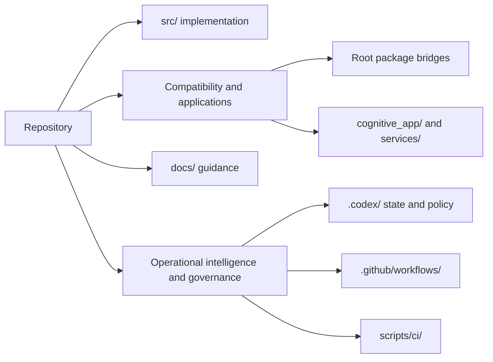

# Repository map

This is the concise contributor-facing map of `_codex_`. For component details and
status vocabulary, use the [repository explanation](REPOSITORY_EXPLANATION.md).

## Master overview

`_codex_` is both a Python ML distribution and an agent-operated engineering
workspace. The repository has four boundaries:

1. **Implementation:** `src/` is the canonical home for new Python implementation.
2. **Compatibility and applications:** selected root packages are packaging bridges;
   `cognitive_app/`, `services/`, and infrastructure trees are distinct application
   or deployment surfaces.
3. **Guidance:** `docs/` explains architecture, onboarding, and operations.
4. **Operations and governance:** `.codex/`, `.github/workflows/`, and `scripts/ci/`
   hold state, policy, workflow definitions, and automation.

## Active runtime policy

`_codex_` is a Python-first platform with a Node.js 22 active runtime layer. The current
implementation policy is: Node.js 22 for all active application manifests and workflow
definitions; historical Node.js 20 references are archival and disabled-only, not active
project policy.

The active sources of truth are the live manifests (`package.json`, `cognitive_app/package.json`,
`copilot/extension/package.json`) and the active workflow definitions under
`.github/workflows/`. Archive copies under `.github/workflow-archive/disabled/` are
historical references, not live runtime requirements.

## Core directories

| Path | Use it for |
|---|---|
| `src/codex_ml/` | ML CLI, data, training, evaluation, inference, serving, and plugins |
| `src/codex/` | Ingestion, analysis, transformation, and verification |
| `src/cognitive_brain/` | Cognitive contracts, memory, learning, and coordination |
| `src/rag/` | Retrieval, embeddings, indexing, and evaluation |
| `src/mcp/` | Repository-owned MCP implementation |
| `configs/` | Primary Hydra configuration |
| `tests/` | Default pytest discovery and regression suites |
| `cognitive_app/` | React/TypeScript/Vite dashboard |

Root folders such as `training/`, `tokenization/`, and `codex_utils/` have explicit
packaging mappings or proxies. Treat them as compatibility/bridge surfaces unless
`pyproject.toml` identifies them as the active package location.

## Operational directories

| Path | Use it for |
|---|---|
| `docs/` | Current human-facing guidance and architecture |
| `.codex/` | Agent policy, session state, memory evidence, and operational records |
| `.github/workflows/` | Active GitHub Actions definitions |
| `scripts/ci/` | CI checks, orchestration, telemetry, and remediation |
| `agents/` | Packaged agent orchestration primitives |
| `docker/`, `k8s/`, `deploy/`, `infrastructure/` | Deployment declarations |

## Role-specific shortcuts

- [Contributor](onboarding/CONTRIBUTOR.md)
- [ML engineer](onboarding/ML_ENGINEER.md)
- [GitHub Actions maintainer](onboarding/GITHUB_ACTIONS_MAINTAINER.md)
- [Agent/session operator](onboarding/AGENT_SESSION_OPERATOR.md)

