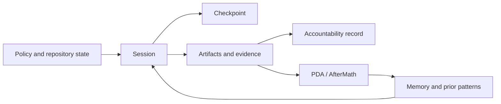

# Session and agent-state guide

The repository's **operational intelligence layer** records how agent work is planned,
executed, checked, and carried between sessions. It complements git history; it does
not replace source code or package configuration as the implementation authority.

## State surfaces

| Surface | Purpose | Typical examples |
|---|---|---|
| `.codex/` | Policy, machine-readable state, operational references, and dated evidence | `agent_context.json`, `CODEBASE_AGENCY_POLICY.md` |
| Agent memory | Retained observations and patterns used to recover context | STM/LTM stores, pattern records, session context |
| Checkpoints | Explicit resumable boundaries for a process or session | `.codex/checkpoints/`, checkpoint utilities under `src/` |
| Session artifacts | Evidence generated while work runs | session logs, startup packets, diagnostics, reports |
| PDA/AfterMath | Plan/do/assess outcomes and learned patterns | `.codex/aftermath/pda_iterations.jsonl` |
| Accountability | Human-readable record of objectives, actions, agents, and validation | `docs/accountability/AGENT_ACCOUNTABILITY_REPORT.md` |

## Authority and lifecycle

1. Read policy and repository state before starting.
2. Use memory and prior evidence as context, not as proof of current implementation.
3. Create checkpoints at meaningful resumable boundaries.
4. Treat generated session artifacts as evidence with timestamps and provenance.
5. Record completed work and validation in accountability and PDA/AfterMath records.
6. Re-check source, manifests, and live workflow state when historical records disagree.

## Parallel agent lanes

Give every independent lane a named objective and owner. Run lanes concurrently, then
synchronize before edits that touch shared files. Record which agents contributed and
which evidence was accepted in the final accountability entry.

## `/chronicle search` keywords

`/chronicle search` is the conceptual search surface used in task descriptions. The
repository CLI invocation is `python -m aries_serpent_core.cli chronicle search`.
Use these stable terms when searching session history:

| Topic | Suggested search keywords |
|---|---|
| Workflow compliance | `workflow compliance`, `WEC`, `governance gate` |
| Self-healing CI | `self-healing CI`, `CI pattern healer`, `recovery loop` |
| Coverage gaps | `coverage gap`, `coverage ratchet`, `untested module` |
| Session memory | `session memory`, `STM`, `LTM`, `AfterMath` |
| Checkpoint behavior | `checkpoint`, `resume`, `session recovery` |
| Parallel agent lanes | `parallel lanes`, `multi-lane`, `agent delegation` |
| CI optimization | `CI optimization`, `progressive validation`, `workflow telemetry` |

Search with the narrowest useful phrase first, then add a component path, issue number,
PR number, or session identifier.
