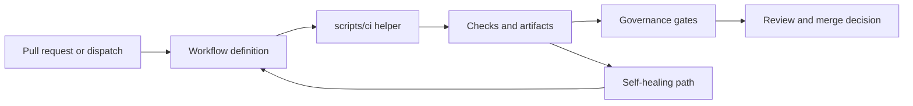

# Workflow and governance map

Active workflow definitions live in `.github/workflows/`. This page groups the main
maintainer entry points; it is not an exhaustive inventory.

## Active Node.js policy

The live project baseline is Node.js 22. Active workflows under `.github/workflows/`
configure `actions/setup-node` with `node-version: '22'` or use a repo-variable default
that resolves to 22. Historical Node.js 20 references are archival-only and live in
legacy or disabled workflow copies; they are not current runtime policy unless explicitly
re-enabled.

| Area | Start with | Supporting code and guidance |
|---|---|---|
| CI validation | `pre-merge-validation.yml`, `progressive-validation.yml`, `resilient_validation.yml`, `nox_gates.yml` | `noxfile.py`, `pytest.ini`, `scripts/ci/workflow_orchestrator.py`, [CI index](ci/INDEX.md) |
| Security | `dependency-security-gate.yml`, `security-scanning-suite.yml`, `codeql-ga-gate.yml`, `secrets-detection.yml` | `scripts/ci/aggregate_security_findings.py`, `scripts/ci/fetch_security_snapshot.py`, [security guide](SECURITY.md) |
| Coverage | `coverage-ratchet.yml`, `coverage-with-timeout.yml`, `code-quality-coverage-suite.yml` | `scripts/ci/generate_coverage_dashboard.py`, `scripts/ci/generate_coverage_map.py`, [testing index](testing/INDEX.md) |
| Self-healing | `iterative-self-healing-ci.yml`, `ci-pattern-healer.yml`, `self-healing.yml`, `unified-copilot-management.yml` | `scripts/ci/autonomous_test_healer_orchestrator.py`, [.codex prevention guide](../.codex/CI_PATTERN_PREVENTION_GUIDE.md) |
| Policy and governance | `comment-review-gate.yml`, `deferral-language-gate.yml`, `workflow-execution-gate.yml`, `unified-governance-check.yml` | `.codex/CODEBASE_AGENCY_POLICY.md`, `.codex/WEC_CANONICAL_ITEMS.md`, `scripts/ci/session_wrapup_autofix.py` |
| Workflow health | `workflow-execution-gate.yml`, `actionlint-audit.yml`, `proactive-ci-monitor.yml` | `scripts/ci/workflow_compliance_scan.py`, `scripts/ci/workflow_health_collector.py` |

## How the layers fit

## Maintainer shortcuts

- **A failing run:** inspect the run and failed job logs, then locate the matching
  helper under `scripts/ci/`.
- **A dependency alert:** start with the dependency security gate and the authoritative
  package manifest or lockfile.
- **A coverage regression:** compare the ratchet and timeout workflows with the coverage
  configuration in `pyproject.toml`.
- **A policy failure:** read the named gate, then the linked policy or WEC contract.
- **A workflow edit:** validate syntax, permissions, action pins, concurrency, timeout,
  and trigger behavior.

The filename alone does not establish enforcement. Read the workflow's triggers,
permissions, job conditions, and failure handling to distinguish blocking gates from
reporting or notification workflows. For example, `security-alert-notification.yml`
creates issue notifications, while dependency and CodeQL gates enforce checks on their
configured events.

See [GitHub Actions maintainer onboarding](onboarding/GITHUB_ACTIONS_MAINTAINER.md)
for the role workflow.
