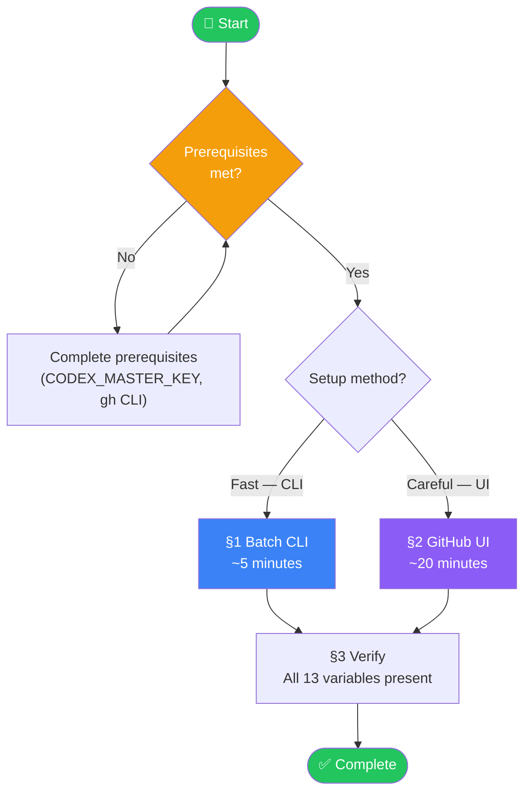
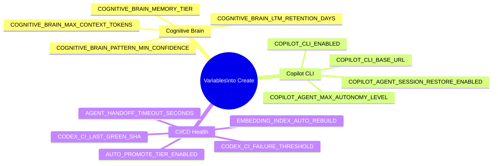
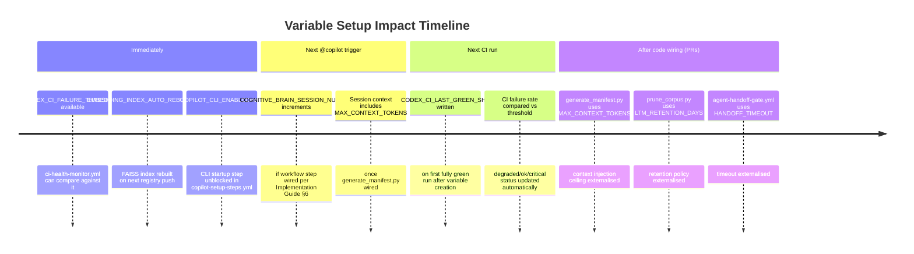

# [Human Admin] Repository Variables Setup Guide

> **For:** Human administrator (mbaetiong) — manual GitHub UI / CLI actions required  
> **Source:** [PR #3483 comment #issuecomment-3988416714](https://github.com/Aries-Serpent/_codex_/pull/3483#issuecomment-3988416714)  
> **Technical reference:** [`REPO_VARIABLES_IMPLEMENTATION_GUIDE.md`](./REPO_VARIABLES_IMPLEMENTATION_GUIDE.md)  
> **Version:** 1.0.0  
> **Last Updated:** 2026-03-03

---

## Overview

This guide contains **every action needed to implement the repository variable recommendations**
from PR #3483. Each section has:

- ☐ checkboxes to track completion
- 📋 copy-paste ready code blocks
- 🔗 direct URLs — no searching required
- 👆 exact click-by-click steps

**Total variables to create: 13**  
**Variables to convert to placeholder (auto-managed): 1**  
**Estimated time: ~20 minutes**

---

## Setup Flow



---

## Prerequisites Checklist

Before starting, confirm all prerequisites:

- [ ] You are logged in as **mbaetiong** (repository owner)
- [ ] `gh` CLI is installed — run `gh --version` to confirm
- [ ] `gh auth status` shows `Aries-Serpent/_codex_` in scope
- [ ] `CODEX_MASTER_KEY` secret exists with `variables: read+write` permission  
  → Check: <https://github.com/Aries-Serpent/_codex_/settings/secrets/actions>
- [ ] You have at least 20 minutes uninterrupted

---

## §1 — Batch CLI Method (Recommended — ~5 minutes)

Copy and paste the entire block below into your terminal. It creates all 13 new variables in one pass using the GitHub CLI.

```bash
# ── Aries-Serpent/_codex_ repository variable setup ──────────────────────────
# Source: PR #3483 #issuecomment-3988416714
# Run from any directory — uses gh CLI (must be authenticated)

REPO="Aries-Serpent/_codex_"

create_var() {
  local name="$1" value="$2"
  if gh variable set "$name" --body "$value" --repo "$REPO" 2>/dev/null; then
    echo "✅  $name = $value"
  else
    echo "❌  FAILED: $name"
  fi
}

echo "──────────────────────────────────────────────────"
echo "Creating Cognitive Brain variables…"
echo "──────────────────────────────────────────────────"
create_var "COGNITIVE_BRAIN_MAX_CONTEXT_TOKENS"    "32000"
create_var "COGNITIVE_BRAIN_LTM_RETENTION_DAYS"    "90"
create_var "COGNITIVE_BRAIN_PATTERN_MIN_CONFIDENCE" "0.75"
create_var "COGNITIVE_BRAIN_MEMORY_TIER"            "both"

echo "──────────────────────────────────────────────────"
echo "Creating Copilot CLI variables…"
echo "──────────────────────────────────────────────────"
create_var "COPILOT_CLI_BASE_URL"                   "http://localhost:8765"
create_var "COPILOT_CLI_ENABLED"                    "true"
create_var "COPILOT_AGENT_SESSION_RESTORE_ENABLED"  "true"
create_var "COPILOT_AGENT_MAX_AUTONOMY_LEVEL"       "E"

echo "──────────────────────────────────────────────────"
echo "Creating CI/CD health variables…"
echo "──────────────────────────────────────────────────"
create_var "CODEX_CI_FAILURE_THRESHOLD"             "10.0"
create_var "CODEX_CI_LAST_GREEN_SHA"                ""
create_var "AGENT_HANDOFF_TIMEOUT_SECONDS"          "120"
create_var "EMBEDDING_INDEX_AUTO_REBUILD"           "true"
create_var "AUTO_PROMOTE_TIER_ENABLED"              "false"

echo "──────────────────────────────────────────────────"
echo "Done. Verify at:"
echo "https://github.com/Aries-Serpent/_codex_/settings/variables/actions"
echo "──────────────────────────────────────────────────"
```

**After running**, check all 13 lines show ✅. If any show ❌, see [§4 Troubleshooting](#4-troubleshooting).

---

## §2 — GitHub UI Method (Step-by-Step)

### Navigate to the variables page

👆 **Click this link:** <https://github.com/Aries-Serpent/_codex_/settings/variables/actions>

Or navigate manually:
1. Open <https://github.com/Aries-Serpent/_codex_>
2. Click **Settings** tab (top of the page, requires owner access)
3. In the left sidebar, scroll to **Security** → click **Secrets and variables**
4. Click **Actions** in the sub-menu
5. Click the **Variables** tab (next to Secrets)

You should see the existing variables list. You will click **New repository variable** for each one below.

---

### Variable setup — Mermaid checklist map



---

### Group A — Cognitive Brain (4 variables)

For each variable below:
1. Click **New repository variable** at <https://github.com/Aries-Serpent/_codex_/settings/variables/actions>
2. Enter **Name** and **Value** exactly as shown
3. Click **Add variable**

---

#### A1 — `COGNITIVE_BRAIN_MAX_CONTEXT_TOKENS`

- [ ] Created

| Field | Value |
|---|---|
| **Name** | `COGNITIVE_BRAIN_MAX_CONTEXT_TOKENS` |
| **Value** | `32000` |

```
COGNITIVE_BRAIN_MAX_CONTEXT_TOKENS
```
```
32000
```

> **Purpose:** Matches `CONTEXT_WINDOW_BUDGET` constant in `scripts/ci/generate_manifest.py`.
> Externalising allows CI to override the session injection ceiling without a code change.

---

#### A2 — `COGNITIVE_BRAIN_LTM_RETENTION_DAYS`

- [ ] Created

| Field | Value |
|---|---|
| **Name** | `COGNITIVE_BRAIN_LTM_RETENTION_DAYS` |
| **Value** | `90` |

```
COGNITIVE_BRAIN_LTM_RETENTION_DAYS
```
```
90
```

> **Purpose:** How long LTM patterns are retained before pruning. Aligns with `AUDIT_RETENTION_DAYS`.
> Consumed by `scripts/ci/prune_corpus.py`.

---

#### A3 — `COGNITIVE_BRAIN_PATTERN_MIN_CONFIDENCE`

- [ ] Created

| Field | Value |
|---|---|
| **Name** | `COGNITIVE_BRAIN_PATTERN_MIN_CONFIDENCE` |
| **Value** | `0.75` |

```
COGNITIVE_BRAIN_PATTERN_MIN_CONFIDENCE
```
```
0.75
```

> **Purpose:** Minimum confidence threshold before a pattern is injected into a Copilot session.
> Referenced by `AgentBrainInterface.query_patterns()`.

---

#### A4 — `COGNITIVE_BRAIN_MEMORY_TIER`

- [ ] Created

| Field | Value |
|---|---|
| **Name** | `COGNITIVE_BRAIN_MEMORY_TIER` |
| **Value** | `both` |

```
COGNITIVE_BRAIN_MEMORY_TIER
```
```
both
```

> **Purpose:** Which SQLite memory tiers are active for recall.
> Values: `stm` (short-term only) | `ltm` (long-term only) | `both` (full recall pipeline).

---

### Group B — Copilot CLI (4 variables)

---

#### B1 — `COPILOT_CLI_BASE_URL`

- [ ] Created

| Field | Value |
|---|---|
| **Name** | `COPILOT_CLI_BASE_URL` |
| **Value** | `http://localhost:8765` |

```
COPILOT_CLI_BASE_URL
```
```
http://localhost:8765
```

> **Purpose:** The cognitive_app FastAPI endpoint. Consumed as `VITE_CLI_API_URL` in
> `ApiClient.tsx` and `XtermTerminal.tsx`. Allows CI integration tests to point at a test server.

---

#### B2 — `COPILOT_CLI_ENABLED`

- [ ] Created

| Field | Value |
|---|---|
| **Name** | `COPILOT_CLI_ENABLED` |
| **Value** | `true` |

```
COPILOT_CLI_ENABLED
```
```
true
```

> **Purpose:** Feature flag. Set to `false` to disable CLI server startup in environments
> where port 8765 is blocked.

---

#### B3 — `COPILOT_AGENT_SESSION_RESTORE_ENABLED`

- [ ] Created

| Field | Value |
|---|---|
| **Name** | `COPILOT_AGENT_SESSION_RESTORE_ENABLED` |
| **Value** | `true` |

```
COPILOT_AGENT_SESSION_RESTORE_ENABLED
```
```
true
```

> **Purpose:** When `true`, `session-log-retrieval-agent` injects prior session context at session
> start — enabling memory continuity across Copilot coding agent sessions.

---

#### B4 — `COPILOT_AGENT_MAX_AUTONOMY_LEVEL`

- [ ] Created

| Field | Value |
|---|---|
| **Name** | `COPILOT_AGENT_MAX_AUTONOMY_LEVEL` |
| **Value** | `E` |

```
COPILOT_AGENT_MAX_AUTONOMY_LEVEL
```
```
E
```

> **Purpose:** Runtime cap on agent autonomy tier. `E` = advisory only (current safe default).
> Change to `D` only after `e-to-d-transition-gate.yml` confirms 5/5 conditions AND you have
> reviewed the E→D Transition Map.  
> ⚠️ **Do not set to `D` without explicit owner review.**

---

### Group C — CI/CD Health (5 variables)

---

#### C1 — `CODEX_CI_FAILURE_THRESHOLD`

- [ ] Created

| Field | Value |
|---|---|
| **Name** | `CODEX_CI_FAILURE_THRESHOLD` |
| **Value** | `10.0` |

```
CODEX_CI_FAILURE_THRESHOLD
```
```
10.0
```

> **Purpose:** Numeric failure rate at which `CODEX_CI_FAILURE_RATE` status flips to `degraded`.
> Parseable by `ci-health-alert-agent`. Must be a float string (e.g. `10.0`, not `10`).

---

#### C2 — `CODEX_CI_LAST_GREEN_SHA`

- [ ] Created

| Field | Value |
|---|---|
| **Name** | `CODEX_CI_LAST_GREEN_SHA` |
| **Value** | *(leave empty — auto-set by CI on next green push)* |

```
CODEX_CI_LAST_GREEN_SHA
```
```

```

> **Purpose:** Tracks the last known-good commit SHA. Auto-written by CI after a clean run.
> Use with `git bisect good "$CODEX_CI_LAST_GREEN_SHA"` to locate regressions.
> Create it empty — CI will populate it.

---

#### C3 — `AGENT_HANDOFF_TIMEOUT_SECONDS`

- [ ] Created

| Field | Value |
|---|---|
| **Name** | `AGENT_HANDOFF_TIMEOUT_SECONDS` |
| **Value** | `120` |

```
AGENT_HANDOFF_TIMEOUT_SECONDS
```
```
120
```

> **Purpose:** Maximum wait time before `agent-handoff-gate.yml` declares a handoff failed.
> 120 seconds (2 minutes) is the recommended starting value. Increase if agents take longer
> to acknowledge.

---

#### C4 — `EMBEDDING_INDEX_AUTO_REBUILD`

- [ ] Created

| Field | Value |
|---|---|
| **Name** | `EMBEDDING_INDEX_AUTO_REBUILD` |
| **Value** | `true` |

```
EMBEDDING_INDEX_AUTO_REBUILD
```
```
true
```

> **Purpose:** When `true`, `agent-registry-validation.yml` triggers `embedding-index-rebuild.yml`
> via `gh workflow run` on every push to main — keeps the FAISS corpus index fresh.
> Already wired at lines 231–238 of the validation workflow.

---

#### C5 — `AUTO_PROMOTE_TIER_ENABLED`

- [ ] Created

| Field | Value |
|---|---|
| **Name** | `AUTO_PROMOTE_TIER_ENABLED` |
| **Value** | `false` |

```
AUTO_PROMOTE_TIER_ENABLED
```
```
false
```

> **Purpose:** Gates `scripts/ci/auto_promote_tier.py`. Start at `false` — automation will
> not promote agent tiers autonomously.  
> ⚠️ **Only set to `true` after thorough validation of the promotion script logic.**

---

### Group D — Update Existing Variable (1 action)

#### D1 — `COGNITIVE_BRAIN_SESSION_NUMBER` → Convert to Auto-Increment

This variable should no longer be manually set. A workflow step should increment it
automatically on each session open.

**Current manual workaround** (until workflow wiring is done):

- [ ] Noted that this variable requires the auto-increment workflow step from the [Implementation Guide §6](./REPO_VARIABLES_IMPLEMENTATION_GUIDE.md#6-session-number-auto-increment)

**To update manually right now** (temporary — increment by 1):
1. Click <https://github.com/Aries-Serpent/_codex_/settings/variables/actions>
2. Find `COGNITIVE_BRAIN_SESSION_NUMBER` in the list
3. Click the **pencil ✏️ edit icon** to the right
4. Change the value to the current value + 1
5. Click **Save variable**

> **Long-term action:** Add the PATCH API step shown in [Implementation Guide §6](./REPO_VARIABLES_IMPLEMENTATION_GUIDE.md#6-session-number-auto-increment)
> to `chatops_copilot_trigger.yml` so the increment happens automatically on each
> `@copilot` trigger.

---

## §3 — Verification

### Verify via CLI

```bash
# List all variables and confirm the 13 new ones are present
gh variable list --repo Aries-Serpent/_codex_ | sort
```

Expected output includes (among existing variables):

```
AGENT_HANDOFF_TIMEOUT_SECONDS        120
AUTO_PROMOTE_TIER_ENABLED            false
CODEX_CI_FAILURE_THRESHOLD           10.0
CODEX_CI_LAST_GREEN_SHA              (empty or a SHA)
COGNITIVE_BRAIN_LTM_RETENTION_DAYS   90
COGNITIVE_BRAIN_MAX_CONTEXT_TOKENS   32000
COGNITIVE_BRAIN_MEMORY_TIER          both
COGNITIVE_BRAIN_PATTERN_MIN_CONFIDENCE  0.75
COPILOT_AGENT_MAX_AUTONOMY_LEVEL     E
COPILOT_AGENT_SESSION_RESTORE_ENABLED  true
COPILOT_CLI_BASE_URL                 http://localhost:8765
COPILOT_CLI_ENABLED                  true
EMBEDDING_INDEX_AUTO_REBUILD         true
```

## Verify via GitHub UI

👆 Click: <https://github.com/Aries-Serpent/_codex_/settings/variables/actions>

Confirm all 13 variable names appear in the list. The page does not show values by default —
click the variable name to expand it and confirm the value.

### Completion Checklist Summary

- [ ] A1 `COGNITIVE_BRAIN_MAX_CONTEXT_TOKENS` = `32000`
- [ ] A2 `COGNITIVE_BRAIN_LTM_RETENTION_DAYS` = `90`
- [ ] A3 `COGNITIVE_BRAIN_PATTERN_MIN_CONFIDENCE` = `0.75`
- [ ] A4 `COGNITIVE_BRAIN_MEMORY_TIER` = `both`
- [ ] B1 `COPILOT_CLI_BASE_URL` = `http://localhost:8765`
- [ ] B2 `COPILOT_CLI_ENABLED` = `true`
- [ ] B3 `COPILOT_AGENT_SESSION_RESTORE_ENABLED` = `true`
- [ ] B4 `COPILOT_AGENT_MAX_AUTONOMY_LEVEL` = `E`
- [ ] C1 `CODEX_CI_FAILURE_THRESHOLD` = `10.0`
- [ ] C2 `CODEX_CI_LAST_GREEN_SHA` = *(empty — auto-set)*
- [ ] C3 `AGENT_HANDOFF_TIMEOUT_SECONDS` = `120`
- [ ] C4 `EMBEDDING_INDEX_AUTO_REBUILD` = `true`
- [ ] C5 `AUTO_PROMOTE_TIER_ENABLED` = `false`
- [ ] D1 Noted `COGNITIVE_BRAIN_SESSION_NUMBER` auto-increment is a follow-up workflow task

---

## §4 — Troubleshooting

### `gh variable set` returns 404

Your `gh` CLI may be authenticated to a different scope. Run:

```bash
gh auth status
gh auth refresh --scopes "repo,variable"
```

Then retry the batch command from [§1](#1--batch-cli-method-recommended---5-minutes).

### `gh variable set` returns 403 Forbidden

You do not have repository admin access with the current token. Confirm:

```bash
gh api /repos/Aries-Serpent/_codex_ --jq '.permissions'
```

Expected: `"admin": true`. If not, re-authenticate with a token that has `variables: write`.

### Variable appears in list but CI cannot read it

Repository variables are available as `${{ vars.VARIABLE_NAME }}` in workflow files.
If a workflow is not picking up a new variable:
1. Check the workflow uses `vars.VARIABLE_NAME` syntax (not `env.` or `secrets.`)
2. Trigger a new workflow run — GitHub Actions caches variable context per run, not per push
3. Confirm the variable is at **repository** scope, not environment scope

### `COPILOT_CLI_BASE_URL` not picked up by frontend

The frontend reads this as `VITE_CLI_API_URL` environment variable, not as a GitHub
repository variable. To use it in a CI build:

```yaml
- name: Build cognitive_app
  env:
    VITE_CLI_API_URL: ${{ vars.COPILOT_CLI_BASE_URL }}
  run: cd cognitive_app && npm run build
```

---

## §5 — What Changes After Setup



---

## Document Maintenance

| Field | Value |
|---|---|
| **Variables page** | <https://github.com/Aries-Serpent/_codex_/settings/variables/actions> |
| **Secrets page** | <https://github.com/Aries-Serpent/_codex_/settings/secrets/actions> |
| **Source comment** | [PR #3483 #issuecomment-3988416714](https://github.com/Aries-Serpent/_codex_/pull/3483#issuecomment-3988416714) |
| **Technical reference** | [`REPO_VARIABLES_IMPLEMENTATION_GUIDE.md`](./REPO_VARIABLES_IMPLEMENTATION_GUIDE.md) |
| **Owner** | @mbaetiong |
| **Next review** | After any workflow wiring PRs land (code wiring from Implementation Guide §8) |

---

**END OF HUMAN ADMIN SETUP GUIDE**
