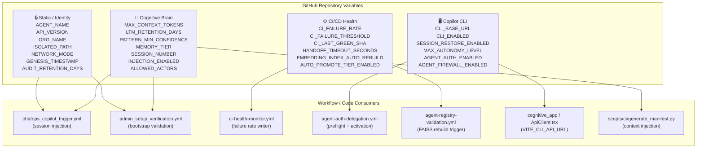
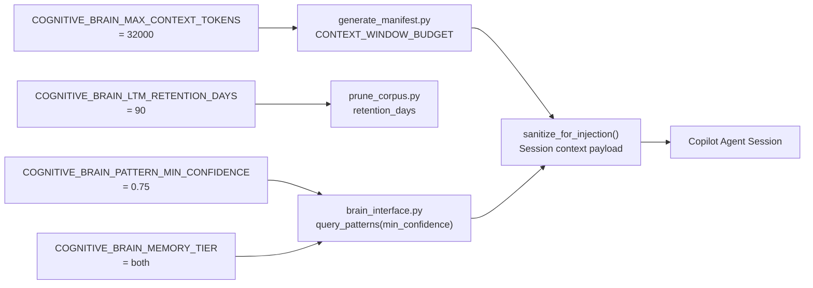
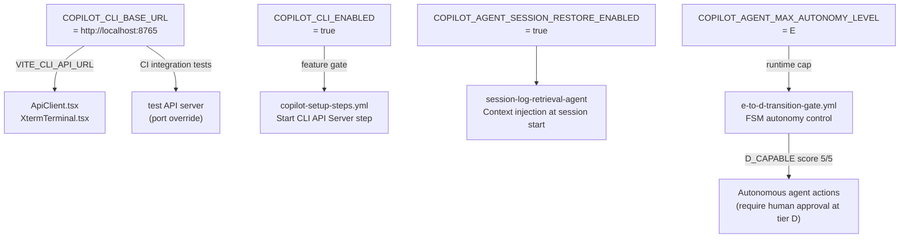
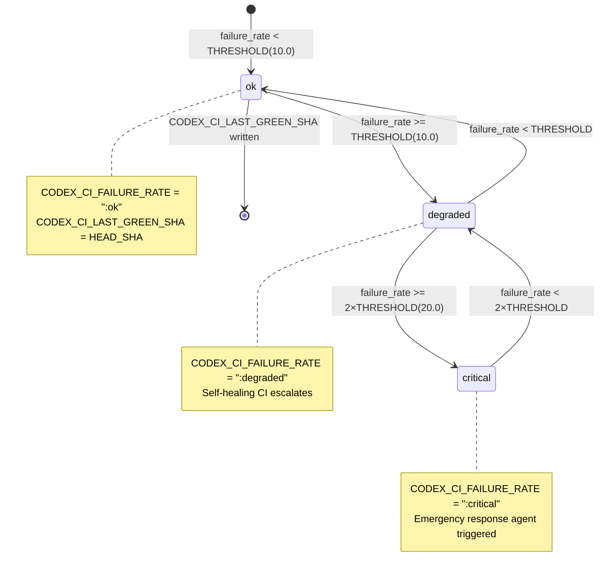
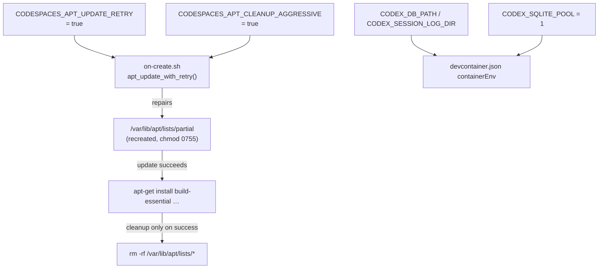
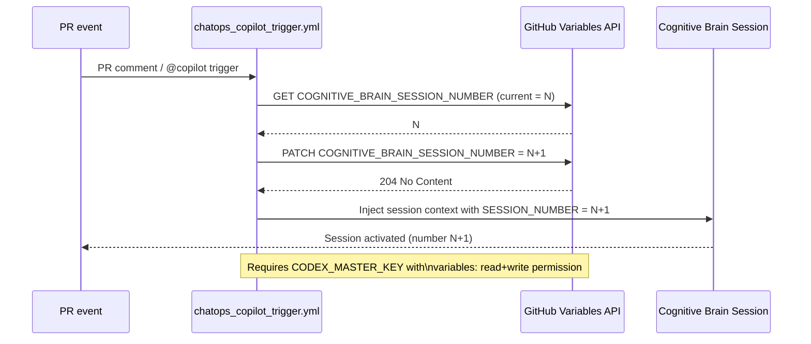
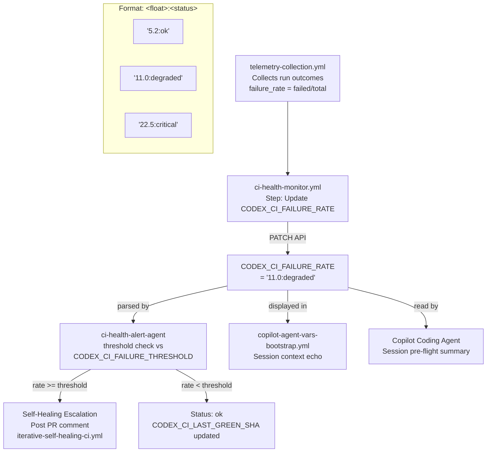
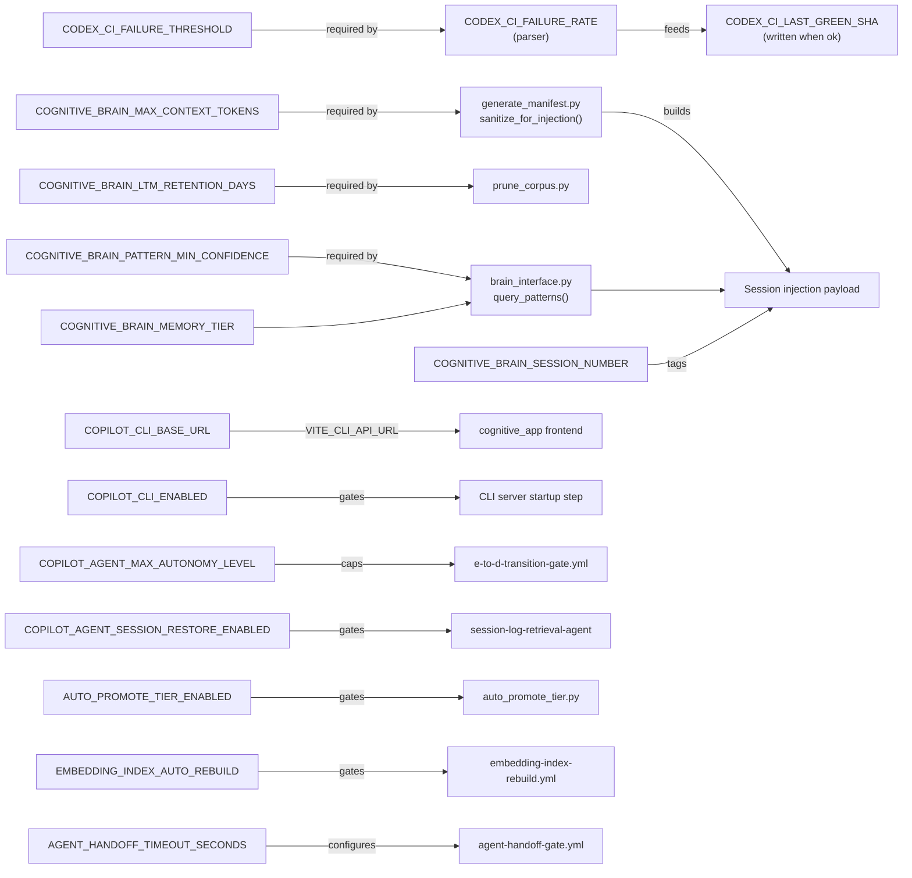

# Repository Variables — Implementation Guide

> **Source:** [PR #3483 comment #issuecomment-3988416714](https://github.com/Aries-Serpent/_codex_/pull/3483#issuecomment-3988416714)  
> **Author:** Copilot variable analysis (2026-03-03)  
> **Version:** 1.0.0  
> **Last Updated:** 2026-03-03  
> **Human Admin Action Guide:** [`HUMAN_ADMIN_REPO_VARIABLES_SETUP.md`](./HUMAN_ADMIN_REPO_VARIABLES_SETUP.md)

---

## Table of Contents

1. [Architecture Overview](#1-architecture-overview)
2. [Current Variable Status](#2-current-variable-status)
3. [New Variables — Cognitive Brain](#3-new-variables--cognitive-brain)
4. [New Variables — Copilot CLI](#4-new-variables--copilot-cli)
5. [New Variables — CI/CD Health](#5-new-variables--cicd-health)
6. [Session Number Auto-Increment](#6-session-number-auto-increment)
7. [CI Failure Rate Lifecycle](#7-ci-failure-rate-lifecycle)
8. [Code Wiring Reference](#8-code-wiring-reference)
9. [Variable Dependency Map](#9-variable-dependency-map)

---

## 1. Architecture Overview

The repository variables feed three subsystems: the **Cognitive Brain** (memory injection pipeline),
the **Copilot CLI** (FastAPI cognitive_app at port 8765), and the **CI/CD health** automation layer.



---

## 2. Current Variable Status

### 2a. Placeholder / Auto-Updated Variables

These variables drift when stored as static integers or strings — they must be updated
programmatically by a workflow step.

| Variable | Current Value | Update Mechanism | Format Spec |
|---|---|---|---|
| `COGNITIVE_BRAIN_SESSION_NUMBER` | `109` | Auto-increment via `chatops_copilot_trigger.yml` step (see [§6](#6-session-number-auto-increment)) | Integer, monotonically increasing |
| `CODEX_CI_FAILURE_RATE` | `11.0:degraded` | Written by `ci-health-monitor.yml` step "Update CODEX_CI_FAILURE_RATE repo variable" | `<float>:<status>` where status ∈ `{ok, degraded, critical}` |

**Format spec for `CODEX_CI_FAILURE_RATE`:**
- `ok` — rate < `CODEX_CI_FAILURE_THRESHOLD`
- `degraded` — rate ≥ `CODEX_CI_FAILURE_THRESHOLD` (default threshold: `10.0`)
- `critical` — rate ≥ `2 × CODEX_CI_FAILURE_THRESHOLD` (default: `20.0`)

### 2b. Correctly Static Variables

These are **human-controlled governance flags** and **identity constants**. Automation must
**never** overwrite them without explicit owner approval.

| Variable | Rationale |
|---|---|
| `AUTONOMOUS_ACTIONS_ENABLED` | Human governance flag — gates all autonomous agent actions |
| `COPILOT_AGENT_AUTH_ENABLED` | Human governance flag — gates token delegation |
| `COPILOT_AGENT_FIREWALL_ENABLED` | Human governance flag — network isolation control |
| `COGNITIVE_BRAIN_INJECTION_ENABLED` | Human governance flag — session context injection master switch |
| `GENESIS_TIMESTAMP` | Immutable identity constant set at repository creation |
| `CODEX_ORG_NAME` | Identity constant |
| `CODEX_AGENT_NAME` | Identity constant |
| `CODEX_API_VERSION` | API version pin |
| `CODEX_ISOLATED_PATH` | Network isolation path |
| `CODEX_NETWORK_MODE` | Network mode policy |
| `AUDIT_RETENTION_DAYS` | Retention policy (change only with explicit decision) |

---

## 3. New Variables — Cognitive Brain

These variables externalise constants currently embedded in Python scripts, enabling
workflow-level override without code changes.

### Variable Definitions

| Variable | Recommended Value | Type |
|---|---|---|
| `COGNITIVE_BRAIN_MAX_CONTEXT_TOKENS` | `32000` | Integer (read-only by agents) |
| `COGNITIVE_BRAIN_LTM_RETENTION_DAYS` | `90` | Integer |
| `COGNITIVE_BRAIN_PATTERN_MIN_CONFIDENCE` | `0.75` | Float string |
| `COGNITIVE_BRAIN_MEMORY_TIER` | `both` | Enum: `stm` \| `ltm` \| `both` |

### Purpose Details

**`COGNITIVE_BRAIN_MAX_CONTEXT_TOKENS`**  
Mirrors `CONTEXT_WINDOW_BUDGET = 32_000` in `scripts/ci/generate_manifest.py:59`.
Externalising this allows CI to override the injection ceiling without a code change.
Consumed by `sanitize_for_injection()` — raises `ValueError` when safe payload exceeds budget.

```python
# scripts/ci/generate_manifest.py (current hardcoded constant — wire to var)
CONTEXT_WINDOW_BUDGET: int = int(os.environ.get("COGNITIVE_BRAIN_MAX_CONTEXT_TOKENS", 32_000))
```

**`COGNITIVE_BRAIN_LTM_RETENTION_DAYS`**  
Aligns with `AUDIT_RETENTION_DAYS = 90`. Consumed by `scripts/ci/prune_corpus.py`
(90-day corpus retention). Externalising enables tuning without commits.

**`COGNITIVE_BRAIN_PATTERN_MIN_CONFIDENCE`**  
Gate threshold before a memory pattern is injected into a Copilot session.
Referenced by `AgentBrainInterface.query_patterns()` in `src/codex/cognitive/brain_interface.py`.

**`COGNITIVE_BRAIN_MEMORY_TIER`**  
Controls which SQLite tiers are active for session recall. STM = short-term (deque),
LTM = long-term (SQLite persist), `both` = full recall pipeline.

### Wiring Diagram



---

## 4. New Variables — Copilot CLI

These variables wire the cognitive_app FastAPI server endpoint into CI and enable
feature-flagging of CLI capabilities without code changes.

### Variable Definitions

| Variable | Recommended Value | Type |
|---|---|---|
| `COPILOT_CLI_BASE_URL` | `http://localhost:8765` | URL string |
| `COPILOT_CLI_ENABLED` | `true` | Boolean string |
| `COPILOT_AGENT_SESSION_RESTORE_ENABLED` | `true` | Boolean string |
| `COPILOT_AGENT_MAX_AUTONOMY_LEVEL` | `E` | Enum: `E` (advisory) \| `D` (autonomous with approval) |

### Purpose Details

**`COPILOT_CLI_BASE_URL`**  
The cognitive_app API endpoint. Currently hardcoded in three frontend files:
- `cognitive_app/src/components/cli/ApiClient.tsx:40` — `CLI_API` constant
- `cognitive_app/src/components/cli/XtermTerminal.tsx:13` — `API_BASE` constant
- `cognitive_app/src/components/cli/index.tsx:30` — `CLI_API` constant

`ApiClient.tsx` already reads `VITE_CLI_API_URL` (commit `cf85ef5`); `XtermTerminal.tsx` also
reads `VITE_CLI_API_URL` at line 13. Setting this repo variable allows CI integration tests to
point at a test server without modifying code.

**`COPILOT_CLI_ENABLED`**  
Feature flag. When `false`, workflows skip CLI startup and API health checks.
Useful for environments where port 8765 is blocked.

**`COPILOT_AGENT_SESSION_RESTORE_ENABLED`**  
When `true`, `session-log-retrieval-agent` injects prior session context at session start.
Enables true memory continuity across Copilot coding agent sessions.

**`COPILOT_AGENT_MAX_AUTONOMY_LEVEL`**  
Caps the autonomy tier the agent may act at within a session. `E` = advisory only;
`D` = autonomous with human approval required (controlled by `e-to-d-transition-gate.yml`).
Currently the gate score is 5/5 (D_CAPABLE unlocked) — this variable is the runtime cap.

### Wiring Diagram



---

## 5. New Variables — CI/CD Health

These variables drive the self-healing CI pipeline, tier promotion automation, and FAISS
index management.

### Variable Definitions

| Variable | Recommended Value | Type | Update Mechanism |
|---|---|---|---|
| `CODEX_CI_FAILURE_THRESHOLD` | `10.0` | Float string | Static (human-set) |
| `CODEX_CI_LAST_GREEN_SHA` | *(empty — auto-set)* | Git SHA string | Auto-written on green push |
| `AGENT_HANDOFF_TIMEOUT_SECONDS` | `120` | Integer string | Static |
| `EMBEDDING_INDEX_AUTO_REBUILD` | `true` | Boolean string | Static |
| `AUTO_PROMOTE_TIER_ENABLED` | `false` | Boolean string | Static (promote to `true` after validation) |

### Purpose Details

**`CODEX_CI_FAILURE_THRESHOLD`**  
The numeric rate at which `CODEX_CI_FAILURE_RATE` status flips to `degraded`.
`ci-health-monitor.yml` currently compares against a hardcoded value; externalising it
allows threshold adjustment without a workflow commit.

**`CODEX_CI_LAST_GREEN_SHA`**  
Auto-set by a post-green-push workflow step. Enables bisect commands like:
```bash
git bisect good "$CODEX_CI_LAST_GREEN_SHA"
```

**`AGENT_HANDOFF_TIMEOUT_SECONDS`**  
Maximum wait time in `agent-handoff-gate.yml` before a handoff is declared failed.
Currently hardcoded in the workflow step; externalising enables tuning.

**`EMBEDDING_INDEX_AUTO_REBUILD`**  
Controls whether `agent-registry-validation.yml` triggers `embedding-index-rebuild.yml`
on push to main via `gh workflow run`. Already wired at lines 231–238 of the validation
workflow — this variable becomes the guard condition.

**`AUTO_PROMOTE_TIER_ENABLED`**  
Gates `scripts/ci/auto_promote_tier.py`. Start at `false` until promotion logic is
fully validated. Flip to `true` to enable automatic agent tier elevation.

### CI Health State Machine



---

## 5a. New Variables — Codespaces Prebuild

These variables ensure GitHub Codespaces prebuilds succeed and give Copilot
agents a consistent runtime environment. They resolve prebuild error **1309
(UnifiedContainersErrorPrebuilTemplateOnCreateFailed)**, triggered when the APT
list directory is missing/corrupted during `onCreateCommand`
(`E: List directory /var/lib/apt/lists/partial is missing.`).

### Variable Definitions

| Variable | Recommended Value | Type | MUST/SHOULD/MAY |
| --- | --- | --- | --- |
| `CODESPACES_APT_UPDATE_RETRY` | `true` | Boolean string | SHOULD |
| `CODESPACES_APT_CLEANUP_AGGRESSIVE` | `true` | Boolean string | MAY |
| `CODEX_DEVCONTAINER_WORKSPACE` | `/workspaces/_codex_` | Path string | SHOULD |
| `CODEX_DEVCONTAINER_PYTHON_VERSION` | `3.12` | Version string | MUST |
| `CODEX_DEVCONTAINER_NODE_VERSION` | `20` | Version string | SHOULD |
| `CODEX_DEVCONTAINER_RUST_VERSION` | `stable` | Version string | MAY |
| `CODEX_SESSION_LOG_DIR` | `/workspaces/_codex_/.codex/sessions` | Path string | MUST |
| `CODEX_DB_PATH` | `/workspaces/_codex_/.codex/codex.db` | Path string | MUST |
| `CODEX_SQLITE_POOL` | `1` | Integer string | SHOULD |
| `CODEX_CLI_API_URL` | `http://localhost:8765` | URL string | MUST |

### Setup Instructions

**Via GitHub UI** (Settings → Secrets and variables → Actions → Variables):

1. [ ] `CODESPACES_APT_UPDATE_RETRY` = `true`
2. [ ] `CODESPACES_APT_CLEANUP_AGGRESSIVE` = `true`
3. [ ] `CODEX_DEVCONTAINER_WORKSPACE` = `/workspaces/_codex_`
4. [ ] `CODEX_DEVCONTAINER_PYTHON_VERSION` = `3.12`
5. [ ] `CODEX_DEVCONTAINER_NODE_VERSION` = `20`
6. [ ] `CODEX_DEVCONTAINER_RUST_VERSION` = `stable`
7. [ ] `CODEX_SESSION_LOG_DIR` = `/workspaces/_codex_/.codex/sessions`
8. [ ] `CODEX_DB_PATH` = `/workspaces/_codex_/.codex/codex.db`
9. [ ] `CODEX_SQLITE_POOL` = `1`
10. [ ] `CODEX_CLI_API_URL` = `http://localhost:8765`

**Via `gh` CLI** (requires an authenticated token with `repo` scope):

```bash
bash .codex/CODESPACES_VARIABLES_BOOTSTRAP.sh
```

### Wiring Diagram



---

## 6. Session Number Auto-Increment

`COGNITIVE_BRAIN_SESSION_NUMBER` must be incremented by a workflow step, not set manually,
to maintain meaningful recall ordering.

### Implementation Pattern

Add the following step to `chatops_copilot_trigger.yml` (or `agent-auth-delegation.yml`)
immediately after reading the current session number:

```yaml
- name: Increment COGNITIVE_BRAIN_SESSION_NUMBER
  env:
    GH_TOKEN: ${{ secrets.CODEX_MASTER_KEY }}
  run: |
    CURRENT="${{ vars.COGNITIVE_BRAIN_SESSION_NUMBER }}"
    NEXT=$((CURRENT + 1))
    gh api \
      --method PATCH \
      -H "Accept: application/vnd.github+json" \
      /repos/${{ github.repository }}/actions/variables/COGNITIVE_BRAIN_SESSION_NUMBER \
      -f name='COGNITIVE_BRAIN_SESSION_NUMBER' \
      -f value="$NEXT"
    echo "Session number incremented: $CURRENT → $NEXT"
```

### Auto-Increment Flow



---

## 7. CI Failure Rate Lifecycle

`CODEX_CI_FAILURE_RATE` is written by `ci-health-monitor.yml` after every telemetry run.
The format spec `<float>:<status>` must be parsed consistently by all consumers.

### Lifecycle



### Parser Reference (Bash)

```bash
# Parse CODEX_CI_FAILURE_RATE in any workflow step
RATE_RAW="${{ vars.CODEX_CI_FAILURE_RATE }}"          # e.g. "11.0:degraded"
RATE_FLOAT="${RATE_RAW%%:*}"                           # "11.0"
RATE_STATUS="${RATE_RAW##*:}"                          # "degraded"
THRESHOLD="${{ vars.CODEX_CI_FAILURE_THRESHOLD }}"    # "10.0"

if (( $(echo "$RATE_FLOAT >= $THRESHOLD" | bc -l) )); then
  echo "::warning::CI failure rate ${RATE_FLOAT}% exceeds threshold ${THRESHOLD}%"
fi
```

---

## 8. Code Wiring Reference

Files that need updating once variables are created:

| File | Line | Change Required |
|---|---|---|
| `scripts/ci/generate_manifest.py` | 59 | `CONTEXT_WINDOW_BUDGET = int(os.environ.get("COGNITIVE_BRAIN_MAX_CONTEXT_TOKENS", 32_000))` |
| `scripts/ci/prune_corpus.py` | (retention constant) | Read `COGNITIVE_BRAIN_LTM_RETENTION_DAYS` env var |
| `cognitive_app/src/components/cli/index.tsx` | 30 | `const CLI_API = import.meta.env.VITE_CLI_API_URL ?? 'http://localhost:8765';` |
| `.github/workflows/ci-health-monitor.yml` | (threshold constant) | Replace hardcoded threshold with `vars.CODEX_CI_FAILURE_THRESHOLD` |
| `.github/workflows/agent-handoff-gate.yml` | (timeout constant) | Replace hardcoded timeout with `vars.AGENT_HANDOFF_TIMEOUT_SECONDS` |
| `.github/workflows/agent-registry-validation.yml` | 231–238 | Guard `gh workflow run` with `vars.EMBEDDING_INDEX_AUTO_REBUILD == 'true'` |
| `.github/workflows/e-to-d-transition-gate.yml` | (autonomy output) | Cap effective tier at `vars.COPILOT_AGENT_MAX_AUTONOMY_LEVEL` |

---

## 9. Variable Dependency Map

Shows which variables must exist before others can function correctly.



---

## Document Maintenance

| Field | Value |
|---|---|
| **Source comment** | [PR #3483 #issuecomment-3988416714](https://github.com/Aries-Serpent/_codex_/pull/3483#issuecomment-3988416714) |
| **Human admin action guide** | [`HUMAN_ADMIN_REPO_VARIABLES_SETUP.md`](./HUMAN_ADMIN_REPO_VARIABLES_SETUP.md) |
| **Related workflows** | `ci-health-monitor.yml`, `chatops_copilot_trigger.yml`, `agent-auth-delegation.yml`, `agent-registry-validation.yml` |
| **Related scripts** | `scripts/ci/generate_manifest.py`, `scripts/ci/prune_corpus.py`, `scripts/ci/auto_promote_tier.py` |
| **Next review** | After any of the 5 Tier-1 GROUNDED gates change behaviour |
