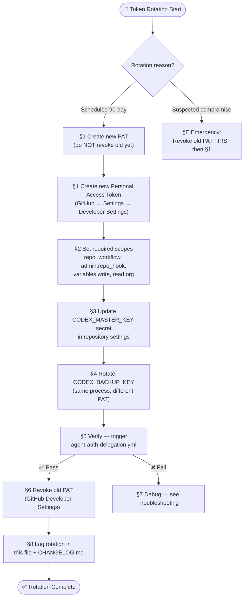

# 🔑 CODEX_MASTER_KEY & CODEX_BACKUP_KEY — Token Rotation Guide

> **For:** Human administrator (`@mbaetiong`) — manual GitHub UI / CLI steps required  
> **Scope:** `CODEX_MASTER_KEY` and `CODEX_BACKUP_KEY` repository secrets  
> **Policy:** Rotate every **90 days** or immediately on suspected compromise  
> **Last Updated:** 2026-03-17  
> **Version:** 1.0.0

---

## 🗺️ Overview



---

## Prerequisites

| Requirement | Check |
|-------------|-------|
| GitHub account: `mbaetiong` (repository owner) | Required |
| Access to GitHub → Settings → Developer settings → Personal access tokens | Required |
| `gh` CLI installed locally (optional, for §3 CLI method) | Optional |
| Previous PAT **not yet revoked** (unless emergency) | Required |

---

## § 1 — Create New Personal Access Token (Fine-Grained)

1. Navigate to: **GitHub → Your profile → Settings → Developer settings → Personal access tokens → Fine-grained tokens**  
   Direct URL: `https://github.com/settings/tokens?type=beta`

2. Click **"Generate new token"**

3. Fill in:
   | Field | Value |
   |-------|-------|
   | **Token name** | `codex-master-key-YYYY-MM` (e.g. `codex-master-key-2026-06`) |
   | **Expiration** | `90 days` |
   | **Resource owner** | `Aries-Serpent` |
   | **Repository access** | `Only select repositories` → `_codex_` |

4. Set **Repository permissions**:
   | Permission | Level |
   |-----------|-------|
   | Actions | Read and write |
   | Contents | Read and write |
   | Pull requests | Read and write |
   | Secrets | Read and write |
   | Variables | Read and write |
   | Workflows | Read and write |
   | Issues | Read and write |
   | Metadata | Read (auto-granted) |

5. Click **"Generate token"** — copy the token immediately (shown only once).

> ⚠️ **Store the new token securely** in your password manager before proceeding.

---

## § 2 — Update `CODEX_MASTER_KEY` in Repository Secrets

### Option A — GitHub UI (recommended for first rotation)

1. Navigate to: `https://github.com/Aries-Serpent/_codex_/settings/secrets/actions`
2. Click **`CODEX_MASTER_KEY`** → **"Update"**
3. Paste the new PAT token value
4. Click **"Update secret"**

### Option B — GitHub CLI

```bash
# Authenticate with a PAT that has admin:repo_hook or use your browser session
echo "YOUR_NEW_PAT_HERE" | gh secret set CODEX_MASTER_KEY \
  --repo Aries-Serpent/_codex_
```

---

## § 3 — Rotate `CODEX_BACKUP_KEY`

The `CODEX_BACKUP_KEY` is used as a fallback when `CODEX_MASTER_KEY` is unavailable.
Rotate it on the same schedule but generate a **separate** PAT.

1. Repeat §1 with token name `codex-backup-key-YYYY-MM`
2. Use identical permissions as §1
3. Update `CODEX_BACKUP_KEY` via UI or CLI:

```bash
echo "YOUR_BACKUP_PAT_HERE" | gh secret set CODEX_BACKUP_KEY \
  --repo Aries-Serpent/_codex_
```

---

## § 4 — Verify Rotation

### Trigger verification workflow

```bash
gh workflow run agent-auth-delegation.yml \
  --repo Aries-Serpent/_codex_ \
  --ref main
```

Or navigate to:  
`https://github.com/Aries-Serpent/_codex_/actions/workflows/agent-auth-delegation.yml`  
→ **"Run workflow"** on `main`

### Expected output (success)

```
✅ CODEX_MASTER_KEY: secret present (length > 0)
✅ Cognitive Pre-flight Check: PASS
✅ activate-delegation: success
```

### Check in CI log

Look for the `🧠 Cognitive Pre-flight Check` job → step `Set repo variables via CODEX_MASTER_KEY`:
- Status: ✅ `COPILOT_AGENT_AUTH_ENABLED=true`
- Status: ✅ Session number incremented

---

## § 5 — Revoke Old Token

> ⚠️ **Only do this AFTER §4 passes.** Revoking before verification will break CI.

1. Navigate to: `https://github.com/settings/tokens`
2. Find the **old** `codex-master-key-YYYY-MM` token
3. Click **"Delete"** → confirm
4. Repeat for old `codex-backup-key-YYYY-MM`

---

## § 6 — Log the Rotation

After successful rotation, update this file's rotation log table:

| Date | Rotated By | New Token Name | Expiry | Method |
|------|-----------|----------------|--------|--------|
| *YYYY-MM-DD* | `@mbaetiong` | `codex-master-key-YYYY-MM` | *YYYY-MM-DD* | UI / CLI |

Also add a one-line entry to `CHANGELOG.md`:
```markdown
### Security (YYYY-MM-DD)
- Rotated CODEX_MASTER_KEY and CODEX_BACKUP_KEY (90-day scheduled rotation)
```

---

## § E — Emergency Rotation (Suspected Compromise)

If you believe the token was leaked (e.g., accidentally committed, exposed in logs):

1. **Immediately** revoke the old PAT at `https://github.com/settings/tokens`
2. Follow §1–§4 above to create and deploy new tokens
3. Audit recent workflow runs for unauthorized variable changes:
   ```bash
   gh api repos/Aries-Serpent/_codex_/actions/runs \
     --jq '.workflow_runs[:20] | .[] | {id, name, conclusion, created_at}'
   ```
4. Check `docs/accountability/AGENT_ACCOUNTABILITY_REPORT.md` for unexpected agent activations
5. File a GitHub security advisory if repository data was accessed: `https://github.com/Aries-Serpent/_codex_/security/advisories/new`

---

## § 7 — Troubleshooting

### `CODEX_MASTER_KEY not available` in CI

**Symptom:** CI log shows `⚠️ CODEX_MASTER_KEY not available`  
**Cause:** Secret was not saved, wrong repo, or expired  
**Fix:**
```bash
# Verify secret exists (name only — value is never shown)
gh secret list --repo Aries-Serpent/_codex_ | grep CODEX_MASTER_KEY
```

## `Failed to set variable: 403 Forbidden`

**Symptom:** `activate-delegation` job fails with 403  
**Cause:** New PAT missing `variables:write` permission  
**Fix:** Regenerate token with `Variables: Read and write` permission (§1 step 4)

### `token has expired` in workflow logs

**Symptom:** Actions fail with authentication errors after 90 days  
**Fix:** Rotate immediately following this guide

---

## Token Rotation Calendar

| Token | Last Rotated | Next Due | Owner |
|-------|-------------|---------|-------|
| `CODEX_MASTER_KEY` | *pending first entry* | *90 days from creation* | `@mbaetiong` |
| `CODEX_BACKUP_KEY` | *pending first entry* | *90 days from creation* | `@mbaetiong` |

> Update this table after each rotation.

---

## Related Documents

- [`HUMAN_ADMIN_REPO_VARIABLES_SETUP.md`](./HUMAN_ADMIN_REPO_VARIABLES_SETUP.md) — Repository variables setup
- [`GENESIS_SETUP_GUIDE.md`](./GENESIS_SETUP_GUIDE.md) — Initial repository bootstrap
- [`REPOSITORY_SECURITY_SETUP.md`](./REPOSITORY_SECURITY_SETUP.md) — Full security configuration
- [`HUMAN_ACTION_REQUIRED.md`](./HUMAN_ACTION_REQUIRED.md) — Outstanding admin actions
- `docs/accountability/AGENT_ACCOUNTABILITY_REPORT.md` — Agent session audit trail

---

*This document was generated by Copilot Agent (S142 · 2026-03-17) and must be updated by a human admin after each rotation.*
