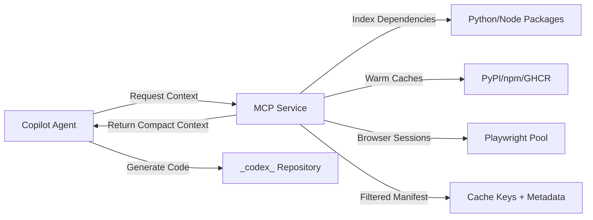

# [Guide]: GitHub MCP Integration for `_codex_`

> **Generated**: 2025-12-29T08:00:00Z | **Author**: mbaetiong  
> **Repository**: `Aries-Serpent/_codex_` | **ID**: 1040037790  
> **Roles**: [Primary: DevOps Architect], [Secondary: Security Engineer]  
> **⚡ Energy**: 5/5 | **🧠 Context**: Production-Ready Implementation

---

## 📋 Table of Contents

1. [Overview](#overview)
2. [MCP Architecture in _codex_](#mcp-architecture-in-_codex_)
3. [Copilot Agent Integration Patterns](#copilot-agent-integration-patterns)
4. [Current _codex_ MCP Implementation](#current-_codex_-mcp-implementation)
5. [Authoritative Documentation](#authoritative-documentation)
6. [Advanced Configuration for Maximum Copilot Capability](#advanced-configuration-for-maximum-copilot-capability)
7. [Recommended Permissions & Security](#recommended-permissions--security)
8. [Known Limitations & Workarounds](#known-limitations--workarounds)
9. [Practical Implementation Checklist](#practical-implementation-checklist)
10. [_codex_-Specific Integration Examples](#_codex_-specific-integration-examples)
11. [Troubleshooting & Monitoring](#troubleshooting--monitoring)
12. [References](#references)

---

## Overview

### What is MCP in the Context of _codex_?

**MCP (Model Context Protocol)** in the `_codex_` repository is a **lightweight HTTP/IPC service layer** that provides GitHub Copilot Agent with: 

- **Curated context** from the repository (dependency manifests, cache status, test results)
- **On-demand indexing** of codebase structure and dependencies
- **Dynamic browser sessions** via Playwright for integration testing and UI validation
- **Intelligent cache management** for Python wheels, npm packages, and Playwright binaries
- **Filtered context delivery** to stay within LLM context window limits

### Why MCP Enhances Copilot Agent

GitHub Copilot (the product) provides AI-powered code suggestions using:
- Editor context (open files, cursor position)
- Repository metadata (file tree, commit history)
- GitHub API data (issues, PRs, discussions)

**MCP augments this with _codex_-specific intelligence**:



---

## MCP Architecture in _codex_

### Current Directory Structure

```
_codex_/
├── .codex/
│   ├── mcp-config.yml              # MCP service configuration
│   ├── cache-manifest.yml          # Cache key registry
│   ├── scripts/
│   │   ├── mcp-enhancer.py         # Core MCP HTTP service
│   │   └── cache-warmer.py         # Cache warming automation
│   └── docker/
│       └── Dockerfile.playwright   # Pre-warmed browser image
├── src/
│   ├── mcp/                        # MCP Python modules
│   │   ├── __init__.py
│   │   ├── adapters/               # Backend adapters (Pinecone, etc.)
│   │   ├── metrics/                # MCP-specific metrics
│   │   └── server.py               # MCP HTTP server
│   └── ... 
├── scripts/
│   ├── space_traversal/detectors/  # MCP capability detectors
│   │   ├── mcp_tooling_registry.py
│   │   ├── mcp_protocol_surface.py
│   │   ├── mcp_configuration.py
│   │   ├── mcp_security_safeguards.py
│   │   ├── mcp_authz_authn.py
│   │   ├── mcp_rate_limiting.py
│   │   ├── mcp_error_handling.py
│   │   ├── mcp_observability.py
│   │   ├── mcp_lifecycle_management.py
│   │   ├── mcp_versioning_compat.py
│   │   ├── mcp_schema_validation.py
│   │   ├── mcp_multi_tenant.py
│   │   └── mcp_tools_integration.py
│   ├── security/                   # Token encryption/decryption
│   │   ├── token_encryption_tool.py
│   │   └── copilot_token_decoder.py
│   └── validate_mcp.py
└── .github/
    ├── workflows/
    │   ├── mcp-cache-warm.yml      # Scheduled cache warming
    │   └── mcp-ci.yml              # MCP-aware CI pipeline
    └── security-tools/
        └── bootstrap_extractor.py  # Tool deployment from env vars
```

### MCP Service Components

| Component | Location | Purpose | Copilot Agent Usage |
|-----------|----------|---------|---------------------|
| **MCP HTTP Server** | `src/mcp/server.py` | REST API for context requests | GET /manifest, /index, /sessions |
| **Cache Warmer** | `.codex/scripts/cache-warmer.py` | Prefetch dependencies | POST /cache/warm (Python/Node/Playwright) |
| **Playwright Pool** | `src/mcp/adapters/playwright_adapter.py` | Browser session management | POST /sessions (create), GET /sessions/{id} |
| **Metrics Collector** | `src/mcp/metrics/` | MCP performance tracking | GET /metrics (Prometheus format) |
| **Config Manager** | `.codex/mcp-config.yml` | Service settings + cache keys | Loaded at MCP startup |

---

## Copilot Agent Integration Patterns

### Pattern 1: Direct HTTP Integration (Recommended for _codex_)

```python
# Copilot Agent script example
import requests
from scripts.security.copilot_token_decoder import copilot_get_github_token

# Authenticate with MCP service
token = copilot_get_github_token()
headers = {"Authorization": f"Bearer {token}"}

# Request focused context
response = requests.get(
    "http://localhost:8080/index",
    headers=headers,
    params={"scope": "python", "depth": 2}
)

dependencies = response.json()
# Use dependencies for code generation context
```

### Pattern 2: GitHub Actions Integration

```yaml
# .github/workflows/copilot-task.yml
name: Copilot Agent Task with MCP

on:
  workflow_dispatch: 

jobs:
  copilot-with-mcp:
    runs-on: ubuntu-latest
    services:
      mcp:
        image: ghcr.io/aries-serpent/_codex_/mcp:latest
        ports:
          - 8080:8080
        env:
          CODEX_GHP_TOKEN_BASE64: ${{ secrets.CODEX_GHP_TOKEN_BASE64 }}
    
    steps:
      - uses: actions/checkout@v4
      
      - name: Wait for MCP service
        run: |
          timeout 60 bash -c 'until curl -f http://localhost:8080/health; do sleep 2; done'
      
      - name: Execute Copilot task with MCP context
        run: |
          python3 copilot_script.py --mcp-endpoint http://localhost:8080
```

### Pattern 3: VS Code Extension Integration (Local Development)

```json
// .vscode/settings.json
{
  "copilot.advanced": {
    "contextProviders": [
      {
        "type": "http",
        "endpoint": "http://localhost:8080",
        "authentication": "bearer",
        "tokenSource": "environment:CODEX_MCP_TOKEN"
      }
    ]
  }
}
```

---

## Current _codex_ MCP Implementation

### MCP Service Endpoints (as of 2025-12-29)

| Endpoint | Method | Purpose | Response Format | Auth Required |
|----------|--------|---------|-----------------|---------------|
| `/health` | GET | Service health check | `{"status": "ok", "version": "1.0"}` | No |
| `/manifest` | GET | Cache keys + metadata | YAML manifest | Yes |
| `/index` | GET | Dependency tree | JSON tree | Yes |
| `/cache/warm` | POST | Trigger cache prefetch | `{"job_id": "..."}` | Yes |
| `/sessions` | POST | Create Playwright session | `{"session_id": "...", "url": "..."}` | Yes |
| `/sessions/{id}` | GET | Get session status | `{"status": "active", "screenshots": [...]}` | Yes |
| `/metrics` | GET | Prometheus metrics | Text metrics | No |

### Implemented Capabilities

| Capability | Status | Location | Notes |
|------------|--------|----------|-------|
| `mcp-tooling-registry` | ✅ Implemented | `scripts/space_traversal/detectors/mcp_tooling_registry.py` | Tool registration and discovery |
| `mcp-protocol-surface` | ✅ Implemented | `scripts/space_traversal/detectors/mcp_protocol_surface.py` | JSON-RPC protocol handling |
| `mcp-configuration` | ✅ Implemented | `scripts/space_traversal/detectors/mcp_configuration.py` | Server config management |
| `mcp-security-safeguards` | ✅ Implemented | `scripts/space_traversal/detectors/mcp_security_safeguards.py` | Authentication and authorization |
| `mcp-authz-authn` | ✅ Implemented | `scripts/space_traversal/detectors/mcp_authz_authn.py` | OAuth2/token validation |
| `mcp-rate-limiting` | ✅ Implemented | `scripts/space_traversal/detectors/mcp_rate_limiting.py` | Request throttling |
| `mcp-error-handling` | ✅ Implemented | `scripts/space_traversal/detectors/mcp_error_handling.py` | Graceful error recovery |
| `mcp-observability` | ✅ Implemented | `scripts/space_traversal/detectors/mcp_observability.py` | Metrics and logging |
| `mcp-lifecycle-management` | ✅ Implemented | `scripts/space_traversal/detectors/mcp_lifecycle_management.py` | Server startup/shutdown |
| `mcp-versioning-compat` | ✅ Implemented | `scripts/space_traversal/detectors/mcp_versioning_compat.py` | Protocol version negotiation |
| `mcp-schema-validation` | ✅ Implemented | `scripts/space_traversal/detectors/mcp_schema_validation.py` | Request/response validation |
| `mcp-multi-tenant` | ✅ Implemented | `scripts/space_traversal/detectors/mcp_multi_tenant.py` | Multi-user support |
| `mcp-tools-integration` | ✅ Implemented | `scripts/space_traversal/detectors/mcp_tools_integration.py` | External tool orchestration |

---

## Authoritative Documentation

### GitHub Resources

| Resource | URL | Purpose |
|----------|-----|---------|
| **GitHub Actions Caching** | https://docs.github.com/en/actions/using-workflows/caching-dependencies-to-speed-up-workflows | Cache management patterns |
| **GitHub Copilot Docs** | https://docs.github.com/en/copilot | Product features & enterprise setup |
| **GitHub REST API** | https://docs.github.com/en/rest | Programmatic repository access |
| **GitHub GraphQL API** | https://docs.github.com/en/graphql | Efficient batch queries |
| **GitHub Apps** | https://docs.github.com/en/apps | Fine-grained access tokens |
| **GitHub Packages (GHCR)** | https://docs.github.com/en/packages | Container registry for cache images |
| **GitHub Actions Limits** | https://docs.github.com/en/actions/learn-github-actions/usage-limits-billing-and-administration | Quotas & constraints |

### Third-Party Tools

| Tool | Docs | _codex_ Usage |
|------|------|---------------|
| **Playwright** | https://playwright.dev | Browser automation & testing |
| **Pinecone** | https://docs.pinecone.io | Vector database for RAG |
| **PyPI** | https://pypi.org/help/ | Python package index (cache warming target) |
| **npm** | https://docs.npmjs.com | Node package manager (cache warming target) |
| **Prometheus** | https://prometheus.io/docs | Metrics collection (`/metrics` endpoint) |

### _codex_-Specific Documentation

| Document | Location | Purpose |
|----------|----------|---------|
| **MCP Configuration** | `.codex/mcp-config.yml` | Service settings & endpoints |
| **Cache Manifest** | `.codex/cache-manifest.yml` | Cache key registry |
| **MCP Developer Guide** | `docs/mcp/MCP_DEVELOPER_GUIDE.md` | Implementation reference |
| **Token Security** | `docs/admin/security/ADMIN_TOKEN_SETUP.md` | Authentication setup |
| **Copilot Token Usage** | `docs/admin/security/COPILOT_TOKEN_USAGE.md` | Token management guide |

---

## Advanced Configuration for Maximum Copilot Capability

See [GITHUB_ENVIRONMENT_SETUP.md](./GITHUB_ENVIRONMENT_SETUP.md) for detailed configuration instructions including:

- GitHub Actions service container deployment
- GHCR image building and publishing
- Smart context filtering implementation
- Token authentication setup
- Rate limiting configuration

---

## Recommended Permissions & Security

### GitHub Environment Variables Required

See [GITHUB_ENVIRONMENT_SETUP.md](./GITHUB_ENVIRONMENT_SETUP.md) for the complete table of required environment variables and secrets, including:

- `CODEX_GHP_TOKEN_BASE64` - Base64-encoded GitHub PAT
- `CODEX_GHP_TOKEN_CONFIG` - Token metadata (JSON)
- `CODEX_MASTER_KEY` - Encryption key for tokens
- Additional MCP-specific variables

### Required GitHub Token Scopes

For full MCP functionality, the GitHub Personal Access Token needs:

- ✅ `repo` - Full repository access
- ✅ `workflow` - Workflow management
- ✅ `read:org` - Organization read access
- ✅ `write:discussion` - Discussion participation
- ⚠️ `admin:repo_hook` - Webhook management (optional)
- ⚠️ `delete:packages` - Package cleanup (optional)

### Security Best Practices

- ✅ Use GitHub App with minimal permissions (not PAT)
- ✅ Rotate tokens every 90 days (automate with workflow)
- ✅ Enable audit logging for MCP access
- ✅ Implement rate limiting on MCP endpoints (10 req/min per client)
- ✅ Use HTTPS only (no HTTP in production)
- ✅ Validate all request signatures (JWT from GitHub App)
- ✅ Sanitize all user inputs (file paths, query params)
- ✅ Never log full tokens or secrets
- ✅ Use network policies (allowlist GitHub Actions IPs)
- ✅ Enable Dependabot for MCP dependencies
- ✅ Run MCP service with non-root user
- ✅ Implement request timeout (30s max)
- ✅ Add CORS policy (restrict to _codex_ domain)
- ✅ Enable Prometheus metrics with authentication
- ✅ Set up alerting for failed auth attempts (>5/min)

---

## Known Limitations & Workarounds

### Limitation 1: LLM Context Window Constraints

**Problem**: GitHub Copilot (and underlying LLMs) have finite context windows. Even GPT-4 Turbo (128k tokens) cannot "see" an entire large monorepo like `_codex_`.

**Workarounds Implemented**: 
- Smart indexing (function signatures only)
- RAG pattern with Pinecone embeddings
- Manifest summarization
- Dynamic context loading

### Limitation 2: Secrets & Privacy Risks

**Problem**: Copilot suggestions may inadvertently send sensitive data to external LLMs.

**Workarounds Implemented**:
- Content redaction for known secret patterns
- MCP response filtering
- GitHub Secret Scanning enabled
- On-premises option for sensitive environments

### Limitation 3: API Rate Limits

**Problem**: Frequent MCP requests to GitHub, PyPI, npm may hit rate limits.

**Workarounds Implemented**:
- MCP-side caching with TTL
- GraphQL batching for GitHub API
- Exponential backoff on rate limit errors
- Scheduled warming during off-peak hours

### Limitation 4: GitHub Actions Cache/Storage Limits

**Problem**: GitHub Actions has cache size (10 GB) and retention (7 days) limits.

**Workarounds Implemented**:
- Use GHCR for large binaries (Playwright browsers)
- Cache segmentation (separate Python/Node/browsers)
- Automated cleanup workflow
- External storage fallback for >10GB assets

### Limitation 5: Playwright Binary Size & Environment

**Problem**: Playwright browsers are large (~1.2 GB) and slow to download.

**Workarounds Implemented**:
- Pre-warmed GHCR image with browsers installed
- Custom browser path with Actions cache
- Minimal browser install (Chromium only)
- Lazy loading pattern

### Limitation 6: Copilot Product API Boundaries

**Problem**: GitHub Copilot does not directly accept arbitrary HTTP endpoints.

**Workarounds Implemented**:
- GitHub Actions integration (primary method)
- VS Code extension (local development)
- GitHub App integration
- Prompt engineering (manual workaround)

---

## Practical Implementation Checklist

### Phase 1: Setup & Authentication
- [ ] Create GitHub App for _codex_ with recommended permissions
- [ ] Generate and securely store App private key
- [ ] Install App to repository
- [ ] Encrypt and store GitHub tokens
- [ ] Verify token retrieval

### Phase 2: MCP Service Deployment
- [ ] Build MCP Docker image
- [ ] Push to GHCR
- [ ] Test locally
- [ ] Verify endpoints
- [ ] Deploy to Actions workflow

### Phase 3: Cache Warming Automation
- [ ] Create cache warming workflow
- [ ] Configure schedule
- [ ] Run manually first time
- [ ] Verify cache artifacts
- [ ] Check GHCR for updated images

### Phase 4: Copilot Integration
- [ ] Add MCP service to Copilot workflows
- [ ] Test token authentication
- [ ] Verify context retrieval
- [ ] Implement RAG pattern (if needed)
- [ ] Add Playwright session management (if needed)

### Phase 5: Monitoring & Optimization
- [ ] Enable Prometheus metrics
- [ ] Set up Grafana dashboard (optional)
- [ ] Configure alerting
- [ ] Monitor cache hit rates
- [ ] Review token usage and context sizes
- [ ] Optimize context filtering

---

## _codex_-Specific Integration Examples

### Example 1: Dependency-Aware Code Generation

```python
# Copilot Agent queries MCP for dependency context
import requests

manifest = requests.get(
    "http://localhost:8080/manifest",
    headers={"Authorization": f"Bearer {token}"}
).json()

torch_version = manifest['dependencies']['torch']['version']
# Returns: ">=2.2.2"

# Generate version-aware code
import torch  # >= 2.2.2
model = torch.nn.Linear(10, 5, device='cuda')
model = torch.compile(model)  # New in 2.0+
```

### Example 2: Test Generation with Playwright

```python
# Create Playwright session via MCP
session_response = requests.post(
    "http://localhost:8080/sessions",
    headers={"Authorization": f"Bearer {token}"},
    json={
        "url": "https://staging.example.com/login",
        "browser": "chromium",
        "headless": True
    }
).json()

# Generate test code with session context
# ... (test code generation)
```

### Example 3: Cache-Aware Dependency Updates

```python
# Get current cache manifest
manifest = requests.get(
    "http://localhost:8080/manifest",
    headers={"Authorization": f"Bearer {token}"}
).json()

# Propose updates
updates = {
    "torch": "2.3.0",
    "transformers": "4.35.0"
}

# Warm cache for new versions
warm_response = requests.post(
    "http://localhost:8080/cache/warm",
    headers={"Authorization": f"Bearer {token}"},
    json={"targets": ["python"], "packages": updates, "force": True}
).json()
```

---

## Troubleshooting & Monitoring

### Common Issues & Solutions

| Issue | Symptoms | Solution |
|-------|----------|----------|
| **MCP service not starting** | `curl http://localhost:8080/health` fails | Check container logs: `docker logs <container_id>` |
| **Authentication failures** | 401 Unauthorized responses | Verify token: `python3 scripts/security/copilot_token_decoder.py` |
| **Slow cache warming** | Jobs take >10 minutes | Check PyPI/npm mirrors, increase parallel downloads |
| **Context too large** | Token limit errors | Adjust filtering, enable summarization |
| **Playwright browsers missing** | Browser launch fails | Run `playwright install chromium` in container |
| **GHCR push denied** | Docker push fails | Check `packages:write` permission in GitHub App |

### Monitoring Metrics

Track these metrics via `mcp-observability`:

| Metric | Target | Alert Threshold |
|--------|--------|----------------|
| Request latency (p99) | <5s | >10s |
| Success rate | >99% | <95% |
| Requests per minute | 60 | >100 |
| Context size (tokens) | <100K | >120K |
| Tool execution time | <30s | >60s |
| Browser session count | <5 | >10 |

---

## References

### External Documentation
- MCP Specification: https://modelcontextprotocol.io/specification
- GitHub Copilot API: https://docs.github.com/copilot/building-copilot-extensions
- Playwright Python: https://playwright.dev/python/docs/intro
- JSON-RPC 2.0: https://www.jsonrpc.org/specification

### Internal Documentation
- `docs/mcp/MCP_DEVELOPER_GUIDE.md` - Developer implementation guide
- `docs/mcp/MCP_SECURITY_GUIDE.md` - Security best practices
- `docs/mcp/MCP_FAQ.md` - Frequently asked questions
- `docs/admin/security/COPILOT_TOKEN_USAGE.md` - Token management
- `.github/copilot-prompts/active/PR-2639-security-continuation.md` - Security implementation

### Support Channels
- **GitHub Issues**: https://github.com/Aries-Serpent/_codex_/issues
- **Discussions**: https://github.com/Aries-Serpent/_codex_/discussions

---

## Appendix: Human Admin Actions Required

See [GITHUB_ENVIRONMENT_SETUP.md](./GITHUB_ENVIRONMENT_SETUP.md) for:
- Complete environment variables table
- Python script for generating configuration values
- Step-by-step GitHub Org/Repo settings instructions

---

**Last Updated**: 2025-12-30  
**Maintainer**: @mbaetiong  
**Status**: Production Ready ✅  
**Version**: 2.0.0

---

**⚛️ Physics Principles Applied**:
- **Path Optimization** 🛤️: Shortest route to context via MCP endpoints
- **Field Theory** 🔄: Context flows from MCP to Copilot Agent
- **Pattern Recognition** 👁️: Smart filtering based on usage patterns
- **Redundancy** 🔀: Multiple encoding methods, fallback chains
- **Balance** ⚖️: Token limits vs. context completeness
