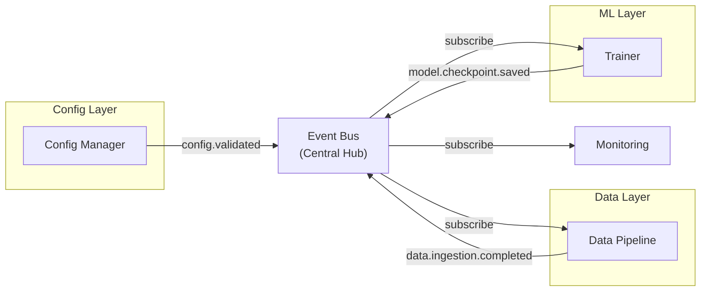

# ADR-006: Event-Driven Architecture for Cross-Layer Communication

**Status:** Accepted  
**Date:** 2026-07-10  
**Author:** @mbaetiong  
**Session:** S250-doc-arch  

---

## Context

With a 5-layer architecture, components in different layers need to communicate. Options are:

1. **Direct function calls** — Simple but creates tight coupling
2. **Pub/Sub event bus** — Decoupled but adds infrastructure
3. **Message queues** — Robust but adds complexity

As layers become independent microservices, direct coupling becomes impossible. Event-driven architecture allows:
- Loose coupling between layers
- Asynchronous processing
- Easier testing (mock event handlers)
- Natural audit trail (events are logs)

---

## Decision

Adopt **event-driven architecture** for cross-layer communication using a **local event bus** (in-process) with provisions for distributed event streaming (Kafka, RabbitMQ) in future phases.

**Event types:**

```
ConfigurationLayer
├─ config.loaded
├─ config.validated
└─ config.error

DataLayer
├─ data.ingestion.started
├─ data.ingestion.completed
├─ data.validation.failed
└─ data.quality.metrics

MLLayer
├─ training.epoch.started
├─ training.batch.completed
├─ training.validation.started
├─ model.checkpoint.saved
└─ training.error

RAGLayer
├─ embedding.computed
├─ vector.search.completed
└─ knowledge_graph.updated

APILayer
├─ request.received
├─ response.sent
└─ error.occurred
```

---

## Architecture

```python
class Event:
    """Base event class."""
    def __init__(self, name: str, timestamp: float, source_layer: str, 
                 data: dict = None):
        self.name = name
        self.timestamp = timestamp
        self.source_layer = source_layer
        self.data = data or {}

class EventBus:
    """Local event bus for in-process communication."""
    
    def __init__(self):
        self.handlers: Dict[str, List[Callable]] = {}
        self.event_history: List[Event] = []
    
    def subscribe(self, event_name: str, handler: Callable):
        """Register handler for event."""
        if event_name not in self.handlers:
            self.handlers[event_name] = []
        self.handlers[event_name].append(handler)
    
    def publish(self, event: Event):
        """Publish event to all subscribers."""
        self.event_history.append(event)
        
        if event.name in self.handlers:
            for handler in self.handlers[event.name]:
                try:
                    handler(event)
                except Exception as e:
                    self.publish(Event("error.handler_failed", 
                                      time.time(), "EventBus", 
                                      {"error": str(e)}))

# Global event bus
event_bus = EventBus()
```

**Usage example:**

```python
# Layer 2 (Data) publishes event
def on_data_loaded(data):
    event = Event(
        name="data.ingestion.completed",
        timestamp=time.time(),
        source_layer="DataLayer",
        data={"num_samples": len(data), "features": data.shape[1]}
    )
    event_bus.publish(event)

# Layer 3 (ML) subscribes to event
def on_data_ready(event: Event):
    print(f"Training starting with {event.data['num_samples']} samples")
    trainer.start_training()

event_bus.subscribe("data.ingestion.completed", on_data_ready)
```

---

## Event Flow Diagram



---

## Consequences

### Positive
✅ Loose coupling between layers — easy to modify individual layers  
✅ Asynchronous processing — non-blocking operations  
✅ Natural audit trail — all events logged  
✅ Easy to add monitoring and alerting  
✅ Testing easier — mock event bus  
✅ Future-proof for distributed systems  

### Negative
⚠️ Learning curve for event-driven patterns  
⚠️ Harder to debug — flow is implicit rather than explicit  
⚠️ Eventual consistency rather than immediate consistency  

### Mitigations
- Comprehensive event documentation
- Event bus has built-in logging
- Debugging tools to trace event flow
- Events timestamped for ordering

---

## Future: Distributed Events

When scaling to distributed systems, replace local event bus with:

**Apache Kafka:**
```python
# Topic partitioning by layer
topics = {
    "config": {"partitions": 3},
    "data": {"partitions": 5},
    "training": {"partitions": 8},
    "api": {"partitions": 10}
}
```

**RabbitMQ:**
```python
# Topic exchanges for fanout
exchanges = {
    "config": rabbitmq.exchange_declare("config", "topic"),
    "data": rabbitmq.exchange_declare("data", "topic"),
}
```

Both provide ordering, persistence, and scalability beyond in-process pub/sub.

---

## Implementation Checklist

- [x] EventBus base implementation
- [x] Event hierarchy defined
- [x] Layer integration started
- [ ] Event documentation for all layers
- [ ] Monitoring dashboard for event flow
- [ ] Performance testing under load
- [ ] Migration plan for distributed events

---

## Related ADRs
- ADR-004: 5-Layer Architecture
- ADR-009: Distributed Tracing Strategy
