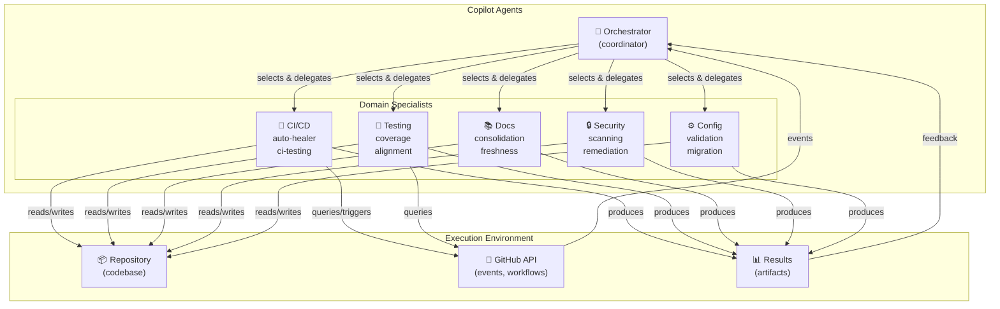
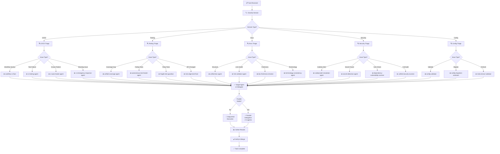
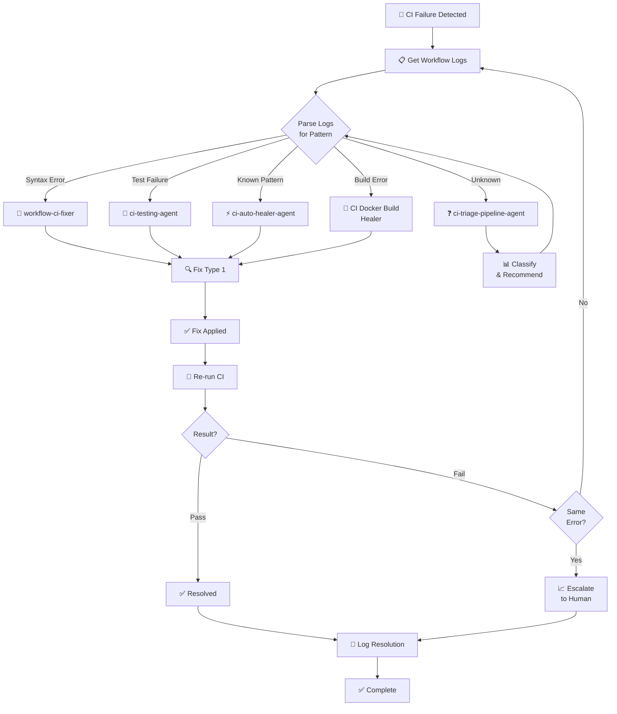
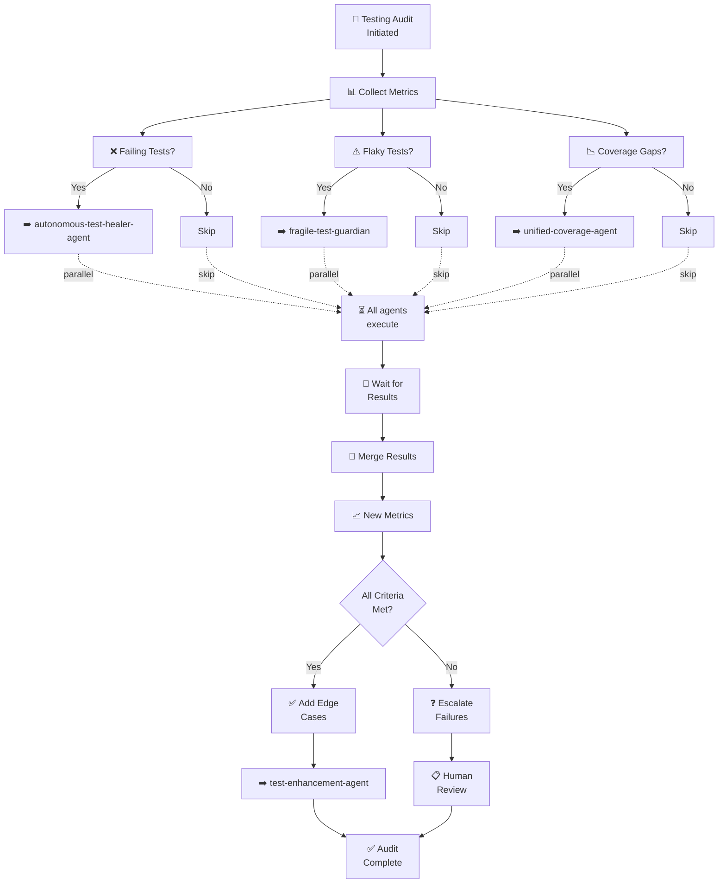
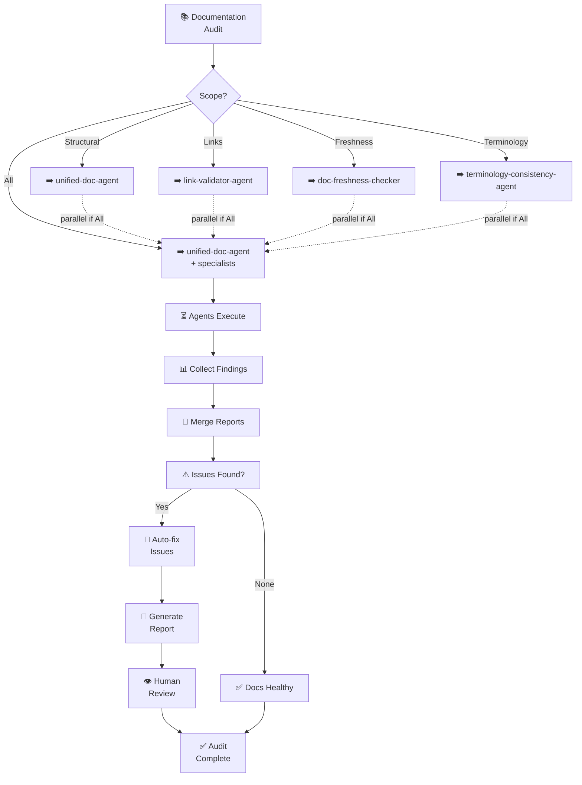
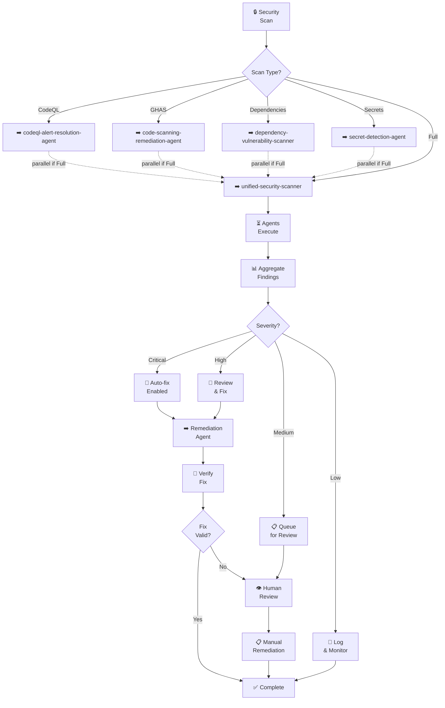
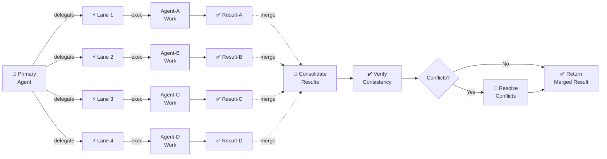
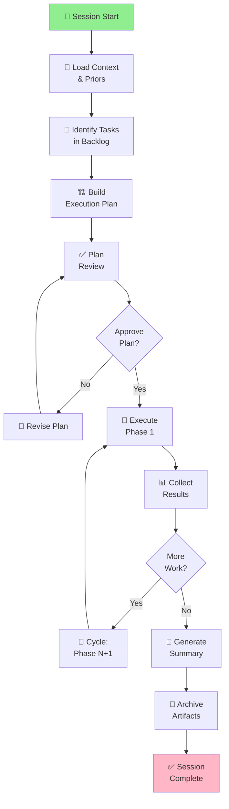
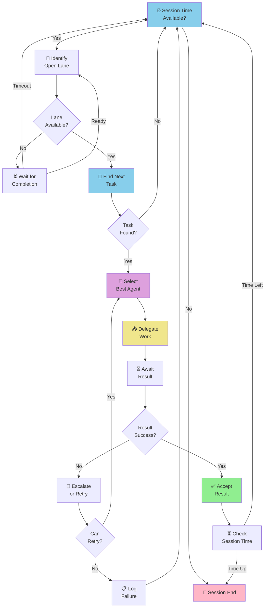
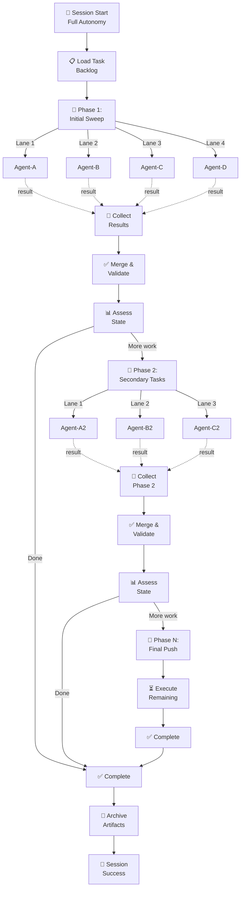

# Agent Workflow Coordination Diagrams

> **Document:** Mermaid Workflow Diagrams for Multi-Agent Orchestration  
> **Version:** 1.0.0  
> **Generated:** 2026-06-26  
> **Purpose:** Visual reference for agent coordination patterns, decision flows, and parallel execution models  

---

## Table of Contents

1. [Overall System Architecture](#overall-system-architecture)
2. [Agent Selection Decision Tree](#agent-selection-decision-tree)
3. [CI/CD Failure Resolution Cascade](#cicd-failure-resolution-cascade)
4. [Testing & Coverage Audit Workflow](#testing--coverage-audit-workflow)
5. [Documentation Audit Workflow](#documentation-audit-workflow)
6. [Security Scanning & Remediation](#security-scanning--remediation)
7. [Multi-Lane Parallel Execution](#multi-lane-parallel-execution)
8. [Session Lifecycle](#session-lifecycle)

---

## Overall System Architecture

---

## Agent Selection Decision Tree

---

## CI/CD Failure Resolution Cascade

---

## Testing & Coverage Audit Workflow

---

## Documentation Audit Workflow

---

## Security Scanning & Remediation

---

## Multi-Lane Parallel Execution

---

## Session Lifecycle

---

## Agentic Autonomy Loop

---

## Full Agentic Autonomy Pattern

---

## See Also

- [Custom Agent Selection Framework](./CUSTOM_AGENT_SELECTION_FRAMEWORK.md)
- [Multi-Agent Interaction Protocol](./CUSTOM_AGENT_INTERACTION_PROTOCOL.md)
- [Repeatable Processes](./CUSTOM_AGENT_REPEATABLE_PROCESSES.md)
- [AGENT_REGISTRY.yaml](../../.github/agents/AGENT_REGISTRY.yaml)
