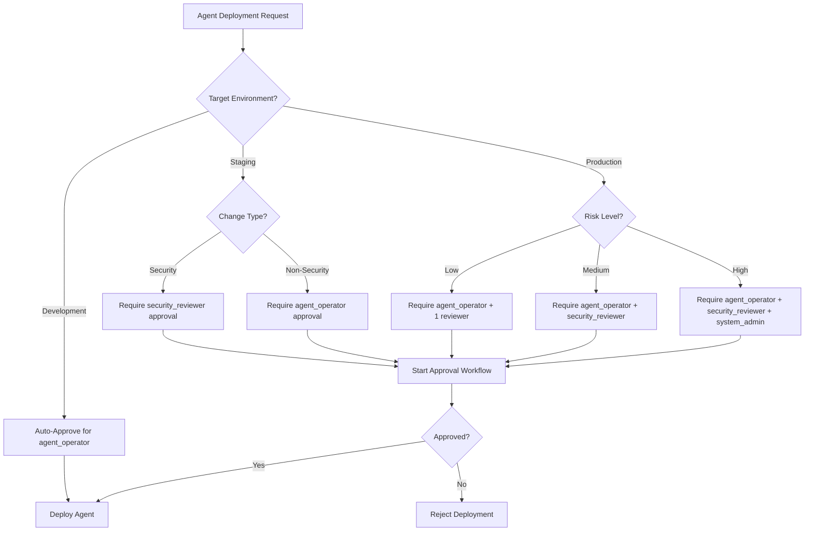
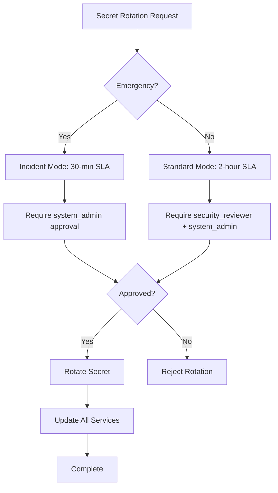
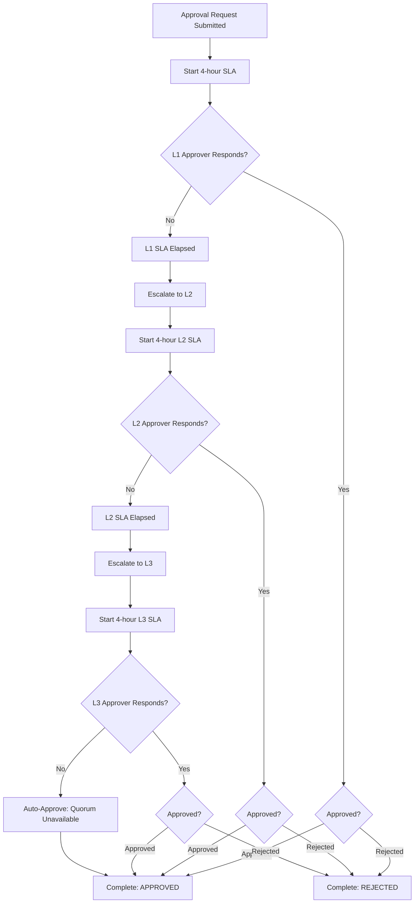

# Governance API Reference
**Last Updated:** 2026-07-11
**Version:** v0.2.1

**Status:** Production Ready
**Version:** 1.0.0
**Last Updated: 2026-07-08
**Author:** Phase 12 WS3 Documentation Team

---

## Table of Contents

1. [Overview](#overview)
2. [RBAC System](#rbac-system)
3. [Approval Policies](#approval-policies)
4. [Token Hierarchy](#token-hierarchy)
5. [Governance Decision Trees](#governance-decision-trees)
6. [API Endpoints](#api-endpoints)
7. [Examples](#examples)

---

## Overview

The Codex governance system provides Production Role-Based Access Control (RBAC), approval workflows, and audit logging for all sensitive operations. It ensures that all actions are validated against a comprehensive permission matrix and properly audited.

**Key Principles:**
- **Zero unauthorized actions:** Every permission check failure raises `PermissionDeniedError`
- **Full audit trail:** All governance decisions are logged and queryable
- **Immutable history:** Resolved approvals are kept in memory; state cannot be mutated
- **Auto-approval support:** Fast-track approvals when requester is already privileged

---

## RBAC System

### Role Hierarchy

The Codex platform defines 7 core roles organized by privilege level:

```
system_admin
  ├── agent_operator
  │   ├── ci_operator
  │   └── security_reviewer
  ├── doc_maintainer
  ├── agent_reader
  └── guest
```

#### System Admin
- **Scope:** Full control over all resources and role management
- **Actions:** CREATE, READ, UPDATE, DELETE, EXECUTE, APPROVE, ASSIGN
- **Resources:** agents, workflows, secrets, docs, code, reports, roles, audit_logs
- **Use Case:** Platform administrators, governance leads

#### Agent Operator
- **Scope:** Deploy, configure, and execute agents; manage workflows
- **Actions:** CREATE, READ, UPDATE, EXECUTE (agents/workflows); READ (secrets, docs, code)
- **Resources:** agents, workflows, secrets, docs, code, reports, roles, audit_logs
- **Use Case:** Agent deployment teams, workflow managers

#### CI Operator
- **Scope:** Trigger CI workflows and approve CI gates
- **Actions:** READ, EXECUTE, APPROVE (workflows); READ (agents, docs, code)
- **Resources:** workflows, agents, reports, audit_logs
- **Use Case:** CI/CD teams, pipeline maintainers

#### Security Reviewer
- **Scope:** Review and approve security-sensitive changes
- **Actions:** READ, APPROVE (workflows, secrets, code); READ (agents, docs, reports)
- **Resources:** workflows, secrets, code, reports, audit_logs
- **Use Case:** Security team, compliance officers

#### Doc Maintainer
- **Scope:** Create and manage documentation resources
- **Actions:** CREATE, READ, UPDATE, DELETE (docs); READ (agents, workflows, code, reports)
- **Resources:** docs, agents, workflows, code, reports
- **Use Case:** Documentation teams, technical writers

#### Agent Reader
- **Scope:** Read-only access to agent state and logs
- **Actions:** READ (agents, workflows, docs, code, reports)
- **Resources:** agents, workflows, docs, code, reports
- **Use Case:** Read-only users, auditors, analysts

#### Guest
- **Scope:** Minimal read-only access to public content
- **Actions:** READ (docs, reports)
- **Resources:** docs, reports
- **Use Case:** External stakeholders, public access

### Permission Matrix

Complete permission mapping:

| Role | Agents | Workflows | Secrets | Docs | Code | Reports | Roles | Audit Logs |
|------|--------|-----------|---------|------|------|---------|-------|-----------|
| **system_admin** | CRUDEF | CRUDEF | CRUDF | CRUDF | CRUDF | CRU | CRUDEF | R |
| **agent_operator** | CRUE | CRUE | R | R | RU | CR | R | R |
| **ci_operator** | RE | REA | — | R | R | CR | R | R |
| **security_reviewer** | R | RA | RA | R | RA | R | R | R |
| **doc_maintainer** | R | R | — | CRUDF | R | R | R | — |
| **agent_reader** | R | R | — | R | R | R | R | — |
| **guest** | — | — | — | R | — | R | — | — |

**Legend:** C=Create, R=Read, U=Update, D=Delete, E=Execute, A=Approve, F=Assign

### Resource Types

- **agents** - Agent definitions and instances
- **workflows** - CI/CD and governance workflows
- **secrets** - Credentials and sensitive data (requires explicit approval)
- **docs** - Documentation resources
- **code** - Source code and configuration
- **reports** - Generated reports and analytics
- **roles** - Role definitions and assignments
- **audit_logs** - Audit trail records

### Enforcement Patterns

#### Check Permission

```python
from codex.governance.rbac import RBACEnforcer, CodexRole, ResourceType, Action

enforcer = RBACEnforcer()

# Check if user has permission
try:
    enforcer.check_permission(
        user_id="user123",
        roles=[CodexRole.AGENT_OPERATOR],
        action=Action.EXECUTE,
        resource=ResourceType.AGENTS
    )
    # Permission granted, proceed
except PermissionDeniedError as e:
    # Permission denied - log and return error
    logger.error(f"Access denied: {e.user_id} cannot {e.action} {e.resource}")
```

#### Enforce Action

```python
# Enforce and audit simultaneously
enforcer.enforce_action(
    user_id="user123",
    roles=[CodexRole.AGENT_OPERATOR],
    action=Action.CREATE,
    resource=ResourceType.AGENTS,
    resource_id="agent_prod_001",
    context={"agent_name": "DataProcessor", "environment": "production"}
)
```

---

## Approval Policies

### Approval Request Lifecycle

```
PENDING → APPROVED → [Execute Action]
       ↘ REJECTED ↗
         EXPIRED
```

### Policy States

- **PENDING:** Request awaiting approver decision(s)
- **APPROVED:** All required approvers have approved
- **REJECTED:** One or more approvers rejected
- **EXPIRED:** Approval window (5 min default) elapsed without resolution
- **ARCHIVED:** Resolved request (APPROVED/REJECTED/EXPIRED) for audit

### Auto-Approval Logic

Requests are auto-approved when:

1. **RBAC Privilege Check:** Requester already has the required approval role for the target resource
2. **Quorum Unavailable:** Owner/L1 approvers not available after SLA escalation
3. **Incident Mode:** System in incident mode and action is authorized
4. **Emergency Override:** System admin provides explicit emergency exception

### SLA Escalation

Approval requests follow a 3-level escalation policy:

**Level 1 (L1) - Primary Owner:** 4 hour SLA
**Level 2 (L2) - Secondary Reviewer:** 4 hour SLA (escalated from L1)
**Level 3 (L3) - Senior Authority:** 4 hour SLA (escalated from L2)

Special SLAs for:
- **Destructive Operations:** 0 hour SLA (requires immediate approval)
- **Incident Response:** 30 minute SLA (expedited approval)

### Approval Decision

```python
from codex.governance.approval_service import ApprovalService, ApprovalDecision

service = ApprovalService()

# Submit approval request
request = service.submit_approval(
    policy_code="AGENT_DEPLOY_PROD",
    requester_id="user123",
    resource_id="agent_prod_001",
    context={"change_summary": "Update ML model", "risk_level": "high"}
)

# Approver decides
decision = ApprovalDecision(
    approver_id="approver456",
    approver_name="Alice Chen",
    decision="approved",
    reason="Change reviewed and validated against security policies"
)

service.add_decision(request.request_id, decision)
```

### Approval Policies by Category

#### Agent Deployment (AGENT_DEPLOY_*)

- **Production:** Requires security_reviewer + agent_operator approval
- **Staging:** Requires agent_operator approval
- **Development:** Auto-approved for agent_operator role
- **SLA:** 4 hours (24 hours for major version changes)

#### Secret Rotation (SECRET_ROTATE)

- **Requires:** security_reviewer + system_admin approval
- **SLA:** 2 hours
- **Audit:** Full secret change history retained

#### Workflow Changes (WORKFLOW_CHANGE)

- **Requires:** ci_operator + security_reviewer (if security-related)
- **SLA:** 4 hours
- **Auto-approval:** Allowed if change is non-security-related and requester is ci_operator

#### Code Changes (CODE_REVIEW)

- **Requires:** security_reviewer approval
- **SLA:** 24 hours
- **Tier 1:** High-risk changes (security, auth, governance)
- **Tier 2:** Medium-risk changes (performance, reliability)

---

## Token Hierarchy

### Token Types

#### Access Token
- **Purpose:** Authenticate API requests
- **TTL:** 15 minutes (default)
- **Scope:** Specific permissions (read, write, admin)
- **Refresh:** Via refresh token
- **Format:** JWT (RS256)

#### Refresh Token
- **Purpose:** Obtain new access tokens
- **TTL:** 30 days (default)
- **Scope:** Limited to token refresh
- **Revocation:** Immediate upon logout
- **Format:** Opaque token (secure, random)

#### Session Token
- **Purpose:** Track user session across requests
- **TTL:** 24 hours (default)
- **Scope:** Session-specific (user_id, roles, permissions)
- **Revocation:** Automatic on logout or timeout
- **Format:** JWT with session ID

#### API Token
- **Purpose:** Service-to-service authentication
- **TTL:** Long-lived (90 days)
- **Scope:** Service-specific permissions
- **Rotation:** Monthly recommended
- **Format:** Base64-encoded (API key pattern)

### Token Scope Model

Scopes control granular permissions within each token:

```
api:agents:read      # Read agent definitions
api:agents:write     # Create/modify agents
api:workflows:exec   # Execute workflows
api:secrets:read     # Read secrets
governance:approve   # Approve requests
governance:audit     # Access audit logs
```

### Token Lifecycle

```
Token Issued
    ↓
[TTL countdown]
    ↓
[Refresh via Refresh Token] OR [Token Expires]
    ↓
New Token Issued OR Re-authenticate
```

### Token Management API

#### Issue Token

```python
from codex.auth.token_manager import TokenManager

tokens = TokenManager(secret_key="your-secret-key")

# Issue access token
access_token = tokens.issue_token(
    user_id="user123",
    roles=["agent_operator", "ci_operator"],
    expires_in_seconds=900  # 15 minutes
)

# Issue refresh token
refresh_token = tokens.issue_refresh_token(
    user_id="user123",
    expires_in_seconds=2592000  # 30 days
)
```

#### Validate Token

```python
# Validate and decode token
try:
    payload = tokens.validate_token(access_token)
    user_id = payload["user_id"]
    roles = payload["roles"]
except TokenExpiredError:
    # Use refresh token to get new access token
    new_access_token = tokens.refresh_access_token(refresh_token)
except TokenInvalidError:
    # Token is invalid or tampered with
    return 401_UNAUTHORIZED
```

#### Revoke Token

```python
# Revoke session token on logout
tokens.revoke_token(session_token)

# Revoke all tokens for a user (password change)
tokens.revoke_all_user_tokens(user_id="user123")
```

---

## Governance Decision Trees

### Agent Deployment Decision Tree



### Secret Rotation Decision Tree



### Approval Escalation Decision Tree



---

## API Endpoints

### RBAC Enforcement

#### Check Permission
```
GET /api/v1/governance/rbac/check
Content-Type: application/json

{
  "user_id": "user123",
  "action": "execute",
  "resource": "agents",
  "resource_id": "agent_prod_001"
}

Response:
{
  "allowed": true,
  "roles": ["agent_operator", "ci_operator"],
  "reason": "agent_operator role permits execute on agents"
}
```

#### List User Permissions
```
GET /api/v1/governance/rbac/permissions?user_id=user123

Response:
{
  "user_id": "user123",
  "roles": ["agent_operator"],
  "permissions": {
    "agents": ["create", "read", "update", "execute"],
    "workflows": ["create", "read", "update", "execute"],
    "secrets": ["read"],
    "docs": ["read"],
    "code": ["read", "update"],
    "reports": ["create", "read"],
    "audit_logs": ["read"]
  }
}
```

### Approval Workflows

#### Submit Approval Request
```
POST /api/v1/governance/approvals
Content-Type: application/json

{
  "policy_code": "AGENT_DEPLOY_PROD",
  "requester_id": "user123",
  "resource_id": "agent_prod_001",
  "context": {
    "agent_name": "DataProcessor",
    "version": "2.1.0",
    "change_summary": "ML model update"
  }
}

Response:
{
  "request_id": "req-uuid-123",
  "status": "pending",
  "created_at": 1720000000,
  "expires_at": 1720000300,
  "approvers": ["approver1@company.com", "approver2@company.com"]
}
```

#### Get Approval Status
```
GET /api/v1/governance/approvals/{request_id}

Response:
{
  "request_id": "req-uuid-123",
  "status": "pending",
  "decisions": [
    {
      "approver": "approver1@company.com",
      "decision": "approved",
      "reason": "Change reviewed",
      "decided_at": 1720000100
    }
  ],
  "auto_approved": false
}
```

#### Add Decision
```
POST /api/v1/governance/approvals/{request_id}/decision
Content-Type: application/json

{
  "approver_id": "approver1@company.com",
  "decision": "approved",
  "reason": "Change reviewed and validated"
}

Response:
{
  "request_id": "req-uuid-123",
  "status": "pending",
  "pending_approvers": ["approver2@company.com"]
}
```

---

## Examples

### Example 1: Agent Deployment with Approval

```python
from codex.governance.rbac import RBACEnforcer, CodexRole, Action, ResourceType
from codex.governance.approval_service import ApprovalService, ApprovalDecision

# Step 1: Check if requester has permission
rbac = RBACEnforcer()
try:
    rbac.enforce_action(
        user_id="alice",
        roles=[CodexRole.AGENT_OPERATOR],
        action=Action.EXECUTE,
        resource=ResourceType.AGENTS,
        resource_id="agent_prod_001"
    )
except PermissionDeniedError:
    print("Alice lacks execute permission on agents")
    return

# Step 2: Submit approval request
approval_service = ApprovalService()
request = approval_service.submit_approval(
    policy_code="AGENT_DEPLOY_PROD",
    requester_id="alice",
    resource_id="agent_prod_001",
    context={
        "agent_name": "DataProcessor",
        "version": "2.1.0",
        "change_summary": "Update ML model for Q3 campaign"
    }
)

print(f"Approval request {request.request_id} submitted")
print(f"Expires at {request.expires_at}")

# Step 3: Security reviewer approves
decision = ApprovalDecision(
    approver_id="bob_security_lead",
    approver_name="Bob Chen",
    decision="approved",
    reason="Model validated against Q3 security requirements"
)

approval_service.add_decision(request.request_id, decision)

# Step 4: Check if approved
updated_request = approval_service.get_request(request.request_id)
if updated_request.status == "approved":
    print("Deployment approved. Proceeding...")
    # Execute deployment
```

### Example 2: Custom Role with Limited Permissions

```python
from codex.governance.rbac import RBACEnforcer, ResourceType, Action

rbac = RBACEnforcer()

# Define custom role with limited scope
custom_role_permissions = {
    ResourceType.AGENTS: {Action.READ},
    ResourceType.WORKFLOWS: {Action.READ, Action.EXECUTE},
    ResourceType.REPORTS: {Action.READ, Action.CREATE}
}

# Register custom role
rbac.register_custom_role("analyst_reporting", custom_role_permissions)

# Check permission
if rbac.has_permission("user_analyst", "analyst_reporting", Action.READ, ResourceType.AGENTS):
    print("Analyst can read agents")
else:
    print("Analyst cannot modify agents")
```

---

## References

- [RBAC Implementation](../arch/RBAC-design-detailed.md)
- [Approval Policies](../arch/approval-policies-detailed.md)
- [Token Management](../api/token-hierarchy.md)
- [Audit Logging](../ops/security-runbooks.md)
- [API Documentation](../api/)

---

**Last Updated: 2026-07-08
**Version:** 1.0.0
**Status:** Production Ready
