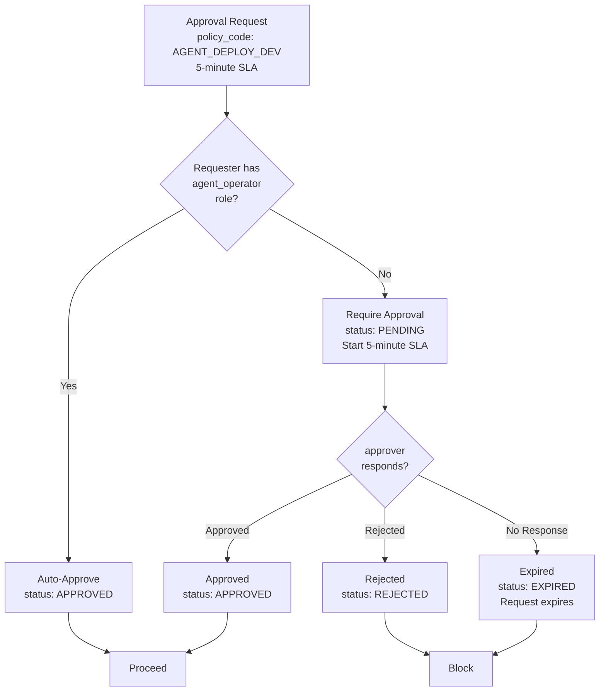
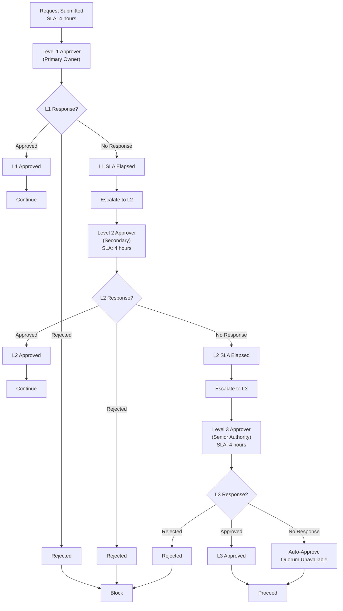
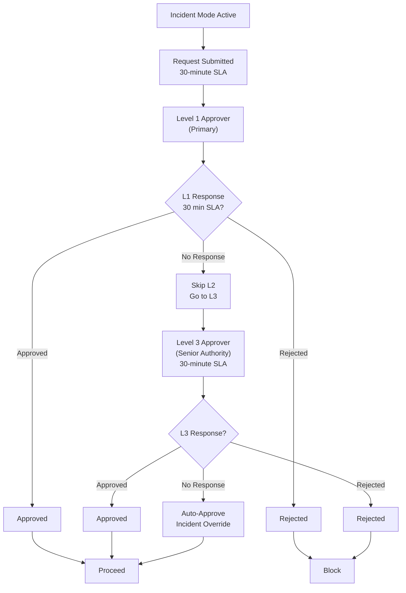

# Approval Policies & Decision Logic - Detailed
**Last Updated:** 2026-07-11
**Version:** v0.2.1

**Status:** Production Ready
**Version:** 1.0.0
**Last Updated: 2026-07-08
**Author:** Phase 12 WS3 Documentation Team

---

## Table of Contents

1. [Overview](#overview)
2. [Approval States](#approval-states)
3. [SLA Escalation](#sla-escalation)
4. [Approval Policies by Category](#approval-policies-by-category)
5. [Auto-Approval Logic](#auto-approval-logic)
6. [Decision Trees](#decision-trees)
7. [Implementation Guide](#implementation-guide)

---

## Overview

### Purpose

The approval system provides a human-in-the-loop gate for sensitive operations, ensuring that:

1. **Separation of Duties:** Deployers and approvers are different people
2. **Compliance:** All sensitive changes require documented approval
3. **Accountability:** Full audit trail of who approved what and when
4. **Speed:** Fast-track approval when requester is already privileged

### Key Characteristics

- **5-minute SLA:** Requests expire after 5 minutes without approval
- **3-level escalation:** If approval not given, escalate up chain
- **Auto-approval:** RBAC-privileged requesters auto-approved
- **Incident mode:** Expedited 30-minute SLA during incidents
- **Immutable history:** Once resolved, approvals cannot be changed

### Approval Workflow States

```
 
 PENDING (5m)
 
 
 
 
 
 APPROVED REJECTED EXPIRED 
 
 
 
 
 
 ARCHIVED (90d)
 
```

---

## Approval States

### PENDING

**Duration:** Up to 5 minutes from creation

**Characteristics:**
- Awaiting at least one approver decision
- Can be escalated if no response within SLA
- Multiple approvers can vote before reaching APPROVED/REJECTED
- Context and metadata immutable

**Transitions:**
- APPROVED: All required approvers approved
- REJECTED: Any required approver rejected
- EXPIRED: 5 minutes elapsed without decision

**Example:**
```python
request = ApprovalRequest(
 request_id="req-789",
 policy_code="AGENT_DEPLOY_PROD",
 status=ApprovalStatus.PENDING,
 created_at=1720000000,
 expires_at=1720000300 # 5 minutes later
)
```

### APPROVED

**Duration:** Permanent (moved to ARCHIVED after 90 days)

**Characteristics:**
- All required approvers have approved (or auto-approved)
- Action can now proceed immediately
- Immutable - cannot be un-approved
- Full decision history retained

**Transitions:**
- PENDING: When last required approver approved
- ARCHIVED: After 90-day retention

**Example:**
```python
request.status = ApprovalStatus.APPROVED
request.decisions = [
 ApprovalDecision(
 approver="alice",
 decision="approved",
 reason="Reviewed and validated"
 ),
 ApprovalDecision(
 approver="bob",
 decision="approved",
 reason="Security assessment passed"
 )
]
```

### REJECTED

**Duration:** Permanent (moved to ARCHIVED after 90 days)

**Characteristics:**
- At least one required approver has rejected
- Action is blocked and cannot proceed
- Immutable - cannot be un-rejected
- Rejection reason documented

**Transitions:**
- PENDING: When any required approver rejected
- ARCHIVED: After 90-day retention

**Escalation Options:**
- Requester can submit new request for re-approval
- Resubmission after addressing approval reason recommended

**Example:**
```python
request.status = ApprovalStatus.REJECTED
request.decisions = [
 ApprovalDecision(
 approver="charlie",
 decision="rejected",
 reason="ML model has not been validated against Q3 security requirements"
 )
]
```

### EXPIRED

**Duration:** Permanent (moved to ARCHIVED after 90 days)

**Characteristics:**
- 5-minute approval window elapsed without decision
- Considered a rejection (action cannot proceed)
- Typically triggers automatic escalation
- Requester can resubmit immediately

**Transitions:**
- PENDING: When 5 minutes elapsed
- Auto-escalate: Escalate to Level 2 approvers if multi-level policy
- ARCHIVED: After 90-day retention

**Example:**
```python
# At 5-minute mark
request.status = ApprovalStatus.EXPIRED
request.escalation_count = 1
```

---

## SLA Escalation

### Escalation Policy

If approval decision is not made within the SLA window, the request automatically escalates to the next level of authority:

```
Level 1 (Primary) 4 hours Level 2 (Secondary) 4 hours Level 3 (Senior)
 (escalate) (escalate)
 
If Level 3 doesn't respond:
 Auto-approve (quorum unavailable)
```

### Level 1: Primary Owner (4 hours)

**Who:** Usually the direct manager or subject-matter expert

**Actions:**
- Approve based on technical assessment
- Request more information if needed
- Reject with clear reason

**Example SLA Definition:**
```python
SLAPolicy(
 policy_code="AGENT_DEPLOY_PROD",
 l1_sla_hours=4.0,
 l2_sla_hours=4.0,
 owner_sla_hours=4.0,
 max_escalations=2
)
```

### Level 2: Secondary Reviewer (4 hours)

**When:** Escalated from L1 after 4 hours without response

**Who:** Senior peer or team lead (different from L1)

**Characteristics:**
- Different person than L1 (separation of duties)
- May request additional review
- Same approval authority as L1

**Escalation Trigger:**
```python
if time.time() > request.sla_deadline:
 request.escalation_count += 1
 request.current_approver_id = "level2_approver"
 request.sla_deadline = time.time() + 4 * 3600
```

### Level 3: Senior Authority (4 hours)

**When:** Escalated from L2 after 4 hours without response

**Who:** Director, manager, or authority figure

**Authority:**
- Can override previous concerns
- Final decision authority
- May make executive decision

**Auto-Approval Logic:**
```python
if time.time() > request.sla_deadline and request.escalation_count >= 2:
 # Auto-approve due to quorum unavailable
 request.status = ApprovalStatus.APPROVED
 request.auto_approved = True
 request.escalation_count = 3
```

### Special SLAs

#### Destructive Operations (0 hours)

Operations that cannot be undone require immediate approval:

- Database migrations
- Production data deletion
- Secret revocation
- Agent deprecation

**Policy:**
```python
SLAPolicy(
 policy_code="DESTRUCTIVE_OPERATION",
 l1_sla_hours=0.0, # Immediate approval required
 is_destructive=True,
 requires_system_admin=True
)
```

#### Incident Response (30 minutes)

During active incidents, approval SLA is expedited:

- Reduce L1 SLA to 30 minutes
- Skip L2 escalation (go directly to L3)
- Auto-approve if senior authority unavailable

**Policy:**
```python
SLAPolicy(
 policy_code="INCIDENT_RESPONSE",
 incident_sla_minutes=30.0,
 is_incident_related=True,
 max_escalations=1
)
```

---

## Approval Policies by Category

### AGENT_DEPLOY_DEV

**Purpose:** Deploy agent to development environment

**Requirements:**
- Requester: Any team member
- Approver: agent_operator role
- Auto-approve: Yes (if requester has agent_operator)

**SLA:** 4 hours (best-effort, no escalation)

**Policy Definition:**
```python
APPROVAL_POLICY_MATRIX = {
 "AGENT_DEPLOY_DEV": {
 "require_rbac_approval": True,
 "auto_approve_if_privileged": True,
 "required_roles": [CodexRole.AGENT_OPERATOR],
 "sla_hours": 4,
 "max_escalations": 0,
 "environment": "development"
 }
}
```

**Workflow:**
```
Requester submits request
 
[Check: Does requester have agent_operator role?]
 YES Auto-approve, proceed with deployment
 NO Request agent_operator approval
 
 [Wait up to 4 hours]
 
 [Timeout: Request expires]
```

### AGENT_DEPLOY_STAGING

**Purpose:** Deploy agent to staging environment

**Requirements:**
- Requester: Any team member
- Approver: security_reviewer + agent_operator
- Auto-approve: No

**SLA:** 4 hours (escalates to L2, then L3)

**Policy Definition:**
```python
"AGENT_DEPLOY_STAGING": {
 "require_rbac_approval": True,
 "auto_approve_if_privileged": False,
 "required_roles": [CodexRole.SECURITY_REVIEWER, CodexRole.AGENT_OPERATOR],
 "sla_hours": 4,
 "max_escalations": 2,
 "environment": "staging"
}
```

### AGENT_DEPLOY_PROD

**Purpose:** Deploy agent to production environment

**Requirements:**
- Requester: agent_operator role (enforced)
- Approver 1: security_reviewer (code/model validation)
- Approver 2: ci_operator (infrastructure readiness)
- Multi-step approval required

**SLA:** 4 hours per approver (cascading)

**Policy Definition:**
```python
"AGENT_DEPLOY_PROD": {
 "require_rbac_approval": True,
 "auto_approve_if_privileged": False,
 "required_roles": [CodexRole.SECURITY_REVIEWER, CodexRole.CI_OPERATOR],
 "sla_hours": 4,
 "max_escalations": 2,
 "environment": "production",
 "sequential_approval": True,
 "requires_all_approvers": True,
 "risk_level": "high"
}
```

**Workflow:**
```
agent_operator submits deployment request
 
[Requires 2 approvals: security_reviewer + ci_operator]
 security_reviewer reviews code/model (4h SLA)
 Approved Continue
 Rejected Deployment blocked
 Timeout Escalate to L2 security reviewer
 
 ci_operator reviews infrastructure (4h SLA in parallel)
 Approved Both approved, proceed
 Rejected Deployment blocked
 Timeout Escalate to L2 infra reviewer
```

### SECRET_ROTATE

**Purpose:** Rotate/update sensitive credentials

**Requirements:**
- Requester: security_reviewer role (enforced)
- Approver 1: security_reviewer (initial review)
- Approver 2: system_admin (final authorization)

**SLA:** 2 hours (expedited, critical operation)

**Policy Definition:**
```python
"SECRET_ROTATE": {
 "require_rbac_approval": True,
 "auto_approve_if_privileged": False,
 "required_roles": [CodexRole.SECURITY_REVIEWER, CodexRole.SYSTEM_ADMIN],
 "sla_hours": 2,
 "max_escalations": 1,
 "is_destructive": False, # But time-sensitive
 "requires_all_approvers": True
}
```

**Special Handling:**
- Audit log entry required with rotation details
- Email notification to security team
- Automatic rollback capability for 24 hours

### CODE_REVIEW_SECURITY

**Purpose:** Approve security-sensitive code changes

**Requirements:**
- Requester: Any developer
- Approver: security_reviewer (required)
- SLA: 24 hours

**Policy Definition:**
```python
"CODE_REVIEW_SECURITY": {
 "require_rbac_approval": True,
 "auto_approve_if_privileged": False,
 "required_roles": [CodexRole.SECURITY_REVIEWER],
 "sla_hours": 24,
 "max_escalations": 1,
 "risk_areas": [
 "authentication",
 "authorization",
 "cryptography",
 "secrets",
 "data validation"
 ]
}
```

### WORKFLOW_CHANGE

**Purpose:** Approve CI/CD workflow changes

**Requirements:**
- Requester: ci_operator role
- Approver: ci_operator + security_reviewer (if security-related)
- SLA: 4 hours

**Policy Definition:**
```python
"WORKFLOW_CHANGE": {
 "require_rbac_approval": True,
 "auto_approve_if_privileged": False,
 "required_roles": [CodexRole.CI_OPERATOR],
 "conditional_roles": [CodexRole.SECURITY_REVIEWER], # If security-related
 "sla_hours": 4,
 "max_escalations": 1
}
```

---

## Auto-Approval Logic

### When Is Auto-Approval Triggered?

Auto-approval is triggered when ALL of these conditions are met:

#### Condition 1: Requester Has Required Role

```python
# Check if requester has all required approval roles
def check_rbac_auto_approval(requester_roles, policy):
 required_roles = set(policy["required_roles"])
 has_all_roles = required_roles.issubset(set(requester_roles))
 return has_all_roles
```

#### Condition 2: Policy Allows Auto-Approval

```python
# Check policy configuration
def policy_allows_auto_approval(policy):
 return policy.get("auto_approve_if_privileged", False)
```

#### Condition 3: Not a Destructive Operation

```python
def is_safe_for_auto_approval(policy):
 return not policy.get("is_destructive", False)
```

### Auto-Approval Examples

#### Example 1: Developer Deploying to Dev Environment

```python
request = ApprovalRequest(
 policy_code="AGENT_DEPLOY_DEV",
 requester_id="alice",
 requester_roles=[CodexRole.AGENT_OPERATOR],
 resource_id="agent_dev_v1"
)

# Policy allows auto-approval if requester has agent_operator
if all([
 CodexRole.AGENT_OPERATOR in request.requester_roles,
 POLICIES["AGENT_DEPLOY_DEV"]["auto_approve_if_privileged"],
 not POLICIES["AGENT_DEPLOY_DEV"]["is_destructive"]
]):
 request.status = ApprovalStatus.APPROVED
 request.auto_approved = True
 # Proceed immediately
```

#### Example 2: Agent Operator with RBAC Privilege

```python
request = ApprovalRequest(
 policy_code="AGENT_DEPLOY_PROD",
 requester_id="bob",
 requester_roles=[
 CodexRole.AGENT_OPERATOR,
 CodexRole.SECURITY_REVIEWER,
 CodexRole.CI_OPERATOR
 ]
)

# Policy requires both security_reviewer + ci_operator
if all([
 CodexRole.SECURITY_REVIEWER in request.requester_roles,
 CodexRole.CI_OPERATOR in request.requester_roles,
 POLICIES["AGENT_DEPLOY_PROD"]["auto_approve_if_privileged"],
]):
 request.status = ApprovalStatus.APPROVED
 request.auto_approved = True
 # Proceed immediately (rare case - usually blocked by "not auto_approve_if_privileged")
```

### Auto-Approval Audit

When auto-approval is triggered, it's logged differently:

```python
AuditCode.AUTO_APPROVAL_RBAC_PRIVILEGE = "AUTO_APPROVAL_RBAC_PRIVILEGE"

# Logged as
{
 "timestamp": 1720000000,
 "request_id": "req-xyz",
 "audit_code": AuditCode.AUTO_APPROVAL_RBAC_PRIVILEGE,
 "requester_id": "alice",
 "roles": ["agent_operator"],
 "policy": "AGENT_DEPLOY_DEV",
 "auto_approved": True,
 "reason": "Requester has required agent_operator role"
}
```

---

## Decision Trees

### Single-Level Approval



### Multi-Level Escalation



### Incident Mode Escalation



---

## Implementation Guide

### Step 1: Define Policy

```python
# Define a new approval policy
policy = {
 "policy_code": "CUSTOM_OPERATION",
 "required_roles": [CodexRole.AGENT_OPERATOR, CodexRole.SECURITY_REVIEWER],
 "sla_hours": 4,
 "max_escalations": 2,
 "auto_approve_if_privileged": False,
 "is_destructive": False,
 "sequential_approval": False,
 "requires_all_approvers": True
}

APPROVAL_POLICY_MATRIX["CUSTOM_OPERATION"] = policy
```

### Step 2: Submit Request

```python
from codex.governance.approval_service import ApprovalService

service = ApprovalService()

request = service.submit_approval(
 policy_code="CUSTOM_OPERATION",
 requester_id="alice",
 resource_id="resource_001",
 context={"change_type": "update", "risk_level": "medium"}
)

print(f"Request {request.request_id} created")
print(f"Status: {request.status}")
print(f"Expires: {request.expires_at}")
```

### Step 3: Check Request Status

```python
# Check if request was auto-approved
if request.auto_approved:
 print("Request auto-approved (requester has required roles)")
 # Proceed immediately
else:
 print(f"Awaiting approval from: {request.pending_approvers}")
 # Wait or poll for approvals
```

### Step 4: Add Decision

```python
from codex.governance.approval_service import ApprovalDecision

decision = ApprovalDecision(
 approver_id="bob",
 approver_name="Bob Chen",
 decision="approved",
 reason="Change validated against security requirements",
 authority_level=1 # L1 approver
)

service.add_decision(request.request_id, decision)

# Check if approved now
updated = service.get_request(request.request_id)
if updated.status == "approved":
 print("Approved! Proceeding with action...")
```

### Step 5: Handle Escalation

```python
# Check if request has escalated
if request.escalation_count > 0:
 print(f"Request escalated {request.escalation_count} times")
 
# Check if request expired
if request.status == "expired":
 print("Request expired without approval")
 # Option 1: Resubmit
 # Option 2: Escalate manually
```

---

## References

- [Governance API Reference](../api/governance-api-reference.md)
- [RBAC Design](../arch/RBAC-design-detailed.md)
- [Token Hierarchy](../api/token-hierarchy.md)
- [Audit Logging](../ops/security-runbooks.md#audit-logging)

---

**Last Updated: 2026-07-08
**Version:** 1.0.0
**Status:** Production Ready
