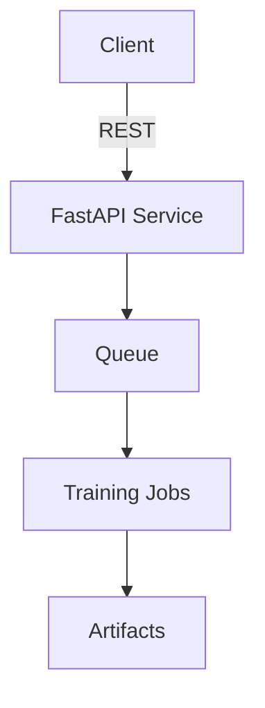

# Architecture Overview

The FastAPI service exposes `/infer`, `/train`, and `/evaluate` endpoints.
Requests are enqueued and processed by background workers that write
artifacts and metrics to disk for offline inspection.
