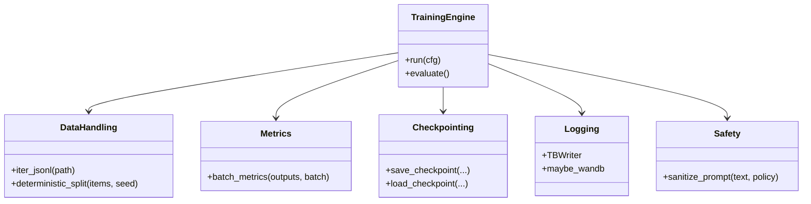
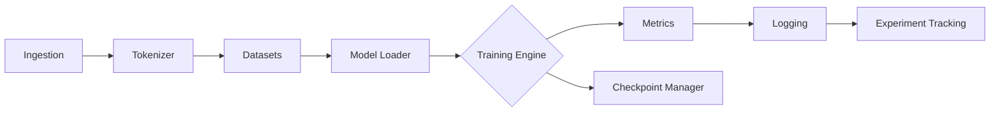

# Architecture Overview

This page sketches the core components and their relationships.

## Runtime flow

**Legend**

- Solid nodes are required.
- Dashed arrows/nodes (not shown) can represent optional components such as LoRA/PEFT adapters, offline trackers (TensorBoard, MLflow, W&B), and the async NDJSON writer.

The flow begins with raw data ingestion, followed by tokenization and dataset creation. A model loader prepares either a tiny in-repo model or a cached Hugging Face checkpoint. The training engine (HF Trainer or a custom loop) consumes datasets and produces metrics. Metrics feed into logging and optional experiment tracking backends while checkpoints enable resume and evaluation.
