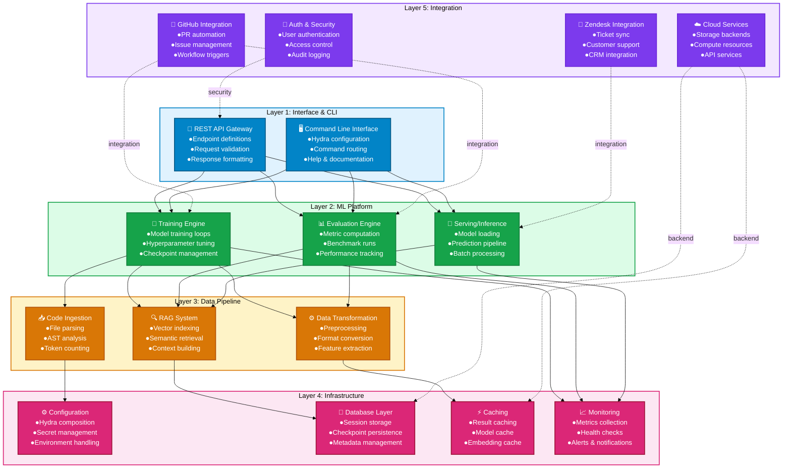
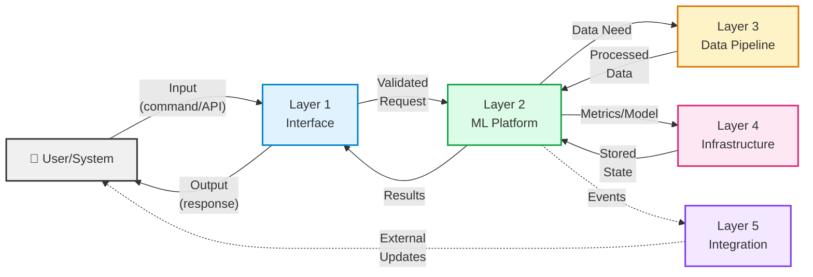

# 5-Layer Architecture Overview

**Last Updated**: 2026-01-20  
**Version**: v0.9.0  
**Status**: Production-Ready  
**Coverage**: 108+ Components

---

## Quick Reference

The Aries-Serpent/_codex_ platform is organized into **5 horizontal layers**, each handling specific responsibilities:



---

## Layer Descriptions

### Layer 1: Interface & CLI 🖥️
**Responsibility**: User interaction and request entry points  
**Key Components**:
- **CLI** - Command-line interface with Hydra-based configuration management
- **REST API** - HTTP endpoint gateway for programmatic access
- **Command Routing** - Routes commands to appropriate layer 2 engines

**Typical Flow**:
```
User Command → CLI Parser → Hydra Config → Layer 2 (Training/Eval/Serving)
```

**Technologies**: Click, Hydra, FastAPI

---

### Layer 2: ML Platform 🔄
**Responsibility**: Core machine learning operations  
**Key Components**:
- **Training Engine** - Model training with checkpoint management
- **Evaluation Engine** - Metrics computation and benchmark execution
- **Serving/Inference** - Model loading and prediction pipelines

**Typical Flow**:
```
Config → Model Architecture → Training Loop → Checkpoints → Evaluation → Metrics
```

**Technologies**: PyTorch, Ray, MLflow

---

### Layer 3: Data Pipeline 📥
**Responsibility**: Data ingestion, transformation, and retrieval  
**Key Components**:
- **Code Ingestion** - Parses source files and generates ASTs
- **RAG System** - Builds vector indices and retrieves relevant context
- **Transformation** - Preprocesses and transforms data formats

**Typical Flow**:
```
Raw Files → AST Analysis → Token Encoding → Vector Embedding → Storage
Query → Semantic Search → Ranking → Context Assembly → Return
```

**Technologies**: tokenizers, transformers, FAISS/Pinecone, SentenceBERT

---

### Layer 4: Infrastructure ⚙️
**Responsibility**: System support, persistence, and observability  
**Key Components**:
- **Configuration** - Hydra composition and secret management
- **Database** - Session/checkpoint/metadata persistence
- **Caching** - Results, model, and embedding caches
- **Monitoring** - Metrics, health checks, alerts

**Typical Flow**:
```
Config Files → Hydra Composition → Validated Config → Layer 2/3 Operations
Operations → Metrics → Monitoring Stack → Alerts/Dashboards
```

**Technologies**: OmegaConf, SQLite, Redis/Memcached, Prometheus

---

### Layer 5: Integration 🔌
**Responsibility**: External system connections  
**Key Components**:
- **GitHub Integration** - PR automation, issue management
- **Zendesk Integration** - CRM and support ticket sync
- **Cloud Services** - Storage, compute, API services
- **Auth & Security** - User management and access control

**Typical Flow**:
```
External Trigger (GitHub PR) → Validation → Layer 1-4 Processing → Update External System
```

**Technologies**: GitHub API, Zendesk API, Cloud SDKs, OAuth/JWT

---

## Data Flow Through Layers



---

## Component Inventory by Layer

| Layer | Component | Status | Docs |
|-------|-----------|--------|------|
| **L1** | CLI | ✅ Production | [docs/cli](../cli/) |
| **L1** | API Gateway | ✅ Production | [docs/api](../api/) |
| **L2** | Training Engine | ✅ Production | [docs/training](../training/) |
| **L2** | Evaluation Engine | ✅ Production | [docs/evaluation](../evaluation/) |
| **L2** | Serving | ✅ Production | [docs/serving](../serving/) |
| **L3** | Code Ingestion | ✅ Production | [docs/ingestion](../ingestion/) |
| **L3** | RAG System | ✅ Production | [docs/rag](../rag/) |
| **L3** | Data Transform | ✅ Production | [docs/transformation](../transformation/) |
| **L4** | Configuration | ✅ Production | [docs/configuration](../configuration/) |
| **L4** | Database | ✅ Production | [docs/database](../database/) |
| **L4** | Caching | ✅ Production | [docs/caching](../caching/) |
| **L4** | Monitoring | ✅ Production | [docs/monitoring](../monitoring/) |
| **L5** | GitHub Integration | ✅ Production | [docs/integration](../integration/) |
| **L5** | Zendesk Integration | ✅ Production | [docs/zendesk](../zendesk/) |
| **L5** | Cloud Services | ✅ Production | [docs/cloud](../cloud/) |
| **L5** | Auth & Security | ✅ Production | [docs/security](../security/) |

---

## Key Design Principles

1. **Separation of Concerns** - Each layer has a single responsibility
2. **Layered Dependency** - Higher layers depend on lower layers, not vice versa
3. **Modularity** - Components within layers are independently testable
4. **Scalability** - Each layer can scale independently based on demand
5. **Observability** - Layer 4 provides insights into all other layers

---

## Next Steps

- 👉 See [System Context Diagram](SYSTEM_CONTEXT.md) for user/external system perspective
- 👉 See [End-to-End Request Flow](E2E_REQUEST_FLOW.md) for request lifecycle
- 👉 See [Component Dependencies](COMPONENT_DEPENDENCIES.md) for module relationships
- 👉 See individual layer docs for detailed architecture

---

**Related Documentation**:
- [ARCHITECTURE.md](../ARCHITECTURE.md) - Full architecture documentation
- [CODEBASE_MERMAID_MAPS.md](../CODEBASE_MERMAID_MAPS.md) - All system diagrams
- [System Context](SYSTEM_CONTEXT.md) - C4 Context diagram
