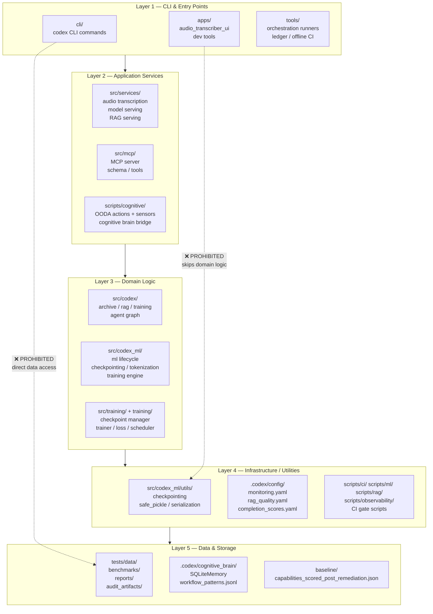

# Platform Architecture Layers

**Version**: 1.0  
**Owner**: `codebase-health-guardian`  
**Updated**: 2026-05-27  
**D1 exit criteria**: architecture map + DOMAIN_OWNERSHIP.md + import-linter gate ✅

---

## Layer Hierarchy



---

## Boundary Rules (enforced by `import-linter.yml`)

| Rule | Allowed | Prohibited |
|------|---------|-----------|
| CLI → Services | ✅ | CLI → codex_ml internals directly |
| Services → Domain | ✅ | Services → L5 storage directly |
| Domain → Infra | ✅ | Domain → CLI (upward) |
| Infra → Storage | ✅ | Infra → Services (upward) |
| Tests → Any | ✅ | Production code → tests |

---

## Import Contract (`.importlinter` config)

```ini
[importlinter]
root_package = codex_ml

[importlinter:contract:layers]
name = Layer Hierarchy
type = layers
layers =
    cli | apps | tools
    src.services | src.mcp
    src.codex | src.codex_ml | training
    scripts
    tests
```

Run: `lint-imports --config .importlinter` (enforced by `.github/workflows/import-linter.yml`)

---

## Boundary Tests

Automated boundary tests live in `tests/architecture/test_layer_boundaries.py`.  
Run: `pytest tests/architecture/ -v`

---

## Change Log

| Date | Version | Change |
|------|---------|--------|
| 2026-05-27 | 1.0 | Initial architecture layer doc — D1 exit criteria #4 |
