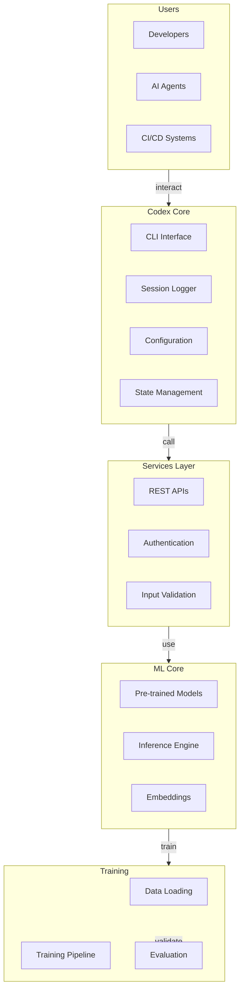

# Architecture Master Reference
**Last Updated:** 2026-07-11
**Version:** v0.2.1

> **Consolidated Master Document** for Codex Architecture
> **Created**: 2026-07-08
> **Consolidation Campaign**: Phase 12 WS3
> **Status**: Active Master Document

**Source Files Consolidated**:
- agents/prompts/ARCHITECTURE.md
- .github/agents/ARCHITECTURE.md
- docs/ARCHITECTURE_INDEX.md
- docs/ARCHITECTURE_QUICK_REFERENCE.md
- docs/ARCHITECTURE_BLUEPRINT.md
- docs/architecture/ARCHITECTURE_LAYERS.md
- docs/infrastructure/ARCHITECTURE.md
- .codex/ARCHITECTURE_DIAGRAMS.md
- .codex/monitoring/ARCHITECTURE.md
- audio_cleaner_v1/docs/ARCHITECTURE.md
- docs/ARCHITECTURE_DIAGRAMS.md
- docs/ARCHITECTURE_DIAGRAMS_INDEX.md

---

## Table of Contents

1. [System Overview](#system-overview)
2. [Architecture Layers](#architecture-layers)
3. [Layer Definitions](#layer-definitions)
4. [Core Components](#core-components)
5. [Data Flow Architecture](#data-flow-architecture)
6. [Deployment Architecture](#deployment-architecture)
7. [Security Architecture](#security-architecture)
8. [Monitoring Architecture](#monitoring-architecture)
9. [Import Constraints](#import-constraints)
10. [Governance & Policy](#governance--policy)

---

## System Overview

The _codex_ repository implements a **Level 4 MLOps-certified, production-grade ML framework** with comprehensive architecture documentation across multiple domains:

### Key Architectural Domains

| Domain | Owner | Focus Area |
|--------|-------|-----------|
| **D1** | code-analysis-agent | Architecture & Layer Boundaries |
| **D2** | security-review-agent | Auth, Encryption, Scanning |
| **D3** | ci-testing-agent | CI/CD Pipeline Architecture |
| **D4** | orchestrator-agent | System Integration Flows |

---

## Architecture Layers

### Layer Definitions

The Codex platform is organized into the following architectural layers, each with strictly enforced import boundaries:

| Layer | Package / Path | Allowed Imports | Purpose |
|-------|---------------|-----------------|---------|
| **Domain** | `src/codex/` | stdlib, third-party | Core business logic |
| **ML Core** | `src/codex_ml/` | Domain, stdlib, third-party | Machine learning models |
| **Training** | `training/`, `src/training/` | ML Core, Domain, stdlib | Model training pipeline |
| **Services** | `src/services/` | ML Core, Domain, stdlib | API services & backends |
| **CLI / Apps** | `cli/`, `apps/` | All layers | User-facing interfaces |
| **Scripts** | `scripts/` | All layers (automation only) | Automation & tooling |
| **Tests** | `tests/` | All layers (test scope) | Testing infrastructure |

---

## Core Components

### 5-Layer Architecture

```

 CLI / Apps Layer User Interface (CLI, Web, Desktop)
 (cli/, apps/) 

 Services Layer APIs, Backend Services
 (src/services/) 

 ML Core Layer Models, ML Infrastructure
 (src/codex_ml/) 

 Training Layer Training Pipelines
 (training/, src/training/) 

 Domain Layer Core Business Logic
 (src/codex/) 

```

### Component Relationships



---

## Data Flow Architecture

### Request Flow

1. **User Input**: Developer or AI agent provides input to CLI
2. **Validation**: Input validation layer checks format/constraints
3. **Processing**: Core logic processes validated input
4. **ML Inference**: ML Core handles model predictions (if needed)
5. **Output**: Results returned to user with logging
6. **Persistence**: Session logs stored for audit trail

### Configuration Flow

```
Repository Root
 pyproject.toml (Project metadata)
 .codex/ (Codex-specific configuration)
 agent_context.json
 DOMAIN_OWNERSHIP.md
 CODEBASE_AGENCY_POLICY.md
 .github/agents/ (Agent definitions)
 AGENT_REGISTRY.yaml
 agent-configs/
 config/ (App configuration)
 hydra/
 app_config.yaml
```

---

## Deployment Architecture

### Deployment Targets

#### Local Development

```
Developer Machine
 Python 3.11+ Virtual Environment
 Source Code (git clone)
 Local Database (SQLite)
 Model Cache (disk storage)
```

#### Docker

```
Docker Image
 Python 3.11+ Base Image
 Source Code (COPY)
 Dependencies (pip install)
 Model Cache (volume mount)
 Entrypoint (CLI/App)
```

#### Kubernetes

```
K8s Cluster
 Deployment (App Pods)
 Service (Load Balancing)
 ConfigMap (Configuration)
 Secret (Credentials)
 PVC (Model Storage)
 HPA (Auto-scaling)
```

#### Cloud Deployment

```
Cloud Platform (AWS/GCP/Azure)
 Managed Container Service
 Database Service (RDS/Cloud SQL)
 Object Storage (S3/GCS/Blob)
 Secrets Manager
 Monitoring Service
```

---

## Security Architecture

### Authentication & Authorization

- **RBAC** (Role-Based Access Control) via `patch_rbac_engine.py`
- **Token Management** via secret injection
- **Policy Enforcement** via `.codex/CODEBASE_AGENCY_POLICY.md`
- **Audit Trail** via session logging

### Data Protection

- **Encryption in Transit**: HTTPS/TLS for all APIs
- **Encryption at Rest**: Database-level encryption
- **Secret Management**: GitHub Actions secret injection
- **PII Scrubbing**: Automated via `pii-scrubber` agent

### Security Scanning

- **CodeQL**: Static security analysis
- **Dependabot**: Dependency vulnerability scanning
- **Secret Scanning**: GitHub native secrets detection
- **SBOM**: Software Bill of Materials tracking

---

## Monitoring Architecture

### Metrics Collection

```
Application
 Business Metrics
 User signups
 Model accuracy
 API response times
 System Metrics
 CPU usage
 Memory usage
 Disk I/O
 Application Metrics
 Error rates
 Latency distribution
 Cache hit rates
```

### Observability Stack

- **Logs**: Structured JSON logging to stdout/files
- **Metrics**: Prometheus-format metrics exposure
- **Traces**: Distributed tracing (OpenTelemetry compatible)
- **Alerts**: Threshold-based alerting on anomalies

### Dashboards

- **Health Dashboard**: System status overview
- **Performance Dashboard**: Latency & throughput metrics
- **Error Dashboard**: Error rates & failure modes
- **Security Dashboard**: Auth failures & policy violations

---

## Import Constraints

### Prohibited Cross-Layer Imports

```
 FORBIDDEN:
 - src/codex/ src/codex_ml/ or training/
 - src/codex_ml/ training/
 - src/services/ cli/ or apps/
 - tests/ src/codex/ (circular imports)

 ALLOWED:
 - CLI/Apps All layers (top-level access)
 - Services ML Core, Domain, stdlib
 - ML Core Domain, stdlib, third-party
 - Domain stdlib, third-party only
```

### Enforcement Mechanism

- **Tool**: `.importlinter` configuration
- **CI Workflow**: `import-linter.yml` on every PR
- **Owner**: `code-analysis-agent`
- **Escalation**: PR blocks if violations detected

---

## Governance & Policy

### Domain Ownership

Ownership map tracked in `.codex/DOMAIN_OWNERSHIP.md`:

```
Domain 1 (D1): Architecture & Layer Boundaries
 Owner: code-analysis-agent
 Reference: docs/architecture/ARCHITECTURE_LAYERS.md
 Enforcement: import-linter.yml

Domain 2 (D2): Security & Compliance
 Owner: security-review-agent
 Reference: docs/security/SECURITY_ARCHITECTURE.md
 Enforcement: GitHub Advanced Security

Domain 3 (D3): Testing & Quality
 Owner: ci-testing-agent
 Reference: docs/testing/
 Enforcement: pytest + coverage gates

Domain 4 (D4): Agent & Orchestration
 Owner: orchestrator-agent
 Reference: agents/AGENT_CONSOLIDATION_MATRIX.md
 Enforcement: agent registry validation
```

### Policy Framework

- **AI Agency Policy**: `.codex/CODEBASE_AGENCY_POLICY.md`
- **Governance Framework**: `.codex/GOVERNANCE_POLICY_FRAMEWORK.md`
- **Domain Ownership**: `.codex/DOMAIN_OWNERSHIP.md`
- **Compliance Reports**: `.codex/reports/`

---

## D1 Exit Criteria

| # | Criterion | Status | Reference |
|---|-----------|--------|-----------|
| 1 | Architecture doc present | | This document |
| 2 | `.importlinter` config present | | `.importlinter` |
| 3 | `import-linter.yml` CI workflow | | `.github/workflows/` |
| 4 | Domain ownership map | | `.codex/DOMAIN_OWNERSHIP.md` |

---

## Quick Reference Links

**Navigation**:
- [Layer Definitions](##architecture-layers) - Deep dive into layer structure
- [Data Flow](##data-flow-architecture) - Understand request processing
- [Deployment Options](##deployment-architecture) - Choose deployment model
- [Security Controls](##security-architecture) - Review security posture
- [Monitoring Setup](##monitoring-architecture) - Set up observability

**Related Documents**:
- [API Reference](../api/COMPREHENSIVE_API_REFERENCE.md)
- [Deployment Runbook](../ops/DEPLOYMENT_RUNBOOK.md)
- [Agent Guide](../../agents/AGENT_CONSOLIDATION_MATRIX.md)
- [Security Policy](../security/SECURITY_ARCHITECTURE.md)

---

**This document is the authoritative architecture reference for Codex.**
Keep in sync with import linters, governance policies, and domain ownership maps.

*Last Updated: 2026-07-08
*Consolidation Status: Complete (12 files merged)*
