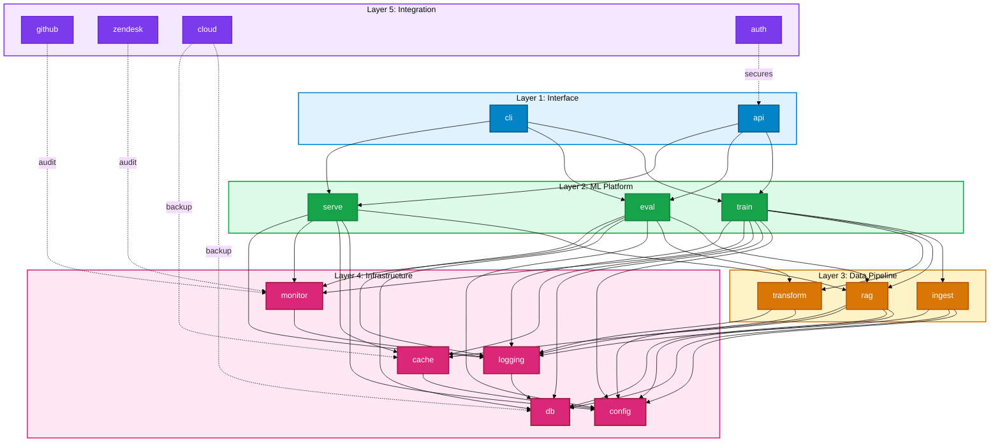

# Component Dependencies
**Last Updated:** 2026-07-11
**Version:** v0.2.1

**Last Updated**: 2026-01-20  
**Version**: v0.9.0  
**Total Components**: 57 modules across 5 layers

---

## Dependency Graph Overview



---

## Dependency Analysis

### Core Dependencies (Foundation)

**Layer 4 (Infrastructure)** - No external dependencies
- `config` ← Hydra, OmegaConf
- `db` ← SQLite/PostgreSQL
- `cache` ← Redis/Memcached
- `monitor` ← Prometheus, Grafana
- `logging` ← Python logging

**Layer 3 (Data)** - Depends on Layer 4
- `ingest` → config, db, logging
- `rag` → config, db, cache, logging
- `transform` → config, logging

**Layer 2 (ML)** - Depends on Layer 3 & 4
- `train` → ingest, rag, transform, config, db, cache, monitor, logging
- `eval` → rag, transform, config, db, monitor, logging
- `serve` → rag, config, cache, monitor, logging

**Layer 1 (Interface)** - Depends on Layer 2
- `cli` → train, eval, serve
- `api` → train, eval, serve

**Layer 5 (Integration)** - Cross-cutting
- `github` → monitor, any layer (async)
- `zendesk` → monitor, logging (async)
- `cloud` → db, cache (backup)
- `auth` → api, config (security)

---

## Module Inventory by Layer

### Layer 1: Interface (2 modules)
```
cli/              - Command-line interface
  ├── cli.py      - Main CLI dispatcher
  ├── commands/   - Command handlers
  └── config_cli/ - Config management

api/              - REST API
  ├── api.py      - FastAPI app
  ├── routes/     - Endpoint handlers
  └── schemas/    - Request/response models
```

### Layer 2: ML Platform (3 modules)
```
train/            - Training engine
  ├── trainer.py  - Main trainer
  ├── loop.py     - Training loop
  └── checkpoint/ - Model checkpointing

eval/             - Evaluation engine
  ├── evaluator.py - Metrics computation
  └── metrics/    - Metric definitions

serve/            - Serving/inference
  ├── server.py   - Inference server
  ├── predict.py  - Prediction pipeline
  └── batching/   - Batch prediction
```

### Layer 3: Data Pipeline (3 modules)
```
ingest/           - Code ingestion
  ├── parser.py   - File parsing
  ├── ast_gen.py  - AST generation
  └── tokenizer/  - Tokenization

rag/              - RAG system
  ├── indexer.py  - Vector indexing
  ├── retriever.py - Semantic search
  └── ranker.py   - Result ranking

transform/        - Data transformation
  ├── preprocessor.py - Data prep
  ├── formatter.py    - Format conversion
  └── extractor.py    - Feature extraction
```

### Layer 4: Infrastructure (4 modules)
```
config/           - Configuration
  ├── loader.py   - Hydra loading
  ├── validator.py - Schema validation
  └── secrets.py  - Secret management

db/               - Database layer
  ├── session.py  - SQLite/PostgreSQL
  ├── models.py   - ORM models
  └── migrations/ - Database migrations

cache/            - Caching layer
  ├── redis.py    - Redis client
  ├── memcached.py- Memcached client
  └── local.py    - Local cache

monitor/          - Monitoring
  ├── metrics.py  - Metrics collection
  ├── health.py   - Health checks
  └── alerts.py   - Alert engine

logging/          - Structured logging
  ├── logger.py   - Log setup
  ├── formatters/ - Log formatting
  └── handlers/   - Log handlers
```

### Layer 5: Integration (4 modules)
```
github/           - GitHub integration
  ├── client.py   - GitHub API wrapper
  ├── pr.py       - PR operations
  └── workflows/  - Workflow triggers

zendesk/          - Zendesk integration
  ├── client.py   - Zendesk API wrapper
  ├── tickets.py  - Ticket operations
  └── sync.py     - CRM synchronization

cloud/            - Cloud storage
  ├── s3.py       - AWS S3 integration
  ├── gcs.py      - Google Cloud
  └── azure.py    - Azure integration

auth/             - Authentication
  ├── oauth.py    - OAuth2/GitHub
  ├── jwt.py      - JWT tokens
  └── rbac.py     - Role-based access
```

---

## Dependency Patterns

### Pattern 1: Config Injection
All modules depend on `config` for settings:
```
Any Module
  ├── Get config from config module
  ├── Validate schema
  ├── Apply defaults
  └── Use configuration
```

### Pattern 2: Logging Throughout
All modules use `logging` for observability:
```
Any Module
  ├── Create logger instance
  ├── Log at key decision points
  ├── Include context
  └── Send to configured handlers
```

### Pattern 3: Monitoring Integration
ML Platform modules report metrics:
```
train/eval/serve
  ├── During execution
  ├── Emit metrics to monitor
  ├── Track timing
  └── Report errors
```

### Pattern 4: Database Persistence
Data operations use `db` for storage:
```
ingest/rag/transform
  ├── Prepare data
  ├── Store in database
  ├── Query when needed
  └── Maintain indexes
```

### Pattern 5: Cache Acceleration
High-frequency operations use `cache`:
```
rag (retrieval)
  ├── Check cache for similar queries
  ├── Return cached result if hit
  ├── Fall back to DB/compute if miss
  └── Cache result for future use
```

---

## Critical Path Analysis

**Longest dependency chain** (for any request):

```
CLI Command
  → train (L2)
    → ingest (L3)
      → config (L4)  [critical path]
      → db (L4)
      → logging (L4) ← all serialize to DB
```

**Slowest I/O dependencies**:
1. `ingest` → `db` (file I/O + SQL queries)
2. `rag` → `db` (large vector searches)
3. `serve` → `cache` (fallback if cache miss)
4. `monitor` → `db` (append-only logs)

---

## Next Steps

- 👉 See [5-Layer Architecture](../architecture/5_LAYER_ARCHITECTURE.md) for layer structure
- 👉 See module-specific docs for detailed component architectures
- 👉 Review source code for performance optimization patterns

---

**Related Documentation**:
- [5-Layer Architecture](../architecture/5_LAYER_ARCHITECTURE.md) - System layers
- [ARCHITECTURE.md](./INDEX.md) - Full architecture
