# Data Flow Architecture

**Last Updated**: 2026-01-20  
**Version**: v0.9.0  
**Reference**: [5-Layer Architecture](5_LAYER_ARCHITECTURE.md)

---

## End-to-End Data Flow

```mermaid
%%{init: {'accessibility': {'title': 'Data Flow Architecture<br/>From Source to Consumption'}, 'theme': 'base'}}%%
graph LR
    subgraph "Data Sources"
        GitHub["🐙 GitHub Repos<br/>Source code<br/>Issues<br/>PRs"]
        Upload["📤 User Upload<br/>Files<br/>Datasets<br/>Models"]
        External["🌐 External Data<br/>APIs<br/>Web scrape<br/>Feeds"]
    end

    subgraph "Ingestion Layer"
        Parser["📥 Parser<br/>• File loading<br/>• Format detect<br/>• Validation"]
        Tokenizer["🔤 Tokenizer<br/>• Token encoding<br/>• BPE/WordPiece<br/>• Vocabulary"]
        AST["🌳 AST Generator<br/>• Parse syntax<br/>• Build tree<br/>• Extract features"]
    end

    subgraph "Processing Layer"
        Preprocess["⚙️ Preprocessor<br/>• Cleaning<br/>• Normalization<br/>• Deduplication"]
        Transform["🔄 Transformer<br/>• Feature extract<br/>• Format convert<br/>• Augmentation"]
        Embed["🧠 Embedding<br/>• Encode to vectors<br/>• Normalize<br/>• Cache vectors"]
    end

    subgraph "Storage Layer"
        RawDB["💾 Raw Storage<br/>• Original files<br/>• Versioned<br/>• Archived"]
        VectorDB["🔍 Vector DB<br/>• Embeddings<br/>• Indices<br/>• HNSW graph"]
        MetadataDB["📋 Metadata DB<br/>• File info<br/>• Source info<br/>• Statistics"]
    end

    subgraph "Retrieval & Ranking"
        Search["🔎 Semantic Search<br/>• Encode query<br/>• Vector search<br/>• Get candidates"]
        Rank["📊 Ranker<br/>• Score matches<br/>• Filter duplicates<br/>• Sort by relevance"]
        Build["🏗️ Context Builder<br/>• Assemble chunks<br/>• Add metadata<br/>• Format output"]
    end

    subgraph "ML Operations"
        Train["🔄 Training<br/>• Load context<br/>• Forward pass<br/>• Backprop"]
        Cache["⚡ Cache<br/>• Store results<br/>• Embeddings<br/>• Predictions"]
        Eval["📊 Evaluation<br/>• Load test data<br/>• Compute metrics<br/>• Compare"]
    end

    subgraph "Output & Integration"
        API["📡 API Output<br/>• Predictions<br/>• Embeddings<br/>• Context"]
        Storage["☁️ Cloud Storage<br/>• Models<br/>• Artifacts<br/>• Checkpoints"]
        External2["🌐 External<br/>• GitHub updates<br/>• API push<br/>• Webhooks"]
    end

    %% Data flow
    GitHub --> Parser
    Upload --> Parser
    External --> Parser

    Parser --> Tokenizer
    Parser --> AST

    Tokenizer --> Preprocess
    AST --> Preprocess

    Preprocess --> Transform
    Transform --> Embed

    Embed --> VectorDB
    Parser --> RawDB
    Preprocess --> MetadataDB

    VectorDB --> Search
    MetadataDB --> Search
    RawDB --> Search

    Search --> Rank
    Rank --> Build

    Build --> Train
    Build --> Cache
    Build --> Eval

    Train --> Cache
    Cache --> API
    Eval --> API

    API --> Storage
    API --> External2
    VectorDB -.updates.-> Cache
    MetadataDB -.stats.-> Eval

    %% Styling
    style GitHub fill:#fce7f3,stroke:#db2777,stroke-width:2px
    style Upload fill:#fce7f3,stroke:#db2777,stroke-width:2px
    style External fill:#fce7f3,stroke:#db2777,stroke-width:2px

    style Parser fill:#fef3c7,stroke:#d97706,stroke-width:2px
    style Tokenizer fill:#fef3c7,stroke:#d97706,stroke-width:2px
    style AST fill:#fef3c7,stroke:#d97706,stroke-width:2px

    style Preprocess fill:#fef3c7,stroke:#d97706,stroke-width:2px
    style Transform fill:#fef3c7,stroke:#d97706,stroke-width:2px
    style Embed fill:#fef3c7,stroke:#d97706,stroke-width:2px

    style RawDB fill:#dbeafe,stroke:#0284c7,stroke-width:2px
    style VectorDB fill:#dbeafe,stroke:#0284c7,stroke-width:2px
    style MetadataDB fill:#dbeafe,stroke:#0284c7,stroke-width:2px

    style Search fill:#dcfce7,stroke:#16a34a,stroke-width:2px
    style Rank fill:#dcfce7,stroke:#16a34a,stroke-width:2px
    style Build fill:#dcfce7,stroke:#16a34a,stroke-width:2px

    style Train fill:#10b981,stroke:#059669,stroke-width:2px,color:#fff
    style Cache fill:#10b981,stroke:#059669,stroke-width:2px,color:#fff
    style Eval fill:#10b981,stroke:#059669,stroke-width:2px,color:#fff

    style API fill:#f3e8ff,stroke:#7c3aed,stroke-width:2px
    style Storage fill:#f3e8ff,stroke:#7c3aed,stroke-width:2px
    style External2 fill:#f3e8ff,stroke:#7c3aed,stroke-width:2px
```



---

## Data Transformation Pipeline

### Stage 1: Ingestion
**Input**: Raw files (source code, data, models)  
**Process**:
```
Raw File
  ↓
Detect Format (py, json, parquet, etc.)
  ↓
Parse Content
  ├─ Code: Extract syntax
  ├─ Text: Split to chunks
  └─ Data: Load schema
  ↓
Validate & Sanitize
  ├─ Check encoding
  ├─ Remove nulls/nans
  └─ Verify integrity
  ↓
Store Original
  └─ RawDB for archival
```

**Volume**: 1GB-100GB per ingestion run

### Stage 2: Tokenization
**Input**: Parsed content  
**Process**:
```
Content
  ↓
Tokenize with BPE
  ├─ Code: Context-aware
  ├─ Text: Byte-pair encoding
  └─ Data: Value-based
  ↓
Build Vocabulary
  ├─ Frequent tokens
  ├─ Special tokens
  └─ Unknown token
  ↓
Encode to IDs
  └─ [12, 456, 789, ...]
```

**Volume**: 100M-1B tokens per ingestion

### Stage 3: Processing
**Input**: Tokenized content  
**Process**:
```
Tokens
  ↓
Preprocess
  ├─ Remove duplicates
  ├─ Normalize
  └─ Filter noise
  ↓
Transform
  ├─ Extract features
  ├─ Generate statistics
  └─ Create augmented versions
  ↓
Embed
  ├─ Encode to vectors
  ├─ Using trained model
  └─ Normalize L2
  ↓
Store Vectors
  └─ VectorDB with index
```

**Volume**: 100K-10M embeddings (768-4096 dims)

### Stage 4: Retrieval
**Input**: Query or context need  
**Process**:
```
Query
  ↓
Encode Query Vector
  ├─ Same model as ingestion
  └─ Normalize
  ↓
Search VectorDB
  ├─ HNSW index lookup
  ├─ Get top-k candidates
  └─ Calculate similarities
  ↓
Rank Results
  ├─ Score by relevance
  ├─ Filter duplicates
  └─ Sort descending
  ↓
Build Context
  ├─ Combine chunks
  ├─ Add metadata
  └─ Format for LLM
```

**Latency**: <100ms for 10k vector search

### Stage 5: ML Operations
**Input**: Context + data  
**Process**:
```
Context
  ↓
Training Loop
  ├─ Forward pass
  ├─ Compute loss
  ├─ Backward pass
  └─ Update weights
  ↓
Caching
  ├─ Store results
  ├─ Cache embeddings
  └─ Invalidate on update
  ↓
Evaluation
  ├─ Load test data
  ├─ Run inference
  └─ Compute metrics
  ↓
Output
  ├─ Store predictions
  ├─ Save artifacts
  └─ Update metrics
```

---

## Data Volumes & Characteristics

### Training Data
| Metric | Value |
|--------|-------|
| **Total Size** | 10-100 GB |
| **Number of Files** | 1K-100K |
| **Number of Tokens** | 1B-10B |
| **Number of Vectors** | 1M-100M |
| **Avg Vector Dims** | 768-4096 |
| **Compression Ratio** | 10:1 (original:tokenized) |

### Real-time Inference
| Metric | Value |
|--------|-------|
| **Queries/sec** | 100-1000 |
| **Avg Query Size** | 1-100 tokens |
| **Context Size** | 100-2000 tokens |
| **Output Size** | 10-500 tokens |
| **Latency Target** | <200ms p95 |

### Caching Characteristics
| Cache Type | Hit Rate | TTL |
|------------|----------|-----|
| **Embedding Cache** | 70-80% | 24h |
| **Result Cache** | 60-70% | 1h |
| **Query Cache** | 40-50% | 30min |
| **Vector Index** | N/A | Persistent |

---

## Storage Backends

### Raw Storage
```
Location: RawDB (SQLite or PostgreSQL)
Structure:
  - files table (filename, content, hash)
  - metadata table (source, date, version)
  - history table (changes log)

Size: Original uncompressed data
Retention: 1-2 years
Access: Infrequent (archive)
```

### Vector Storage
```
Location: VectorDB (Pinecone, FAISS, or Milvus)
Structure:
  - vectors: [id, embedding, metadata]
  - indices: HNSW for fast search
  - replicas: For HA

Size: Compressed vectors
Retention: Persistent, updated incrementally
Access: High-frequency (search)
```

### Metadata Storage
```
Location: MetadataDB (PostgreSQL)
Structure:
  - file_metadata: source, size, hash
  - processing_stats: token count, dims
  - quality_metrics: deduplication, coverage

Size: Indexed, <1% of raw size
Retention: Persistent
Access: Medium-frequency (queries)
```

---

## Data Quality & Validation

### Ingestion Validation
```yaml
checks:
  - file_size: 0 < size < 1GB
  - encoding: valid UTF-8
  - format: valid JSON/Python/etc.
  - duplicates: hash check
  - corrupted: integrity check
  
fallback:
  - Skip invalid files
  - Log errors
  - Report summary
```

### Tokenization Quality
```yaml
checks:
  - token_count: min/max bounds
  - vocabulary_coverage: >99%
  - unknown_tokens: <0.1%
  - special_tokens: correct handling
  
metrics:
  - avg_tokens_per_file
  - vocab_size
  - compression_ratio
```

### Vector Quality
```yaml
checks:
  - vector_dims: correct
  - magnitude: normalized ~1.0
  - nans: none
  - duplicates: low cosine sim check
  
metrics:
  - index_quality: search accuracy
  - query_latency: p50/p95/p99
  - retrieval_recall: precision@k
```

---

## Data Lifecycle

```
Raw Data
  ├─ Day 1-7: Hot (frequently accessed)
  ├─ Day 8-30: Warm (occasionally accessed)
  ├─ Day 31-365: Cold (archived)
  └─ 365+: Deleted/purged

Processed Data (Vectors)
  ├─ Day 1-30: Hot (in VectorDB, in-memory cache)
  ├─ Day 31-90: Warm (in VectorDB, disk cache)
  ├─ Day 91-365: Cold (in archive, no hot access)
  └─ 365+: Deleted/purged

Metadata & Indices
  ├─ Persistent (always hot)
  └─ Replicated for HA
```

---

## Next Steps

- 👉 See [Ingestion Pipeline](../ingestion/INGESTION_PIPELINE.md) for ingestion details
- 👉 See [RAG Architecture](../rag/RAG_ARCHITECTURE.md) for retrieval details
- 👉 See [Storage Guide](../storage/STORAGE_GUIDE.md) for storage options

---

**Related Documentation**:
- [5-Layer Architecture](5_LAYER_ARCHITECTURE.md) - System architecture
- [E2E Request Flow](E2E_REQUEST_FLOW.md) - Request lifecycle
- [Training Workflow](../training/TRAINING_WORKFLOW.md) - Training data flow
