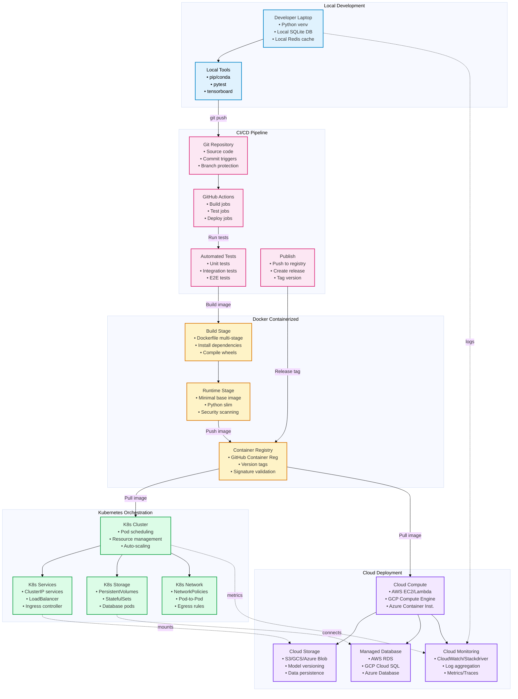

# Deployment Architecture
**Last Updated:** 2026-07-11
**Version:** v0.2.1

**Last Updated**: 2026-01-20
**Version**: v0.2.1
**Supported Platforms**: Local, Docker, Kubernetes, Cloud

---

## Deployment Architecture Overview



---

## Deployment Targets

### Local Development
**Use Case**: Development, debugging, rapid iteration

**Setup**:
```bash
git clone <repo>
cd _codex_
python -m venv venv
source venv/bin/activate
pip install -r requirements-dev.txt
```

**Environment**:
- Python virtual environment
- Local SQLite database
- Optional: Redis for caching
- Test runner: pytest
- Monitoring: TensorBoard

**Command**:
```bash
codex train --config configs/dev.yaml
```

---

### Docker Containerized
**Use Case**: Consistent environments, CI/CD, Kubernetes

**Build Process**:
```dockerfile
# Stage 1: Build
FROM python:3.11-slim as builder
WORKDIR /build
COPY requirements*.txt .
RUN pip install --user -r requirements.txt

# Stage 2: Runtime
FROM python:3.11-slim
COPY --from=builder /root/.local /root/.local
COPY . /app
WORKDIR /app
ENV PATH=/root/.local/bin:$PATH
CMD ["codex", "serve"]
```

**Registry**:
- GitHub Container Registry (ghcr.io)
- Version tags: `v0.2.1`, `latest`, `main`
- Signature validation: Cosign

**Commands**:
```bash
docker build -t codex:latest .
docker run -p 8000:8000 codex:latest
docker push ghcr.io/aries-serpent/codex:latest
```

---

### Kubernetes Orchestration
**Use Case**: Production scaling, high availability

**Manifest Structure**:
```yaml
# deployment.yaml
apiVersion: apps/v1
kind: Deployment
metadata:
 name: codex-api
spec:
 replicas: 3
 selector:
 matchLabels:
 app: codex-api
 template:
 metadata:
 labels:
 app: codex-api
 spec:
 containers:
 - name: codex
 image: ghcr.io/aries-serpent/codex:v0.2.1
 ports:
 - containerPort: 8000
 env:
 - name: CONFIG_FILE
 value: /etc/config/config.yaml
 resources:
 requests:
 cpu: 2
 memory: 8Gi
 limits:
 cpu: 4
 memory: 16Gi
 livenessProbe:
 httpGet:
 path: /health
 port: 8000
 initialDelaySeconds: 30
 periodSeconds: 10
---
# service.yaml
apiVersion: v1
kind: Service
metadata:
 name: codex-api
spec:
 type: LoadBalancer
 selector:
 app: codex-api
 ports:
 - protocol: TCP
 port: 80
 targetPort: 8000
---
# ingress.yaml
apiVersion: networking.k8s.io/v1
kind: Ingress
metadata:
 name: codex-ingress
spec:
 ingressClassName: nginx
 rules:
 - host: api.codex.example.com
 http:
 paths:
 - path: /
 pathType: Prefix
 backend:
 service:
 name: codex-api
 port:
 number: 80
```

**Operations**:
```bash
kubectl apply -f k8s/
kubectl get pods
kubectl logs -f deployment/codex-api
kubectl scale deployment codex-api --replicas=5
```

---

### Cloud Deployment
**Use Case**: Fully managed, auto-scaling, enterprise

**AWS Deployment**:
```bash
# ECS on Fargate
aws ecs create-service \
 --cluster production \
 --service-name codex \
 --task-definition codex:1 \
 --desired-count 3 \
 --launch-type FARGATE

# Or Lambda for serverless
aws lambda create-function \
 --function-name codex-predict \
 --runtime python3.11 \
 --handler app.handler \
 --code S3Bucket=codex-builds,S3Key=lambda.zip
```

**GCP Deployment**:
```bash
gcloud run deploy codex \
 --image gcr.io/project/codex:latest \
 --platform managed \
 --region us-central1 \
 --memory 8Gi \
 --cpu 4
```

**Azure Deployment**:
```bash
az containerapp create \
 --resource-group rg-codex \
 --name codex \
 --image mcr.microsoft.com/codex:latest \
 --cpu 4 \
 --memory 8Gi
```

---

## Storage Configuration

### Local Development
```yaml
database:
 type: sqlite
 path: ./data/codex.db
 
cache:
 type: local
 path: ./cache/
 
storage:
 type: local
 path: ./models/
```

### Docker/K8s
```yaml
database:
 type: postgresql
 host: postgres-service
 port: 5432
 
cache:
 type: redis
 host: redis-service
 port: 6379
 
storage:
 type: s3
 bucket: codex-models
 prefix: v0.2.1/
```

### Cloud
```yaml
database:
 type: postgresql
 host: cloudsql-instance
 ssl: true
 
cache:
 type: redis
 endpoint: elasticache.amazonaws.com
 
storage:
 type: s3
 bucket: prod-models
 prefix: v0.2.1/
 encryption: AES256
```

---

## CI/CD Deployment Pipeline

```
1. Commit to git
 
2. GitHub Actions trigger
 Build (docker build)
 Test (pytest)
 Scan (security checks)
 Push image
 
3. Create release
 Version tag (v0.2.1)
 Release notes
 GitHub release
 
4. Deploy to environments
 Dev cluster (auto)
 Staging cluster (auto)
 Production cluster (manual approval)
 
5. Post-deployment
 Health checks
 Smoke tests
 Metrics validation
 Alert team if issues
```

---

## Environment Comparison

| Aspect | Local | Docker | K8s | Cloud |
|--------|-------|--------|-----|-------|
| **Setup Time** | 5 min | 10 min | 30 min | 15 min |
| **Data Isolation** | None | Volumes | PVCs | Managed |
| **Scaling** | Manual | Manual | Auto | Auto |
| **Monitoring** | Local | Logs | Prometheus | CloudWatch |
| **Cost** | Free | Free | $100-500/mo | $500-2000/mo |
| **HA** | | | | |
| **Security** | Basic | Good | Excellent | Excellent |

---

## Next Steps

- Review the Docker multi-stage build configuration in the repository
- Explore Kubernetes deployment configurations in the `k8s/` directory
- Consider cloud-specific deployment options based on your infrastructure

---

**Note**: This document covers the deployment architecture overview. For detailed deployment guides, refer to the infrastructure documentation in the repository.
