# End-to-End Request Flow
**Last Updated:** 2026-07-11
**Version:** v0.2.1

**Last Updated**: 2026-01-20
**Version**: v0.2.1
**Reference**: [5-Layer Architecture](5_LAYER_ARCHITECTURE.md)

---

## Request Lifecycle Overview

This diagram shows how a request flows through all 5 layers from entry to response:

```mermaid
%%{init: {'accessibility': {'title': 'End-to-End Request Flow<br/>From Input to Output'}, 'theme': 'base'}}%%

graph TD

 Start([" Request Entry"]) --> L1["Layer 1: Interface & CLI"]
 
 %% Layer 1: Parse & Validate
 L1 --> CLI{Check Request<br/>Type}

 CLI -->|"CLI Command"| CParse["Parse Command Line Args"]

 CLI -->|"REST API"| AParse["Parse HTTP Request"]

 CParse --> Hydra[" Load Hydra Config<br/>• Read config files<br/>• Resolve overrides<br/>• Validate schema"]

 AParse --> Hydra
 
 Hydra --> ValidCfg{"Config<br/>Valid?"}

 ValidCfg -->|" Error"| ErrorCfg["Return Error<br/>Invalid Configuration"]

 ValidCfg -->|" OK"| RouteCmd["Route Command<br/>to Layer 2"]
 
 %% Layer 2: ML Operation
 RouteCmd --> L2["Layer 2: ML Platform"]

 L2 --> SelectOp{Operation<br/>Type?}
 
 SelectOp -->|"train"| Train[" Training Engine<br/>• Load model<br/>• Load dataset<br/>• Run training loop"]

 SelectOp -->|"eval"| Eval[" Evaluation Engine<br/>• Load checkpoint<br/>• Run evaluation<br/>• Compute metrics"]

 SelectOp -->|"predict"| Serve[" Serving Engine<br/>• Load model<br/>• Preprocess input<br/>• Run inference"]
 
 %% Data dependencies (Layer 3)
 Train --> L3A["Layer 3: Data Pipeline"]

 Eval --> L3A

 Serve --> L3A
 
 L3A --> DataOp{Data<br/>Operation?}

 DataOp -->|"Need raw code"| Ingest[" Code Ingestion<br/>• Parse files<br/>• Generate AST<br/>• Count tokens"]

 DataOp -->|"Need context"| RAG[" RAG System<br/>• Vector encode<br/>• Semantic search<br/>• Rank results"]

 DataOp -->|"Need transform"| Trans[" Transformation<br/>• Preprocess data<br/>• Format conversion<br/>• Feature extract"]
 
 Ingest --> StoreL4["Persist to Layer 4"]

 RAG --> StoreL4

 Trans --> StoreL4
 
 %% Infrastructure (Layer 4)
 StoreL4 --> L4["Layer 4: Infrastructure"]

 L4 --> ConfigOp[" Configuration<br/>• Load secrets<br/>• Merge settings<br/>• Validate params"]

 ConfigOp --> StorageOp[" Storage<br/>• Load/save model<br/>• Load/save data<br/>• Update cache"]

 StorageOp --> MetricsOp[" Monitoring<br/>• Record metrics<br/>• Log events<br/>• Update health"]
 
 %% Operation completion (back to Layer 2)
 MetricsOp --> L2Complete["Return to Layer 2"]

 L2Complete --> OpComplete{"Operation<br/>Complete?"}
 
 OpComplete -->|" Error"| ErrorOp["Handle Error<br/>Log & retry/fail"]

 OpComplete -->|" Success"| ExternalCheck{"Notify<br/>External?"}
 
 %% Layer 5: Integration
 ExternalCheck -->|" Internal Only"| Format["Return Result<br/>to User"]

 ExternalCheck -->|" Notify"| L5["Layer 5: Integration"]
 
 L5 --> IntOp{Integration<br/>Type?}

 IntOp -->|"GitHub"| GHSync[" GitHub Integration<br/>• Post PR comment<br/>• Create issue<br/>• Update workflow"]

 IntOp -->|"Zendesk"| ZDSync[" Zendesk Integration<br/>• Update ticket<br/>• Create case<br/>• Sync status"]

 IntOp -->|"Cloud"| CloudSync[" Cloud Integration<br/>• Upload model<br/>• Save artifacts<br/>• Update metadata"]

 IntOp -->|"HF/MLflow"| ExtSync[" External Services<br/>• Push to Hub<br/>• Log experiment<br/>• Save weights"]
 
 GHSync --> ExtComplete["Integration Complete"]

 ZDSync --> ExtComplete

 CloudSync --> ExtComplete

 ExtSync --> ExtComplete
 
 %% Final response
 ExtComplete --> Format

 ErrorOp --> Format

 Format --> Response[" Return Response<br/>• Status code<br/>• Result data<br/>• Metadata"]

 Response --> End([" Request Complete"])

 ErrorCfg --> End
 
 %% Styling
 style Start fill:#10b981,stroke:#059669,stroke-width:3px,color:#fff
 style End fill:#10b981,stroke:#059669,stroke-width:3px,color:#fff
 
 style L1 fill:#e0f2fe,stroke:#0284c7,stroke-width:2px
 style L2 fill:#dcfce7,stroke:#16a34a,stroke-width:2px
 style L3A fill:#fef3c7,stroke:#d97706,stroke-width:2px
 style L4 fill:#fce7f3,stroke:#db2777,stroke-width:2px
 style L5 fill:#f3e8ff,stroke:#7c3aed,stroke-width:2px
 
 style CParse fill:#0284c7,stroke:#075985,stroke-width:2px,color:#fff
 style AParse fill:#0284c7,stroke:#075985,stroke-width:2px,color:#fff
 style Hydra fill:#0284c7,stroke:#075985,stroke-width:2px,color:#fff
 style RouteCmd fill:#0284c7,stroke:#075985,stroke-width:2px,color:#fff
 
 style Train fill:#16a34a,stroke:#15803d,stroke-width:2px,color:#fff
 style Eval fill:#16a34a,stroke:#15803d,stroke-width:2px,color:#fff
 style Serve fill:#16a34a,stroke:#15803d,stroke-width:2px,color:#fff
 
 style Ingest fill:#d97706,stroke:#b45309,stroke-width:2px,color:#fff
 style RAG fill:#d97706,stroke:#b45309,stroke-width:2px,color:#fff
 style Trans fill:#d97706,stroke:#b45309,stroke-width:2px,color:#fff
 
 style ConfigOp fill:#db2777,stroke:#9f1239,stroke-width:2px,color:#fff
 style StorageOp fill:#db2777,stroke:#9f1239,stroke-width:2px,color:#fff
 style MetricsOp fill:#db2777,stroke:#9f1239,stroke-width:2px,color:#fff
 
 style GHSync fill:#7c3aed,stroke:#6d28d9,stroke-width:2px,color:#fff
 style ZDSync fill:#7c3aed,stroke:#6d28d9,stroke-width:2px,color:#fff
 style CloudSync fill:#7c3aed,stroke:#6d28d9,stroke-width:2px,color:#fff
 style ExtSync fill:#7c3aed,stroke:#6d28d9,stroke-width:2px,color:#fff
 
 style ErrorOp fill:#ef4444,stroke:#dc2626,stroke-width:2px,color:#fff
 style ErrorCfg fill:#ef4444,stroke:#dc2626,stroke-width:2px,color:#fff
 style Response fill:#f59e0b,stroke:#d97706,stroke-width:2px,color:#fff
```



---

## Request Flow by Type

### Training Request Flow

```
User: codex train --config configs/default.yaml
 
CLI Parse Hydra Config Load Validate Route to Training Engine
 
Layer 2: Load model architecture + config
 
Layer 3: Load training data via Code Ingestion + RAG
 
Layer 4: Load from DB, cache configuration, setup monitoring
 
Layer 2: Run training loop, periodic checkpoints
 
Layer 4: Save checkpoint to DB + cloud storage
 
Layer 5: Log to MLflow, upload metrics
 
Return: Training complete, saved to <checkpoint>
```

### Inference/Prediction Request Flow

```
User: codex predict --model model.pt --input input.json
 
API Parse Hydra Config Load Validate Route to Serving Engine
 
Layer 2: Load model weights
 
Layer 3: Preprocess input via Data Transformation
 
Layer 4: Check cache for similar predictions
 
Layer 2: Run inference
 
Layer 4: Cache result, log metrics
 
Layer 5: (Optional) Upload to prediction service
 
Return: Prediction: [result], inference_time: 0.045s
```

### Evaluation Request Flow

```
User: codex evaluate --checkpoint checkpoints/model-epoch-10.pt
 
CLI Parse Hydra Config Load Validate Route to Evaluation Engine
 
Layer 2: Load checkpoint
 
Layer 3: Load eval dataset via RAG
 
Layer 4: Load eval config, setup monitoring
 
Layer 2: Compute metrics (accuracy, F1, etc.)
 
Layer 4: Persist metrics to DB, update dashboards
 
Layer 5: Log to MLflow, push to leaderboard
 
Return: Metrics: {accuracy: 0.92, f1: 0.88, ...}
```

---

## Critical Decision Points

| Decision | Determines |
|----------|-----------|
| **Request Type** | Which Layer 2 engine handles the request (train/eval/serve) |
| **Config Valid?** | Whether request proceeds or returns error |
| **Data Available?** | Which Layer 3 operations are needed |
| **External Notify?** | Whether Layer 5 integrations are triggered |
| **Operation Success?** | Whether result or error is returned |

---

## Error Handling Throughout Flow

**Layer 1**: Configuration errors Return HTTP 400 (Bad Request)
**Layer 2**: Model errors Return error + retry guidance
**Layer 3**: Data errors Return error + missing data info
**Layer 4**: Storage errors Fallback to alternate storage + alert
**Layer 5**: Integration errors Log error, complete layer 2 operation

All errors are logged to Layer 4 monitoring for visibility.

---

## Latency Characteristics

| Layer | Typical Latency | Bottleneck |
|-------|-----------------|-----------|
| Layer 1 | <100ms | Config loading |
| Layer 2 | Variable | Operation type (training: hours, predict: <100ms) |
| Layer 3 | 100ms-5s | Data I/O, vector search |
| Layer 4 | 10-100ms | Database/cache operations |
| Layer 5 | 100ms-1s | External API calls |
| **Total** | Dominated by Layer 2 operation time |

---

## Next Steps

- See [5-Layer Architecture](5_LAYER_ARCHITECTURE.md) for layer details
- See [Training Workflow](../training/TRAINING_WORKFLOW.md) for training-specific flow
- See [Component Dependencies](COMPONENT_DEPENDENCIES.md) for module interactions

---

**Related Documentation**:
- [ARCHITECTURE.md](./INDEX.md) - Full architecture documentation
- [5-Layer Architecture](5_LAYER_ARCHITECTURE.md) - Layer structure and responsibilities
- [System Context](SYSTEM_CONTEXT.md) - External system context
