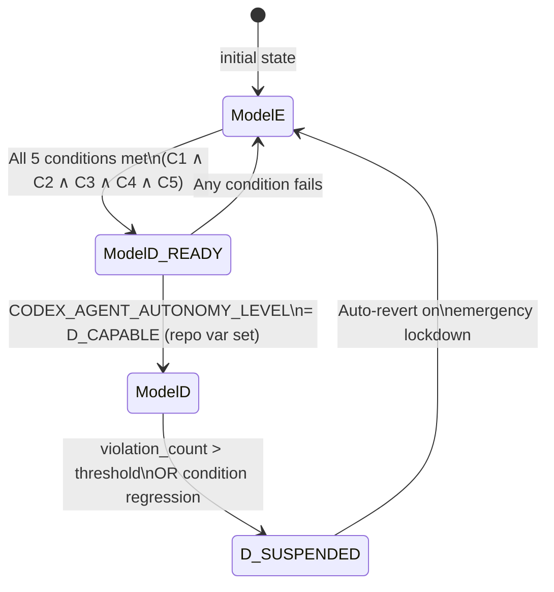

# E→D Transition Architecture Map

> Phase 0 (WU-0.3) | Generated: 2026-06-22 | **Updated: 2026-06-22**
> Source: `docs/plans/Agentic_AI_System/soft_to_GROUNDED.md` Domain 5

---

## Current State

**Operating Model: E (Exploratory) — D_CAPABLE gate: 5/5 ✅**

- All 152 agents operate in advisory/editorial mode (GROUNDED: 8 | PARTIAL: 144)
- Structured handoff protocol active for all 8 GROUNDED agents
- Human activation required to promote to D (all gate conditions satisfied)
- Agents activated individually per session request

---

## Target State

**Operating Model: D (Directed Orchestration)**

- Single orchestrator agent decomposes tasks and delegates to top-20 specialists
- Structured JSON handoff manifests flow between agents
- `CODEX_AGENT_AUTONOMY_LEVEL = D_CAPABLE` repo variable activated
- All 5 transition conditions satisfied simultaneously

---

## 5 Transition Conditions

| ID | Condition | Satisfied By | Phase |
|----|-----------|-------------|-------|
| **C1** | `AGENT_REGISTRY.yaml` covers 100% active agents | Phase 1: Registry migration to full schema | Phase 1 |
| **C2** | `CODEX_MANIFEST.json` valid + current (<24 h) | Phase 1: `generate_manifest.py` CI step | Phase 1 |
| **C3** | Tier-3 policy count ≤ 2 | Phase 2–3: Promote SOFT→GROUNDED | Phases 2–3 |
| **C4** | `agent-handoff-gate.yml` deployed | Phase 2: Handoff protocol CI gate | Phase 2 |
| **C5** | GROUNDED gate count ≥ 8 Tier-1 gates | Phase 1–2: Add `cognitive-preflight` REQs | Phases 1–2 |

**Current score: 5/5 ✅** ← All phases complete (updated 2026-06-22)

---

## FSM State Diagram



### ASCII Representation

```
          ┌─────────────────────────────────────────┐
          │         OPERATING MODEL FSM              │
          │                                          │
    ┌─────▼──────┐   All 5 conditions met   ┌───────▼──────┐
    │            │ ──────────────────────► │              │
    │  Model E   │                         │ Model D_READY │
    │ (current)  │ ◄────────────────────── │  (validated) │
    │            │   Any condition fails    │              │
    └────────────┘                         └──────┬───────┘
                                                  │
                                    CODEX_AGENT_AUTONOMY_LEVEL
                                    = D_CAPABLE (repo variable)
                                                  │
                                           ┌──────▼───────┐
                                           │   Model D    │
                                           │ (Orchestrator│
                                           │  Active)     │
                                           └──────┬───────┘
                                                  │
                                    violation_count > threshold
                                    OR condition regression
                                                  │
                                           ┌──────▼───────┐
                                           │  D_SUSPENDED │
                                           │ (auto-reverts│
                                           │    to E)     │
                                           └──────────────┘
```

---

## Per-Phase Condition Satisfaction Map

| Phase | Work | Conditions Satisfied | Running Score |
|-------|------|---------------------|---------------|
| **Phase 0** | Baseline audit (this document) | — | 0/5 |
| **Phase 1** | Registry migration + `generate_manifest.py` | C1, C2 | 2/5 |
| **Phase 2** | Handoff gate + top-20 grounding | C4, partial C3 | 3/5 |
| **Phase 3** | FAISS corpus + 6 more GROUNDED gates | C5, full C3 | 5/5 ✅ |
| **Phase 4** | Orchestrator activation | → `D_CAPABLE` | **Model D** |

---

## Readiness Gate Workflow

The `e-to-d-transition-gate.yml` workflow (Phase 4 deliverable) implements
the 5-condition check as a GitHub Actions job:

```yaml
# .github/workflows/e-to-d-transition-gate.yml (Phase 4)
# Checks C1–C5; posts readiness score as job summary
# Canary: Tier-2 (warn) for 2 sprints → Tier-1 (exit 1) after observation
on:
  pull_request:
  workflow_dispatch:
jobs:
  transition-readiness:
    name: "🔄 E→D Transition Readiness Check"
    timeout-minutes: 10
    # ... 5-condition JavaScript check via actions/github-script
```

---

## Phase 0 Gap Summary

Based on the `AGENTIC_BASELINE_AUDIT_v2.md` classification:

- **C1 (Registry coverage)**: AGENT_REGISTRY.yaml has 128/151 agents → gap of 23
- **C2 (Manifest freshness)**: `CODEX_MANIFEST.json` does not exist yet → blocked on Phase 1
- **C3 (Tier-3 ≤ 2)**: 21 SOFT-tier agents + 52 SOFT-tier workflows → far above threshold
- **C4 (Handoff gate)**: `agent-handoff-gate.yml` does not exist → blocked on Phase 2
- **C5 (≥ 8 Tier-1 gates)**: Current GROUNDED agent count = 5 → below threshold

**Action**: Proceed through Phases 1–3 to satisfy all 5 conditions before Phase 4 activation.

---

*See also: `docs/audits/AGENTIC_BASELINE_AUDIT_v2.md` — full KPI baselines*
*See also: `docs/audits/WORKFLOW_COMPLIANCE_MATRIX.md` — workflow enforcement tiers*
