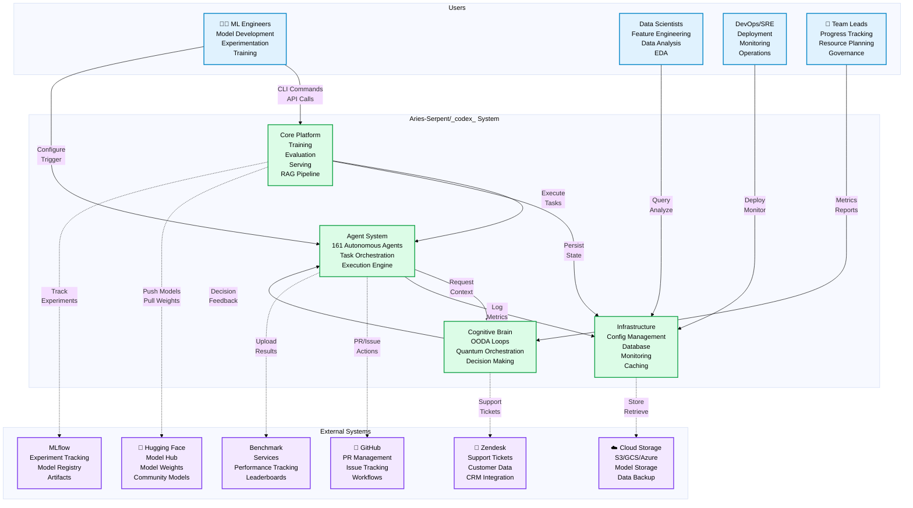

# System Context Diagram (C4 Context)
**Last Updated:** 2026-07-11
**Version:** v0.2.1

**Last Updated**: 2026-01-20
**Version**: v0.2.1
**Reference**: [5-Layer Architecture](5_LAYER_ARCHITECTURE.md)

---

## Context Level Overview

The Aries-Serpent/_codex_ system operates within a broader ecosystem of users and external systems:



---

## System Responsibilities

### Core Platform
- **Training**: Model training with hyperparameter tuning
- **Evaluation**: Metric computation and benchmark execution
- **Serving**: Inference and prediction pipelines
- **RAG**: Vector indexing and semantic retrieval

### Agent System
- **Task Orchestration**: Route and coordinate work
- **Autonomous Execution**: Run tasks without human intervention
- **Error Recovery**: Self-healing and resilience
- **Feedback Loop**: Learn from outcomes

### Cognitive Brain
- **OODA Loops**: Observe Orient Decide Act
- **Pattern Recognition**: Identify recurring issues
- **Decision Making**: Choose optimal actions
- **Quantum Orchestration**: Coordinate complex workflows

### Infrastructure
- **Configuration**: Hydra-based setup and secrets
- **Database**: Session and checkpoint persistence
- **Monitoring**: Metrics, logs, alerts, dashboards
- **Caching**: Results, models, embeddings

---

## User Types & Interactions

| User Type | Primary Interactions | Key Workflows |
|-----------|-------------------|---------------|
| **ML Engineers** | CLI, API, training | Develop models, run experiments, deploy |
| **Data Scientists** | Query tools, analysis | Feature engineering, data analysis, EDA |
| **DevOps/SRE** | Deployment, monitoring | Production deployment, system health |
| **Team Leads** | Dashboards, reports | Progress tracking, resource planning |

---

## External System Integrations

| System | Purpose | Direction | Frequency |
|--------|---------|-----------|-----------|
| **GitHub** | PR automation, workflows | Bidirectional | Per-commit |
| **Zendesk** | Support ticket sync | Bidirectional | Per-ticket |
| **Hugging Face** | Model sharing | Bidirectional | Per-release |
| **MLflow** | Experiment tracking | Unidirectional () | Per-run |
| **Cloud Storage** | Model/data persistence | Bidirectional | On-demand |
| **Benchmarks** | Performance tracking | Unidirectional () | Per-release |

---

## Key Boundary Crossings

### Incoming (Users System)
1. **CLI Commands** - User runs `codex train --config config.yaml`
2. **API Calls** - Programmatic model requests: `POST /api/predict`
3. **GitHub Triggers** - PR opened Automated checks
4. **Configuration Changes** - Update `configs/` System reloads

### Outgoing (System External)
1. **Model Upload** - Push trained models to Hugging Face
2. **PR Comments** - Agent post findings to GitHub PR
3. **Support Tickets** - Update customer issues in Zendesk
4. **Metrics Upload** - Submit benchmark results
5. **Artifact Storage** - Save models/data to cloud storage

---

## Architecture Context

This C4 Context diagram represents **Level 1** of the C4 model:

```
Level 1: System Context (this diagram)
  ↓
Level 2: Containers (see 5-Layer Architecture)
  ↓
Level 3: Components (see individual layer docs)
  ↓
Level 4: Code (see source files)
```

---

## Next Steps

- See [5-Layer Architecture](5_LAYER_ARCHITECTURE.md) for internal layer structure
- See [End-to-End Request Flow](E2E_REQUEST_FLOW.md) for request lifecycle
- See [Component Dependencies](COMPONENT_DEPENDENCIES.md) for module relationships

---

**Related Documentation**:
- [ARCHITECTURE.md](./INDEX.md) - Full architecture documentation
- [5-Layer Architecture](5_LAYER_ARCHITECTURE.md) - Internal system layers
- Check the integration documentation in the repository for external system integration details
