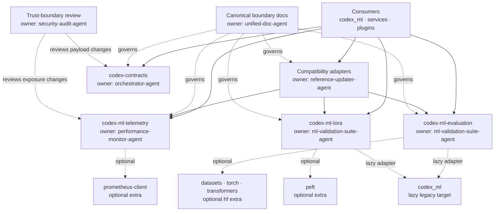
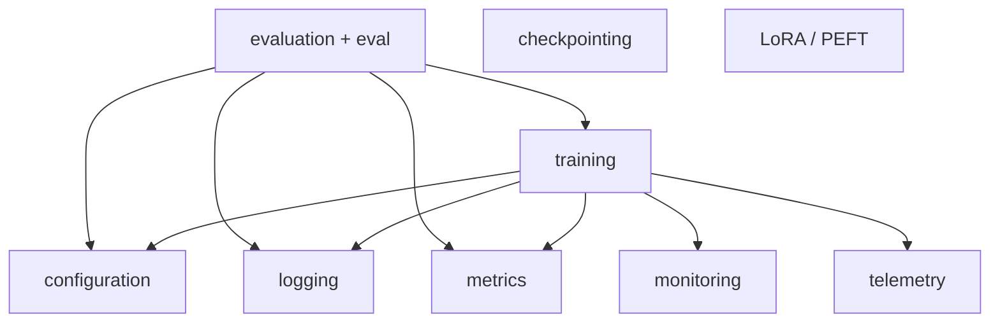
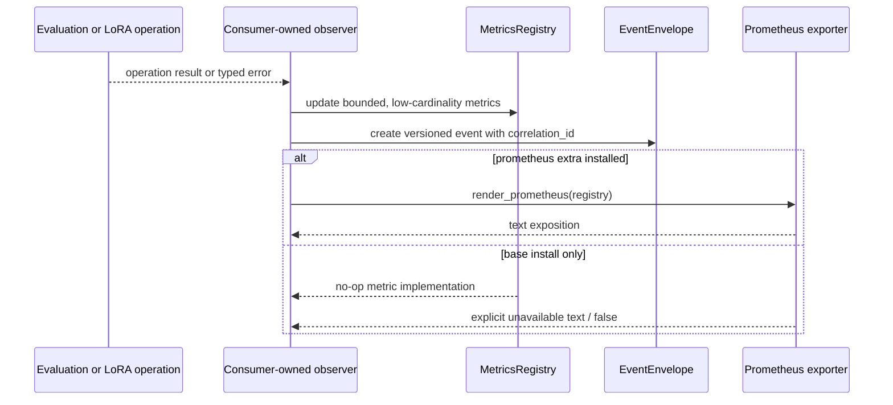

# Federated Package Boundaries

> **Canonical status:** current alpha package boundary and extraction contract
>
> **Decision:** [ADR-009](../adr/ADR-009-federated-package-boundaries.md)
>
> **Last verified:** 2026-09-12

This artifact defines the extraction-safe boundary for the standalone
`codex-contracts`, `codex-ml-telemetry`, `codex-ml-evaluation`, and `codex-ml-lora`
distributions. It documents the current checkout, not a claim that external
publication or deployment has occurred.

## Dependency and ownership graph

Allowed dependency direction is downward in the diagram. All four distributions have
dependency-free base installs. Optional extras and lazy, call-time adapters may cross
to third-party or legacy implementations; importing a package root must not. Consumers
may depend on any boundary, but the boundaries must never import consumers.

The owner names above are exact custom-agent names listed in
`agents/AGENT_MASTER_REFERENCE.md`.
They identify review responsibility, not autonomous deployment authority.

### Monolith domain dependency policy

The compatibility host retains internal domains while extraction proceeds. The
current allowed directed graph is:

Checkpointing, LoRA/PEFT, and telemetry currently have no allowed outgoing
domain edges. New edges require an architecture decision; reverse edges and
cycles are rejected by `tests/architecture/test_federated_package_boundaries.py`.
The standalone distributions remain below this graph and cannot import the
compatibility host.

## Public API inventory

Only package-root exports are public. A new public name requires tests, documentation,
and compatibility review.

| Distribution / import | Supported public names | Contract |
|---|---|---|
| `codex-contracts` / `codex_contracts` | `ArtifactReference`, `CodexPlugin`, `ContractValidationError`, `ErrorEnvelope`, `EventEnvelope`, `__version__` | Immutable or structural interoperability primitives; `EventEnvelope` uses bounded, versioned JSON |
| `codex-ml-telemetry` / `codex_ml_telemetry` | `EXAMPLES_PROCESSED`, `REQUEST_LATENCY`, `TRAIN_STEP_DURATION`, `HealthReport`, `HealthStatus`, `MetricsRegistry`, `render_prometheus`, `start_metrics_server`, `track_time`, `__version__` | Framework-neutral health and metrics surface with no-op behavior when Prometheus is absent |
| `codex-ml-evaluation` / `codex_evaluation` | `CodexMetricAdapter`, `EvaluationBatch`, `EvaluationError`, `EvaluationReport`, `EvaluationRunner`, `Evaluator`, `Metric`, `MetricInput`, `MetricLoader`, `MetricRegistrationError`, `MetricRegistry`, `__version__` | Scalar evaluation contracts and runner; the Codex metric adapter resolves the monolith only when called |
| `codex-ml-lora` / `codex_lora` | `CodexMlLoraAdapter`, `LoraBackend`, `LoraConfig`, `OptionalDependencyError`, `PeftBackend`, `apply_lora`, `load_lora`, `__version__` | Backend-neutral LoRA surface; PEFT and legacy Codex ML implementations are lazy adapters |

Internal validation helpers, Prometheus implementation objects, and module paths below
the package roots are not public API.

## Migration compatibility

| Existing surface | Standalone target | Compatibility in this checkout | Removal or promotion gate |
|---|---|---|---|
| `codex_ml.telemetry.{EXAMPLES_PROCESSED, REQUEST_LATENCY, TRAIN_STEP_DURATION, track_time}` | Same names from `codex_ml_telemetry` | Standalone package preserves the names; legacy module remains available | Migrate callers, compare behavior with and without the optional extra, then deprecate before removal |
| `codex_ml.telemetry.start_metrics_server` | `codex_ml_telemetry.start_metrics_server` | Same arguments and safe localhost default; both report unavailable support with `False` | Preserve return and bind semantics through a documented deprecation window |
| `codex_ml.monitoring.metrics_export.get_metrics_text` | `codex_ml_telemetry.render_prometheus` | Adapter prefers the standalone renderer and falls back when it is unavailable | Remove fallback only after the standalone distribution is mandatory |
| `codex_ml.monitoring.health.HealthReport` | `codex_ml_telemetry.HealthReport` | **Not drop-in:** the legacy model includes monitoring/logging semantics; the standalone type is a small immutable transport record | Migrate only consumers needing the transport contract; do not alias the types |
| `codex_ml.metrics.get_metric(name)` | `codex_evaluation.CodexMetricAdapter(name)` | Lazy bridge preserves named metric lookup and converts the result to a finite scalar through `EvaluationRunner` | Compare representative metric results, then replace bridge use with explicitly registered standalone metrics |
| `codex_ml.evaluation.runner.EvaluationRunner` | `codex_evaluation.EvaluationRunner` | **Not drop-in:** standalone input/output types are `EvaluationBatch` and `EvaluationReport` and accept an explicit metric mapping | Migrate call sites explicitly; retain legacy orchestration until result and error semantics are tested |
| `codex_ml.peft.peft_adapter.apply_lora(model, cfg)` | `codex_lora.apply_lora(model, LoraConfig(...))` or `CodexMlLoraAdapter` | Lazy legacy adapter translates configuration; it does not support `adapter_name` or loading | Test configuration translation and model behavior before retiring the legacy entry point |
| Direct `peft` configuration/application | `codex_lora.PeftBackend` through `apply_lora` / `load_lora` | `peft` remains optional and is imported only when invoked | Test with the `peft` extra installed and absent; preserve `OptionalDependencyError` semantics |
| Ad hoc cross-package dictionaries and exceptions | `EventEnvelope`, `ArtifactReference`, `ErrorEnvelope` | Additive API; no blanket legacy alias | Define a producer/consumer schema test before replacing each payload |

All four standalone distributions are version `0.1.0a1` and have alpha maturity.
The evaluation distribution name is frozen as `codex-ml-evaluation`; `codex-ml-eval`
is not a release alias. Compatibility claims apply only to the inventory above; they
do not stabilize private modules. During migration, `codex-ml` remains the `0.3.0`
implementation and compatibility host rather than a metapackage.

## Extraction-ready telemetry design

Extraction preserves these rules:

1. **Instrumentation is framework-independent.** Producers update `MetricsRegistry`;
   web adapters choose response types and routes.
2. **Optional backend means bounded degradation.** Importing the base package works
   without Prometheus. Export/server helpers return explicit fallback results.
3. **Stable metric identity.** Keep metric names, units, and label keys stable; avoid
   user-controlled or unbounded label values.
4. **Portable health records.** `HealthReport.to_dict()` yields a JSON-compatible
   snapshot; transport and persistence remain consumer concerns.
5. **Correlation crosses packages through contracts.** Cross-node telemetry should
   carry an `EventEnvelope.correlation_id` and reference large payloads with
   `ArtifactReference`, rather than embedding data in metrics or events.
6. **Instrumentation stays outside feature packages.** Consumer-owned observers wrap
   evaluation and LoRA operations, so neither package acquires a telemetry dependency.
7. **No reverse imports.** Every extracted package must build and test without the
   monorepo on `sys.path`; only an explicitly invoked legacy adapter may resolve it.

## Change gates

- `orchestrator-agent`: approve dependency-direction or wire-contract changes.
- `performance-monitor-agent`: approve metric identity, health, and exporter changes.
- `ml-validation-suite-agent`: approve evaluation contracts, LoRA behavior, and
  optional-backend compatibility.
- `reference-updater-agent`: maintain additive adapters and import-path migration.
- `security-audit-agent`: review new payload fields, network exposure, and trust changes.
- `unified-doc-agent`: keep this artifact, ADR-009, navigation, and package READMEs aligned.

Extraction is ready when standalone tests pass in isolation, optional-dependency paths
are tested both present and absent, public exports match this inventory, legacy adapters
have explicit retirement gates, and no reverse dependency on monorepo implementations
exists.
