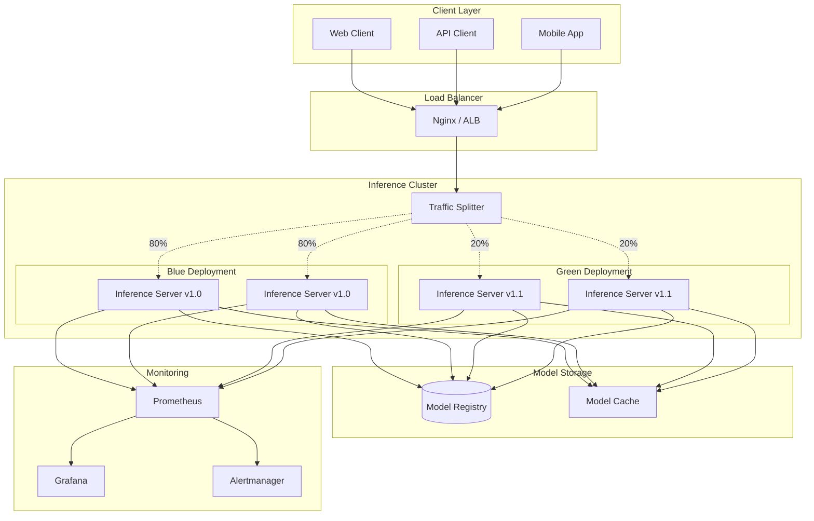
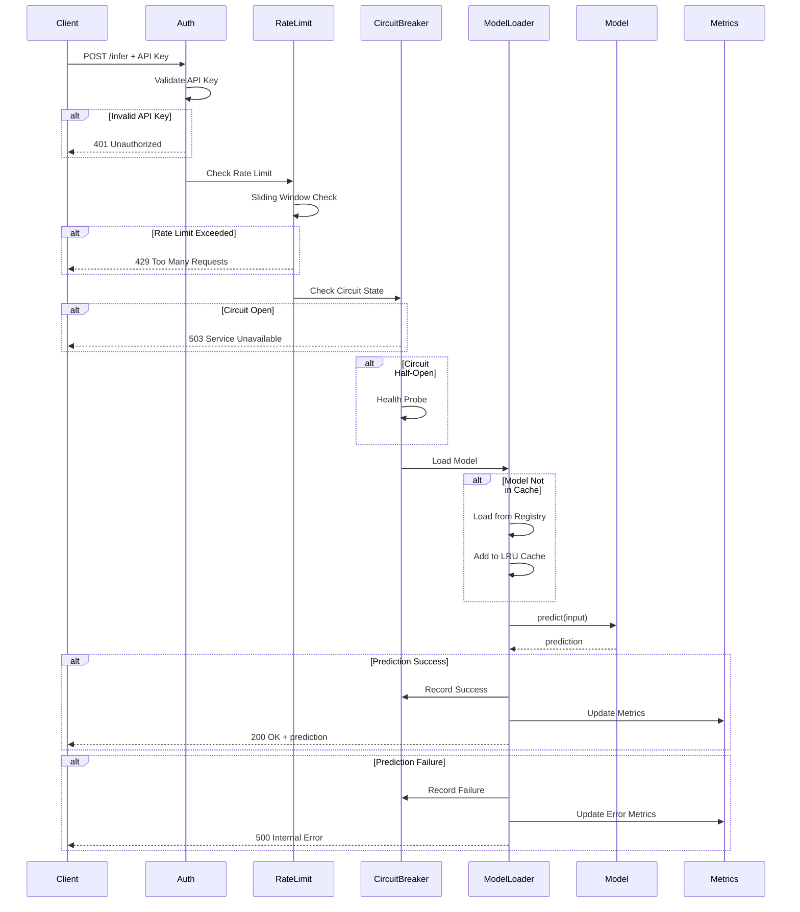
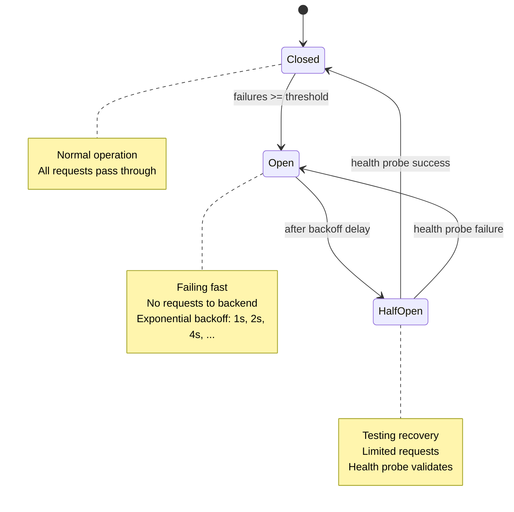
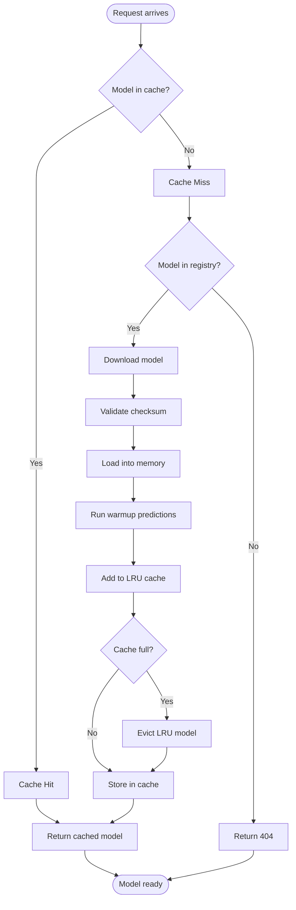
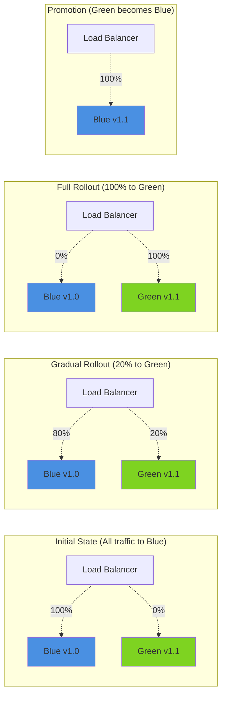
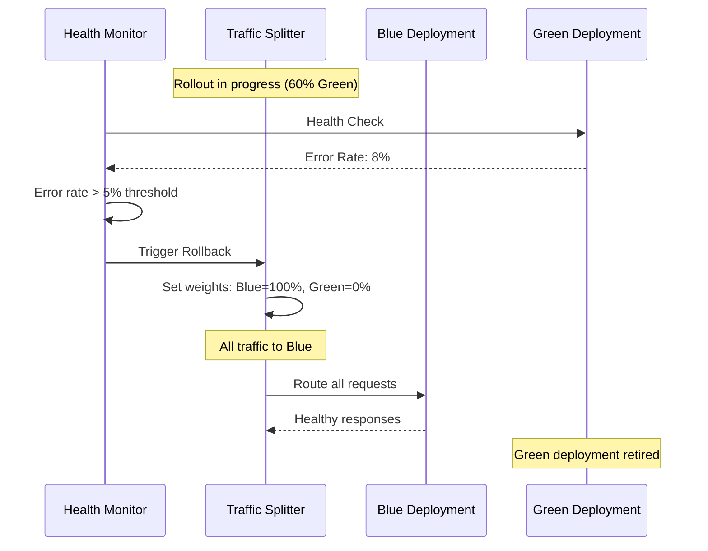
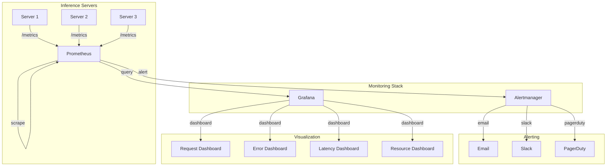
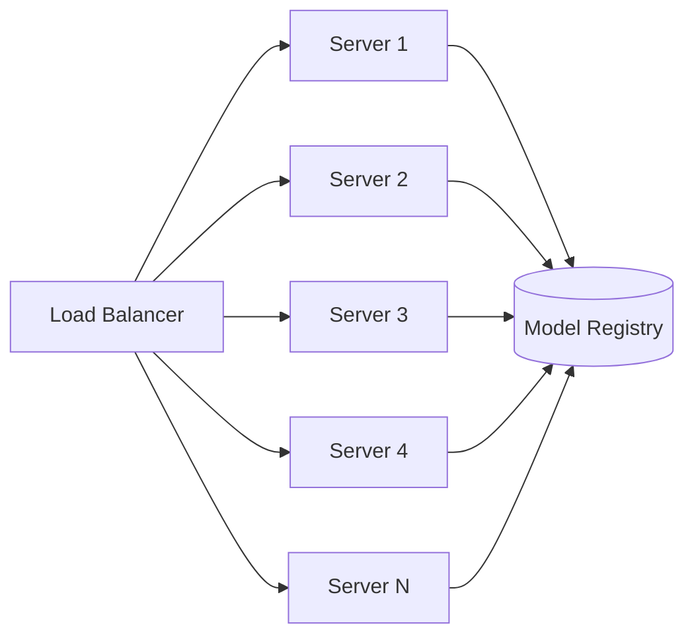
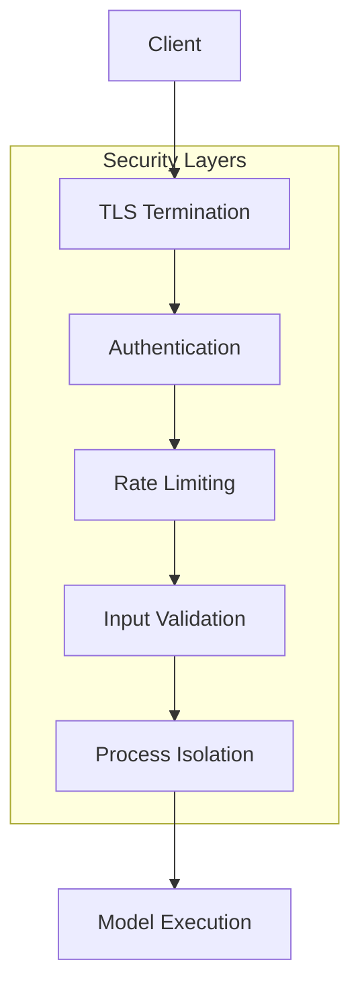

# Inference Serving Architecture

> **Version**: 2.0.0  
> **Last Updated**: 2024-12-07

---

## Overview

This document describes the architecture of the inference serving system, including components, data flows, and deployment patterns.

---

## System Architecture



---

## Request Flow



---

## Circuit Breaker State Machine



---

## Model Loading Flow



---

## Deployment Architecture

### Blue-Green Deployment



### Rollback Scenario



---

## Monitoring Architecture



---

## Component Details

### Inference Server

**Responsibilities:**
- Accept HTTP requests
- Authenticate requests
- Apply rate limiting
- Load models on-demand
- Execute predictions
- Return results
- Expose metrics

**Key Classes:**
- `InferenceServer`: FastAPI application
- `AuthManager`: Authentication handler
- `CircuitBreaker`: Failure protection
- `ModelLoader`: Model management
- `PrometheusMetrics`: Metrics collection

**Configuration:**
```python
{
    "host": "0.0.0.0",
    "port": 8000,
    "workers": 4,
    "timeout": 60,
    "model_cache_size": 3,
    "rate_limit_rpm": 1000
}
```

### Model Loader

**Responsibilities:**
- Load models from registry
- Cache models in memory
- Evict least-recently-used models
- Validate model checksums
- Handle model warmup

**Cache Strategy:**
- LRU eviction
- Max 3 models (configurable)
- Thread-safe access
- Lazy loading

### Circuit Breaker

**Responsibilities:**
- Track failure rates
- Open circuit on threshold
- Exponential backoff recovery
- Health probing
- Per-model isolation

**States:**
- **Closed**: Normal operation, all requests pass
- **Open**: Failing fast, no backend requests
- **Half-Open**: Testing recovery with health probes

**Configuration:**
```python
{
    "failure_threshold": 5,
    "timeout_seconds": 60,
    "half_open_max_calls": 3,
    "backoff_base_seconds": 1,
    "backoff_max_seconds": 300
}
```

### Traffic Splitter

**Responsibilities:**
- Route requests to blue or green
- Gradual traffic shifting
- Health-based failover
- Error rate monitoring

**Routing Logic:**
```python
if not blue_healthy and green_healthy:
    return "green"
elif not green_healthy and blue_healthy:
    return "blue"
else:
    # Weighted random selection
    return weighted_choice([
        ("blue", blue_weight),
        ("green", green_weight)
    ])
```

---

## Data Flow

### Prediction Request

1. **Client** sends POST to `/infer`
2. **Load Balancer** routes to inference server
3. **Authentication** validates API key/JWT
4. **Rate Limiter** checks request quota
5. **Circuit Breaker** checks model health
6. **Model Loader** loads/retrieves model
7. **Model** executes prediction
8. **Response** returns to client
9. **Metrics** recorded to Prometheus

### Model Update

1. **New model** uploaded to registry
2. **Deployment manager** initiates blue-green rollout
3. **Green deployment** loads new model
4. **Health checks** validate green
5. **Traffic** gradually shifts to green (0% → 100%)
6. **Monitoring** tracks error rates
7. **Rollback** if error rate exceeds threshold
8. **Promotion** if rollout successful

---

## Scaling Strategy

### Horizontal Scaling



**Scaling Rules:**
- Add replica when CPU > 70%
- Remove replica when CPU < 30%
- Min replicas: 2
- Max replicas: 10

### Vertical Scaling

**Memory Scaling:**
- Base: 4GB per server
- +2GB per cached model
- +4GB for GPU operations

**CPU Scaling:**
- 2 cores for I/O operations
- 4-8 cores for CPU inference
- GPU recommended for large models

---

## Security Architecture



**Security Controls:**
1. **TLS**: All traffic encrypted
2. **Authentication**: API key or JWT required
3. **Rate Limiting**: Prevent abuse
4. **Input Validation**: Sanitize inputs
5. **Process Isolation**: Sandbox execution

---

## Failure Modes & Recovery

### Failure Scenarios

| Failure | Detection | Recovery |
|---------|-----------|----------|
| Model crash | Circuit breaker | Reload model |
| High latency | Metrics | Scale up |
| Memory leak | Resource monitor | Restart server |
| Network partition | Health checks | Failover |
| Corrupted model | Checksum validation | Re-download |

### Recovery Strategies

1. **Automatic**: Circuit breaker, health checks
2. **Manual**: Admin intervention, rollback
3. **Preventive**: Canary deployments, chaos testing

---

## Performance Characteristics

### Latency Targets

| Operation | P50 | P95 | P99 |
|-----------|-----|-----|-----|
| Health check | <10ms | <50ms | <100ms |
| Authentication | <5ms | <10ms | <20ms |
| Model loading (cache hit) | <50ms | <100ms | <200ms |
| Model loading (cache miss) | <5s | <10s | <15s |
| Inference (small model) | <100ms | <300ms | <500ms |
| Inference (large model) | <500ms | <1s | <2s |

### Throughput Targets

| Endpoint | Target RPS |
|----------|------------|
| `/health` | 500+ |
| `/metrics` | 100+ |
| `/infer` (cached) | 50+ |
| `/infer` (uncached) | 10+ |

---

## Related Documentation

- [Troubleshooting Guide](../troubleshooting/inference_serving.md)
- [Deployment Guide](../guides/inference_deployment.md)
- [Performance Tuning](../guides/inference_performance.md)
- [Monitoring Setup](../guides/inference_monitoring.md)

---

*Last reviewed: Previous Cycle-12-07*
