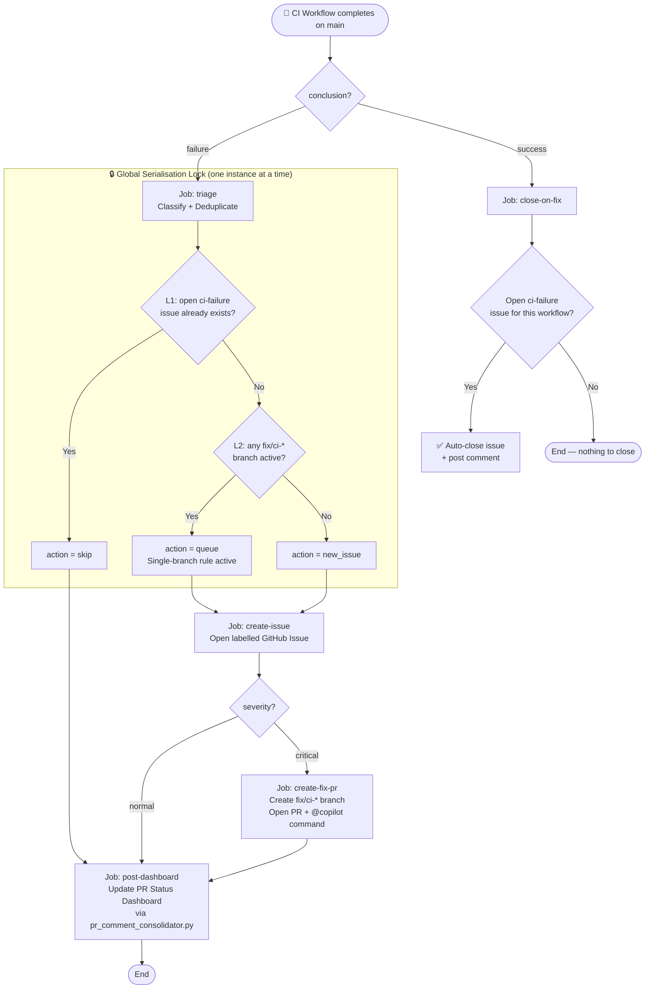
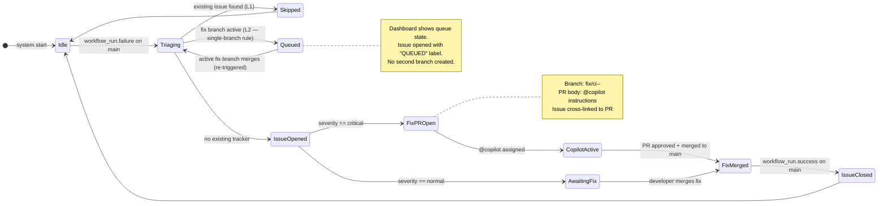
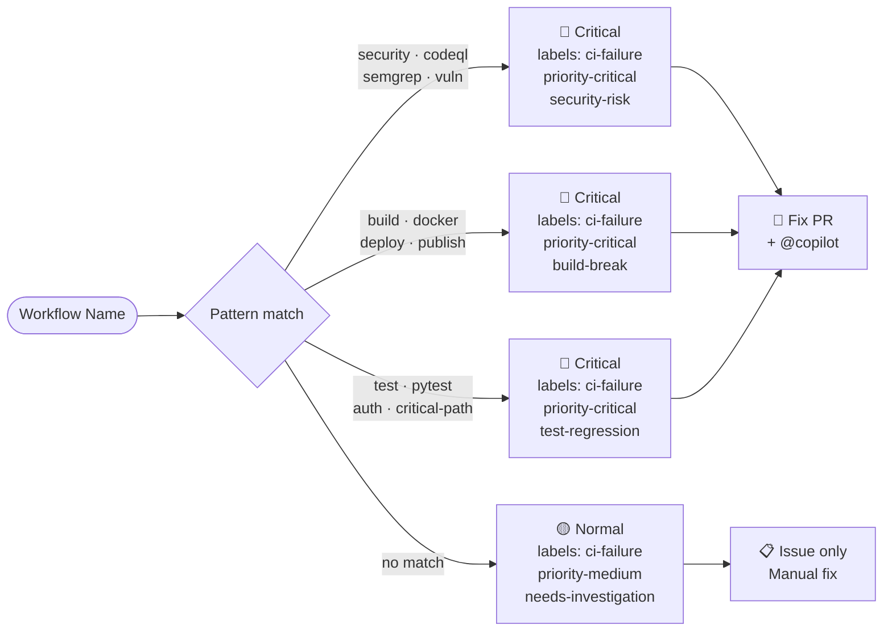
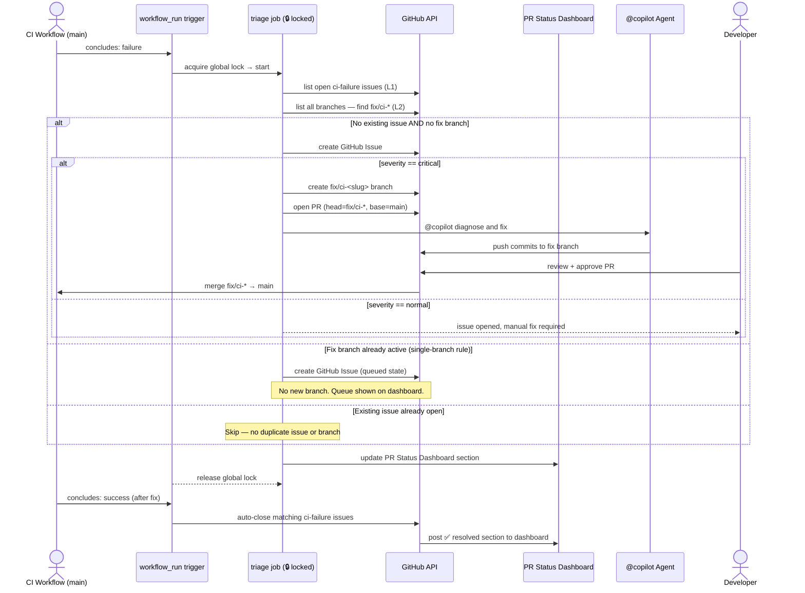
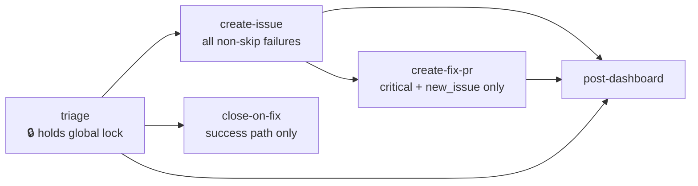

# 🚨 CI Failure Auto-Response

> **Owner:** @mbaetiong  
> **Version:** 1.0.0  
> **Last Updated:** 2026-03-17  
> **Workflow:** [`.github/workflows/ci-failure-issue-creator.yml`](https://github.com/Aries-Serpent/_codex_/blob/main/.github/workflows/ci-failure-issue-creator.yml)

---

## Overview

When any monitored CI workflow **fails on `main`**, the CI Failure Auto-Response system
automatically:

1. **Opens a GitHub Issue** to track the failure (all severities).
2. **For critical failures** — creates a dedicated fix branch and opens a PR with an
   `@copilot` command so the Copilot Coding Agent begins the investigation immediately.
3. **Enforces a single-branch rule** — at most one `fix/ci-*` branch exists at any
   given time. Additional failures are _queued_ (issue opened, no second branch created).
4. **Posts every outcome** to the **📊 PR Status Dashboard** via
   `pr_comment_consolidator.py` — all state is visible in one place.
5. **Auto-closes** the tracking issue when the workflow passes on `main` again.

---

## 1. End-to-End Process Map



---

## 2. Single-Branch Rule — State Diagram

Only **one** `fix/ci-*` branch may exist at a time.  
Subsequent failures are queued until the active branch merges.



---

## 3. Severity Classification



---

## 4. Actor Interaction — Sequence Diagram



---

## 5. Dashboard Integration

Every outcome writes **one section** to the **📊 PR Status Dashboard** comment on the
active PR.  No additional standalone comments are posted.

| Outcome | Dashboard status | Dashboard summary example |
|---------|-----------------|--------------------------|
| Workflow passed (resolved) | ✅ success | `✅ \`CodeQL Analysis\` — passing on \`main\`` |
| Skip (existing issue) | ⚠️ warning | `🔴 \`CodeQL Analysis\` failed — existing tracker covers this` |
| Queued (branch active) | ⚠️ warning | `🔴 \`CodeQL Analysis\` failed — queued (single-branch rule active)` |
| Normal failure → new issue | ❌ failure | `🟡 \`Data Quality Suite\` failed — issue opened, manual fix required` |
| Critical → fix PR opened | ❌ failure | `🔴 CRITICAL \`Auth Tests\` failed — fix PR opened, @copilot assigned` |

---

## 6. Single-Branch Queue Visualisation

```mermaid
%%{init: {'accessibility': {'title': 'Timeline'}}%%
gantt
    title  Single-Branch Rule — Failure Queue Timeline
    dateFormat HH:mm
    axisFormat %H:%M

    section Active Fix
    fix/ci-auth-tests (PR #N)   : active, a1, 09:00, 60m

    section Queued Failures
    CodeQL fails → Issue #M     : crit, q1, 09:05, 55m
    Docker Build fails → Issue #P : crit, q2, 09:20, 40m

    section Resolution
    fix/ci-auth-tests merged    : milestone, m1, 10:00, 0m
    Queue processed (next triage) : q3, 10:00, 5m
```



> **Queue rule:** Issues `#M` and `#P` are opened immediately with a "QUEUED" note
> linking to the active fix branch. No second `fix/ci-*` branch is created until
> `fix/ci-auth-tests` merges and the system re-triages.

---

## 7. Job Dependency Graph



---

## 8. Configuration Reference

| Setting | Value | Purpose |
|---------|-------|---------|
| Concurrency group | `ci-failure-issue-creator-global-lock` | Serialises all invocations — race-free branch check |
| `cancel-in-progress` | `false` | Queues instead of dropping concurrent failures |
| Fix branch prefix | `fix/ci-<slug>-<timestamp>` | Enables L2 scan to detect any active fix branch |
| Critical label | `priority-critical` | Applied to issue + PR |
| Normal label | `priority-medium` + `needs-investigation` | Applied to issue |
| Issue marker | `<!-- CI_FAILURE_TRACKER:<slug> -->` | Enables L1 deduplication across re-runs |
| Auto-close trigger | `workflow_run.conclusion == 'success'` on `main` | Closes matching `ci-failure` issues |

---

## 9. Adding a New Monitored Workflow

To monitor an additional workflow, add its **exact `name:` field value** to the
`workflows:` list in `.github/workflows/ci-failure-issue-creator.yml`:

```yaml
on:
  workflow_run:
    workflows:
      - "My New Workflow"   # ← add here
    types: [completed]
    branches: [main]
```

---

## 10. Troubleshooting

| Symptom | Likely cause | Fix |
|---------|-------------|-----|
| Duplicate issues created | Race between two simultaneous failure events | Check concurrency group — must be `ci-failure-issue-creator-global-lock` with `cancel-in-progress: false` |
| Fix PR not created for critical failure | `action` resolved to `queue` (a `fix/ci-*` branch already exists) | Merge or delete the active fix branch first |
| Issue not auto-closed | Workflow name in `close-on-fix` slug doesn't match issue title | Check that the issue title contains the slugified workflow name |
| Dashboard not updated | No open PR found in `find-pr` step | Manually trigger with a `workflow_dispatch` and supply a `pr_number` |

---

> 🤖 _This document is maintained alongside `.github/workflows/ci-failure-issue-creator.yml`.  
> Update both when changing the process logic._
