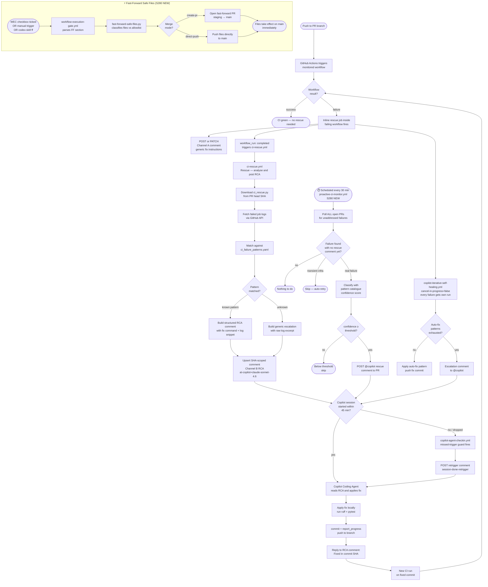
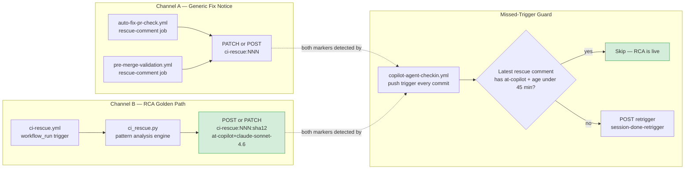
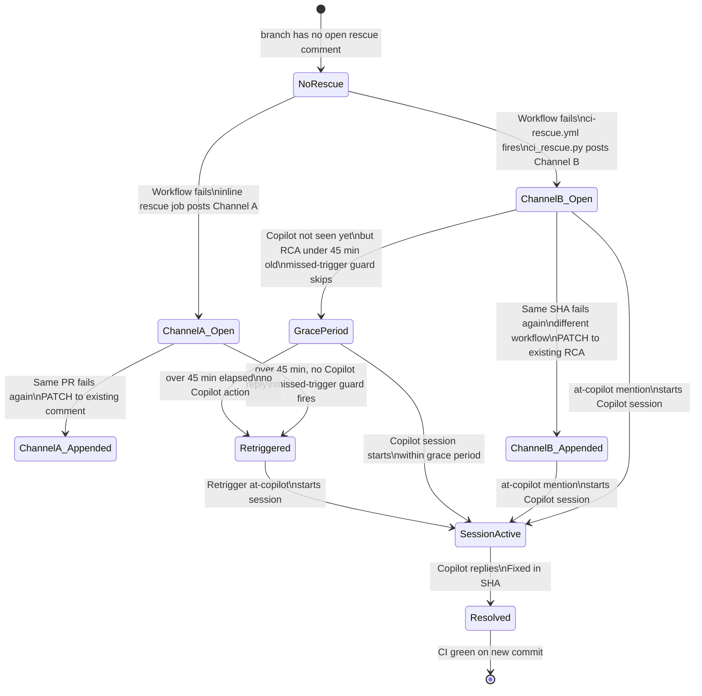
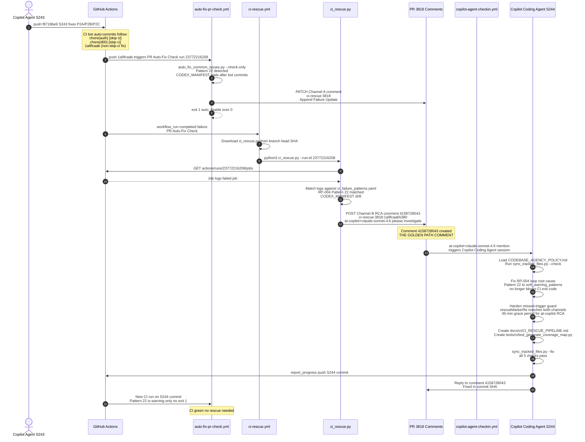
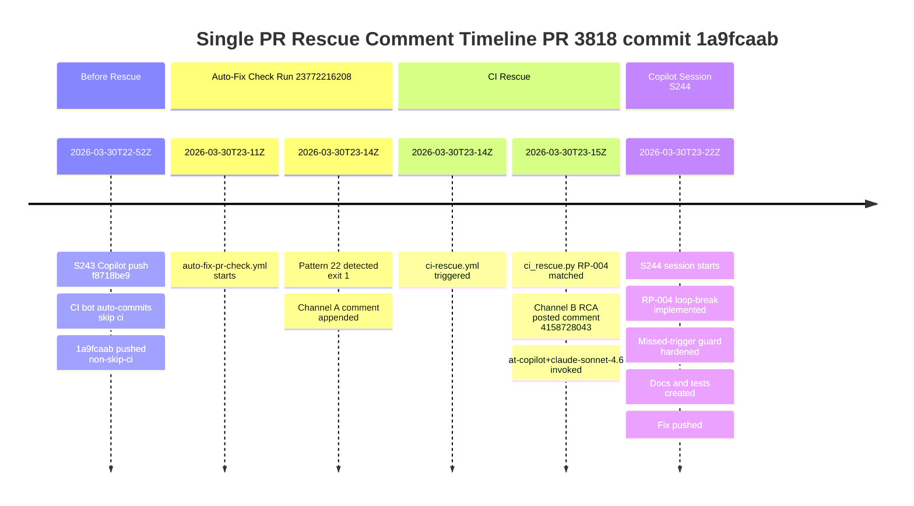
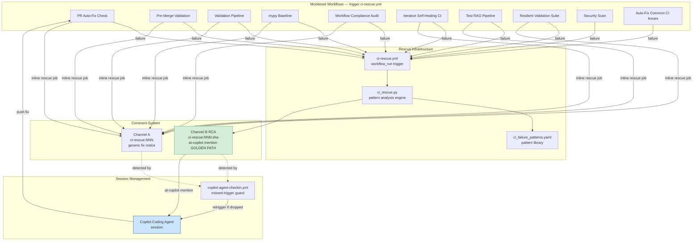
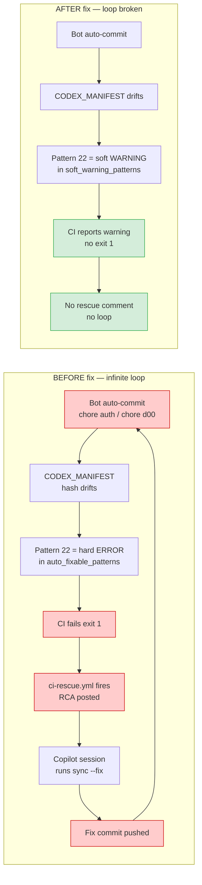
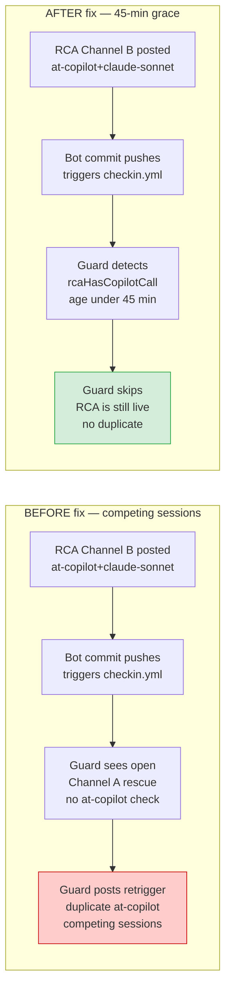
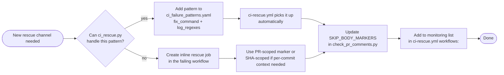

# CI Rescue Pipeline — Golden Path Documentation

> **Status:** Canonical reference (S280, 2026-04-02)
> **Scope:** End-to-end lifecycle from workflow failure to Copilot fix — including Proactive CI Monitor and Fast-Forward Safe-File Promotion
> **Golden-path example:** PR [#3818](https://github.com/Aries-Serpent/_codex_/pull/3818) comment [#4158728043](https://github.com/Aries-Serpent/_codex_/pull/3818#issuecomment-4158728043)
> **S280 additions:** `proactive-ci-monitor.yml` (scheduled safety net), `fast-forward-safe-files.yml` (immediate main promotion), WEC FF checkbox gate

---

## Table of Contents

1. [Overview](#1-overview)
2. [Complete Pipeline Flowchart](#2-complete-pipeline-flowchart)
3. [Comment Channel Architecture](#3-comment-channel-architecture)
4. [Deduplication State Machine](#4-deduplication-state-machine)
5. [Sequence Diagram — Golden Path (2026-03-30)](#5-sequence-diagram--golden-path-2026-03-30)
6. [Rescue Comment Lifecycle](#6-rescue-comment-lifecycle)
7. [Workflow Dependency Graph](#7-workflow-dependency-graph)
8. [Anti-Pattern Map](#8-anti-pattern-map)
9. [Component Responsibility Matrix](#9-component-responsibility-matrix)
10. [Rules for Adding New Rescue Channels](#10-rules-for-adding-new-rescue-channels)

---

## 1. Overview

The CI Rescue pipeline converts any monitored workflow failure into a structured `@copilot` session automatically — no human intervention required. The pipeline consists of **five cooperating layers** (S280):

| Layer | System | Role |
|-------|--------|------|
| 1 | **`ci-rescue.yml` + `ci_rescue.py`** | Push-triggered: pattern analysis, structured RCA comment with `@copilot` mention |
| 2 | **Inline rescue jobs** in monitored workflows | Channel A fallback: generic fix-instructions comment on every failure |
| 3 | **`copilot-iterative-self-healing.yml`** | Push-triggered: escalation when patterns are exhausted; `cancel-in-progress: false` ensures no run is lost |
| 4 | **`proactive-ci-monitor.yml`** (S280 🆕) | **Scheduled safety net (every 30 min):** polls ALL open PRs for failures that slipped past layers 1–3; posts `@copilot` rescue for any gap. Also manually triggerable by maintainer from the GitHub Actions UI or via `gh workflow run` |
| 5 | **`copilot-agent-checkin.yml`** missed-trigger guard | Final guard: re-triggers Copilot if the session was silently dropped after a new push |

### Fast-Forward Safe-File Promotion (S280 🆕)

For files that **only take effect from `main`** (workflow schedules, `workflow_run` triggers, `workflow_dispatch` UI buttons), the pipeline now includes a promotion path that bypasses the full PR merge cycle:

| Trigger | System | Description |
|---------|--------|-------------|
| WEC checkbox `⚡ Fast-Forward Approved` | **`workflow-execution-gate.yml`** → `fast-forward-safe-files.yml` | Maintainer ticks checkbox in PR body → WEC gate parses it → FF workflow auto-fires |
| Manual | **`fast-forward-safe-files.yml`** | Direct trigger from GitHub Actions UI or `gh workflow run` |
| CLI | **`codex-skill ff --pr <N>`** | Copilot Agent or maintainer previews/applies from terminal |

Allowed file patterns are governed by `.codex/fast_forward_allowlist.yaml`.

---

## 2. Complete Pipeline Flowchart

---

## 3. Comment Channel Architecture

**Key insight:** Channel B (SHA-scoped RCA from `ci_rescue.py`) is the **golden path** because it:
- Contains a **pattern-matched root cause** with exact fix command
- Directly **invokes `@copilot+claude-sonnet-4.6`** to start a session immediately
- Uses **SHA-scoped dedup** so each commit gets exactly one RCA comment
- Accumulates failure updates for multiple workflows failing on the **same SHA**

---

## 4. Deduplication State Machine

---

## 5. Sequence Diagram — Golden Path (2026-03-30)

This documents the **exact sequence** that produced the ideal rescue scenario — commit `1a9fcaab`, run [23772216208](https://github.com/Aries-Serpent/_codex_/actions/runs/23772216208), comment [#4158728043](https://github.com/Aries-Serpent/_codex_/pull/3818#issuecomment-4158728043):

---

## 6. Rescue Comment Lifecycle

---

## 7. Workflow Dependency Graph

---

## 8. Anti-Pattern Map

### Anti-Pattern 1: RP-004 Infinite Loop (Fixed in S244)

### Anti-Pattern 2: Duplicate Retriggers (Fixed in S244)

---

## 9. Component Responsibility Matrix

| Component | Detects failure | Posts Channel A | Posts Channel B RCA | Deduplicates | Retriggers dropped sessions |
|-----------|:-:|:-:|:-:|:-:|:-:|
| Inline rescue jobs (auto-fix-pr-check, pre-merge-validation, etc.) | ✅ | ✅ | ❌ | ✅ PR-scoped PATCH | ❌ |
| `ci-rescue.yml` | ✅ workflow_run | ❌ | ✅ | ✅ SHA-scoped PATCH | ❌ |
| `ci_rescue.py` | ✅ log analysis | ❌ | ✅ | ✅ HTTP_STATUS delimiter | ❌ |
| `copilot-agent-checkin.yml` missed-trigger guard | ❌ | ❌ | ❌ | ✅ grace period | ✅ |
| `auto_fix_common_issues.py` | ✅ Pattern 22+ | ❌ | ❌ | N/A | ❌ |

### Marker Reference

| Marker | Channel | Scope | Who posts | Who reads |
|--------|---------|-------|-----------|-----------|
| `<!-- ci-rescue:{pr} -->` | A | PR | inline rescue jobs | checkin.yml guard |
| `<!-- ci-rescue:{pr}:{sha12} -->` | B | SHA | `ci_rescue.py` | checkin.yml guard |
| `<!-- session-done-retrigger -->` | Guard | PR | checkin.yml | checkin.yml dedup |
| `<!-- incomplete-session-retrigger -->` | Guard | PR | checkin.yml | checkin.yml dedup |
| `<!-- ci-rescue-rca:{sha12} -->` | B fallback | SHA | `ci-rescue.yml` inline fallback | checkin.yml guard |

---

## 10. Rules for Adding New Rescue Channels

**Mandatory checklist for new rescue channels:**

1. ☐ **Unique parseable HTML marker** — use `<!-- ci-rescue-{source}:{pr}:{sha} -->` for new sources
2. ☐ **`@copilot+claude-sonnet-4.6`** in body — triggers session without human intervention
3. ☐ **Paginate comment search** (up to 50 pages) before creating to find existing marker
4. ☐ **Upsert semantics** — `PATCH` existing comment, `POST` only if not found
5. ☐ **Register pattern** in `.codex/patterns/ci_failure_patterns.yaml`
6. ☐ **Update `SKIP_BODY_MARKERS`** in `check_pr_comments.py` — prevent circular gate failure
7. ☐ **Update `rescueMarkerRe`** in `copilot-agent-checkin.yml` if marker format differs
8. ☐ **Add workflow** to monitored list in `ci-rescue.yml` `on.workflow_run.workflows:`

---

## Related Files

| File | Role |
|------|------|
| `.github/workflows/ci-rescue.yml` | Orchestrator — downloads engine, runs pattern analysis |
| `scripts/ci/ci_rescue.py` | Core engine — log analysis, SHA-scoped RCA posting |
| `.codex/patterns/ci_failure_patterns.yaml` | Known patterns: id, log_regexes, fix_command |
| `.github/workflows/copilot-agent-checkin.yml` | Missed-trigger guard (every push) |
| `.github/workflows/auto-fix-pr-check.yml` | Channel A: PR-scoped fix notice |
| `.github/workflows/pre-merge-validation.yml` | Channel A: pre-merge fix notice |
| `scripts/ci/auto_fix_common_issues.py` | Pattern detection + soft_warning_patterns Pattern 22 |
| `scripts/ci/sync_tracked_files.py` | Fixes RP-004: CODEX_MANIFEST/CHANGELOG sync |
| `scripts/ci/check_pr_comments.py` | SKIP_BODY_MARKERS prevents circular gate failures |
| `tests/ci/test_generate_coverage_map.py` | Unit tests for coverage map generation |

---

*Generated: S244 — 2026-03-30T23:22Z · Golden-path rescue: PR #3818 comment #4158728043*
