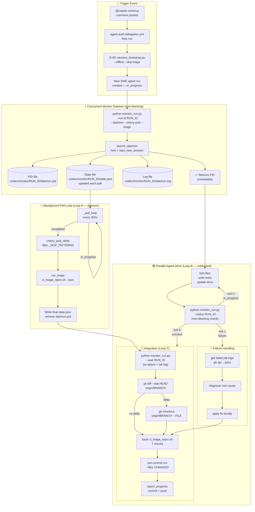

# Concurrent Workflow Monitoring & Cherry-Pick Process — Reproducibility Reference

> **Session:** S146 | **PR:** #3615 | **Date:** 2026-03-17
> **CLI tool:** `scripts/ci/monitor_run.py`
> **Runbook:** Follow each numbered step in sequence; commands are copy-paste exact.

---

## Architecture Diagram



---

## CLI Quick-Reference

```bash
# ── Start daemon (non-blocking) ──────────────────────────────────────────
python scripts/ci/monitor_run.py --run-id 23220880384 --daemon --cherry-pick --triage

# ── Check status while working on other tasks ────────────────────────────
python scripts/ci/monitor_run.py --status 23220880384
# exit 0=in_progress  5=success  1=failure  2=timeout  3=api_error  4=triage_fail

# ── Re-attach to tail log ────────────────────────────────────────────────
python scripts/ci/monitor_run.py --wait 23220880384

# ── Stop daemon ──────────────────────────────────────────────────────────
python scripts/ci/monitor_run.py --stop 23220880384

# ── List all monitors ────────────────────────────────────────────────────
python scripts/ci/monitor_run.py --list

# ── Resolve via check-run ID or commit SHA ───────────────────────────────
python scripts/ci/monitor_run.py --check-id 67492995091 --daemon
python scripts/ci/monitor_run.py --commit  abc1234ef    --daemon

# ── One-shot snapshot (no polling) ───────────────────────────────────────
python scripts/ci/monitor_run.py --run-id 23220880384 --check-only

# ── Python API: non-blocking thread ──────────────────────────────────────
from scripts.ci.monitor_run import start_background_monitor, poll_status
handle = start_background_monitor(run_id=23220880384, cherry_pick=True, triage=True)
# ... do other work ...
state = poll_status(23220880384)   # reads state.json — no network call
```

---

## Overview

This document is the standardised reference for the **Concurrent Monitor + Cherry-Pick
pattern** used whenever a Copilot SWE agent run is `in_progress` on the same branch.

The pattern has three interlocking loops managed by `monitor_run.py`:

```
Loop A — Monitor (daemon)     Loop B — Parallel work         Loop C — Integration
──────────────────────────    ──────────────────────         ────────────────────
poll GitHub API every 5m      edit files, run tests          git diff vs remote
write state.json each poll    check --status non-blocking    cherry_pick_delta
                                                             ci_triage_repro.sh
Detect completion ─────────────────────────────────────────► report_progress
```

Each step below has:

- **Trigger** — when to run it
- **Repro command** — exact shell command
- **Expected output** — what success looks like
- **Decision** — what to do with the result

---

## Prerequisites

```bash
# All commands run from the repository root
cd /home/runner/work/_codex_/_codex_

# GitHub CLI authenticated (read-only for monitoring)
# GITHUB_TOKEN or gh auth status must be valid

# Python ≥ 3.12
python --version

# git remote configured
git remote -v | grep origin
```

---

## Step 0 — Record the run ID before starting

When a `@copilot continue` comment triggers a new SWE agent run, capture its ID
immediately from the workflow list.

```bash
# Repro: list the most recent in_progress run on the active branch
BRANCH="copilot/sub-pr-3606-again"
gh api \
  "repos/Aries-Serpent/_codex_/actions/runs?branch=${BRANCH}&status=in_progress&per_page=5" \
  --jq '.workflow_runs[] | [.id, .name, .status, .run_started_at] | @tsv'
```

**Expected output:**

```
23220880384    Addressing comment on PR #3615    in_progress    2026-03-17T23:15:03Z
```

**Decision:** Save `RUN_ID=23220880384`. Proceed to Step 1.

---

## Step 1 — Establish local baseline before the run completes

Record the current local HEAD so you can later compute the delta.

```bash
# Repro
git log --oneline HEAD ^origin/0D_base_
```

**Expected output (S146 session):**

```
e0e1e7b cherry-pick: all 9 commits from PR #3613 (copilot/sub-pr-3606) + S146 D-00 CI wiring + 21 unit tests
a9b19cc chore(auth): write provenance session token [skip ci]
b6b59c4 cherry-pick: bring all PR #3613 changes into PR #3615 (S145 CI triage, session bootstrap, CB status)
6ae4507 Initial plan
```

**Decision:** Note the top SHA (`e0e1e7b`). Any commit on the remote above this is new
work from the agent run that must be cherry-picked.

---

## Step 2 — Poll run status (Loop A)

Run this every 5 minutes until `status != "in_progress"`.

```bash
RUN_ID=23220880384

# Repro: single-poll via GitHub CLI
gh api "repos/Aries-Serpent/_codex_/actions/runs/${RUN_ID}" \
  --jq '[.status, .conclusion, .updated_at] | @tsv'
```

**Possible outputs:**

| Output | Meaning | Next step |
|--------|---------|-----------|
| `in_progress    null    <timestamp>` | Still running | Wait 5 min, re-poll |
| `completed    success    <timestamp>` | ✅ Run succeeded — may have pushed commits | → Step 4 |
| `completed    failure    <timestamp>` | ❌ Run failed | → Step 3 |
| `completed    skipped    <timestamp>` | Run skipped (no matching trigger) | → Step 4 (no new commits expected) |

## Poll loop (bash)

```bash
RUN_ID=23220880384
while true; do
  RESULT=$(gh api "repos/Aries-Serpent/_codex_/actions/runs/${RUN_ID}" \
    --jq '[.status, .conclusion // "none"] | @tsv')
  echo "[$(date -u +%H:%M:%SZ)] ${RESULT}"
  STATUS=$(echo "${RESULT}" | cut -f1)
  [[ "${STATUS}" != "in_progress" ]] && break
  sleep 300   # 5-minute interval
done
echo "Run ${RUN_ID} finished: ${RESULT}"
```

---

## Step 3 — Handle run failure (branch: failed)

If the run concludes with `failure`:

```bash
# Repro: get failed job logs
gh api "repos/Aries-Serpent/_codex_/actions/runs/${RUN_ID}/jobs" \
  --jq '.jobs[] | select(.conclusion=="failure") | [.id, .name] | @tsv'

# Then fetch log for each failed job
JOB_ID=<failed_job_id>
gh api "repos/Aries-Serpent/_codex_/actions/jobs/${JOB_ID}/logs" 2>/dev/null | tail -50
```

**Decision:**
- Fix the root cause in the local checkout.
- Run `bash scripts/ci/ci_triage_repro.sh` to confirm triage passes.
- Proceed to Step 5 (pre-commit) and commit the fix.

---

## Step 4 — Detect new commits pushed by the run

After run completion, fetch the remote and diff against local HEAD.

```bash
# Repro
BRANCH="copilot/sub-pr-3606-again"
git fetch origin "${BRANCH}"

# Show commits that are on remote but NOT on local
git log --oneline HEAD..origin/${BRANCH}
```

**Possible outputs:**

| Output | Meaning | Next step |
|--------|---------|-----------|
| *(empty)* | Run pushed no substantive commits (or only `[skip ci]`) | → Step 5 (validate existing state) |
| `abc1234 fix: some change` | New substantive commits | → Step 4a (cherry-pick) |
| `abc1234 chore(auth): write provenance session token [skip ci]` | Auth-only commit | → Inspect then skip or apply |

## Step 4a — Cherry-pick new substantive commits

```bash
# Repro: list files changed in new commits
git diff --stat HEAD origin/${BRANCH} -- \
  $(git diff --name-only HEAD origin/${BRANCH} \
    | grep -v "^\.codex/agent_auth" \
    | grep -v "^CODEX_MANIFEST")
```

If there are meaningful diffs, take the final state of those files:

```bash
# Repro: checkout changed files from remote final state
for FILE in $(git diff --name-only HEAD origin/${BRANCH} \
    | grep -v "^\.codex/agent_auth" \
    | grep -v "^CODEX_MANIFEST"); do
  git checkout "origin/${BRANCH}" -- "${FILE}"
  echo "Applied: ${FILE}"
done
```

**Verify no unintended changes:**

```bash
git diff --stat HEAD
```

---

## Step 5 — Run all 7 CI triage checks

Always run after any cherry-pick and before committing.

```bash
# Repro: full 7-check suite
bash scripts/ci/ci_triage_repro.sh
```

**Expected output:**

```
━━━ Summary ━━━
  ✅ 1_actionlint: 0 errors
  ✅ 2_ruff_i001: 0 issues
  ✅ 3_mypy_baseline: 282 <= 282
  ✅ 4_autofix: exit 0 (0 informational)
  ✅ 5_telemetry: all 3 fields correct
  ✅ 6_threshold: both=99.7
  ✅ 7_changelog: consistent

All checks passed ✅
```

**If any check fails:** Run `bash scripts/ci/ci_triage_repro.sh --fix` then re-run.
See `docs/ci/CI_TRIAGE_REPRO_S145.md` for per-check root-cause + fix reference.

---

## Step 6 — Run pre-commit on all changed files

```bash
# Repro: collect changed files and run pre-commit
CHANGED=$(git diff --name-only HEAD)
if [[ -z "${CHANGED}" ]]; then
  echo "No changes — skipping pre-commit"
else
  pre-commit run --files ${CHANGED}
fi
```

**Expected output:** `All checks passed.`

---

## Step 7 — Run unit tests for any new/modified test files

```bash
# Repro: run CI unit tests
python -m pytest tests/ci/ -v --tb=short 2>&1 | tail -20
```

**Expected output:**

```
XX passed, Y warnings in Z.ZZs
```

---

## Step 8 — Commit and push via report_progress

Never use `git commit` or `git push` directly in agent sessions.
Use the `report_progress` tool which stages, commits, and pushes atomically.

**Checklist before committing:**

```bash
# Repro: final pre-commit checklist
echo "=== 1. Triage ===" && bash scripts/ci/ci_triage_repro.sh 2>&1 | grep -E "✅|❌|Summary" | tail -10
echo "=== 2. Tests ===" && python -m pytest tests/ci/ -q 2>&1 | tail -5
echo "=== 3. ruff ===" && python -m ruff check scripts/ci/ tests/ci/ 2>&1 | tail -3
echo "=== 4. Diff ===" && git diff --stat HEAD
```

---

## Step 9 — Verify final remote state

After `report_progress` pushes:

```bash
# Repro: confirm remote HEAD matches expected SHA
git fetch origin "${BRANCH}"
git log --oneline HEAD ^origin/0D_base_ | head -5
```

Also confirm zero diff with PR #3613 source (if cherry-picking from it):

```bash
# Repro: confirm parity with source branch
SOURCE="copilot/sub-pr-3606"
git fetch origin "${SOURCE}"
git diff --stat HEAD origin/${SOURCE} -- \
  $(git diff --name-only HEAD origin/${SOURCE} \
    | grep -v "^\.codex/agent_auth" \
    | grep -v "^CODEX_MANIFEST")
# Expected: 0 substantive differences
```

---

## Full Repro — One-liner chain

Run the entire monitoring + integration sequence in one shell session:

```bash
#!/usr/bin/env bash
# CONCURRENT MONITOR + CHERRY-PICK REPRO  (S146 pattern)
set -euo pipefail

BRANCH="copilot/sub-pr-3606-again"
SOURCE="copilot/sub-pr-3606"
RUN_ID="23220880384"
REPO="Aries-Serpent/_codex_"

echo "▶ Step 0: Record baseline"
BASELINE_SHA=$(git rev-parse HEAD)
echo "  Baseline: ${BASELINE_SHA}"

echo "▶ Step 1: Poll until run completes"
while true; do
  RESULT=$(gh api "repos/${REPO}/actions/runs/${RUN_ID}" \
    --jq '[.status, .conclusion // "none"] | @tsv')
  echo "  [$(date -u +%H:%M:%SZ)] ${RESULT}"
  STATUS=$(echo "${RESULT}" | cut -f1)
  [[ "${STATUS}" != "in_progress" ]] && break
  sleep 300
done

echo "▶ Step 2: Fetch remote"
git fetch origin "${BRANCH}" "${SOURCE}"

echo "▶ Step 3: Detect new commits"
NEW_COMMITS=$(git log --oneline "${BASELINE_SHA}..origin/${BRANCH}" \
  | grep -v "\[skip ci\]" || true)
echo "  New substantive commits: ${NEW_COMMITS:-none}"

echo "▶ Step 4: Apply parity from source branch"
DIFF_FILES=$(git diff --name-only HEAD "origin/${SOURCE}" \
  | grep -v "^\.codex/agent_auth" | grep -v "^CODEX_MANIFEST" || true)
if [[ -n "${DIFF_FILES}" ]]; then
  for F in ${DIFF_FILES}; do
    git checkout "origin/${SOURCE}" -- "${F}" && echo "  Applied: ${F}"
  done
else
  echo "  Source branch fully absorbed — no delta"
fi

echo "▶ Step 5: Run triage checks"
bash scripts/ci/ci_triage_repro.sh

echo "▶ Step 6: Run tests"
python -m pytest tests/ci/ -q 2>&1 | tail -5

echo "✅ Ready to commit via report_progress"
```

---

## Decision Tree

```
@copilot continue comment posted
         │
         ▼
  Detect new run ID
  (list_workflow_runs API)
         │
         ├── No new run? ──► Work proceeds without blocking; skip to Step 5
         │
         ▼
  Poll run status (Step 2)
         │
         ├── in_progress ──► Do parallel work (Loop B); re-poll in 5 min
         │
         ├── failure ──────► Diagnose (Step 3) → fix → re-run triage
         │
         └── success ──────► Fetch delta (Step 4)
                                    │
                                    ├── No delta ──► Step 5 (triage)
                                    │
                                    └── Delta ─────► Checkout files (Step 4a)
                                                     → Step 5 (triage)
                                                     → Step 6 (pre-commit)
                                                     → Step 7 (tests)
                                                     → Step 8 (commit)
                                                     → Step 9 (verify)
```

---

## Parallel Work (Loop B) — What to do while waiting

While the run is `in_progress`, the following tasks are safe to work on in
parallel because they do not conflict with the agent run's expected output:

| Task | Safe? | Reason |
|------|-------|--------|
| Add unit tests for existing functions | ✅ | New file; no conflict |
| Update CHANGELOG.md / AGENT_ACCOUNTABILITY_REPORT.md | ✅ | Append-only; merge trivially |
| Create new docs (this file) | ✅ | New file; no conflict |
| Wire new CI step in a workflow | ✅ | Agent run does not touch workflows |
| Modify files the agent run is likely editing | ⚠️ | Risk of conflict on integration |
| Modify `.mypy_baseline` | ⚠️ | Agent may also modify; check diff carefully |
| Merge / rebase | ❌ | Wait until run completes |

---

## Conflict Resolution

If `git diff --stat HEAD origin/${BRANCH}` shows conflicting edits in the same
file after the run completes:

```bash
# Repro: three-way view of the conflict
git diff HEAD "origin/${BRANCH}" -- <conflicting_file>

# Strategy 1: take remote (agent run wins)
git checkout "origin/${BRANCH}" -- <file>

# Strategy 2: take local (current session wins)
# (do nothing — already at local state)

# Strategy 3: manual merge
# Edit the file to combine both changes, then:
git add <file>
```

**Policy (per CODEBASE_AGENCY_POLICY.md §3a):** Always take the richer state.
For `CHANGELOG.md` / `AGENT_ACCOUNTABILITY_REPORT.md`, concatenate both entries.
For code files, prefer the state that passes all 7 triage checks.

---

## References

| Resource | Path |
|----------|------|
| 7-check triage script | `scripts/ci/ci_triage_repro.sh` |
| Per-check root-cause reference | `docs/ci/CI_TRIAGE_REPRO_S145.md` |
| Session bootstrap (D-00 gate) | `scripts/ci/session_bootstrap.py` |
| Agency policy | `.codex/CODEBASE_AGENCY_POLICY.md` |
| Cognitive Brain Phase 4 status | `.codex/COGNITIVE_BRAIN_STATUS_S146.md` |
| Session injector agent (D-00 diagram) | `.github/agents/cognitive-brain-session-injector.md` |

---

_Generated by `session_bootstrap.py` pattern during S146 — 2026-03-17T23:21Z_
_Reproducible reference for the Concurrent Monitor + Cherry-Pick process_
