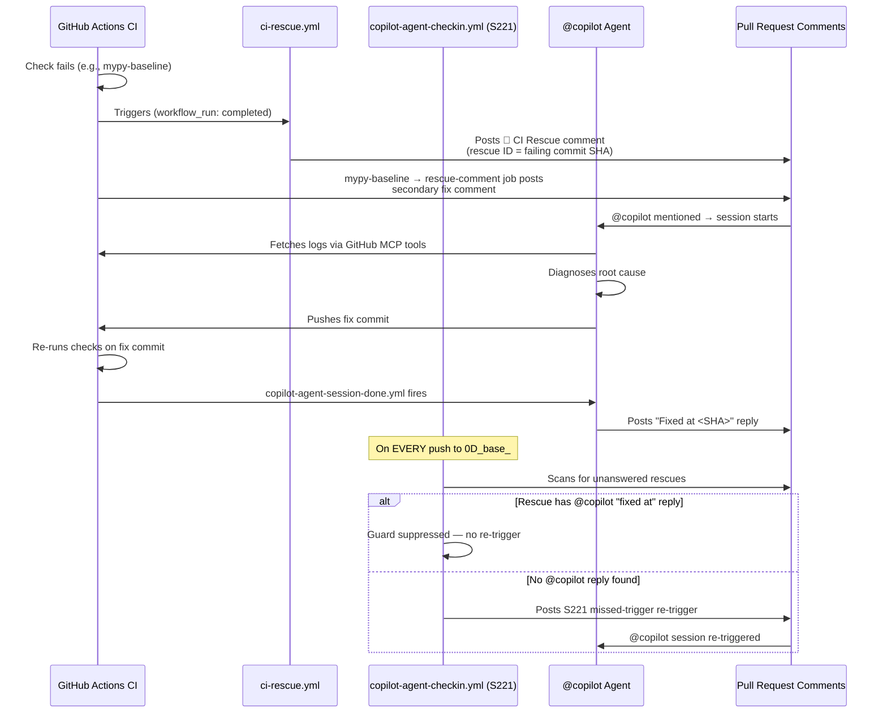

# PR Lifecycle — 0D_base_ Branch

> **Version:** 1.0.0  
> **Date:** 2026-03-28  
> **Branch:** `0D_base_`  
> **Sources:** `.github/workflows/` inspection, CI log history (runs 23689574622, 23691951388, 23692231532)

This document describes the full expected lifecycle of a pull request on the `0D_base_` branch:
which workflows run, when Copilot sessions are triggered, what failures are expected vs unexpected,
and how the self-healing / rescue system responds.

---

## Table of Contents

1. [High-Level Lifecycle Overview](#1-high-level-lifecycle-overview)
2. [Workflow Trigger Map](#2-workflow-trigger-map)
3. [Pre-Approval Workflows (no token delegation required)](#3-pre-approval-workflows)
4. [Post-Approval Workflows (require `COPILOT_AGENT_AUTH_ENABLED`)](#4-post-approval-workflows)
5. [Copilot Session Startup Triggers](#5-copilot-session-startup-triggers)
6. [Expected Failing Checks (and why they fail)](#6-expected-failing-checks)
7. [Rescue & Self-Healing Chain](#7-rescue--self-healing-chain)
8. [Mermaid Lifecycle Diagram](#8-mermaid-lifecycle-diagram)
9. [Rescue Flow Diagram](#9-rescue-flow-diagram)
10. [Historical CI Log Cross-Reference](#10-historical-ci-log-cross-reference)

---

## 1. High-Level Lifecycle Overview

```
Developer pushes commit to 0D_base_
         │
         ▼
┌────────────────────────────────┐
│  PHASE 1: Pre-Approval Checks  │  ← runs immediately on every push/PR
│  (no human approval required)  │
└────────────────────────────────┘
         │
         ▼ (all green OR rescue triggered)
┌────────────────────────────────┐
│  PHASE 2: Agent Token Gate     │  ← owner approves agent-auth-delegation
│  (owner approves once per PR)  │
└────────────────────────────────┘
         │
         ▼
┌────────────────────────────────┐
│  PHASE 3: Post-Approval Runs   │  ← full test suites, Copilot sessions
│  (COPILOT_AGENT_AUTH_ENABLED)  │
└────────────────────────────────┘
         │
         ▼
┌────────────────────────────────┐
│  PHASE 4: Merge Readiness      │  ← all required checks green, ready for merge
└────────────────────────────────┘
```

---

## 2. Workflow Trigger Map

| Workflow | Trigger | Requires Approval | Purpose |
|----------|---------|-------------------|---------|
| `validate.yml` | `pull_request` | No | Pre-commit hook suite (ruff, detect-secrets, sync-tracked-files) |
| `mypy-baseline.yml` | `pull_request` + `push` | No | Type-check anti-regression gate |
| `resilient_validation.yml` | `pull_request` | No | Full pytest suite (4 shards + integration + slow) |
| `agent-auth-delegation.yml` | `push` + `issue_comment` + `workflow_run` | **Yes — owner approves** | Delegates token to Copilot agents |
| `copilot-agent-checkin.yml` | `push` to `0D_base_` | No (reads repo vars) | S221 guard — missed-trigger recovery |
| `ci-rescue.yml` | `workflow_run` (on failure) | No | Root-cause analysis + rescue comment posting |
| `copilot-agent-session-done.yml` | `workflow_run` | No | Session completion tracking |
| `copilot-session-chain.yml` | `issue_comment` / `workflow_dispatch` | No | Copilot session sequencing |
| `copilot-pr-session-injector.yml` | `pull_request` | No | Injects session context into PR |
| `copilot-cascade-review.md` | Manual / dispatch | No | Multi-pass Copilot PR review |

---

## 3. Pre-Approval Workflows

These run **immediately** on every push or PR event, without any human approval:

### 3.1 `validate.yml` — Validation Pipeline (Fast Validation)

**Trigger:** `pull_request` (opened, synchronize, reopened)  
**Checks:**
- `pre-commit` hooks: end-of-file-fixer, detect-secrets, sync-tracked-files
- `ruff check` (import hygiene, linting)
- `python3 scripts/ci/sync_tracked_files.py --check` (P22 tracked-file drift)

**Expected to pass:** Always. Failures indicate import hygiene issues, secrets drift, or untracked file hash changes.

### 3.2 `mypy-baseline.yml` — mypy Anti-Regression Gate

**Trigger:** `pull_request` + `push`  
**Checks:**
- Runs `python scripts/ci/mypy_baseline.py --require-baseline`
- Compares current `src/` mypy error count against `.mypy_baseline`
- **FAILS** if `current_errors > baseline`

**Expected to pass:** Always. The baseline is set to the CI-environment count (isolated venv: `mypy>=1.8.0, types-PyYAML, types-requests` only).

> ⚠️ **Note on environment parity:** The CI venv does NOT install the full project. This means
> `# type: ignore` annotations that suppress errors from installed packages (pydantic, PyJWT,
> cryptography, etc.) appear as "unused" in CI. The `.mypy_baseline` MUST be set using the
> CI-isolated venv, not the local fully-installed environment.

### 3.3 `resilient_validation.yml` — Resilient Validation Suite

**Trigger:** `pull_request`  
**Checks:**
- 4 test shards: `pytest tests/ -m 'not slow and not integration'`
- Integration shard: `pytest tests/ -m integration`
- Slow shard: `pytest tests/ -m slow`

**Expected failures:** None after CI rescue. The import collection must succeed.
Known failure mode: `ModuleNotFoundError` during pytest collection (e.g., broken `__init__.py` imports — see P19-BATCH-WATCH-001).

---

## 4. Post-Approval Workflows

### 4.1 `agent-auth-delegation.yml` — Agent Token Delegation

**Trigger:** `push` to `0D_base_`, `issue_comment` containing `@copilot`, `workflow_run`  
**Gate:** **Owner must approve** in the GitHub Actions UI.

Once approved, this workflow:
1. Sets `COPILOT_AGENT_AUTH_ENABLED = true`
2. Sets `COGNITIVE_BRAIN_ALLOWED_ACTORS` repo variable
3. Posts `@copilot continue` comment to trigger next Copilot session

**Who can be delegated:** `copilot-swe-agent[bot]`, `github-copilot[bot]`, `github-actions[bot]`

---

## 5. Copilot Session Startup Triggers

Copilot sessions start when **any** of the following conditions are met:

| Trigger | Workflow | Comment Prefix |
|---------|----------|---------------|
| `@copilot <task>` in PR comment | `copilot-pr-session-injector.yml` | Immediate |
| `agent-auth-delegation.yml` completes | Posts `@copilot continue` | Post-approval |
| CI failure detected (rescue) | `ci-rescue.yml` → posts `@copilot Fix ...` | On failure |
| Missed-trigger guard fires | `copilot-agent-checkin.yml` → posts re-trigger | On push, if unanswered rescue |
| `copilot-session-chain.yml` dispatch | `workflow_dispatch` | Manual |

### Session Completion Protocol

When a Copilot session completes, `copilot-agent-session-done.yml` fires and:
1. Updates session metadata
2. Checks for outstanding rescue comments
3. If outstanding: posts a missed-trigger re-trigger (S221 guard)

The **S221 guard** (`copilot-agent-checkin.yml`) fires on every push to `0D_base_` and checks:
- Are there any unresolved rescue comments with no `@copilot` response?
- If yes: posts a re-trigger comment (rescue ID + SHA)

**To satisfy the S221 guard permanently for a rescue ID:** reply with `"Resolved at <SHA>"`,
`"Fixed at <SHA>"`, or `"Addressed at <SHA>"` in a `@copilot` comment after the rescue.

---

## 6. Expected Failing Checks

### 6.1 Checks That Are ALWAYS Expected to Pass

| Check | Why it must pass |
|-------|-----------------|
| `validate.yml / Fast Validation` | Import hygiene, no secrets drift |
| `mypy-baseline.yml / mypy Anti-Regression` | No new type errors introduced |
| `resilient_validation.yml` (all shards) | No test collection errors, no regressions |

### 6.2 Checks That May Show `action_required`

| Check | Expected Behavior |
|-------|------------------|
| `agent-auth-delegation.yml` | Shows `waiting for approval` until owner approves |
| Any environment-gated workflow | `action_required` = NOT a code failure — it's repo protection |

> From S242: `action_required` on ALL workflows for `0D_base_` is a **pre-existing repo
> environment protection** requiring human approval. This is NOT a code failure.

### 6.3 Known Flaky / Transient Failures

| Pattern | Root Cause | Action |
|---------|-----------|--------|
| `##[error]The runner has received a shutdown signal` | Transient GH runner infrastructure | Retry — no code fix needed |
| `ModuleNotFoundError: No module named 'services.crawler.X'` | P19 batch stripped try/except (P19-BATCH-WATCH-001) | Fix relative imports |
| `mypy regression: N errors > baseline B` | Baseline set with wrong environment | Re-run `mypy_baseline.py --update` in isolated venv |

---

## 7. Rescue & Self-Healing Chain

When a check fails, the following cascade fires:

```
1. CHECK FAILS (e.g., mypy-baseline.yml)
         │
         ▼
2. ci-rescue.yml fires (triggered by workflow_run)
   - Performs root-cause analysis (matches RP-XXX patterns)
   - Posts 🚨 CI Rescue comment to PR with:
       • rescue ID (commit SHA)
       • failure pattern (RP-009, etc.)
       • fix instructions
         │
         ▼
3. mypy-baseline.yml → rescue-comment job fires
   - Posts secondary "fix required" comment
         │
         ▼
4. Copilot session triggered (by @copilot in rescue comment)
   - Agent investigates logs (GitHub MCP tools)
   - Agent applies fix
   - Agent pushes commit
         │
         ▼
5. copilot-agent-session-done.yml fires
   - Checks if rescue was answered
   - If YES: marks rescue as resolved
   - If NO: S221 guard fires on next push
         │
         ▼
6. S221 Guard (copilot-agent-checkin.yml)
   - Fires on every push to 0D_base_
   - Scans for unanswered rescue comments
   - Posts re-trigger if rescue ID has no @copilot response containing
     "fixed at / resolved at / addressed at <SHA>"
```

### Rescue Patterns (RP-XXX)

| Pattern | Failure Type | Fix |
|---------|-------------|-----|
| `RP-009` | mypy anti-regression gate exceeded baseline | Fix type errors or update baseline |
| `RP-019` | `from src.` import regression | Run P19-BATCH-001; verify P19-BATCH-WATCH-001 |
| (transient) | Runner shutdown | Retry — no code fix |

---

## 8. Mermaid Lifecycle Diagram

```mermaid
flowchart TD
    A[Developer pushes commit] --> B{PR Exists?}
    B -->|No| C[Open PR]
    B -->|Yes| D[Sync push to existing PR]
    C --> E
    D --> E

    subgraph PHASE1 ["Phase 1 — Pre-Approval Checks (immediate)"]
        E[validate.yml / Fast Validation] --> F{Pass?}
        G[mypy-baseline.yml] --> H{Pass?}
        I[resilient_validation.yml shards x6] --> J{Pass?}
    end

    F -->|Fail| K[ci-rescue.yml posts 🚨 rescue comment]
    H -->|Fail| K
    J -->|Fail| K
    K --> L[@copilot Fix Required comment]
    L --> M[Copilot session starts]
    M --> N[Agent fixes code + pushes]
    N --> A

    F -->|Pass| O
    H -->|Pass| O
    J -->|Pass| O

    subgraph PHASE2 ["Phase 2 — Token Delegation Gate"]
        O[agent-auth-delegation.yml] --> P{Owner\nApproves?}
    end

    P -->|Pending| Q[action_required status\n— NOT a code failure]
    P -->|Approved| R[COPILOT_AGENT_AUTH_ENABLED = true]
    R --> S[@copilot continue posted]
    S --> T[Copilot session — next phase tasks]

    subgraph PHASE3 ["Phase 3 — Post-Approval"]
        T --> U[Agent completes tasks]
        U --> V[copilot-agent-session-done.yml]
    end

    V --> W{Rescue\nanswered?}
    W -->|No| X[S221 guard fires\non next push]
    X --> L
    W -->|Yes| Y[Ready for Review]
    Y --> Z[🟢 All checks green → Merge]
```

---

## 9. Rescue Flow Diagram



---

## 10. Historical CI Log Cross-Reference

The following CI runs on this PR are referenced throughout this document and in session notes:

| Run ID | Workflow | Commit | Result | Root Cause | Fixed By |
|--------|----------|--------|--------|-----------|---------|
| [23689574622](https://github.com/Aries-Serpent/_codex_/actions/runs/23689574622) | mypy Baseline Gate | `77d4ec89` | ❌ FAIL (345 > 333) | S137 P19 batch broke `crawler/__init__.py` try/except | S139 `a12f5e2` |
| [23689574640](https://github.com/Aries-Serpent/_codex_/actions/runs/23689574640) | Agent Auth Delegation | `77d4ec89` | ❌ FAIL | Auth delegation pending approval | Human approval |
| [23689574652](https://github.com/Aries-Serpent/_codex_/actions/runs/23689574652) | Validation Pipeline | `77d4ec89` | ❌ FAIL | Same crawler import error (collection failure) | S139 `a12f5e2` |
| [23689574653](https://github.com/Aries-Serpent/_codex_/actions/runs/23689574653) | Resilient Validation Suite | `77d4ec89` | ❌ FAIL (7 jobs) | Same crawler import error | S139 `a12f5e2` |
| [23691793298](https://github.com/Aries-Serpent/_codex_/actions/runs/23691793298) | Agent Auth Delegation | — | ✅ PASS | Owner approved token delegation | N/A |
| [23691951388](https://github.com/Aries-Serpent/_codex_/actions/runs/23691951388) | mypy Baseline Gate | `2293b9af` | ❌ FAIL (342 > 306) | Baseline incorrectly lowered to 306 (local env), CI env sees 342 | S141 this PR |
| [23691951400](https://github.com/Aries-Serpent/_codex_/actions/runs/23691951400) | Validation Pipeline | `2293b9af` | ❌ FAIL | Same baseline mismatch | S141 this PR |
| [23691951433](https://github.com/Aries-Serpent/_codex_/actions/runs/23691951433) | Resilient Validation Suite | `2293b9af` | ❌ FAIL | Same baseline mismatch | S141 this PR |
| [23692231532](https://github.com/Aries-Serpent/_codex_/actions/runs/23692231532) | mypy Baseline Gate | `a12f5e29` | ❌ FAIL (342 > 306) | Baseline still at 306; P19 src-import changes added 9 new CI errors | S141 this PR |
| [23692231503](https://github.com/Aries-Serpent/_codex_/actions/runs/23692231503) | Validation Pipeline | `a12f5e29` | ❌ FAIL | Same baseline issue | S141 this PR |
| [23692231510](https://github.com/Aries-Serpent/_codex_/actions/runs/23692231510) | Resilient Validation Suite (slow) | `a12f5e29` | ❌ FAIL | Same baseline issue | S141 this PR |

### Root Cause Analysis: mypy Baseline Mismatch (S139→S141)

The S139 session correctly fixed the `crawler/__init__.py` import regression (which caused
7 CI jobs to fail with `ModuleNotFoundError`). However, it then updated `.mypy_baseline` to
`306` using the **local fully-installed environment** rather than the **CI isolated venv**.

- Local env (all packages installed): mypy reports **306** errors
- CI isolated venv (only `mypy>=1.8.0, types-PyYAML, types-requests`): mypy reports **333** errors

The **27-error gap** between CI and local is caused by `warn_unused_ignores = True` in `mypy.ini`:
- With packages installed locally, `# type: ignore` annotations suppress real type errors → no
  `unused-ignore` warning
- In CI without packages, imports are silently ignored → `# type: ignore` is redundant →
  `unused-ignore` warning (+27 errors)

S141 additionally fixed 9 errors introduced by the P19 src-import backfill:

| File | Error | Root Cause | Fix Applied |
|------|-------|-----------|-------------|
| `src/codex/zendesk/agent.py` | `Module "tools" has no attribute "ToolRegistry"` | Root `./tools/__init__.py` shadows `src/tools/` | Reverted to `from src.tools import` |
| `src/codex_ml/tokenization/train_tokenizer.py` | `Variable "..." not valid as type` | Module attribute alias not recognized as type | Explicit `from tokenization.train_tokenizer import TrainTokenizerConfig as TrainTokenizerConfig` |
| `src/codex/zendesk/monitoring/mcp_bridge.py` | Unused `# type: ignore[arg-type]` (×4) | `mcp.*` now resolvable; `set_gauge(float)` is correct | Removed redundant `# type: ignore` |
| `src/mcp/server/jsonrpc_adapter.py` | Unused `# type: ignore[return-value]` | `BackendAdapter` now resolvable, no return mismatch | Removed redundant `# type: ignore` |

Baseline was then reset to **333** using the CI isolated venv to ensure parity.

---

## Appendix: Key Patterns

| Pattern ID | Description | Reference |
|-----------|-------------|-----------|
| P19-BATCH-001 | After stripping `src.` prefix, run `ruff check --fix` for import sort (I001) | S137 |
| P19-BATCH-WATCH-001 | Never strip `src.` from `try/except ImportError` blocks without verifying branches remain different; use relative imports instead | S139 |
| P21 | GitHub Actions Node.js 20 version deadline: 2026-06-02 | S135-S136 |
| P22 | Tracked file sync drift: run `sync_tracked_files.py --fix` when `CODEX_MANIFEST.json` changes | S138 |
| §ARLOOP | When a rescue is already addressed, reply `"Resolved at <SHA>"` to suppress S221 re-triggers | S242-S243 |
| `RP-009` | mypy anti-regression gate exceeded baseline (too many errors) | ci-rescue.yml |
| `GH013` | Branch ruleset violation: Copilot agent token lacks bypass → owner must add agent to bypass list | S244 |
