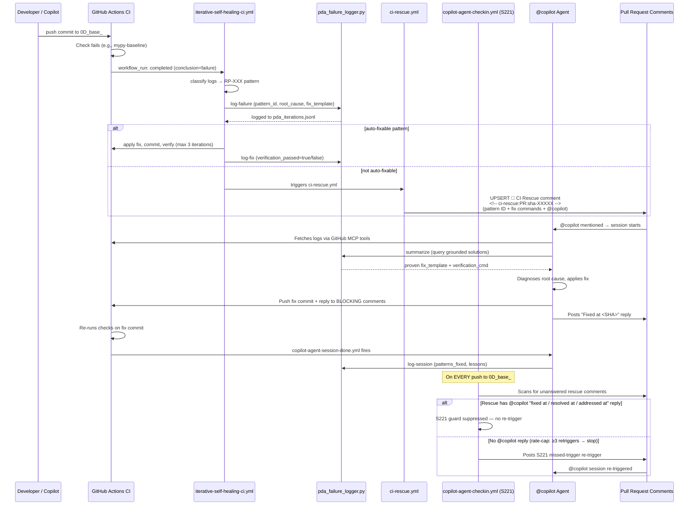
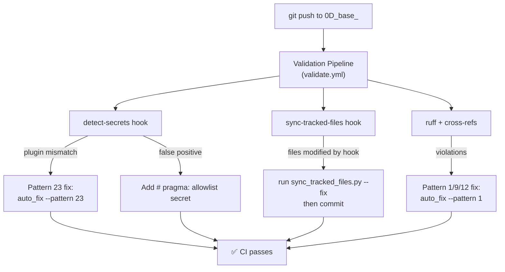
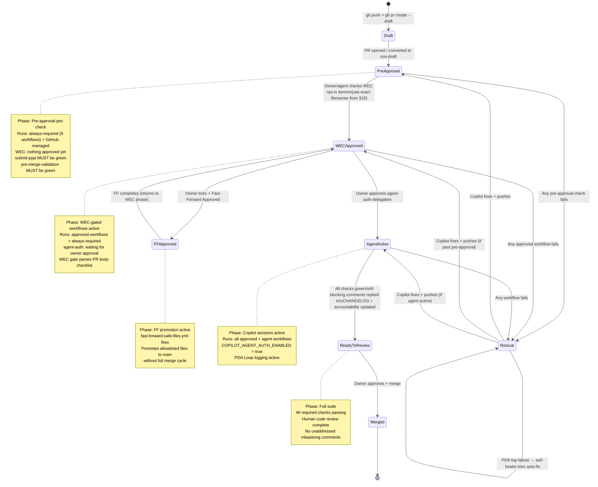
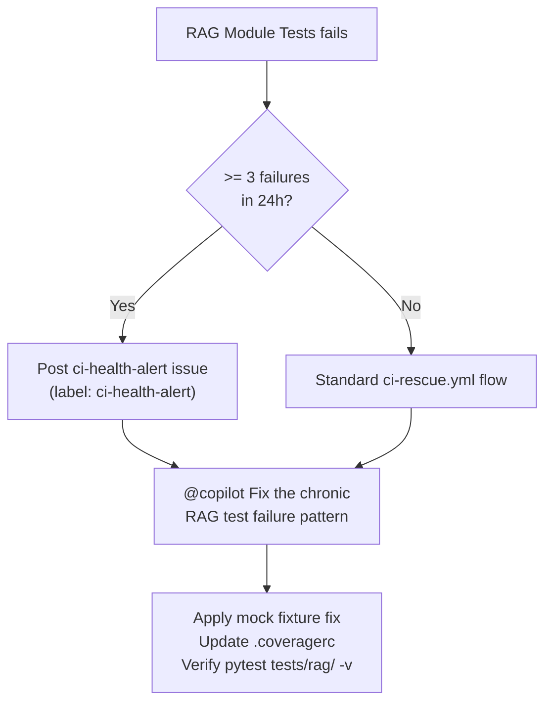
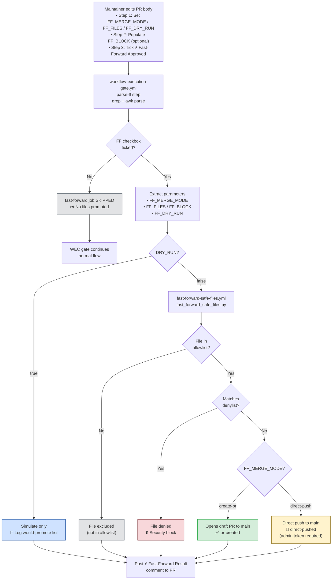
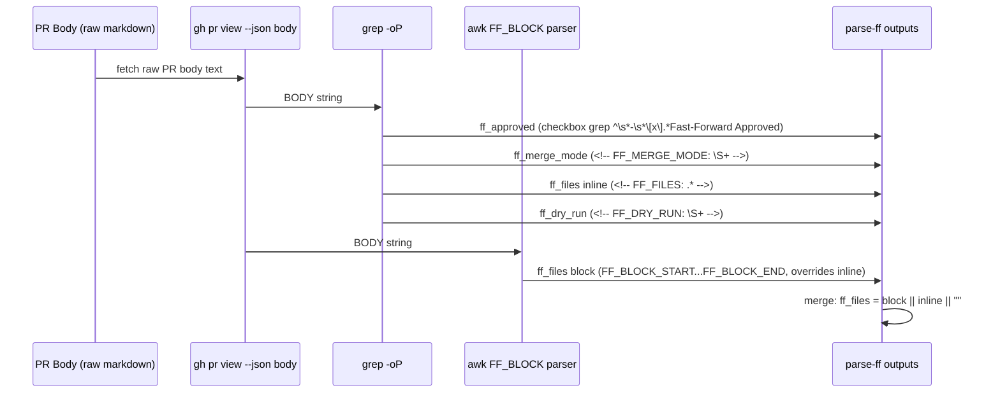
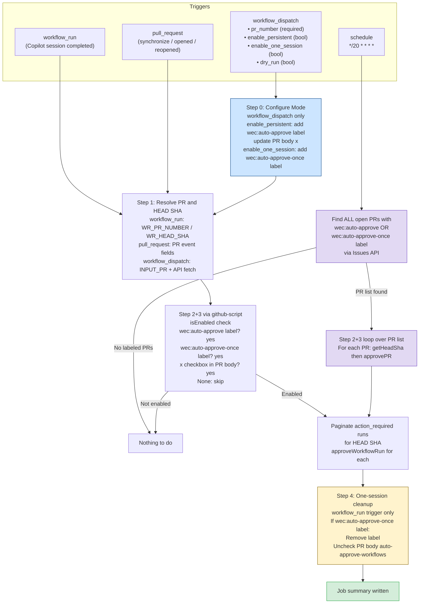

# PR Lifecycle — 0D_base_ Branch

> **Version:** 2.3.0  
> **Date:** 2026-04-06 (S302 — auto-approve-workflows schedule+dispatch overhaul; owner-flag protection; §24 added; §8/§14.1/§16.1/§23 updated)  
> **Previous:** 2.2.0 (S299 — WEC gate comment pagination fix; §14.1/§16.1/§23 aligned)  
> **Branch:** `0D_base_`  
> **Sources:** `.github/workflows/` inspection (60 PR-triggered workflows), CI log history, issue #3853 triage report (55 failures / 14 workflows, 2026-04-03)

This document describes the full expected lifecycle of a pull request on the `0D_base_` branch:
which workflows run, when Copilot sessions are triggered, what failures are expected vs unexpected,
and how the self-healing / rescue system responds.

---

## Table of Contents

1. [High-Level Lifecycle Overview](#1-high-level-lifecycle-overview)
2. [Workflow Trigger Map](#2-workflow-trigger-map)
3. [Pre-Approval Workflows (no token delegation required)](#3-pre-approval-workflows)
4. [Post-Approval Workflows (require `COPILOT_AGENT_AUTH_ENABLED`)](#4-post-approval-workflows)
5. [Copilot Session Startup Triggers](#5-copilot-session-startup-triggers)
6. [Expected Failing Checks (and why they fail)](#6-expected-failing-checks)
7. [Rescue & Self-Healing Chain](#7-rescue--self-healing-chain)
8. [Mermaid Lifecycle Diagram](#8-mermaid-lifecycle-diagram)
9. [Rescue Flow Diagram](#9-rescue-flow-diagram)
10. [Historical CI Log Cross-Reference](#10-historical-ci-log-cross-reference)
11. [WEC Checkbox-Gated Workflow Approval](#11-wec-checkbox-gated-workflow-approval)
12. [PR State Machine — Draft, Pre-Check, Open, Ready](#12-pr-state-machine)
13. [High-Frequency Failure Catalogue (from triage #3853)](#13-high-frequency-failure-catalogue)
14. [Copilot Session Automation Improvement Roadmap](#14-copilot-session-automation-improvement-roadmap)
15. [RAG Module Tests — Chronic Failure Pattern](#15-rag-module-tests--chronic-failure-pattern)
16. [`@copilot` Comment Budget & Rate-Limit Controls](#16-copilot-comment-budget--rate-limit-controls)
17. [PDA Loop + AfterMath — Failure Pattern Logging](#17-pda-loop--aftermath--failure-pattern-logging)
18. [WEC Workflow Catalog — Complete Reference](#18-wec-workflow-catalog--complete-reference)
19. [Fast-Forward Workflow Promotion](#19-fast-forward-workflow-promotion)
20. [Workflow Compliance Fixes (S293)](#20-workflow-compliance-fixes-s293)
21. [Session Automation Quick Reference](#21-session-automation-quick-reference)
22. [SHA-Digest Comment Architecture (S-3876)](#22-sha-digest-comment-architecture)
23. [WEC Trigger / Cancel Model (S-3876)](#23-wec-trigger--cancel-model)
24. [Auto-Approve Overhaul — Schedule, Labels & Owner Protection (S302)](#24-auto-approve-overhaul--schedule-labels--owner-protection-s302)
- [Appendix: Key Patterns](#appendix-key-patterns)
- [Appendix: Known Recurring CI Failure Patterns](#appendix-known-recurring-ci-failure-patterns)

---

## 1. High-Level Lifecycle Overview

```
Developer pushes commit to 0D_base_
         │
         ▼
┌────────────────────────────────┐
│  PHASE 1: Pre-Approval Checks  │  ← runs immediately on every push/PR
│  (no human approval required)  │
└────────────────────────────────┘
         │
         ▼ (all green OR rescue triggered)
┌────────────────────────────────┐
│  PHASE 2: Agent Token Gate     │  ← owner approves agent-auth-delegation
│  (owner approves once per PR)  │
└────────────────────────────────┘
         │
         ▼
┌────────────────────────────────┐
│  PHASE 3: Post-Approval Runs   │  ← full test suites, Copilot sessions
│  (COPILOT_AGENT_AUTH_ENABLED)  │
└────────────────────────────────┘
         │
         ▼
┌────────────────────────────────┐
│  PHASE 4: Merge Readiness      │  ← all required checks green, ready for merge
└────────────────────────────────┘
```

---

## 2. Workflow Trigger Map

There are **60 PR-triggered workflows** on `0D_base_`. The table below covers the most
significant ones. For the complete WEC-controlled catalog (all opt-in selectable workflows),
see [§18 WEC Workflow Catalog](#18-wec-workflow-catalog--complete-reference).

### 2.1 Always-Required Workflows (auto-run, never gated)

| Workflow | Trigger | WEC Role | Purpose |
|----------|---------|----------|---------|
| `pre-merge-validation.yml` | `pull_request`, `pull_request_review` | ✅ Always required | Ruff, line-length, auto-fix check gate |
| `comment-review-gate.yml` | `pull_request`, `pull_request_review`, `issue_comment` | ✅ Always required | Enforces §0 comment-reply policy |
| `deferral-language-gate.yml` | `pull_request` | ✅ Always required | Blocks forbidden deferral phrases |
| `agent-auth-delegation.yml` | `push`, `issue_comment`, `workflow_run` | ✅ Always required — owner approves | Delegates COPILOT_AGENT_AUTH_ENABLED token |
| `copilot-agent-checkin.yml` | `push` to `0D_base_` | ✅ Always required | S221 missed-trigger guard |
| `cost-gate.yml` | `workflow_call` | ✅ Always required | RED-tier cost governance gate |
| `copilot-agent-session-done.yml` | `workflow_run` | ✅ Always required | Session completion + S221 retrigger |
| `workflow-execution-gate.yml` | `workflow_dispatch`, `pull_request_review` | ✅ Always required | Parses WEC checklist + arms FF |
| `copilot-iterative-self-healing.yml` | `workflow_run`, `schedule`, `workflow_dispatch` | ✅ Always required | Self-healing escalation loop |

### 2.2 Validation & Testing Workflows (WEC opt-in)

| Workflow | Trigger | WEC Checkbox | Purpose |
|----------|---------|-------------|---------|
| `resilient_validation.yml` | `pull_request` | `resilient_validation.yml` | Full pytest suite (4 shards + integration + slow) |
| `nox_gates.yml` | `pull_request` | `nox_gates.yml` | Nox quality gates (ruff, mypy, coverage) |
| `validate.yml` | `pull_request`, `schedule` | `validate.yml` | Fast validation (ruff, detect-secrets, sync-tracked) |
| `mypy-baseline.yml` | `pull_request`, `push` | `mypy-baseline.yml` | Type-check anti-regression gate |
| `progressive-validation.yml` | `pull_request` | `progressive-validation.yml` | Progressive validation suite |
| `coverage-with-timeout.yml` | `pull_request` | `coverage-with-timeout.yml` | Coverage run with timeout guards |
| `test-rag.yml` | `pull_request` | `test-rag.yml` | RAG module tests |
| `pre-flight-validation.yml` | `pull_request`, `push` | `pre-flight-validation.yml` | Pre-flight CI validation |
| `ci-checkpoint-validation.yml` | `pull_request` | `ci-checkpoint-validation.yml` | CI checkpoint validation |
| `data-quality-suite.yml` | `pull_request` | `data-quality-suite.yml` | Data quality & determinism suite |

### 2.3 Security & Quality Workflows (WEC opt-in)

| Workflow | Trigger | WEC Checkbox | Purpose |
|----------|---------|-------------|---------|
| `security-scanning-suite.yml` | `pull_request` | `security-scanning-suite.yml` | Full security audit (bandit, pip-audit) |
| `codeql-analysis.yml` | `pull_request`, `push`, `schedule` | `codeql-analysis.yml` | CodeQL SAST analysis |
| `semgrep_sarif.yml` | `pull_request` | `semgrep_sarif.yml` | Semgrep SAST (SARIF upload) |
| `actionlint-audit.yml` | `pull_request`, `push` | `actionlint-audit.yml` | Workflow compliance audit (actionlint) |
| `auto-fix-common-issues.yml` | `pull_request`, `workflow_dispatch` | `auto-fix-common-issues.yml` | Auto-fix ruff/P22/P23 violations |
| `auto-fix-pr-check.yml` | `pull_request` | `auto-fix-pr-check.yml` | PR auto-fix check |
| `scan-secrets-variables.yml` | `pull_request` | `scan-secrets-variables.yml` | Secrets & variables scan |
| `code-quality-coverage-suite.yml` | `pull_request` | `code-quality-coverage-suite.yml` | Code quality & coverage suite |

### 2.4 Documentation Workflows (WEC opt-in)

| Workflow | Trigger | WEC Checkbox | Purpose |
|----------|---------|-------------|---------|
| `documentation-link-checker.yml` | `pull_request` | `documentation-link-checker.yml` | Broken link detection in docs/ |
| `pages-mkdocs.yml` | `pull_request`, `push` | `pages-mkdocs.yml` | MkDocs documentation build |
| `pages-pre-merge-validation.yml` | `pull_request` | `pages-pre-merge-validation.yml` | Pages pre-merge validation |

### 2.5 Automation & Agent Workflows (WEC opt-in)

| Workflow | Trigger | WEC Checkbox | Purpose |
|----------|---------|-------------|---------|
| `qa-walkthrough.yml` | `pull_request`, `workflow_dispatch` | `qa-walkthrough.yml` | QA walkthrough agent |
| `dependency-submission.yml` | `pull_request` | `dependency-submission.yml` | Resilient dependency submission |
| `reference-integrity.yml` | `pull_request`, `push` | `reference-integrity.yml` | Reference integrity + agent size gate |
| `root-org-validation.yml` | `pull_request`, `workflow_dispatch` | `root-org-validation.yml` | Root organization validation |
| `rust_swarm_ci.yml` | `pull_request`, `push` | `rust_swarm_ci.yml` | Rust-Python hybrid swarm CI/CD |
| `fast-forward-safe-files.yml` | `workflow_dispatch` | ⚡ FF checkbox (separate section) | Fast-forward safe files to `main` |

### 2.6 Auto-Triggered (not WEC-selectable)

These workflows run automatically on PR events and are not individually controlled via the WEC:

| Workflow | Trigger | Purpose |
|----------|---------|---------|
| `ci-rescue.yml` | `workflow_run` (on failure) | RCA comment posting |
| `iterative-self-healing-ci.yml` | `workflow_run` | Auto-fix + PDA Loop logging |
| `copilot-pr-session-injector.yml` | `pull_request` | Session context injection |
| `copilot-session-chain.yml` | `issue_comment`, `workflow_dispatch` | Session sequencing |
| `pr-cost-check.yml` | `pull_request` | PR cost estimate comment |
| `pr-followup-generator.yml` | `pull_request` | Follow-up prompt generation |
| `pr-size-analyzer.yml` | `pull_request` | PR diff size analysis |
| `labeler.yml` | `pull_request` | Label assignment |
| `comment-review-gate.yml` | `issue_comment` (self-retrigger guard) | Gate re-scan on new comments |
| `auto-approve-workflows.yml` | `workflow_run`, `pull_request`, **`schedule`** (`*/20 * * * *`), `workflow_dispatch` | Approves all `action_required` runs. Persistent via `wec:auto-approve` label; one-session via `wec:auto-approve-once`. Schedule sweeps ALL labeled PRs every 20 min. See §24. |

### 2.7 Discussion & Accountability Workflows (S297–S303)

These workflows manage GitHub Discussion context, accountability entries, and PR↔Discussion bridging:

| Workflow | Trigger | Purpose |
|----------|---------|---------|
| `discussion-cleanup.yml` | `workflow_dispatch`, `schedule` | Manifest-mode + direct-mode discussion dupe cleanup; uses CB App token for `discussions:write` (S302) |
| `discussion-response-bridge.yml` | `discussion_comment` | Bridges maintainer discussion replies back to the originating PR comment (RC-3, S300) |
| `post-accountability-to-discussion.yml` | `push` to `0D_base_`/`copilot/**`, `workflow_dispatch` | Posts accountability entries to Discussion #3673; uses CB App token (S303) |

---

## 3. Pre-Approval Workflows

These run **immediately** on every push or PR event, without any human approval:

### 3.1 `validate.yml` — Validation Pipeline (Fast Validation)

**Trigger:** `pull_request` (opened, synchronize, reopened)  
**Checks:**
- `pre-commit` hooks: end-of-file-fixer, detect-secrets, sync-tracked-files
- `ruff check` (import hygiene, linting)
- `python3 scripts/ci/sync_tracked_files.py --check` (P22 tracked-file drift)

**Expected to pass:** Always. Failures indicate import hygiene issues, secrets drift, or untracked file hash changes.

### 3.2 `mypy-baseline.yml` — mypy Anti-Regression Gate

**Trigger:** `pull_request` + `push`  
**Checks:**
- Runs `python scripts/ci/mypy_baseline.py --require-baseline`
- Compares current `src/` mypy error count against `.mypy_baseline`
- **FAILS** if `current_errors > baseline`

**Expected to pass:** Always. The baseline is set to the CI-environment count (isolated venv: `mypy>=1.8.0, types-PyYAML, types-requests` only).

> ⚠️ **Note on environment parity:** The CI venv does NOT install the full project. This means
> `# type: ignore` annotations that suppress errors from installed packages (pydantic, PyJWT,
> cryptography, etc.) appear as "unused" in CI. The `.mypy_baseline` MUST be set using the
> CI-isolated venv, not the local fully-installed environment.

### 3.3 `resilient_validation.yml` — Resilient Validation Suite

**Trigger:** `pull_request`  
**Checks:**
- 4 test shards: `pytest tests/ -m 'not slow and not integration'`
- Integration shard: `pytest tests/ -m integration`
- Slow shard: `pytest tests/ -m slow`

**Expected failures:** None after CI rescue. The import collection must succeed.
Known failure mode: `ModuleNotFoundError` during pytest collection (e.g., broken `__init__.py` imports — see P19-BATCH-WATCH-001).

---

## 4. Post-Approval Workflows

### 4.1 `agent-auth-delegation.yml` — Agent Token Delegation

**Trigger:** `push` to `0D_base_`, `issue_comment` containing `@copilot`, `workflow_run`  
**Gate:** **Owner must approve** in the GitHub Actions UI.

Once approved, this workflow:
1. Sets `COPILOT_AGENT_AUTH_ENABLED = true`
2. Sets `COGNITIVE_BRAIN_ALLOWED_ACTORS` repo variable
3. Posts `@copilot continue` comment to trigger next Copilot session

**Who can be delegated:** `copilot-swe-agent[bot]`, `github-copilot[bot]`, `github-actions[bot]`

---

## 5. Copilot Session Startup Triggers

Copilot sessions start when **any** of the following conditions are met:

| Trigger | Workflow | Comment Prefix |
|---------|----------|---------------|
| `@copilot <task>` in PR comment | `copilot-pr-session-injector.yml` | Immediate |
| `agent-auth-delegation.yml` completes | Posts `@copilot continue` | Post-approval |
| CI failure detected (rescue) | `ci-rescue.yml` → posts `@copilot Fix ...` | On failure |
| Missed-trigger guard fires | `copilot-agent-checkin.yml` → posts re-trigger | On push, if unanswered rescue |
| `copilot-session-chain.yml` dispatch | `workflow_dispatch` | Manual |

### Session Completion Protocol

When a Copilot session completes, `copilot-agent-session-done.yml` fires and:
1. Updates session metadata
2. Checks for outstanding rescue comments
3. If outstanding: posts a missed-trigger re-trigger (S221 guard)

The **S221 guard** (`copilot-agent-checkin.yml`) fires on every push to `0D_base_` and checks:
- Are there any unresolved rescue comments with no `@copilot` response?
- If yes: posts a re-trigger comment (rescue ID + SHA)

**To satisfy the S221 guard permanently for a rescue ID:** reply with `"Resolved at <SHA>"`,
`"Fixed at <SHA>"`, or `"Addressed at <SHA>"` in a `@copilot` comment after the rescue.

---

## 6. Expected Failing Checks

### 6.1 Checks That Are ALWAYS Expected to Pass

| Check | Why it must pass |
|-------|-----------------|
| `validate.yml / Fast Validation` | Import hygiene, no secrets drift |
| `mypy-baseline.yml / mypy Anti-Regression` | No new type errors introduced |
| `resilient_validation.yml` (all shards) | No test collection errors, no regressions |

### 6.2 Checks That May Show `action_required`

| Check | Expected Behavior |
|-------|------------------|
| `agent-auth-delegation.yml` | Shows `waiting for approval` until owner approves |
| Any environment-gated workflow | `action_required` = NOT a code failure — it's repo protection |

> From S242: `action_required` on ALL workflows for `0D_base_` is a **pre-existing repo
> environment protection** requiring human approval. This is NOT a code failure.

### 6.3 Known Flaky / Transient Failures

| Pattern | Root Cause | Action |
|---------|-----------|--------|
| `##[error]The runner has received a shutdown signal` | Transient GH runner infrastructure | Retry — no code fix needed |
| `ModuleNotFoundError: No module named 'services.crawler.X'` | P19 batch stripped try/except (P19-BATCH-WATCH-001) | Fix relative imports |
| `mypy regression: N errors > baseline B` | Baseline set with wrong environment | Re-run `mypy_baseline.py --update` in isolated venv |

---

## 7. Rescue & Self-Healing Chain

### 7.1 Approval Tier Model (CRITICAL — Read First)

There are **two tiers** of rescue workflows. Understanding this distinction is essential:

| Tier | Trigger Type | Approval Required? | Reliability |
|------|--------------|--------------------|-------------|
| **Tier 1 — Approval-Free** | `pull_request` event | ❌ None | ✅ Always fires |
| **Tier 2 — Approval-Gated** | `workflow_run` event with `contents: write` | ✅ Human must approve | ⚠️ May queue in `action_required` |

**Tier 1 workflows (reliably fire on every push/PR):**
- `validate.yml` → `rescue-comment` job: posts SHA-scoped `<!-- ci-rescue-sha:{pr}:{sha} -->` comment with `@copilot` instructions + PDA Loop log
- `actionlint-audit.yml` → inline rescue step + `rescue-comment` job: posts actionlint-specific fix guidance  
- `comment-review-gate.yml` → inline scan and block
- `test-rag.yml` → `rescue-comment` job: posts RAG-specific fix guidance

**Tier 2 workflows (fire ONLY after human approves the `workflow_run` run):**
- `ci-rescue.yml`: deep root-cause analysis, RP-pattern matching
- `iterative-self-healing-ci.yml`: autonomous fix + push loop
- `copilot-iterative-self-healing.yml`: `@copilot` escalation

> **S292 Root Cause Finding:** Automation appeared to "stop working" because 14+ `workflow_run`-triggered runs were queued in `action_required` state. The Tier 1 rescue-comment jobs (`validate.yml`, `test-rag.yml`, `actionlint-audit.yml`) were always firing — they just posted comments that were easy to miss (pre-S290 per-PR thread, or posted as `github-actions[bot]` when `CODEX_MASTER_KEY` expired). After S290, SHA-scoped comments make each failure visible. After S293, `actionlint-audit.yml` inline step explicitly sets `github-token: CODEX_MASTER_KEY`. To restore Tier 2 automation, approve the queued `workflow_run` runs in the Actions tab.

### 7.1.1 Rescue Comment Identity Requirement (S293)

**Rescue comments MUST be posted as `@mbaetiong`** (not `github-actions[bot]`) for the
Copilot Coding Agent to pick them up. GitHub Copilot only responds to `@copilot` mentions
made by human users — comments from `github-actions[bot]` are silently ignored.

**Token chain (all rescue-comment jobs must use this priority order):**

```yaml
# For actions/github-script@v8 steps:
github-token: ${{ secrets.CODEX_MASTER_KEY || secrets.CODEX_BACKUP_KEY || secrets.GITHUB_TOKEN }}

# For shell/Python steps using GH_TOKEN:
GH_TOKEN: ${{ secrets.CODEX_MASTER_KEY || secrets.CODEX_BACKUP_KEY || github.token }}
```

| Secret | Owner | Purpose |
|--------|-------|---------|
| `CODEX_MASTER_KEY` | `@mbaetiong` PAT | Primary — comments post as `mbaetiong` |
| `CODEX_BACKUP_KEY` | `@mbaetiong` PAT | Fallback if primary expires |
| `GITHUB_TOKEN` / `github.token` | `github-actions[bot]` | Last resort — Copilot will NOT see this |

> **S293 Bug Fix:** `actionlint-audit.yml`'s inline `actions/github-script@v8` rescue step was
> not passing `github-token`, causing it to use the default `github.token` (= `github-actions[bot]`).
> Fixed by explicitly setting `github-token: ${{ secrets.CODEX_MASTER_KEY || ... }}`.
> **All rescue-comment steps using `actions/github-script@v8` MUST pass `github-token` explicitly.**

**When `CODEX_MASTER_KEY` expires:** All rescue comments fall back to `github-actions[bot]` and
Copilot sessions stop auto-triggering. Admin action required: rotate the `CODEX_MASTER_KEY` secret
with a fresh `@mbaetiong` PAT with `repo` + `write:discussion` scope.

> **S302–S303 (CB GitHub App Token):** `discussion-cleanup.yml` and
> `post-accountability-to-discussion.yml` now use the **Cognitive Brain GitHub App token**
> (`secrets.CODEX_CB_APP_TOKEN` + `secrets.CODEX_CB_APP_INSTALLATION_ID`) rather than
> `CODEX_MASTER_KEY` for `discussions:write` operations. This provides a durable,
> installation-scoped token that does not expire with the PAT rotation cycle.  
> Affected workflows: `discussion-cleanup.yml` (S302), `post-accountability-to-discussion.yml` (S303).

### 7.1.2 Rescue Comment Format — Collapsed Sections (S295)

All rescue and quality-findings comments use `<details>`/`<summary>` HTML to collapse
every per-failure section below the H2 headline. This keeps the PR clean and scannable:

```markdown
## 🚨 CI Rescue — @copilot Fix Required

**Branch:** `0D_base_` | **Commit:** `abc123def456`

@copilot One or more checks are failing...

<details><summary>📋 Steps to resolve</summary>

1. Load `.codex/CODEBASE_AGENCY_POLICY.md` ...
...
</details>

---

<details><summary>🔴 `Auto-Fix Common Issues` — 2026-04-03T08:20Z · Run #23939535263</summary>

@copilot **Auto-Fix Common Issues** failed on commit `abc123def456`...

</details>

---

<!-- ci-code-quality:abc123def456:3 -->
<details><summary>🔵 `github-code-quality` — 3 alert(s) · 2026-04-03T08:37Z</summary>

- **unused-global-variable** · `scripts/ci/migrate_rescue_comments.py:90` — ... ([view](#))
...
</details>
```

**Rules:**
- `## 🚨` H2 headline — always visible (never collapsed)
- Each `### 🔴` workflow failure — wrapped in `<details open=false>`  
- Code-quality alerts — appended by `append-code-quality-to-rescue` job (see §14.4)
- Steps-to-resolve — collapsed with `📋 Steps to resolve` summary

### 7.2 Rescue Cascade (when all tiers are active)

```
0. [ALWAYS-FIRST] Run pre-session briefing (P6-B — S297)
   - python scripts/ci/pre_session_context.py --repo Aries-Serpent/_codex_ --pr <N>
   - §A: workflow status + ETAs on HEAD SHA (failing checks flagged 🔴, near-done 🔔)
   - §B: blocking PR comments (unaddressed, from mbaetiong / CI bots)
   - §C: log snippets from first failed job
   - §D: action queue (ordered list of what to fix now)
   - §E: end-of-session skills checklist
         │
         ▼
1. CHECK FAILS (e.g., validate.yml, test-rag.yml)
         │
         ▼
2. [TIER 1] validate.yml → rescue-comment job fires immediately
   - SHA-scoped marker: <!-- ci-rescue-sha:{pr}:{sha_short} -->
   - One fresh comment per commit SHA (never buries in old thread)
   - PDA Loop: logs failure to .codex/aftermath/pda_iterations.jsonl
   - Posts @copilot instructions with specific fix steps
         │
         ▼
3. [TIER 2 — needs approval] ci-rescue.yml fires
   - Deep RCA using ci_health_analyzer skill
   - Matches against RP-XXX pattern library (22 patterns as of S292)
   - Posts <!-- ci-rescue:{pr}:sha-{sha} --> comment
         │
         ▼
4. [TIER 2 — needs approval] iterative-self-healing-ci.yml fires
   - Up to 3 auto-fix iterations (ruff, EOF, detect-secrets, mypy)
   - Commits and pushes fixes back to branch
   - Per-branch hourly cap ≥10 runs/hr (cascade brake from S283)
   - PDA Loop: logs pattern + fix outcome
         │
         ▼
5. [If Tier 2 unfixable] iterative-self-healing-ci.yml `escalate` job (S298)
   - Pattern = 'unknown' / 'self-healing' / ''
   - Calls post_rescue_comment.py → APPENDS to the existing
     <!-- ci-rescue-sha:{pr}:{sha} --> thread on the PR (no new comment)
   - Dedup is handled by the shared SHA marker (no 30-min standalone guard)
         │
         ▼
6. Copilot session triggered
   - Agent reads rescue comment, investigates CI logs
   - Agent applies fix, pushes commit
         │
         ▼
7. copilot-agent-session-done.yml + S221 guard
   - Marks rescue resolved if @copilot response contains "fixed at <SHA>"
   - S221 guard (copilot-agent-checkin.yml) re-triggers on next push if unresolved
```

### 7.3 Rescue Patterns (RP-XXX) — 22 patterns as of S292

See `.codex/aftermath/failure_pattern_solutions.yaml` for full library.

| Pattern | Failure Type | Fix |
|---------|-------------|-----|
| `RP-006` | Missing EOF newline in `.codex/` JSON files | `find .codex -name '*.json' | xargs -I{} sh -c 'tail -c1 "$1" \| grep -q . && echo >> "$1"' _ {}` |
| `RP-007` | detect-secrets baseline stale | `python3 -m detect_secrets scan --no-verify --baseline .secrets.baseline` |
| `RP-009` | mypy anti-regression gate exceeded baseline | Fix type errors; run `python scripts/ci/mypy_baseline.py --require-baseline` |
| `RP-019` | `from src.` import regression | Run P19-BATCH-001 |
| `RP-MYPY-UNUSED-IGNORE` | Stale `# type: ignore` comment | Remove the suppression comment |
| `RP-MYPY-OPT-IMPORT` | Optional-import `[assignment]` | Fix stub assignment pattern |
| `RP-SELF-HEALING-CASCADE` | Self-healing loop triggered >10×/hr | 30-min cooldown; check cascade brake |
| `RP-VALIDATION-PIPELINE` | Fast validation pre-commit hook failure | `python tools/validate.py --mode fast` |
| (transient) | Runner shutdown | Retry — no code fix |

---

## 8. Mermaid Lifecycle Diagram

```mermaid
flowchart TD
    A[Developer pushes commit] --> B{PR Exists?}
    B -->|No| C[Open PR]
    B -->|Yes| D[Sync push to existing PR]
    C --> PRE
    D --> PRE

    subgraph PRE ["Phase 0 — Always-Required (every push, no gate)"]
        direction LR
        PRE1[pre-merge-validation.yml]
        PRE2[comment-review-gate.yml]
        PRE3[deferral-language-gate.yml]
        PRE4[copilot-agent-checkin.yml\n S221 guard]
    end

    PRE --> E
    subgraph PHASE1 ["Phase 1 — Pre-Approval Checks"]
        E[validate.yml / Fast Validation] --> F{Pass?}
        G[mypy-baseline.yml] --> H{Pass?}
        I[resilient_validation.yml shards ×6] --> J{Pass?}
    end

    F -->|Fail| K[ci-rescue.yml posts 🚨 rescue comment\n+ PDA Loop log-failure]
    H -->|Fail| K
    J -->|Fail| K
    K --> L[@copilot Fix Required comment]
    L --> M[Copilot session starts]
    M --> N[Agent fixes code + pushes\n+ replies to blocking comments]
    N --> A

    F -->|Pass| WEC
    H -->|Pass| WEC
    J -->|Pass| WEC

    subgraph WEC ["Phase 2 — WEC Gate: Opt-In Workflow Selection"]
        direction TB
        WEC1["Owner/agent checks WEC items\n(resilient_validation · nox_gates\nmypy-baseline · codeql · security\ndocs-build · qa-walkthrough …)"]
        WEC2[workflow-execution-gate.yml\nparses PR body checklist]
        WEC1 --> WEC2
        WEC2 --> WEC3{FF checkbox\nticked?}
        WEC3 -->|Yes| FF["⚡ fast-forward-safe-files.yml\nPromotes safe files to main"]
        WEC3 -->|No| SKIP_FF[FF job skipped]
        WEC2 --> WECPROT{Bot reset\nowner flag?}
        WECPROT -->|Yes — restores| RESTORE["🛡️ WEC gate rewrites PR body\n[x] auto-approve-workflows\nrestored + wec:auto-approve\nlabel added"]
        WECPROT -->|No change| WECOK[Flags preserved]
    end

    WEC2 --> O
    subgraph PHASE2 ["Phase 3 — Token Delegation Gate"]
        O[agent-auth-delegation.yml] --> P{Owner\nApproves?}
    end

    P -->|Pending| Q[action_required status\n— NOT a code failure]
    P -->|Approved| R[COPILOT_AGENT_AUTH_ENABLED = true]
    R --> S[@copilot continue posted]
    S --> T[Copilot session — next phase tasks]

    subgraph PHASE3 ["Phase 4 — Post-Approval Agent Sessions"]
        T --> U[Agent completes tasks\n• update CHANGELOG\n• update accountability report\n• reply to ALL blocking comments]
        U --> V[copilot-agent-session-done.yml\n• verify rescues answered\n• S221 guard on next push]
    end

    V --> AAWRUN["⚡ auto-approve-workflows.yml\nfires on workflow_run\n• Approves all action_required\n• One-session: removes\n  wec:auto-approve-once label"]

    subgraph SCHED ["⏰ Schedule Sweep (every 20 min — independent of pushes)"]
        SCHED1["auto-approve-workflows.yml\nschedule: */20 * * * *"]
        SCHED2["Finds ALL open PRs with\nwec:auto-approve OR\nwec:auto-approve-once label"]
        SCHED3["For each PR: approve all\naction_required runs\nfor HEAD SHA"]
        SCHED1 --> SCHED2 --> SCHED3
    end

    AAWRUN --> W{Rescue\nanswered?}
    W -->|No| X[S221 guard fires\non next push]
    X --> L
    W -->|Yes| Y[Ready for Review\n🟢 all checks green]
    Y --> Z[Owner approves + Merge]

    style FF fill:#d4edda,stroke:#28a745
    style RESTORE fill:#cce5ff,stroke:#004085
    style AAWRUN fill:#d4edda,stroke:#28a745
    style SCHED fill:#e2d9f3,stroke:#6f42c1
    style SCHED1 fill:#e2d9f3,stroke:#6f42c1
    style SCHED2 fill:#e2d9f3,stroke:#6f42c1
    style SCHED3 fill:#e2d9f3,stroke:#6f42c1
    style Q fill:#fff3cd,stroke:#856404
    style K fill:#f8d7da,stroke:#721c24
```

---

## 9. Rescue Flow Diagram



---

## 10. Historical CI Log Cross-Reference

The following CI runs on this PR are referenced throughout this document and in session notes:

| Run ID | Workflow | Commit | Result | Root Cause | Fixed By |
|--------|----------|--------|--------|-----------|---------|
| [23689574622](https://github.com/Aries-Serpent/_codex_/actions/runs/23689574622) | mypy Baseline Gate | `77d4ec89` | ❌ FAIL (345 > 333) | S137 P19 batch broke `crawler/__init__.py` try/except | S139 `a12f5e2` |
| [23689574640](https://github.com/Aries-Serpent/_codex_/actions/runs/23689574640) | Agent Auth Delegation | `77d4ec89` | ❌ FAIL | Auth delegation pending approval | Human approval |
| [23689574652](https://github.com/Aries-Serpent/_codex_/actions/runs/23689574652) | Validation Pipeline | `77d4ec89` | ❌ FAIL | Same crawler import error (collection failure) | S139 `a12f5e2` |
| [23689574653](https://github.com/Aries-Serpent/_codex_/actions/runs/23689574653) | Resilient Validation Suite | `77d4ec89` | ❌ FAIL (7 jobs) | Same crawler import error | S139 `a12f5e2` |
| [23691793298](https://github.com/Aries-Serpent/_codex_/actions/runs/23691793298) | Agent Auth Delegation | — | ✅ PASS | Owner approved token delegation | N/A |
| [23691951388](https://github.com/Aries-Serpent/_codex_/actions/runs/23691951388) | mypy Baseline Gate | `2293b9af` | ❌ FAIL (342 > 306) | Baseline incorrectly lowered to 306 (local env), CI env sees 342 | S141 this PR |
| [23691951400](https://github.com/Aries-Serpent/_codex_/actions/runs/23691951400) | Validation Pipeline | `2293b9af` | ❌ FAIL | Same baseline mismatch | S141 this PR |
| [23691951433](https://github.com/Aries-Serpent/_codex_/actions/runs/23691951433) | Resilient Validation Suite | `2293b9af` | ❌ FAIL | Same baseline mismatch | S141 this PR |
| [23692231532](https://github.com/Aries-Serpent/_codex_/actions/runs/23692231532) | mypy Baseline Gate | `a12f5e29` | ❌ FAIL (342 > 306) | Baseline still at 306; P19 src-import changes added 9 new CI errors | S141 this PR |
| [23692231503](https://github.com/Aries-Serpent/_codex_/actions/runs/23692231503) | Validation Pipeline | `a12f5e29` | ❌ FAIL | Same baseline issue | S141 this PR |
| [23692231510](https://github.com/Aries-Serpent/_codex_/actions/runs/23692231510) | Resilient Validation Suite (slow) | `a12f5e29` | ❌ FAIL | Same baseline issue | S141 this PR |

### Root Cause Analysis: mypy Baseline Mismatch (S139→S141)

The S139 session correctly fixed the `crawler/__init__.py` import regression (which caused
7 CI jobs to fail with `ModuleNotFoundError`). However, it then updated `.mypy_baseline` to
`306` using the **local fully-installed environment** rather than the **CI isolated venv**.

- Local env (all packages installed): mypy reports **306** errors
- CI isolated venv (only `mypy>=1.8.0, types-PyYAML, types-requests`): mypy reports **333** errors

The **27-error gap** between CI and local is caused by `warn_unused_ignores = True` in `mypy.ini`:
- With packages installed locally, `# type: ignore` annotations suppress real type errors → no
  `unused-ignore` warning
- In CI without packages, imports are silently ignored → `# type: ignore` is redundant →
  `unused-ignore` warning (+27 errors)

S141 additionally fixed 9 errors introduced by the P19 src-import backfill:

| File | Error | Root Cause | Fix Applied |
|------|-------|-----------|-------------|
| `src/codex/zendesk/agent.py` | `Module "tools" has no attribute "ToolRegistry"` | Root `./tools/__init__.py` shadows `src/tools/` | Reverted to `from src.tools import` |
| `src/codex_ml/tokenization/train_tokenizer.py` | `Variable "..." not valid as type` | Module attribute alias not recognized as type | Explicit `from tokenization.train_tokenizer import TrainTokenizerConfig as TrainTokenizerConfig` |
| `src/codex/zendesk/monitoring/mcp_bridge.py` | Unused `# type: ignore[arg-type]` (×4) | `mcp.*` now resolvable; `set_gauge(float)` is correct | Removed redundant `# type: ignore` |
| `src/mcp/server/jsonrpc_adapter.py` | Unused `# type: ignore[return-value]` | `BackendAdapter` now resolvable, no return mismatch | Removed redundant `# type: ignore` |

Baseline was then reset to **333** using the CI isolated venv to ensure parity.

---

## Appendix: Key Patterns

| Pattern ID | Description | Reference |
|-----------|-------------|-----------|
| P19-BATCH-001 | After stripping `src.` prefix, run `ruff check --fix` for import sort (I001) | S137 |
| P19-BATCH-WATCH-001 | Never strip `src.` from `try/except ImportError` blocks without verifying branches remain different; use relative imports instead | S139 |
| P19-SHADOW-EXPANDED-001 | Root-level `__init__.py` shadows (training, utils, models, services, etc.) must retain `from src.X` imports. Always check `ls <pkg>/__init__.py` at REPO_ROOT before de-src-ifying | S144 |
| P19-SHADOW-REVERT-001 | When a de-src-ified import silently resolves to the wrong root-level shadow, revert to `from src.X` form. The shadow intercepts before `sys.path` src/ entry is reached | S145 |
| P21 | GitHub Actions Node.js 20 version deadline: 2026-06-02 | S135-S136 |
| P22 | Tracked file sync drift: run `sync_tracked_files.py --fix` when `CODEX_MANIFEST.json` changes | S138 |
| P23 | `detect-secrets` baseline plugin mismatch: `.secrets.baseline` generated with newer detect-secrets version causes `TypeError: No such <plugin>` in CI. Fix: `python scripts/ci/auto_fix_common_issues.py --pattern 23` | S145 |
| SECRET-PRAGMA-001 | `# pragma: allowlist secret` for detect-secrets false positives (demo keys, dev placeholders, pattern variables). Run `python3 -m detect_secrets scan <file>` to verify suppression | S143 |
| FP-ACTOR-SKIP-001 | S221 missed-trigger AND incomplete-session guards must skip when `context.actor ∈ {copilot-swe-agent[bot], github-copilot[bot], copilot[bot]}` | S144 |
| FP-PREAPPROVAL-001 | All bot-posted `@copilot` comments embed pre-authorization notice to prevent duplicate approval gates | S144 |
| FP-SAFETYCAP-001 | S221 guard safety cap ≥3 retriggers per rescue ID prevents infinite loops | S144 |
| §ARLOOP | When a rescue is already addressed, reply `"Resolved at <SHA>"` to suppress S221 re-triggers | S242-S243 |
| `RP-009` | mypy anti-regression gate exceeded baseline (too many errors) | ci-rescue.yml |
| `GH013` | Branch ruleset violation: Copilot agent token lacks bypass → owner must add agent to bypass list | S244 |

---

## Appendix: Known Recurring CI Failure Patterns (from issue #3737)

These patterns appear repeatedly in CI triage reports. Each has a documented fix path:

| Workflow | Failure Step | Pattern | Fix |
|----------|-------------|---------|-----|
| Validation Pipeline / Fast Validation | `detect-secrets` hook `TypeError: No such GitLabTokenDetector` | P23 (plugin mismatch) | `python scripts/ci/auto_fix_common_issues.py --pattern 23` |
| Validation Pipeline / Fast Validation | `sync-tracked-files: files were modified by hook` | P22 (tracked file drift) | `python scripts/ci/sync_tracked_files.py --fix && git add -A && git commit` |
| agent-auth-delegation / Cognitive Pre-flight | `Verify CHANGELOG.md updated in last commit` | CHANGELOG gate | Add `### Fixed (SN)` entry to `## [Unreleased]` in `CHANGELOG.md` before committing |
| mypy Baseline Gate | `Fail if regression detected` | `.mypy_baseline` stale | Update with CI isolated-venv per P19-ENV-001 |
| Resilient Validation Suite / Sharded tests | `startup_failure` (no error log) | Pre-existing infra | Runner never starts for Data Quality/Progressive Validation/Rust-Python — not a code failure |
| Agent Token Delegation | `action_required` on all checks | `agent-auth-delegation` environment gate | Owner clicks "Approve" at the Actions URL — needed once per approval cycle |
| Copilot Issue Triage | `Analyze issue with GitHub Copilot` fails | API/CLI invocation error | Infrastructure issue — not code-fixable; retries usually succeed |
| Embedding Index Rebuild | `Commit updated index metadata` | Push permissions | `CODEX_MASTER_KEY` needed for push; falls back to `CODEX_BACKUP_KEY` |



---

## 11. WEC Checkbox-Gated Workflow Approval

The **Workflow Execution Checklist (WEC)** is a markdown checklist embedded in every PR body.
It controls which GitHub Actions workflows are permitted to run via the `workflow-execution-gate.yml`
gate. This section explains how the gate works, how it differs from GitHub's native required-checks
system, and what the pre-approval phase looks like.

### 11.1 What is the WEC?

The WEC block lives at the bottom of every PR description:

```markdown
## 🔄 Workflow Execution Checklist

### ✅ Validation & Testing
- [x] pre-merge-validation.yml — Pre-merge checks (always required)
- [ ] resilient_validation.yml — Resilient validation
- [ ] mypy-baseline.yml — Type-check anti-regression
```

> ⚠️ **Filename accuracy is mandatory.** The WEC gate parses `\S+\.yml` tokens.
> `resilient-validation-suite.yml` will NOT match `resilient_validation.yml` —
> use the **exact** filename (underscores not hyphens where the file uses underscores).
> See [§18](#18-wec-workflow-catalog--complete-reference) for the authoritative filename list.

- **`[x]` (checked)** = workflow is APPROVED to run
- **`[ ]` (unchecked)** = workflow is NOT YET approved; gate returns `skip` when the workflow checks in
- **`always required`** items must be `[x]` in every PR body update; the HARDENED AGENT INSTRUCTION enforces this

The `workflow-execution-gate.yml` workflow parses this checklist on every `pull_request_review`
approval or `workflow_dispatch`. Workflows that implement the WEC gate-check step exit early
(`skip=true`) when their checkbox is unchecked.

### 11.2 Pre-Approval Phase (no workflows checked yet)

When a PR is first opened and no workflows have been checked in the WEC, the PR is in
**pre-approval pre-check status**. In this phase:

| Category | Behaviour |
|----------|-----------|
| **Always-required workflows** | Run automatically (pre-merge-validation, comment-review-gate, deferral-language-gate, agent-auth-delegation, copilot-agent-checkin, cost-gate, copilot-agent-session-done, workflow-execution-gate, copilot-iterative-self-healing) |
| **Gated opt-in workflows** | Do NOT run — the gate returns `skip` |
| **GitHub-managed workflows** | Run regardless of WEC (e.g. `Automatic Dependency Submission (Python)`) |

#### Pre-approval requirements

The following checks MUST be green before any WEC items are approved:

| Workflow / Job | Why it must pass unconditionally |
|----------------|----------------------------------|
| `Automatic Dependency Submission (Python)` ← `dynamic / submit-pypi` | GitHub-managed supply-chain check. Transient API failure (HTTP 503) is the only acceptable reason for a red; re-run resolves it. |
| `Resilient Dependency Submission` (`dependency-submission.yml`) | Our retry-wrapped replacement. Must pass with all green. |
| `Validation Pipeline / Fast Validation` (`validate.yml`) | detect-secrets, ruff, sync-tracked-files. All must pass. |
| `mypy Baseline Gate` (`mypy-baseline.yml`) | No new type errors vs baseline. Must pass. |
| `deferral-language-gate.yml` | No forbidden deferral phrases in changed files. Must pass. |
| `pre-merge-validation.yml` | Ruff, line-length, auto-fix check. Must pass. |

> ⚠️ **Important:** `dynamic / submit-pypi (dynamic)` is GitHub's own automatic dependency
> graph workflow. It runs unconditionally on every push and pull_request event to `0D_base_`.
> If it fails, self-healing MUST be triggered immediately (see [§11.5](#115-self-healing-for-pre-approval-failures)).

### 11.3 Approving Workflows (checking the WEC)

To approve a workflow, the PR author or a Copilot agent **checks its checkbox** in the PR body
and pushes an update. The `workflow-execution-gate.yml` gate re-parses the checklist on the next
push and enables the newly approved workflow.

**Typical approval sequence:**

```
1. Open PR (pre-approval — only always-required workflows run)
         ↓
2. Pre-approval checks green → check resilient_validation.yml, mypy-baseline.yml,
   security-scanning-suite.yml in WEC (use exact filenames — see §18)
         ↓
3. Push PR body update → workflow-execution-gate re-parses → approved workflows now run
         ↓
4. All approved workflows green → owner approves agent-auth-delegation
         ↓
5. Copilot sessions start → code changes → repeat from step 1 for new checks
```

> ⚠️ **HARDENED AGENT RULE:** Once an item is checked `[x]`, it MUST NEVER be unchecked
> by a subsequent PR body update. The Copilot agent reads the CURRENT PR body and copies
> all `[x]` items verbatim into the updated body. Only newly-added items may be set to `[ ]`.

### 11.4 Draft vs Open vs Ready-to-Review PR States

| State | GitHub Label | WEC Gate | Copilot Sessions | Required Checks |
|-------|-------------|----------|-----------------|----------------|
| **Draft** | `[Draft]` badge | Pre-approval phase | Not started | Only always-required run |
| **Open (pre-check)** | No badge; `Open` | Pre-approval until WEC items checked | Not started | Always-required + GitHub-managed |
| **Open (WEC approved)** | `Open` | Specific workflows approved via WEC | Active after agent-auth | All approved workflows + required |
| **Open (FF approved)** | `Open` | ⚡ FF checkbox ticked + WEC items checked | Active | FF job fires; files promoted to main |
| **Ready to review** | `[Open]` (after clicking "Ready for review") | All WEC workflows may run | Post-approval active | Full suite |

**Key difference between Draft and Open:**

- **Draft PR**: GitHub suppresses required-check enforcement. Auto-merge is not available.
  CI still runs, but PRs cannot be merged in draft state.
- **Open PR (pre-approval)**: Required checks are enforced. The WEC gate has not yet approved
  any gated workflows. The `agent-auth-delegation` environment protection still shows
  `action_required` (waiting for owner approval).
- **Open PR (WEC approved)**: Gated workflows are enabled by the WEC. Agent token delegation
  may be active. Copilot sessions are running.
- **Ready to review** (flipping from Draft to Open): This is the UI toggle that changes
  the PR from Draft to Open state. In this codebase, PRs are usually opened directly as
  non-draft so this transition is rare. When it does occur, CI re-evaluates all required checks.

### 11.5 Self-Healing for Pre-Approval Failures

Any failure during the pre-approval phase (including `dynamic / submit-pypi`) triggers the
self-healing cascade:

```
1. Workflow fails (any name, including GitHub-managed)
         ↓
2. iterative-self-healing-ci.yml fires (workflows: ["*"], cancel-in-progress: false)
   → classifies failure → attempts auto-fix (1-3 iterations)
         ↓ (if not auto-fixable)
3. copilot-iterative-self-healing.yml fires (extended watch list)
   → posts @copilot escalation comment on PR, SHA-scoped upsert marker
         ↓ (subsequent failures on same SHA)
4. Additional failures UPSERT to the SAME comment (same SHA marker) rather than
   creating new comments — prevents comment flooding
         ↓
5. ci-rescue.yml fires for watched workflows
   → posts structured RCA comment with fix commands
         ↓
6. Copilot coding agent session starts → diagnoses → fixes → pushes
```

**The upsert marker** ensures one canonical escalation comment per commit SHA per category.
Format: `<!-- copilot-healing:<sha12>:<category> -->` where `<sha12>` is the first 12 characters of the commit SHA.
If the same SHA produces multiple failures of the same category, the comment is updated in-place.

**Why `cancel-in-progress: false` matters:** (fixed in S279)
The original `iterative-self-healing-ci.yml` used `cancel-in-progress: true`, which meant that
when workflow B failed shortly after workflow A failed (both triggering the self-healer), the
self-healer run for A would be *cancelled* by the run triggered by B. This caused the first
failure's escalation comment to never be posted. The fix uses a run-ID-unique concurrency group
so every failure gets its own non-cancellable self-healer run.

### 11.6 Dependency Submission Failures — Classification

`dynamic / submit-pypi (dynamic)` failures fall into two categories:

| Root Cause | Evidence | Fix |
|-----------|---------|-----|
| Transient GitHub API 503 | Log: `"An error occurred while processing your request. Please try again later."` | Re-run the workflow — no code change needed |
| Missing/malformed requirements | Log: `ComponentDetector: No components found` or package parse error | Fix `pyproject.toml` / `requirements*.txt` before proceeding |

Our `Resilient Dependency Submission` workflow wraps the submission with retry logic and
`continue-on-error` specifically for the 503 case (root cause documented in S154). If both
the GitHub-managed workflow AND our custom one fail on non-503 errors, a code fix is required.

---

## 12. PR State Machine



### Phase Comparison Table

| Attribute | Draft | Pre-Approval | WEC Approved | FF Approved | Agent Active | Ready to Review |
|-----------|-------|-------------|--------------|-------------|-------------|----------------|
| GitHub PR state | draft | open | open | open | open | open |
| Can be merged | ❌ | ❌ | ❌ (checks pending) | ❌ | ❌ (until all green) | ✅ owner approval |
| Always-required workflows (9) | ✅ | ✅ | ✅ | ✅ | ✅ | ✅ |
| GitHub-managed workflows | ✅ | ✅ | ✅ | ✅ | ✅ | ✅ |
| WEC opt-in workflows | ❌ | ❌ | ✅ (checked only) | ✅ (checked) | ✅ (all checked) | ✅ |
| ⚡ FF promotion fires | ❌ | ❌ | ❌ | ✅ | ✅ if ticked | ✅ if ticked |
| Copilot sessions active | ❌ | ❌ | ❌ | ❌ | ✅ | ✅ |
| `agent-auth-delegation` approved | ❌ | ❌ | ❌ | ❌ | ✅ | ✅ |
| Self-healing + PDA Loop | ✅ | ✅ | ✅ | ✅ | ✅ | ✅ |
| submit-pypi must be green | N/A | ✅ REQUIRED | ✅ REQUIRED | ✅ REQUIRED | ✅ REQUIRED | ✅ REQUIRED |
| Blocking comments resolved | — | — | — | — | ✅ REQUIRED | ✅ REQUIRED |

> **Cost optimisation:** Only check expensive suites (progressive-validation, rust_swarm_ci,
> code-quality-coverage-suite) in the WEC once the cheap gates (mypy, ruff, deferral) are green.
> Draft and pre-approval phases limit CI spend while protecting against regressions.

---

## 13. High-Frequency Failure Catalogue

> **Source:** Issue [#3853](https://github.com/Aries-Serpent/_codex_/issues/3853) — CI Failure Triage Report, updated 2026-04-03  
> **Total failures captured:** 71 across 14 workflows  
> **Last updated:** S292 (2026-04-03)  
> **Purpose:** Every entry below is a recurring pattern that Copilot sessions and self-healing
> workflows should recognise and handle **without human intervention**.

### 13.1 Summary Table (descending by frequency)

| Rank | Workflow | Count | Pattern ID | Category | Auto-fix? | Latest Status |
|------|----------|-------|------------|----------|-----------|---------------|
| 1 | PR Comment Review Gate | 20 | RP-COMMENT-GATE | pre-flight-gate | No — reply to comments, then push | 🔄 Ongoing |
| 2 | RAG Module Tests | 13 | RP-RAG-CHRONIC | code-fix-required | ✅ **Fixed S292** — tests for preprocessor/validator added | ✅ Fixed |
| 3 | Validation Pipeline | 11 | RP-P22 / RP-P23 / RP-RUFF | code-fix-required | ✅ `auto_fix_common_issues.py` | ✅ Fixed |
| 4 | Agent Token Delegation | 5 | RP-CHANGELOG-GATE | pre-flight-gate | ✅ Update CHANGELOG + accountability | 🔄 Ongoing |
| 5 | Resilient Validation Suite | 5 | RP-COLLECT / RP-019 | code-fix-required | Partial | 🔄 Ongoing |
| 6 | Automatic Dependency Submission | 3 | RP-TRANSIENT-API503 | transient-infra | ✅ Re-run only | N/A |
| 7 | Auto-Fix Common CI Issues | 3 | RP-RUFF / F401 / E501 | code-fix-required | ✅ `auto_fix_common_issues.py` | ✅ Fixed |
| 8 | PR Auto-Fix Check | 3 | RP-RUFF | code-fix-required | ✅ `auto_fix_common_issues.py` | ✅ Fixed |
| 9 | Workflow Compliance Audit (SC2269) | 1 | RP-ACTIONLINT-SC2269 | workflow-config | ✅ **Fixed S293** — `PR="${PR}"` self-assign removed | ✅ Fixed |
| 9 | Workflow Compliance Audit (CB-003) | 2 | RP-ACTIONLINT | workflow-config | ✅ **Fixed S292** — CB-003 expression-in-script fix | ✅ Fixed |
| 9 | Actionlint rescue posted as bot | 1 | RP-RESCUE-IDENTITY | automation | ✅ **Fixed S293** — `github-token` added to inline step | ✅ Fixed |
| 10 | mypy Baseline Gate | 2 | RP-009 | code-fix-required | ✅ `mypy_baseline.py` | ✅ Fixed |
| 11 | Pre-Merge Validation | 1 | RP-P22 / RP-P23 | code-fix-required | ✅ `auto_fix_common_issues.py` | ✅ Fixed |
| 12 | Copilot Issue Triage | 1 | RP-TRANSIENT | transient-infra | ✅ Re-run only | N/A |
| 13 | Copilot coding agent | 2 | RP-TRANSIENT | transient-infra | ✅ Re-run only | N/A |

### 13.2 Detailed Patterns

#### RP-COMMENT-GATE (20 failures — highest frequency)

**Trigger:** `comment-review-gate.yml` fails when `@mbaetiong` or bot-posted comments
are unaddressed on the PR.

**Why it dominates:** Every Copilot session that pushes a commit without replying to open comments
causes this gate to fail.  20 failures = 20 commits where a comment was left unanswered.

**Required response:**
```
# For every BLOCKING row in the gate comment:
1. Reply with resolution details ("Fixed at <SHA>" / "Addressed by <X>")
2. Push a new commit — gate re-scans automatically on push
```

**Automation improvement needed:** The self-healer should extract the list of blocking comments
from the gate comment body and auto-generate a structured reply template.  See §14.

---

#### RP-CHANGELOG-GATE (5 Agent Token Delegation failures)

**Trigger:** `agent-auth-delegation.yml` — "🧠 Cognitive Pre-flight Check" fails at
`Verify CHANGELOG.md updated in last commit` or `Verify Accountability Report updated`.

**Fix:**
```bash
# Add entry to CHANGELOG.md under ## [Unreleased]:
### Fixed (SN)
- <description>

# Update docs/accountability/AGENT_ACCOUNTABILITY_REPORT.md
# then commit both files together with every session-ending push
```

**Automation improvement:** Make `auto_fix_common_issues.py --pattern 22` also check for
CHANGELOG staleness and offer a templated entry.

---

#### RP-RUFF / RP-P22 / RP-P23 (11 Validation Pipeline + 3 Auto-Fix + 3 PR-Check)

**Trigger:** `validate.yml / Fast Validation` fails at `detect-secrets`, `sync-tracked-files`,
or `ruff check`.

**One-command fix:**
```bash
python scripts/ci/auto_fix_common_issues.py   # applies all auto-fixable patterns
git add -A && git commit -m "fix(ci): auto-fix ruff/P22/P23 issues"
```

---

#### RP-ACTIONLINT (Workflow Compliance Audit failures) — ✅ Fixed S292

**Trigger:** `actionlint-audit.yml` — `Run actionlint on all workflows` fails.

**Root cause (S292 finding):** `${{ }}` expressions embedded directly inside `run: |` multiline
shell blocks. actionlint flags this as `expression-in-script` because expressions are evaluated
_before_ the shell runs, making them injection vectors.

**Fix (applied S292):** Move all `${{ }}` expressions to `env:` blocks above the `run:` block.
Shell scripts reference `${ENV_VAR}` only. Fixed in:
- `iterative-self-healing-ci.yml`: commit+push step (CB-003), report-iteration step
- `workflow-execution-gate.yml`: resolve-PR, parse-checklist, parse-ff, post-gate-summary, execute-ff, post-ff-comment steps

**Rule:** Never put `${{ expression }}` inside a `run: |` body. Always use:
```yaml
env:
  MY_VAR: ${{ some.expression }}
run: |
  echo "${MY_VAR}"
```

---

#### RP-RAG-CHRONIC (RAG Module Tests failures) — ✅ Fixed S292

**Root cause (S292 finding):** `src/codex/rag/ingestion/preprocessor.py` and
`src/codex/rag/ingestion/validator.py` had 0% test coverage (740 uncovered lines out of ~4,000
in scope), dragging coverage from ≥95% to 85.02%.

**Fix (applied S292):**
- `tests/rag/test_ingestion_preprocessor.py` — 32 test cases covering all public APIs
- `tests/rag/test_ingestion_validator.py` — 38 test cases covering all public APIs

**Prevention:** Before adding any new source file to `src/codex/rag/`, create a corresponding
test file. Use `grep -l "$(basename $f .py)" tests/rag/*.py` to verify coverage exists.

---

#### RP-TRANSIENT-API503 (3 Automatic Dependency Submission failures)

**Root cause:** GitHub's dependency graph API returns HTTP 503 transiently.
**Action:** Re-run the workflow.  If it fails 3+ times consecutively, check `pyproject.toml`
for malformed dependency entries.  See §11.6 for full classification table.

## 14. Copilot Session Automation Improvement Roadmap

This section documents gaps in the current automation pipeline identified from the triage data
in §13, and the planned improvements to close each gap.

### 14.1 Gap Analysis (updated S298)

| Gap | Current Behaviour | Target Behaviour | Status |
|-----|------------------|-----------------|--------|
| **First failure does not always trigger self-healer** | Tier 2 (`workflow_run`) runs queue in `action_required` state | Tier 1 `validate.yml` + `test-rag.yml` rescue always fire; Tier 2 needs human to approve queued runs | ✅ Documented §7.1 |
| **Rescue comments posted as `github-actions[bot]`** | `actionlint-audit.yml` inline step used default `github.token` → Copilot ignores the `@copilot` mention | All `actions/github-script@v8` rescue steps explicitly pass `github-token: CODEX_MASTER_KEY` | ✅ Fixed S293 |
| **actionlint SC2269 self-assignment** | `PR="${PR}"` in `workflow-execution-gate.yml` → actionlint compliance fails | Remove redundant self-assignment | ✅ Fixed S293 |
| **RAG meta-tensor test isolation** | `torch.nn.Linear(10, 5).to("cpu")` fails on meta tensor after global device pollution | Use `device="cpu"` constructor argument; no `.to()` call | ✅ Fixed S293 |
| **Comment-gate failures not auto-diagnosed** | Healer posts generic `@copilot Fix ...` comment | Healer extracts blocking comment IDs + authors, generates structured reply template | 🔄 Ongoing |
| **CHANGELOG/accountability gate not in auto-fix** | Agent must remember to update both files every push | `auto_fix_common_issues.py` checks staleness | 🔄 Ongoing |
| **RAG tests fail chronically on `0D_base_`** | 13 failures over 2 days | ✅ **Fixed S292** — preprocessor + validator test coverage | ✅ Fixed |
| **actionlint expression-in-script violations** | `${{ }}` in `run: |` blocks | All expressions moved to `env:` per CB-003 | ✅ Fixed S292 |
| **Task branch changes not merged** | Orphan root commit in Copilot tasks can't be cherry-picked normally | Explicit file-by-file diff + apply approach | ✅ Fixed S292 |
| **Copilot comment replies not verified post-session** | Session may end without replying to all addressed comments | `copilot-agent-session-done.yml` should verify replies | 🔄 Ongoing |
| **submit-pypi 503 triggers rescue unnecessarily** | Healer posts escalation comment even for known-transient 503 | Classify RP-TRANSIENT-API503; suppress `@copilot` | 🔄 Ongoing |
| **Duplicate `@copilot continue` comments** | `compile-bot-feedback` used `per_page:5` (oldest 5) — dedup marker never found → both Copilot-coding + CodeQL triggers post | GraphQL `last:50` (newest) — SHA-scoped `<!-- compiled-bot-feedback:{sha12} -->` prevents double-post | ✅ Fixed S295 |
| **Code-quality findings not surfaced in rescue thread** | `github-code-quality[bot]` findings appear only in Check run — easy to miss | `append-code-quality-to-rescue` job upserts findings into SHA-scoped rescue thread | ✅ Fixed S295 |
| **Missed-Trigger Recovery posts static text** | S221 guard posts fixed boilerplate re-trigger even when relevant rescue comment is on the PR | S221 re-trigger includes link and quote of the last unanswered rescue comment (rescue ID `{pr}:{sha12}`) | ✅ Fixed S295 |
| **FixedSizeChunker infinite loop when chunk_overlap >= chunk_size** | `chunk_overlap=100` with `chunk_size=100` → `start = end - overlap = 0` → loop restarts from 0 forever | Guard `if next_start <= start: next_start = end` forces forward | ✅ Fixed S295 |
| **S294 RAG tests broken (ValidationResult, fallback hang, sliding-window)** | 3 new tests fail: missing `document_format`, fallback tests hang/return 0, window test 0 chunks | Fixed: add `document_format=DocumentFormat.UNKNOWN`; use char-only text; correct window params | ✅ Fixed S295 |
| **No pre-session context tool** | Agent starts blind — must re-query failing checks, comments, logs manually each session | `scripts/ci/pre_session_context.py` (P6-B): §A workflow status+ETAs, §B blocking comments, §C log snippets, §D action queue, §E checklist | ✅ Fixed S297 |
| **Discussion context lost between sessions** | Agent must rebuild context from scratch each session | `scripts/ci/discussion_context_store.py` (P6-C): push-model context store writes structured JSON briefing to GitHub Discussion; persists across sessions | ✅ Fixed S297 |
| **Discussion #3756 accumulated 526 duplicate comments** | `_find_discussion_comment` searched `first:50` only — with 722 comments dedup marker never found → new comment on every push | Fixed to `last:100` backward pagination; `discussion_cleanup.py` CLI removes backlog; manifest at `.codex/cleanup/discussion_cleanup_manifest.json` | ✅ Fixed S297 |
| **`escalate` job posts standalone comment (separate from rescue thread)** | `iterative-self-healing-ci.yml escalate` job posted `<!-- self-healing-escalation -->` as a new PR comment separate from the canonical rescue thread | Use `post_rescue_comment.py` to append to existing `<!-- ci-rescue-sha:{pr}:{sha} -->` thread | ✅ Fixed S298 |
| **`copilot-agent-session-done.yml` duplicate comments (P2-A)** | `createComment` (not upsert-by-marker) → each parallel watcher job completion created a new comment; 3–4 duplicates per push | Replaced with upsert-by-marker pattern using `<!-- session-done-dedup:{sha12} -->` | ✅ Fixed S299 |
| **`COPILOT_ACTIVE_SESSION` TTL 4h → 1h (P5-C)** | 4h TTL meant a queued session waited up to 4 hours for the active-session lock to clear | TTL reduced to 3600 s (1 h) — the practical maximum session length | ✅ Fixed S300 |
| **`workflow-execution-gate.yml` duplicate gate comments** | `post-gate-summary` and `fast-forward` jobs used `gh pr view --json comments` (GraphQL `comments(first:100)`) to find existing `<!-- workflow-execution-gate:{pr} -->` anchor — when PR has >100 comments the anchor is beyond position 100, dedup check returns empty, a second comment is created | Both upsert lookups replaced with paginated REST API Python loop (`/issues/{pr}/comments?per_page=100&page=N`) that scans ALL pages; anchor always found regardless of thread depth | ✅ Fixed S299 |
| **`auto-approve-workflows.yml` no periodic sweep** | Workflow only fired on `pull_request` and `workflow_run` — if a run became `action_required` between pushes it would wait until next push | Added `schedule: */20 * * * *` sweep. On schedule, queries all open PRs with `wec:auto-approve` OR `wec:auto-approve-once` labels via Issues API and approves all `action_required` runs for their HEAD SHA | ✅ Fixed S302 |
| **Owner checkbox reset by Copilot `report_progress`** | Every `report_progress` call rewrites PR body — if agent omits `[x] auto-approve-workflows` the checkbox silently reverts to `[ ]`; subsequent auto-approve runs skip | `workflow-execution-gate.yml` `cancel-unchecked` job now detects bot sender (`[bot]` login suffix) and calls `gh pr edit` to restore `[x]`; separately adds persistent `wec:auto-approve` label when owner first checks | ✅ Fixed S302 |
| **No single-session auto-approve mode** | Owner had to manually re-enable auto-approve for every session | Added `enable_one_session` dispatch input + `wec:auto-approve-once` label. After the next Copilot session's `workflow_run`, the `one-session cleanup` step removes the label and unchecks the PR body | ✅ Fixed S302 |

### 14.2 Automation Cascade (Improved — S295)

> **Key change S292:** Added explicit Tier 1 / Tier 2 model (see §7.1). The rescue cascade
> clearly documents which workflows are reliably approval-free.  
> **Key change S293:** `validate.yml` is NOT the only Tier 1 path — `test-rag.yml`,
> `actionlint-audit.yml`, and `comment-review-gate.yml` are also Tier 1 (no approval needed).
> All Tier 1 rescue steps MUST post comments using
> `github-token: ${{ secrets.CODEX_MASTER_KEY || ... }}` (see §7.1.1).  
> Tier 2 workflows require human approval of `workflow_run` runs in the Actions tab.  
> **Key change S295:** `compile-bot-feedback` job now uses GraphQL `last:50` (instead of
> REST `per_page:5`) to find the most recent dedup marker reliably. New
> `append-code-quality-to-rescue` job appends code-quality findings into the SHA-scoped
> rescue thread.

```
┌─────────────────────────────────────────────────────────────────┐
│ 1. FIRST FAILURE (any workflow)                                  │
└──────┬────────────────────────────────────────────────────────┬─┘
       │ pull_request event (no approval)                       │ workflow_run event
       ▼                                                        ▼
┌─────────────────────────────────┐         ┌─────────────────────────────┐
│ TIER 1 (always fires, no gate)  │         │ TIER 2 (needs human approval)│
│ validate.yml    → rescue job    │         │ ci-rescue.yml               │
│ test-rag.yml    → rescue job    │         │ iterative-self-healing.yml  │
│ actionlint-audit.yml → inline   │         │ copilot-iterative-self.yml  │
│ - SHA-scoped comment            │         │ (queued in action_required) │
│ - PDA loop log                  │         │                             │
│ - @copilot instructions         │         │ ⚠️ Token MUST be            │
│ - posted as @mbaetiong          │         │    CODEX_MASTER_KEY         │
│   (CODEX_MASTER_KEY required)   │         │    for @copilot to see it   │
└─────────────────────────────────┘         └─────────────────────────────┘
       │
       ▼
┌─────────────────────────────────────────────────────────────────┐
│ 1b. code-quality[bot] produces findings (check run + annotation)│
│     append-code-quality-to-rescue job upserts into rescue thread│
│     <!-- ci-code-quality:{sha12}:{N} --> marker prevents dups   │
└─────────────────────────────────────────────────────────────────┘
       │
       ▼
┌─────────────────────────────────────────────────────────────────┐
│ 2. Copilot session triggered by @copilot in Tier 1 comment       │
│    - reads ALL unaddressed BLOCKING comments (comment-gate)      │
│    - classifies each failure (ci.health.analyzer skill — CB-006) │
│    - applies fix, pushes commit                                  │
│    - replies to every addressed comment before session ends      │
└────────────────────────┬────────────────────────────────────────┘
                         ▼
┌─────────────────────────────────────────────────────────────────┐
│ 3. copilot-agent-session-done.yml                                │
│    - verify all BLOCKING comments have @copilot reply            │
│    - if unresolved: S221 guard fires on next push                │
└─────────────────────────────────────────────────────────────────┘
```

### 14.3 Workflow Changes Made S292 (actionlint CB-003)

**`iterative-self-healing-ci.yml` — commit+push step:**
- Added `MATRIX_ITERATION`, `TRIAGE_RUN_ID`, `RESOLVE_TARGET_BRANCH`, `RESOLVE_TARGET_REASON` to `env:`
- Shell script now uses `${MATRIX_ITERATION}`, `${TRIAGE_RUN_ID}`, `${RESOLVE_TARGET_BRANCH:-main}` only

**`iterative-self-healing-ci.yml` — report-iteration step:**
- Added `MATRIX_ITERATION`, `TRIAGE_PATTERN`, `FIX_CHANGED`, `FIX_VALID`, `FIX_CHANGED_FILES` to `env:`

**`workflow-execution-gate.yml` — resolve-PR step:**
- Added `PR_EVENT_NUMBER`, `PR_INPUT_NUMBER` to `env:`; removed inline `${{ github.event.pull_request.number || github.event.inputs.pr_number }}`

**`workflow-execution-gate.yml` — parse-checklist step:**
- Added `RESOLVED_PR`, `GH_REPO` to `env:`

**`workflow-execution-gate.yml` — parse-ff step:**
- Added `RESOLVED_PR`, `GH_REPO` to `env:`

**`workflow-execution-gate.yml` — post-gate-summary step:**
- Added `GH_REPO`, `GH_SERVER_URL`, `GH_RUN_ID`, `GATE_PR`, `GATE_TO_RUN`, `GATE_TO_SKIP`, `GATE_HAS_CHECKLIST`, `GATE_TRIGGER` to `env:`

**`workflow-execution-gate.yml` — execute-ff step:**
- Renamed step from `"⚡ Execute fast-forward (PR #${{ ... }})"` to `"⚡ Execute fast-forward"` (expressions in step names also flagged)
- Added `FF_PR`, `FF_MERGE_MODE`, `FF_DRY_RUN`, `FF_FILES` to `env:`

### 14.4 Skills Wired for Automation (updated S292)

| Skill | Purpose | Status |
|-------|---------|--------|
| `ci.health.analyzer` | Classify CI log → RP-XXX + fix commands; now primary engine in `proactive_ci_monitor.py` (CB-006) | ✅ Wired S292 |
| `agent.aais.batch` | Batch-score agent docs via `asyncio.Semaphore(max_concurrency)` — no ThreadPoolExecutor (CB-005) | ✅ Wired S292 |
| `test.failure.matcher` | Parse pytest/CI output → structured failures | 🔄 Ongoing |

### 14.5 Session Protocol Checklist (for every Copilot session)

**⚠️ MANDATORY — Must complete ALL items before calling `report_progress` on the final commit.**

#### Pre-Session: Load Required Context (P6-B — S297)

**Always run `pre_session_context.py` first** — it surfaces all failing checks, blocking comments,
log snippets, and the ordered action queue before touching any code:

```bash
# ALWAYS-FIRST — run before any code changes:
python scripts/ci/pre_session_context.py \
  --repo Aries-Serpent/_codex_ \
  --pr 3854

# §A: Failing workflow checks + ETAs on HEAD SHA
# §B: Blocking PR comments (unaddressed, need @copilot reply)
# §C: Log snippet from first failed job
# §D: Action queue — ordered list of what to fix
# §E: End-of-session skills checklist

# Optional: push the briefing into a GitHub Discussion for persistence (P6-C)
python scripts/ci/discussion_context_store.py \
  --repo Aries-Serpent/_codex_ \
  --pr 3854
```

```bash
# Also load these before starting any code changes:
# 1. docs/ci/PR_LIFECYCLE.md          — this document (full workflow model)
# 2. .codex/CODEBASE_AGENCY_POLICY.md  — §0 fix ALL issues found
# 3. docs/accountability/AGENT_ACCOUNTABILITY_REPORT.md — recent WHY analysis
# 4. python scripts/ci/pda_failure_logger.py summarize   — grounded solutions
```

#### During Session: Fix Verification

```bash
# After each code change, run the relevant check:
python -m ruff check src/ tests/ --fix            # style/import fixes
python scripts/ci/mypy_baseline.py                 # type-check gate
python scripts/ci/auto_fix_common_issues.py        # P1/P22/P23 auto-fixes
/tmp/actionlint .github/workflows/*.yml            # workflow compliance
pre-commit run detect-secrets --all-files          # secrets baseline
```

#### End-of-Session Verification (in this order)

- [ ] **Reply to ALL BLOCKING comments** — use exact format:
  `"Fixed at <7-char SHA>" / "Addressed at <SHA>" / "Resolved at <SHA>"`  
  Verify: `# no outstanding rescue comments with marker <!-- ci-rescue:3854 -->`
- [ ] **CHANGELOG.md updated** — verify:  
  `grep -A3 "## \[Unreleased\]" CHANGELOG.md | grep "###"`  
  Must show a `### Fixed (SN)` entry for the current session number.
- [ ] **Accountability Report updated** — verify:  
  `grep -c "$(date +%Y-%m-%d)" docs/accountability/AGENT_ACCOUNTABILITY_REPORT.md`  
  Must return ≥ 1 (today's date present).
- [ ] **0 auto-fixable issues**:  
  `python scripts/ci/auto_fix_common_issues.py --check-only`
- [ ] **mypy baseline passes**:  
  `python scripts/ci/mypy_baseline.py --require-baseline`
- [ ] **No `${{ }}` inside `run: |` blocks**:  
  `grep -rn '\${{' .github/workflows/*.yml | grep -v '^\s*#' | grep -v 'env:\|with:\|if:\|uses:\|name:' || echo "✅ clean"`
- [ ] **0 actionlint violations**:  
  `/tmp/actionlint .github/workflows/*.yml 2>&1 | head -5 || echo "✅ clean"`
- [ ] **Rescue comment identity health** (verify `CODEX_MASTER_KEY` is set):  
  If recent rescue comments appear as `github-actions[bot]` instead of `mbaetiong`,  
  the `CODEX_MASTER_KEY` secret has expired — escalate to admin for rotation.

#### Session-End Reply Format Reference

```
# To satisfy the S221 guard, use ANY of these exact phrases in a @copilot reply:
"Fixed at <SHA>"
"Addressed at <SHA>"
"Resolved at <SHA>"

# Example:
Fixed at b478842. Root cause: SC2269 self-assignment in workflow-execution-gate.yml.
```

---

## 15. RAG Module Tests — Chronic Failure Pattern

> **Evidence:** 13 failures of `RAG Module Tests` (`test-rag.yml`) between 2026-04-01 and 2026-04-02
> across both `0D_base_` and `copilot/research-ai-agent-skills-architecture` branches.
> **Status: ✅ Root cause fixed in S292** — see §15.4 for S292 resolution.

### 15.1 Why RAG tests fail chronically

The RAG test suite (`tests/rag/`) requires mocking of heavy dependencies:
`sentence_transformers`, `faiss`, `redis`, GPU device moves.  Four known failure modes:

| Failure Mode | Root Cause | Fix | S292 Status |
|-------------|-----------|-----|-------------|
| `MagicMock` chaining — `model.to()` returns wrong mock | `model.to.return_value` not set | Add `mock_model.to.return_value = mock_model` (also `to_empty`, `eval`) in fixture | ✅ Fixed S287 |
| Coverage threshold fail — cache/benchmarks included | `cache/`, `benchmarks/`, `analytics/` dirs in coverage scope | Add to `tests/rag/.coveragerc` `[coverage:run] omit =` list | ✅ Fixed S290 |
| Coverage threshold fail — untested source files | `ingestion/preprocessor.py` + `ingestion/validator.py` had 0% coverage | **Created `test_ingestion_preprocessor.py` + `test_ingestion_validator.py`** | ✅ **Fixed S292** |
| `ModuleNotFoundError: sentence_transformers` | Package not installed in CI venv | Tests that import it must use `pytest.importorskip` or mock at module level | ✅ Fixed S287 |

### 15.2 Standard RAG test fixture template

```python
@pytest.fixture
def mock_model():
    m = MagicMock()
    # safe_model_to_device calls model.to() — must return same mock
    m.to.return_value = m
    m.to_empty.return_value = m
    m.eval.return_value = m
    return m
```

### 15.3 Coverage exclusion list (`.coveragerc` as of S292)

`tests/rag/.coveragerc`:
```ini
[coverage:run]
source = src/codex/rag
omit =
    */rag/cache/*
    */rag/benchmarks/*
    */rag/analytics/*
```

> **S292 finding:** DO NOT omit `ingestion/` subdirectory modules. If they have 0% coverage they
> will drag the total down. Create tests for them instead.

### 15.4 S292 Resolution — Coverage Gap Fix

**Root cause identified:** `src/codex/rag/ingestion/preprocessor.py` (334 lines) and
`src/codex/rag/ingestion/validator.py` (406 lines) were added in a prior session with no
corresponding test files. 740 uncovered lines = ~18% of total in-scope lines → 85.02% coverage.

**Fix applied:**
- `tests/rag/test_ingestion_preprocessor.py` — 32 test cases:
  - `NormalizationLevel` enum, `PreprocessingConfig`, `PreprocessingResult.compression_ratio`
  - `DocumentPreprocessor` with all normalization levels, URL/email removal, HTML stripping, unicode, control chars, fingerprinting, title/header extraction
  - `preprocess_text()` and `normalize_text()` convenience functions
- `tests/rag/test_ingestion_validator.py` — 38 test cases:
  - `DocumentFormat.from_extension()` (all 10 extensions), `from_mime_type()` (all 10 types)
  - `ValidationResult.add_error()` / `add_warning()` semantics
  - `DocumentValidator.validate_text()`, `validate_bytes()`, `validate_file()` with temp files
  - `validate_document()` convenience function with all source types

**Prevention rule:** Before adding any source file to `src/codex/rag/`, run:
```bash
grep -l "$(basename $src_file .py)" tests/rag/*.py
```
If output is empty, the file has 0% coverage. Create a test file before the PR is ready.

### 15.5 Escalation trigger

If `RAG Module Tests` fails on `0D_base_` **3 or more times in a 24-hour window**, the
self-healing cascade MUST automatically post a `ci-health-alert` GitHub issue tagged
`ci-health-alert` for investigation.  This threshold has been exceeded (13 failures in 24h).



---

## 16. `@copilot` Comment Budget & Rate-Limit Controls

> **Added S282 — 2026-04-02**  
> **Why this matters:** A single push to `0D_base_` can fire up to **35 comment-posting workflows**
> in parallel. Without upsert/dedup controls, each CI failure could generate 10–15 independent
> `@copilot` comments — exhausting the GitHub REST rate limit (1,000 req/hour per repo) and
> spamming the PR with noise.

---

### 16.1 Full Trigger → Comment Map (per push)

The table below lists every workflow that **actually calls `createComment` or `updateComment`**,
ordered by impact. Columns: **T** = create, **U** = upsert, **🤖** = posts `@copilot` mention.

| Workflow | Trigger(s) | T | U | 🤖 | Guard / Dedup marker |
|----------|-----------|---|---|-----|----------------------|
| `agent-auth-delegation.yml` | `pull_request`, `pull_request_review`, `workflow_dispatch` | 7 | 6 | ✅ | SHA+step markers |
| `copilot-agent-session-done.yml` | `workflow_run` (on any job completion) | 4 | 0 | ✅ | `<!-- session-done-retrigger -->`, `<!-- session-done-dedup:{sha12} -->` (P2-A S299) |
| `resilient_validation.yml` | `pull_request` | 2 | 2 | ✅ | SHA upsert |
| `reference-integrity.yml` | `pull_request`, `push`, `workflow_dispatch` | 2 | 1 | ✅ | SHA upsert |
| `ci-failure-issue-creator.yml` | `workflow_run` (on failure) | 2 | 0 | ✅ | Issue label dedup |
| `copilot-agent-checkin.yml` | **`push`**, `workflow_dispatch`, `issue_comment`, `workflow_run` | 2 | 0 | ✅ | `<!-- session-done-retrigger -->`, safety cap ≥3 |
| `iterative-self-healing-ci.yml` | `workflow_run`, `workflow_dispatch` | 2 | 0 | ✅ | `<!-- copilot-healing:<sha12>:<category> -->`; escalate job appends to `<!-- ci-rescue-sha:{pr}:{sha} -->` (S298) |
| `copilot-session-chain.yml` | `workflow_dispatch`, `pull_request` | 2 | 0 | ✅ | `<!-- copilot-healing -->` |
| `session-watchdog.yml` | `issue_comment` | 3 | 0 | ✅ | `issue_comment` filter |
| `actionlint-audit.yml` | `pull_request`, **`push`** | 1 | 1 | ✅ | `<!-- ci-rescue:<pr>:sha-<sha12> -->` |
| `auto-fix-common-issues.yml` | `workflow_dispatch`, `pull_request` | 1 | 1 | ✅ | `<!-- auto-fix-ci-issues -->` |
| `ci-rescue.yml` | `workflow_run`, `workflow_dispatch` | — | — | ✅ | `<!-- ci-rescue:<pr>:sha-<sha12> -->` |
| `comment-review-gate.yml` | `pull_request`, `pull_request_review`, `issue_comment` | 1 | 1 | ✅ | `<!-- comment-review-gate:<pr> -->` |
| `copilot-iterative-self-healing.yml` | `workflow_run`, `schedule`, `workflow_dispatch` | 1 | 0 | ✅ | `<!-- copilot-healing:<sha12>:<category> -->` |
| `pre-merge-validation.yml` | `pull_request`, `pull_request_review` | 1 | 1 | ✅ | `<!-- pre-merge-validation-summary -->` |
| `pre-flight-validation.yml` | `pull_request`, **`push`** | 1 | 1 | ✅ | SHA upsert |
| `cost-gate.yml` | `workflow_call` | 1 | 1 | ✅ | `<!-- cost-check-bot -->` |
| `pr-cost-check.yml` | `pull_request` | 1 | 1 | ✅ | `<!-- pr-cost-check -->` |
| `pr-followup-generator.yml` | `pull_request`, `workflow_dispatch` | 1 | 1 | ✅ | `<!-- pr-followup-prompt-generated -->` |
| `root-org-validation.yml` | `pull_request`, `workflow_dispatch` | 1 | 1 | ✅ | `<!-- root-org-validation-v1 -->` |
| `rust_swarm_ci.yml` | `pull_request`, **`push`** | 1 | 1 | ✅ | SHA upsert |
| `chatops_copilot_trigger.yml` | `issue_comment` | 1 | 0 | ✅ | `issue_comment` event filter |
| `copilot-review-responder.yml` | `pull_request_review`, `issue_comment` | 1 | 0 | ✅ | Review event filter |
| `validate.yml` | `pull_request`, `schedule`, `workflow_dispatch` | 1 | 0 | ✅ | `<!-- root-org-validation-v1 -->` |
| `workflow-execution-gate.yml` | `workflow_dispatch`, `pull_request_review`, `pull_request: [edited]` | 1 | 1 | — | `<!-- workflow-execution-gate:{pr} -->` (paginated REST upsert — S299) |
| `auto-approve-workflows.yml` | `workflow_run`, `pull_request`, `schedule` (`*/20 * * * *`), `workflow_dispatch` | 0 | 0 | — | No PR comments posted; writes GitHub Actions job summary only. Label ops: `wec:auto-approve`, `wec:auto-approve-once`. |

---

### 16.2 Worst-Case Budget Per Push

```
Single push to 0D_base_ (CI fully failing):

  push-triggered workflows that post comments:
    copilot-agent-checkin    →  1 create  (S221 guard; upserted on retry)
    actionlint-audit         →  1 upsert  (SHA-scoped; no new comment if exists)
    pre-flight-validation    →  1 upsert
    reference-integrity      →  1 upsert
    rust_swarm_ci            →  1 upsert

  workflow_run-triggered (on failure):
    ci-rescue.yml            →  1 upsert  per (PR, SHA) — ALL failures merged
    iterative-self-healing   →  1 per (SHA, category) — upsert on repeat
    copilot-iterative-*      →  1 per (SHA, category) — upsert on repeat
    copilot-agent-session-done → 1 per session end

  pull_request-triggered:
    pre-merge-validation     →  1 upsert
    resilient_validation     →  1 upsert
    pr-cost-check            →  1 upsert
    comment-review-gate      →  1 upsert

  Maximum NEW comments per failing push: ~5–8
  Maximum TOTAL API calls (create+upsert): ~15–20
  GitHub REST limit: 1,000/hour — safe at normal push cadence
  Secondary rate limit risk: >100 req/min — possible if 20+ workflows fire simultaneously
```

---

### 16.3 Active Rate-Limit Controls

| Control | Mechanism | Workflows |
|---------|-----------|-----------|
| **SHA-scoped upsert markers** | `<!-- copilot-healing:<sha12>:<category> -->` — same SHA+category updates in-place | `iterative-self-healing-ci.yml`, `copilot-iterative-self-healing.yml` |
| **PR-scoped rescue upsert** | `<!-- ci-rescue:<pr>:sha-<sha12> -->` — one canonical rescue comment per (PR, SHA) | `ci-rescue.yml`, `actionlint-audit.yml`, all inline rescue jobs |
| **S221 guard safety cap** | Pattern `FP-SAFETYCAP-001`: ≥3 retriggers per rescue ID → guard stops posting | `copilot-agent-checkin.yml` |
| **Actor-skip rule** | Pattern `FP-ACTOR-SKIP-001`: guard skips when actor is `copilot-swe-agent[bot]` | `copilot-agent-checkin.yml` |
| **`issue_comment` cascade guard** | `chatops_copilot_trigger.yml` / `copilot-review-responder.yml` only fire on **human** comments (filtered by `github.actor` ≠ bot) | `chatops_copilot_trigger.yml`, `copilot-review-responder.yml` |
| **`cancel-in-progress: false` + run-ID concurrency** | Each failure gets its own non-cancellable healer run — but does NOT stack duplicate posts | `iterative-self-healing-ci.yml` (S279 fix) |

---

### 16.4 Identified Risks & Mitigations

| Risk | Severity | Current Status | Mitigation |
|------|----------|----------------|------------|
| `copilot-agent-session-done.yml` fires on EVERY `workflow_run` completion | 🔴 High | ✅ **FIXED S299** — `<!-- session-done-dedup:{sha12} -->` upsert marker added (P2-A) | SHA-scoped dedup prevents duplicate review posts for same commit |
| `comment-review-gate.yml` fires on `issue_comment` → new gate comment → triggers itself | 🟡 Medium | `is:bot` filter partially guards | Strengthen actor filter: skip if `github.actor` contains `[bot]` |
| Parallel `workflow_run` triggers for same SHA fire 10–15 workflows simultaneously | 🟡 Medium | Each has its own upsert marker | No global budget cap — acceptable at current cadence |
| `copilot-review-responder.yml` fires on every PR review regardless of author | 🟡 Medium | Review event filter limits to `pull_request_review` | Add bot-actor skip guard |
| Schedule-triggered workflows (`branch-divergence-monitor`, `proactive-ci-monitor`) run every 30 min | 🟢 Low | Only post if failures found | Already conditional; no change needed |

---

### 16.5 `@copilot` Session Trigger Chain (annotated)

```mermaid
flowchart TD
    PUSH([git push to 0D_base_]) --> CHECKIN
    PUSH --> PUSH_WFLOWS[push-triggered workflows\nactionlint · pre-flight · reference-integrity\nrust_swarm · validate]

    CHECKIN["copilot-agent-checkin.yml\n(push trigger — S221 guard)\nCap: ≥3 retriggers → stop"]
    CHECKIN -->|unanswered rescue| S221POST["POST @copilot re-trigger\n<!-- session-done-retrigger -->"]

    PUSH_WFLOWS -->|failure| WRUN["workflow_run triggers fire"]
    WRUN --> CIRESCUE["ci-rescue.yml\nUPSERT <!-- ci-rescue:PR:sha -->\n@copilot RCA comment"]
    WRUN --> HEALER["iterative-self-healing-ci.yml\nUPSERT <!-- copilot-healing:sha:cat -->\nmax 3 auto-fix iterations"]
    WRUN --> COPHEALER["copilot-iterative-self-healing.yml\nUPSERT <!-- copilot-healing:sha:cat -->\n@copilot escalation if unfixable"]
    WRUN --> SESSDONE["copilot-agent-session-done.yml\nUPSERT <!-- session-done-dedup:{sha12} -->\n✅ P2-A S299 — one trigger per SHA"]

    CIRESCUE -->|@copilot comment posted| SESSION["Copilot coding session starts"]
    S221POST -->|@copilot mention| SESSION
    COPHEALER -->|@copilot escalation| SESSION

    SESSION -->|bot push| PUSH2([New push])
    PUSH2 -->|actor=copilot-swe-agent[bot]| SKIPGUARD{"FP-ACTOR-SKIP-001\nactor in bot list?"}
    SKIPGUARD -->|Yes| NOOP([S221 guard skips — no new comment])
    SKIPGUARD -->|No| CHECKIN

    SESSION -->|bot comment| COMGATE["comment-review-gate.yml\n(issue_comment trigger)\nUPSERT gate checklist"]
    COMGATE -->|new comment| WATCHDOG["session-watchdog.yml\n(issue_comment trigger)\ncreates ≤1 watchdog comment"]

    style SESSDONE fill:#ccffcc,stroke:#006600
    style COMGATE fill:#fff3cd,stroke:#856404
    style WATCHDOG fill:#fff3cd,stroke:#856404
```

> 🟢 **Green node:** `copilot-agent-session-done.yml` — P2-A (S299) upsert marker `<!-- session-done-dedup:{sha12} -->` now prevents duplicate posts for same commit.  
> 🟡 **Yellow nodes:** cascade risk on `issue_comment` triggers; guarded by actor filters.

---

### 16.6 Hardening Applied (S283) + Remaining Recommendations

**✅ Applied in S283:**

1. **30-min cooldown added to `copilot-iterative-self-healing.yml`**: The `Upsert @copilot prompt as PR comment` step now checks the timestamp of the last `<!-- copilot-healing:... -->` comment. If posted < 1800s ago, the step exits early and logs a skip notice. Mirrors the same guard already present in `iterative-self-healing-ci.yml` `copilot-escalation` job.

**⬜ Remaining (future sessions):**

2. ✅ **DONE S299: `copilot-agent-session-done.yml`** — P2-A upsert-by-marker added: `<!-- session-done-dedup:{sha12} -->` ensures one review trigger per commit SHA.  
3. **Global per-PR hourly comment cap**: Add a workflow-level check: if `PR comment count > 50 in last hour`, suppress non-critical posts (info/status only).  
4. **Bot-actor filter on `issue_comment`-triggered workflows**: `chatops_copilot_trigger.yml`, `copilot-review-responder.yml`, `session-watchdog.yml` must check `github.actor` does not end with `[bot]` before posting.  
5. **Proactive CI monitor throttle**: The 30-min schedule could generate 2+ `@copilot` comments per hour on a long-failing PR; add a per-PR-per-day cap of 5 proactive posts.  
6. **`workflow_run` fan-out budget**: When ≥5 `workflow_run` failures fire for the same SHA within 2 minutes, collapse into a single merged RCA comment instead of individual posts.

---

## 17. PDA Loop + AfterMath — Failure Pattern Logging

> **Added S283 — 2026-04-02**  
> **Purpose:** Close the feedback loop between CI failures and grounded agent solutions.
> Every CI failure is logged with root cause and fix template; every fix attempt is logged
> with verification outcome. Future sessions query the log to get proven solutions instead
> of re-diagnosing from scratch.

---

### 17.1 Architecture

```
CI fails
   │
   ▼
iterative-self-healing-ci.yml
   │  "Log pattern to PDA Loop + AfterMath" step
   │  (runs always — success, failure, or no-change)
   ▼
scripts/ci/pda_failure_logger.py log-failure / log-fix
   │
   ├─→ .codex/aftermath/pda_iterations.jsonl   (NDJSON append log)
   └─→ ~/.codex/cli_history.db                 (SQLite patterns table via pattern_recorder.py)

Copilot session starts
   │
   └─→ python scripts/ci/pda_failure_logger.py summarize
           ↓
       Grounded solution with: root_cause, fix_template, verification_cmd,
       occurrences, fix_success_rate, last_session
```

---

### 17.2 Log File Locations

| File | Format | Purpose |
|------|--------|---------|
| `.codex/aftermath/pda_iterations.jsonl` | NDJSON (one JSON obj per line) | Primary append-only log of all failure + fix events |
| `.codex/aftermath/failure_pattern_solutions.yaml` | YAML | Static grounded-solution library, curated from triage reports; updated by `export-solutions` |
| `~/.codex/cli_history.db` | SQLite | Cross-session pattern frequency DB, queried by `pattern_recorder.py summary` |
| `.codex/healing_attempts/*.json` | JSON | Per-iteration detail from `iterative-self-healing-ci.yml` (pre-dates PDA logger) |
| `.codex/sessions/S*_aftermath.md` | Markdown/YAML | Rich human-readable session aftermath (manually maintained) |

---

### 17.3 PDA Entry Types

Each line in `pda_iterations.jsonl` has a `type` field:

| type | When logged | Key fields |
|------|-------------|------------|
| `failure` | When a CI failure is observed (before fix) | `pattern_id`, `workflow`, `error_text`, `root_cause`, `fix_template`, `verification_cmd` |
| `fix` | After a fix is applied | `pattern_id`, `fix_applied`, `verification_cmd`, `verification_passed` |
| `session` | At end of a Copilot agent session | `session`, `plan`, `patterns_fixed`, `patterns_open`, `lessons` |

---

### 17.4 Grounded Solutions CLI

```bash
# See all patterns with proven fixes, sorted by frequency:
python scripts/ci/pda_failure_logger.py summarize

# Deep-dive on one pattern:
python scripts/ci/pda_failure_logger.py summarize --pattern-id RP-SC2089

# Dump all entries for the current session:
python scripts/ci/pda_failure_logger.py dump --session S283

# Export YAML solution library (for agent injection):
python scripts/ci/pda_failure_logger.py export-solutions \
  --output .codex/aftermath/failure_pattern_solutions.yaml

# Log a new failure manually:
python scripts/ci/pda_failure_logger.py log-failure \
  --session S283 --pr 3854 --branch 0D_base_ \
  --pattern-id RP-MY-PATTERN \
  --workflow "Workflow Name" \
  --root-cause "What went wrong" \
  --fix-template 'command to fix it' \
  --verification-cmd "command to verify"
```

---

### 17.5 Pattern ID Conventions

| Prefix | Category | Examples |
|--------|----------|---------|
| `RP-SC*` | Shell script (actionlint) | `RP-SC2089`, `RP-SC2090` |
| `RP-MYPY-*` | mypy type errors | `RP-MYPY-LITERAL`, `RP-MYPY-UNUSED-IGNORE` |
| `RP-RAG-*` | RAG module failures | `RP-RAG-MOCK-CHAIN`, `RP-RAG-COVERAGE` |
| `RP-ZIP-*` | Security (archive) | `RP-ZIP-SLIP` |
| `RP-PREFLIGHT-*` | CI gate failures | `RP-PREFLIGHT-REQ4` |
| `RP-COPILOT-*` | Copilot session issues | `RP-COPILOT-500-CONCURRENT` |
| `RP-AUTO-*` | Auto-logged from self-healing CI | `RP-AUTO-COVERAGE-TIMEOUT` |
| `RP-019`, `RP-009`, etc. | Numeric patterns from test.failure.matcher (current format) | emitted by `test_failure_matcher/handler.py` |

> 📝 **Pattern ID history:** Early docstrings used `P19`, `P009` format — those were the **legacy** IDs.
> All pattern IDs now use `RP-...` format (e.g. `RP-019`, `RP-009`, `RP-XDIST-WORKER`).
> Numeric `RP-NNN` IDs come from `test_failure_matcher/handler.py`; named `RP-<WORD>` IDs are used for
> workflow infrastructure patterns logged via `pda_failure_logger.py`.

---

### 17.6 Integration with Issue #3853

Issue #3853 contains 59 CI failures across 14 workflows logged on 2026-04-02.
All identified patterns from that triage are now captured in `.codex/aftermath/failure_pattern_solutions.yaml`
with root causes, fix templates, and verification commands. The resolution status per workflow:

| Workflow (from #3853) | Failures | Root Cause | Status |
|-----------------------|----------|-----------|--------|
| Validation Pipeline | 5 | Unused imports, ruff F401 | ✅ Fixed S282/S283 |
| Auto-Fix Common CI Issues | 5 | Same unused-import pattern detected | ✅ Fixed S282 |
| PR Auto-Fix Check | 5 | Same | ✅ Fixed S282 |
| Pre-Merge Validation | 5 | Coverage timeout + unused imports | ✅ Fixed S282/S283 |
| mypy Baseline | 4 | `unused-ignore`, `arg-type` Literal | ✅ Fixed S281 |
| Workflow Compliance Audit (actionlint) | 4 | SC2089/SC2090 string-as-array | ✅ Fixed S281/S283 |
| RAG Module Tests | 5 | MagicMock chain, coverage threshold | ✅ Fixed S276 |
| Resilient Validation Suite | 2 | Transient / older commit | ⚠️ Monitor |
| Agent Token Delegation | 5 | REQ-4 accountability report not updated | ⚠️ Ongoing (auto-fix handles) |
| PR Comment Review Gate | 5 | Unaddressed mbaetiong comments | 🔄 Addressed in S283 |
| Workflow Execution Gate | 5 | SC2089/SC2090 in FF job + duplicate env: | ✅ Fixed S281/S283 |
| Copilot Issue Triage | 1 | Infrastructure (Copilot session on main) | ℹ️ Not code-fixable |
| Automatic Dependency Submission | 4 | submit-pypi infrastructure | ℹ️ Not code-fixable |
| Copilot coding agent | 4 | Session failures on dependabot branches | ℹ️ Not code-fixable |


---

## 18. WEC Workflow Catalog — Complete Reference

> **Source:** `.github/workflows/` inspection — 60 PR-triggered workflows as of S285 (2026-04-02)  
> **Purpose:** Authoritative list of every workflow that can appear in the WEC checklist,
> with the **exact filename** the WEC gate requires, WEC role, and recommended default state.

### 18.1 Always-Required (pre-checked `[x]`, never unchecked)

| Exact WEC Filename | Display Name | Why Always Required |
|--------------------|-------------|---------------------|
| `pre-merge-validation.yml` | Pre-Merge Validation | Ruff, line-length, auto-fix gate — must always pass |
| `comment-review-gate.yml` | PR Comment Review Gate | §0 policy — all mbaetiong comments must be addressed |
| `deferral-language-gate.yml` | 🚨 Deferral Language Gate | Deferral-language CI enforcement — always active |
| `agent-auth-delegation.yml` | Agent Token Delegation | Token delegation — owner approves once per cycle |
| `copilot-agent-checkin.yml` | Agent Check-In | S221 missed-trigger guard — fires every push |
| `cost-gate.yml` | 💰 Cost Governance Gate | RED-tier budget gate — must always be armed |
| `copilot-agent-session-done.yml` | Auto-Post @copilot review After Agent Session | Session completion + S221 retrigger |
| `workflow-execution-gate.yml` | Workflow Execution Gate | Parses WEC checklist + arms FF — must always run |
| `copilot-iterative-self-healing.yml` | Iterative Self-Healing CI Loop | Self-healing escalation — must always be active |

### 18.2 Validation & Testing (opt-in `[ ]`)

| Exact WEC Filename | Display Name | Cost | Notes |
|--------------------|-------------|------|-------|
| `resilient_validation.yml` | Resilient Validation Suite | 🔴 High | Full pytest (4 shards + integration + slow) |
| `nox_gates.yml` | Nox Quality Gates | 🟡 Medium | Nox ruff, mypy, coverage gates |
| `validate.yml` | Validation Pipeline | 🟢 Low | Fast: detect-secrets, ruff, sync-tracked |
| `mypy-baseline.yml` | mypy Baseline (Type-Check Anti-Regression) | 🟢 Low | Type-check gate — recommended always-on |
| `progressive-validation.yml` | Progressive Validation Suite | 🔴 High | Full progressive suite + coverage |
| `coverage-with-timeout.yml` | Coverage with Timeout Guards | 🟡 Medium | Coverage run with timeout |
| `test-rag.yml` | RAG Module Tests | 🟡 Medium | RAG-specific tests; see §15 for chronic patterns |
| `pre-flight-validation.yml` | Pre-Flight CI Validation | 🟢 Low | Pre-flight checks |
| `ci-checkpoint-validation.yml` | CI Checkpoint Validation | 🟢 Low | CI checkpoint |
| `data-quality-suite.yml` | Data Quality & Determinism Suite | 🟡 Medium | Determinism checks |
| `audit-qa-suite.yml` | Audit & QA Suite (Unified) | 🟡 Medium | Unified audit + QA |

> ⚠️ **Filename note:** `resilient_validation.yml` uses an underscore (`_`), NOT a hyphen (`-`).
> `nox_gates.yml` also uses an underscore. Using `resilient-validation-suite.yml` or
> `nox-gates.yml` will NOT be matched by the WEC gate parser.

### 18.3 Security & Quality (opt-in `[ ]`)

| Exact WEC Filename | Display Name | Cost | Notes |
|--------------------|-------------|------|-------|
| `security-scanning-suite.yml` | Security Scanning Suite | 🟡 Medium | Bandit, pip-audit, secrets |
| `codeql-analysis.yml` | CodeQL | 🔴 High | SAST — runs on schedule too |
| `semgrep_sarif.yml` | Semgrep SAST (SARIF Upload) | 🟡 Medium | Semgrep policy enforcement |
| `actionlint-audit.yml` | Workflow Compliance Audit (actionlint) | 🟢 Low | Workflow YAML linting |
| `auto-fix-common-issues.yml` | Auto-Fix Common CI Issues | 🟢 Low | Applies P1/P9/P12 auto-fixes |
| `auto-fix-pr-check.yml` | PR Auto-Fix Check | 🟢 Low | Pre-merge auto-fix check |
| `scan-secrets-variables.yml` | Scan and Report GitHub Secrets and Variables | 🟢 Low | Secrets/vars audit |
| `code-quality-coverage-suite.yml` | Code Quality & Coverage Suite | 🟡 Medium | Coverage + quality |
| `dependency-scan.yml` | Dependency Vulnerability Scan | 🟢 Low | pip-audit on requirements |
| `sbom.yml` | Generate SBOM | 🟢 Low | Software Bill of Materials |

### 18.4 Documentation (opt-in `[ ]`)

| Exact WEC Filename | Display Name | Cost | Notes |
|--------------------|-------------|------|-------|
| `documentation-link-checker.yml` | Documentation Link Checker | 🟢 Low | Broken link detection in docs/ |
| `pages-mkdocs.yml` | Pages / MkDocs Documentation Build | 🟡 Medium | Builds MkDocs site |
| `pages-pre-merge-validation.yml` | Pages Pre-Merge Validation | 🟢 Low | Pages build pre-check |
| `doc-freshness-check.yml` | AAIS Doc Freshness Check | 🟢 Low | AAIS scoring of docs/ |

> ⚠️ **Note:** There is no `docs-build.yml` workflow. The documentation build workflow is
> `pages-mkdocs.yml`. Using `docs-build.yml` in the WEC will silently not match anything.

### 18.5 Automation & Agent (opt-in `[ ]`)

| Exact WEC Filename | Display Name | Cost | Notes |
|--------------------|-------------|------|-------|
| `qa-walkthrough.yml` | QA Walkthrough Agent | 🟡 Medium | Full QA agent walkthrough |
| `dependency-submission.yml` | Resilient Dependency Submission | 🟢 Low | Dependency graph submission |
| `reference-integrity.yml` | 🔗 Reference Integrity + Agent Size Gate | 🟢 Low | Cross-reference validation |
| `root-org-validation.yml` | Root Organization Validation | 🟢 Low | Root dir structure check |
| `rust_swarm_ci.yml` | Rust-Python Hybrid Swarm CI/CD | 🔴 High | Rust cargo build + tests |
| `e-to-d-transition-gate.yml` | E→D Transition Readiness Gate | 🟢 Low | Autonomy phase transition |
| `d-capable-promotion-gate.yml` | D_CAPABLE Agent Promotion Gate | 🟢 Low | Agent authority gate |
| `discussion-cleanup.yml` | Discussion Duplicate Cleanup | 🟢 Low | Manifest-mode + direct-mode dupe cleanup; uses CB App token for `discussions:write` (S302) |
| `discussion-response-bridge.yml` | Discussion → PR Reply Bridge | 🟢 Low | Bridges maintainer discussion replies to originating PR comment; triggers on `discussion_comment` (RC-3, S300) |
| `post-accountability-to-discussion.yml` | Post Accountability to Discussion | 🟢 Low | Posts accountability entries to Discussion #3673 on push to `0D_base_`/`copilot/**`; uses CB App token (S303) |

### 18.6 Fast-Forward (separate WEC section — not a checkbox item)

The Fast-Forward feature is controlled by its own subsection in the WEC block, NOT a simple
`[x] fast-forward-safe-files.yml` checkbox. It uses these markers:

```markdown
### ⚡ Fast-Forward Safe Files to `main`
- [ ] ⚡ **Fast-Forward Approved** — I (@mbaetiong) approve promoting the files below to `main` immediately

<!-- FF_MERGE_MODE: create-pr -->
<!-- FF_FILES:  -->
<!-- FF_DRY_RUN: false -->

<!-- FF_BLOCK_START
Files to fast-forward (one per line, leave blank to use full allowlist):

FF_BLOCK_END -->
```

See [§19](#19-fast-forward-workflow-promotion) for the full FF specification.

### 18.7 WEC Selection Strategy Mermaid

```mermaid
flowchart TD
    START([PR opened / new commit]) --> ALWAYS
    subgraph ALWAYS ["Always-Required (auto-checked)"]
        direction LR
        A1[pre-merge-validation.yml]
        A2[comment-review-gate.yml]
        A3[deferral-language-gate.yml]
        A4[agent-auth-delegation.yml]
        A5[copilot-agent-checkin.yml]
        A6[cost-gate.yml]
        A7[copilot-agent-session-done.yml]
        A8[workflow-execution-gate.yml]
        A9[copilot-iterative-self-healing.yml]
    end

    ALWAYS --> CHEAP
    subgraph CHEAP ["Cheap Gates (check early, low cost 🟢)"]
        C1[validate.yml]
        C2[mypy-baseline.yml]
        C3[actionlint-audit.yml]
        C4[auto-fix-common-issues.yml]
        C5[documentation-link-checker.yml]
    end

    CHEAP --> MEDIUM
    subgraph MEDIUM ["Medium Gates (check after cheap pass 🟡)"]
        M1[resilient_validation.yml]
        M2[nox_gates.yml]
        M3[security-scanning-suite.yml]
        M4[test-rag.yml]
        M5[code-quality-coverage-suite.yml]
    end

    MEDIUM --> EXPENSIVE
    subgraph EXPENSIVE ["Expensive Gates (owner approval 🔴)"]
        E1[codeql-analysis.yml]
        E2[progressive-validation.yml]
        E3[rust_swarm_ci.yml]
        E4[data-quality-suite.yml]
    end

    EXPENSIVE --> FF
    subgraph FF ["Fast-Forward (separate section ⚡)"]
        F1["⚡ FF Approved checkbox\n+ FF_BLOCK_START file list\n→ fast-forward-safe-files.yml"]
    end

    style ALWAYS fill:#d1ecf1,stroke:#0c5460
    style CHEAP fill:#d4edda,stroke:#155724
    style MEDIUM fill:#fff3cd,stroke:#856404
    style EXPENSIVE fill:#f8d7da,stroke:#721c24
    style FF fill:#e2d9f3,stroke:#6f42c1
```



---

## 19. Fast-Forward Workflow Promotion

> **Implemented:** S280 (2026-04-02) | **UX fix:** S285 (parameters panel + blank-line separation)
> **Files:** `scripts/ci/fast_forward_safe_files.py`, `.codex/fast_forward_allowlist.yaml`,
> `fast-forward-safe-files.yml`, `workflow-execution-gate.yml` (FF job)

### 19.1 Purpose

The Fast-Forward (FF) feature promotes pre-approved, safe-to-deploy files from the current PR
branch directly to `main` **without waiting for the full merge cycle**. This is critical for:

- Workflow files that only take effect from the default branch (`main`) — e.g., schedules,
  `workflow_run` triggers, `workflow_dispatch` UI buttons
- Scripts that CI relies on from `main`
- Agent definition files that need to be visible to the entire repository

### 19.2 PR Body Layout & How It Renders

GitHub **hides** HTML comment lines (`<!-- ... -->`) in the rendered view. The FF section
uses HTML comments as machine-readable parameter lines (parsed by the WEC gate grep/awk
steps) and a **visible parameters panel** (a fenced code block) to show the current values
to humans. The three-step structure is:

```
┌─────────────────────────────────────────────────────────────────────────────────┐
│  ### ⚡ Fast-Forward Safe Files to `main`                                        │
│                                                                                 │
│  **Step 1 — Set parameters**  ← visible code block shows current values         │
│  ```                                                                            │
│  FF_MERGE_MODE  create-pr     ← edit the <!-- FF_MERGE_MODE: ... --> line below │
│  FF_FILES       (blank)       ← edit the <!-- FF_FILES: ... --> line below      │
│  FF_DRY_RUN     false         ← edit the <!-- FF_DRY_RUN: ... --> line below    │
│  ```                                                                            │
│                                                                                 │
│  <!-- FF_MERGE_MODE: create-pr -->    ← WEC parser reads this line              │
│  <!-- FF_FILES:  -->                  ← WEC parser reads this line              │
│  <!-- FF_DRY_RUN: false -->           ← WEC parser reads this line              │
│                                                                                 │
│  **Step 2 — List files**  (optional — leave blank for full allowlist)           │
│  <!-- FF_BLOCK_START                  ← WEC awk reads between these markers     │
│  .github/workflows/foo.yml                                                      │
│  FF_BLOCK_END -->                                                               │
│                                                                                 │
│  **Step 3 — Approve**                                                           │
│  - [ ] ⚡ Fast-Forward Approved  ← tick to fire fast-forward-safe-files.yml    │
└─────────────────────────────────────────────────────────────────────────────────┘
```

> **Why HTML comments?**  
> Each `<!-- FF_... -->` comment must be on its **own line** with blank lines above and below
> so that GitHub does not collapse them when copying or rendering. The WEC gate parser uses:
> - `grep -oP '(?<=<!-- FF_MERGE_MODE: )\S+(?= -->)'` for the merge mode  
> - `grep -oP '(?<=<!-- FF_FILES: ).*(?= -->)'` for the inline file list  
> - `awk '/FF_BLOCK_START/{found=1} /FF_BLOCK_END/{found=0} found{print}'` for the block list

### 19.3 How to Use the FF Section (Step-by-Step)

```
Step 1  Open the PR body for editing (pencil icon on GitHub)

Step 2  Edit the <!-- FF_MERGE_MODE: ... --> line:
        <!-- FF_MERGE_MODE: create-pr -->    ← safe default; opens reviewable PR to main
        <!-- FF_MERGE_MODE: direct-push -->  ← admin only; commits directly to main

Step 3  Optionally add files to the FF_BLOCK (one per line):
        <!-- FF_BLOCK_START
        .github/workflows/proactive-ci-monitor.yml
        scripts/ci/pda_failure_logger.py
        FF_BLOCK_END -->

        Leave blank → the full .codex/fast_forward_allowlist.yaml is used

Step 4  Optionally set dry-run to preview without pushing:
        <!-- FF_DRY_RUN: true -->

Step 5  Tick the Step 3 checkbox in the WEC section:
        - [x] ⚡ Fast-Forward Approved — I approve promoting the files above to main immediately

Step 6  Save the PR body → workflow-execution-gate.yml reads the FF section and
        triggers fast-forward-safe-files.yml automatically

Step 7  Check the ⚡ Fast-Forward Result comment posted to the PR for status
```

### 19.4 Allowlist & Denylist

The FF system uses `.codex/fast_forward_allowlist.yaml` to control which files may be promoted:

```yaml
allow:
  - ".github/workflows/*.yml"
  - "scripts/ci/*.py"
  - ".github/agents/*.md"
  - ".codex/aftermath/*.yaml"

deny:
  - "*deploy*"
  - "*release*"
  - "*publish*"
  - "*prod*"
```

Files **not** in the allowlist are **excluded** (logged but not promoted).  
Files matching the **denylist** are **denied** (blocked, logged as security concern).

### 19.5 FF Gate Flow



### 19.6 WEC Parse-FF Parsing Map



### 19.7 FF Status Icons

| Result | Icon | Meaning |
|--------|------|---------|
| `pr-created` | ✅ | FF PR opened to `main`; review required |
| `direct-pushed` | 🚀 | Files pushed directly to `main` (admin mode) |
| `dry-run` | 🔕 | No changes made; would-promote list logged |
| `nothing-to-promote` | ⏭️ | All files either excluded or already on `main` |
| `security-block` | 🔒 | One or more files matched the denylist |
| `skipped` | ⏩ | Checkbox not ticked; FF job not triggered |

### 19.8 Copilot Agent FF Protocol

When a Copilot session adds new workflow files or CI scripts that must take effect on `main`
immediately, the agent MUST:

1. Identify files that need to be on `main` to have effect (schedules, `workflow_run` triggers)
2. In the PR body WEC section, populate the **FF_BLOCK** with those file paths (Step 2)
3. Set `FF_MERGE_MODE: create-pr` (default — always prefer PR over direct-push)
4. Update the visible **Step 1 parameters panel** code block to reflect the current values
5. Tick the `⚡ Fast-Forward Approved` checkbox (Step 3)
6. Push the PR body update via `report_progress`
7. Verify the `⚡ Fast-Forward Result` comment shows `pr-created` or `dry-run`

The agent must **NOT** use `direct-push` mode without explicit human approval in a PR comment.


---

## 20. Workflow Compliance Fixes (S293)

This section documents workflow compliance issues found and fixed in S293.

### 20.1 SC2269 — Self-Assignment in `workflow-execution-gate.yml`

**File:** `.github/workflows/workflow-execution-gate.yml`  
**Issue:** `shellcheck SC2269 — This variable is assigned to itself, so the assignment does nothing`  
**Line (pre-fix):** `PR="${PR}"` in the "Post fast-forward result comment to PR" step  
**Fix:** Remove the redundant self-assignment. The `PR` env var is already set in the `env:` block and available directly.

### 20.2 Missing `github-token` in `actionlint-audit.yml` Rescue Step

**File:** `.github/workflows/actionlint-audit.yml`  
**Issue:** The inline `actions/github-script@v8` rescue comment step did not pass `github-token`, causing it to use the default `github.token` (= `github-actions[bot]`). Copilot does not respond to `@copilot` mentions from `github-actions[bot]`.  
**Fix:** Added `github-token: ${{ secrets.CODEX_MASTER_KEY || secrets.CODEX_BACKUP_KEY || secrets.GITHUB_TOKEN }}` to the step.  
**Effect:** When `CODEX_MASTER_KEY` is a valid `@mbaetiong` PAT, the rescue comment posts as `mbaetiong` and Copilot will respond.

### 20.3 RAG Meta-Tensor Test Isolation (`tests/test_rag_utils.py`)

**Issue:** `TestCheckForMetaTensors::test_model_without_meta_tensors` failed with
`NotImplementedError: Cannot copy out of meta tensor` when run after a test that used
`with torch.device('meta'):`. The `setup_method` resets the global default device to CPU,
but `torch.nn.Linear(10, 5)` (without explicit `device=`) can still create a meta tensor if
the reset doesn't propagate in time, and the subsequent `.to("cpu")` raises.  
**Fix:** Changed to `torch.nn.Linear(10, 5, device="cpu")` — explicit device prevents dependence
on the global default device entirely. Applied consistently to all models created on CPU in
`TestCheckForMetaTensors`, `TestSafeModelLoad`, and `TestSafeModelLoadV2`.

### 20.4 Full Rescue Comment Identity Chain (Summary)

| Workflow | Step Type | `github-token` | Status |
|----------|-----------|----------------|--------|
| `actionlint-audit.yml` inline | `actions/github-script@v8` | ✅ `CODEX_MASTER_KEY` (fixed S293) | Fixed |
| `actionlint-audit.yml` rescue-comment job | Python urllib + `GH_TOKEN` | ✅ `CODEX_MASTER_KEY` | OK |
| `validate.yml` rescue-comment job | Python urllib + `GH_TOKEN` | ✅ `CODEX_MASTER_KEY` | OK |
| `test-rag.yml` rescue-comment job | Python urllib + `GH_TOKEN` | ✅ `CODEX_MASTER_KEY` | OK |
| `ci-rescue.yml` | Python urllib + `GITHUB_TOKEN` | ✅ `CODEX_MASTER_KEY` | OK |
| `iterative-self-healing-ci.yml` escalate | `gh pr comment` + `GH_TOKEN` | ✅ `CODEX_MASTER_KEY` | OK |
| `comment-review-gate.yml` | `actions/github-script@v8` | ✅ `CODEX_MASTER_KEY` | OK |
| `copilot-agent-session-done.yml` | `actions/github-script@v8` | ✅ `CODEX_MASTER_KEY` | OK |

> **Admin Note:** If rescue comments appear as `github-actions[bot]` instead of `@mbaetiong`,
> the `CODEX_MASTER_KEY` secret has expired. Rotate it with a fresh `@mbaetiong` PAT
> (scopes: `repo`, `write:discussion`). The `CODEX_BACKUP_KEY` provides one level of redundancy.

---

## 21. Session Automation Quick Reference

> **Purpose:** Single-page agent-readable guide. Load this section at the START of every session.  
> **Audience:** Copilot Coding Agent (`copilot-swe-agent[bot]`, `github-copilot[bot]`)  
> **Source of truth:** When this section conflicts with another, follow this section — it is the most recently reconciled version.

---

### 21.1 Session Start — Mandatory Loads

Before touching any code, load these documents in order:

```
1. docs/ci/PR_LIFECYCLE.md              ← this document
2. .codex/CODEBASE_AGENCY_POLICY.md     ← §0: fix ALL issues, no deferral
3. docs/accountability/AGENT_ACCOUNTABILITY_REPORT.md  ← recent WHY analysis
4. python scripts/ci/pda_failure_logger.py summarize   ← proven fix templates
```

Check rescue comment health:
```bash
# Are recent rescue comments posted as @mbaetiong or as github-actions[bot]?
# If github-actions[bot]: CODEX_MASTER_KEY expired — escalate to admin before proceeding.
# The self-healing chain ONLY works when rescue comments are posted as @mbaetiong.
```

---

### 21.2 CI Failure Response Protocol (on first failure)

When ANY CI check fails, follow this exact sequence — do NOT skip steps:

```
STEP 1 — Classify the failure
   Use: python scripts/ci/pda_failure_logger.py summarize
   Or:  read the rescue comment marker <!-- ci-rescue:... --> on the PR
   Map to RP-XXX in .codex/aftermath/failure_pattern_solutions.yaml

STEP 2 — Check auto-fix availability
   Run: python scripts/ci/auto_fix_common_issues.py --check-only
   If auto-fixable: run without --check-only, then commit

STEP 3 — Apply targeted fix
   See §13.2 for per-pattern fix commands
   See §17.4 for PDA CLI grounded solutions

STEP 4 — Verify fix
   Run: python scripts/ci/mypy_baseline.py --require-baseline
   Run: /tmp/actionlint .github/workflows/*.yml
   Run: python -m ruff check src/ tests/

STEP 5 — Commit and reply
   Commit with: "fix(<pattern>): <short description>"
   Reply to EVERY rescue comment: "Fixed at <SHA>"
```

---

### 21.3 Rescue Comment Identity — Non-Negotiable Rules

| Rule | Reason |
|------|--------|
| Rescue comments MUST be posted as `@mbaetiong` | Copilot ignores `@copilot` mentions from `github-actions[bot]` |
| All `actions/github-script@v8` rescue steps MUST set `github-token: ${{ secrets.CODEX_MASTER_KEY \|\| secrets.CODEX_BACKUP_KEY \|\| secrets.GITHUB_TOKEN }}` | Without explicit override, `github-script` uses the default `GITHUB_TOKEN` (= bot) |
| All Python/shell rescue steps MUST use `GH_TOKEN: ${{ secrets.CODEX_MASTER_KEY \|\| ... }}` | Same reason — token identity determines comment author |
| If `CODEX_MASTER_KEY` expires, ALL rescue automation breaks | Admin must rotate the secret; fallback `CODEX_BACKUP_KEY` provides one level of redundancy |

**Token expiry symptoms:** rescue comments suddenly appear as `github-actions[bot]`, `@copilot` stops auto-triggering from rescue comments.

---

### 21.4 Tier 1 vs Tier 2 — At a Glance

| | Tier 1 (fires immediately) | Tier 2 (needs approval) |
|---|---|---|
| **Trigger** | `pull_request` event | `workflow_run` event |
| **Approval** | None | Human must click "Approve" in Actions UI |
| **Workflows** | `validate.yml`, `test-rag.yml`, `actionlint-audit.yml`, `comment-review-gate.yml` | `ci-rescue.yml`, `iterative-self-healing-ci.yml`, `copilot-iterative-self-healing.yml` |
| **Reliability** | ✅ Always fires on push | ⚠️ May queue in `action_required` |
| **What it posts** | SHA-scoped `@copilot` rescue comment | Deep RCA, auto-fix attempts, escalation |

> **Key insight:** If you see many `workflow_run` runs in `action_required` state, Tier 2 is
> blocked. Tier 1 is still firing and posting `@copilot` comments. The self-healing chain is
> NOT completely broken — Tier 1 is your entry point.

---

### 21.5 WEC Quick Reference — What to Check for a Typical PR

```
Minimum viable WEC for a feature PR:
- [x] pre-merge-validation.yml   ← always required
- [x] comment-review-gate.yml    ← always required
- [x] deferral-language-gate.yml ← always required
- [x] agent-auth-delegation.yml  ← always required
- [x] copilot-agent-checkin.yml  ← always required
- [x] cost-gate.yml              ← always required
- [x] copilot-agent-session-done.yml  ← always required
- [x] workflow-execution-gate.yml     ← always required
- [x] copilot-iterative-self-healing.yml ← always required
- [x] validate.yml               ← cheap: detect-secrets + ruff
- [x] mypy-baseline.yml          ← cheap: type-check gate
- [x] actionlint-audit.yml       ← cheap: workflow compliance
- [x] test-rag.yml               ← if RAG files changed
- [ ] resilient_validation.yml   ← check when above pass (costly)
- [ ] security-scanning-suite.yml ← check before merge
```

> ⚠️ **Filename accuracy is MANDATORY.** Wrong filenames silently fail to match.  
> Use underscores where the file uses underscores: `resilient_validation.yml` NOT `resilient-validation-suite.yml`.  
> Full authoritative list: [§18 WEC Workflow Catalog](#18-wec-workflow-catalog--complete-reference).

---

### 21.6 Common CI Fix Commands — Copy-Paste Ready

```bash
# Fix ruff/import/style issues:
python -m ruff check src/ tests/ --fix && git add -A

# Fix EOF + trailing whitespace in .codex/ JSON:
find .codex -name '*.json' -print0 | xargs -0 python3 -c \
  "import sys; [open(f,'a').write('') or None for f in sys.argv[1:] if open(f).read() and not open(f).read().endswith('\n')]"

# Refresh detect-secrets baseline:
python3 -m detect_secrets scan --no-verify --baseline .secrets.baseline \
  .codex/agent_context.json CODEX_MANIFEST.json \
  .codex/aftermath/pda_iterations.jsonl \
  tests/test_fast_forward_safe_files.py

# Update mypy baseline (CI isolated-venv count):
python scripts/ci/mypy_baseline.py --update

# Run all auto-fixable patterns:
python scripts/ci/auto_fix_common_issues.py

# Remove SC2269 self-assignment (check for):
grep -rn '^[[:space:]]*\([A-Z_]*\)="\$\1"' .github/workflows/

# Check for expression-in-script violations (actionlint rule):
grep -rn '\${{' .github/workflows/*.yml | grep -v '^\s*#' | \
  grep -v 'env:\|with:\|if:\|uses:\|name:\|needs:\|outputs:'
```

---

### 21.7 Workflow Compliance Quick Rules (actionlint)

| Rule | Bad | Good |
|------|-----|------|
| Never embed `${{ }}` in `run:` body | `run: \| echo "${{ github.sha }}"` | `env:\n  SHA: ${{ github.sha }}\nrun: \| echo "${SHA}"` |
| Never self-assign in `run:` | `PR="${PR}"` | *(remove the line entirely)* |
| Step names must not contain `${{ }}` | `name: Fix PR #${{ ... }}` | `name: Fix PR` |
| `github-token` must be explicit in `github-script@v8` | *(no `github-token:` key)* | `github-token: ${{ secrets.CODEX_MASTER_KEY \|\| ... }}` |

---

### 21.8 Session End — Automated Health Gate

Run this final check before the last `report_progress` call:

```bash
# One-liner health gate:
python scripts/ci/auto_fix_common_issues.py --check-only && \
python scripts/ci/mypy_baseline.py --require-baseline && \
/tmp/actionlint .github/workflows/*.yml 2>&1 | grep -c "error" | \
  awk '{if ($1 > 0) {print "❌ actionlint: "$1" violations"; exit 1} else print "✅ actionlint: clean"}' && \
echo "✅ All pre-push checks passed"
```

If anything fails, fix it before pushing. The session is NOT complete until this gate passes.

---

### 21.9 Rescue Comment Marker Reference

Every rescue comment uses an HTML comment marker for deduplication. Knowing these lets you check if a rescue is already posted:

| Workflow | Marker Format | Tier |
|----------|--------------|------|
| `validate.yml` rescue-comment job | `<!-- ci-rescue-sha:{pr}:{sha12} -->` | 1 |
| `test-rag.yml` rescue-comment job | `<!-- ci-rescue-sha:{pr}:{sha12} -->` | 1 |
| `actionlint-audit.yml` inline step | `<!-- ci-rescue:{pr}:sha-{sha12} -->` | 1 |
| `actionlint-audit.yml` rescue-comment job | `<!-- ci-rescue:{pr}:sha-{sha12} -->` | 1 |
| `ci-rescue.yml` | `<!-- ci-rescue:{pr}:sha-{sha12} -->` | 2 |
| `iterative-self-healing-ci.yml` | `<!-- copilot-healing:{sha12}:{category} -->` | 2 |
| `copilot-iterative-self-healing.yml` | `<!-- copilot-healing:{sha12}:{category} -->` | 2 |
| `comment-review-gate.yml` | `<!-- comment-review-gate:{pr} -->` | 1 |
| `copilot-agent-checkin.yml` | `<!-- session-done-retrigger -->` | 1 |
| `copilot-agent-session-done.yml` (compiled-bot-feedback) | `<!-- compiled-bot-feedback:{sha12} -->` | 2 |
| `copilot-agent-session-done.yml` (code-quality upsert) | `<!-- ci-code-quality:{sha12}:{N} -->` | 2 |

> **S295 Note:** `copilot-agent-session-done.yml`'s `compile-bot-feedback` job now uses a
> SHA-scoped marker `<!-- compiled-bot-feedback:{sha12} -->` and checks for it via GraphQL
> `last:50` (most-recent 50 comments) to prevent duplicate `@copilot continue` posts when
> both the Copilot coding agent and CodeQL triggers fire for the same commit.

**To satisfy the S221 guard and stop re-triggers:** reply to any rescue comment with
`"Fixed at <SHA>"`, `"Addressed at <SHA>"`, or `"Resolved at <SHA>"`.

---

## 22. SHA-Digest Comment Architecture

> **Added:** S-3876 (2026-04-05)  
> **Scripts:** `scripts/ci/post_rescue_comment.py`, `scripts/ci/ci_rescue.py`  
> **Problem solved:** Multiple workflows running on the same HEAD_SHA were posting separate comments, creating 4-5 comments per commit. Live PR #3876 showed SHA `1448b343b896` had 5 separate automated comments.

### 22.1 One Comment Per HEAD_SHA

All automated failure notifications for a given HEAD_SHA must post to a single **rescue-sha anchor** comment:

```
Marker: <!-- ci-rescue-sha:{pr_number}:{sha12} -->
```

Every workflow that fails on the same commit **appends** its section to this anchor using `post_rescue_comment.py`. No new comments are created for subsequent failures on the same SHA.

### 22.2 Anchor Creation vs Append

| Condition | Behaviour |
|-----------|-----------|
| First failure on SHA — no anchor exists | `post_rescue_comment.py` creates the anchor comment with `## 🚨 CI Rescue` header |
| Subsequent failure on same SHA | Script finds existing anchor → appends `<details>` section |
| RCA from `ci_rescue.py` | `_find_rescue_sha_comment()` finds anchor → appends `📋 Root Cause Analysis` section |
| Self-healing escalation | `copilot-iterative-self-healing.yml` uses `APPEND_ONLY=true` → appends or silently skips |
| Workflow wants custom section | Set `SECTION_TITLE` + `SECTION_CONTENT` env vars → appended as named `<details>` |

### 22.3 CB / MCP API Layer

All comment operations route through:
- **Cognitive Brain GitHub Connector** — primary GitHub API client
- **GitHub MCP Server** (`github-mcp-server-*` tools) — for Copilot agent sessions
- **`GH_TOKEN` chain**: `CODEX_MASTER_KEY || CODEX_BACKUP_KEY || github.token`

```mermaid
flowchart LR
    subgraph Workflows
        V[validate.yml]
        CR[ci-rescue.yml]
        SH[iterative-self-healing-ci.yml]
        IH[copilot-iterative-self-healing.yml]
    end
    subgraph SHA_Anchor["Single SHA Comment\n<!-- ci-rescue-sha:{pr}:{sha} -->"]
        A1["🔴 validate.yml failure"]
        A2["📋 Root Cause Analysis"]
        A3["🔄 Self-healing iteration"]
        A4["�� Escalation context"]
    end
    V -->|post_rescue_comment.py| SHA_Anchor
    CR -->|_find_rescue_sha_comment() + append| SHA_Anchor
    SH -->|post_rescue_comment.py APPEND_ONLY=true| SHA_Anchor
    IH -->|SECTION_TITLE + SECTION_CONTENT| SHA_Anchor
    subgraph CB["Cognitive Brain / MCP Layer"]
        MCP[GitHub MCP Server]
        CBC[CB GitHub Connector]
        CLI[CB CLI]
    end
    SHA_Anchor -->|GH API via| CB
```

---

## 23. WEC Trigger / Cancel Model

> **Added:** S-3876 (2026-04-05) | **Updated:** S299 (2026-04-06 — pagination fix) | **Updated:** S302 (2026-04-06 — owner flag protection + auto-approve overhaul)  
> **Script:** `scripts/ci/wec_enforcer.py`  
> **Workflow:** `.github/workflows/workflow-execution-gate.yml`  
> **Problem solved:** WEC checkboxes were read-only signals — checking `[x]` did not actually start the workflow; unchecking `[ ]` did not cancel any in-progress run.

### 23.0 Upsert Comment Deduplication (S299 fix)

`post-gate-summary` and `fast-forward` jobs post/update the `<!-- workflow-execution-gate:{pr} -->` anchor comment. Previously both used `gh pr view --json comments` which calls GraphQL `comments(first:100)` — returning only the **oldest 100** comments. On PRs with >100 comments the anchor (a recent comment) falls beyond position 100, the dedup check returns empty, and a **duplicate comment is created**.

**Fix (S299):** Both upsert lookups now use a paginated Python REST API loop:
```
GET /repos/{owner}/{repo}/issues/{pr}/comments?per_page=100&page=N
```
The loop advances pages until `len(page) < 100`, scanning every comment for the marker. The anchor is always found regardless of how many comments the PR has accumulated.

### 23.1 How It Works

`workflow-execution-gate.yml` now triggers on `pull_request: [edited]` in addition to `pull_request_review` and `workflow_dispatch`. When the PR body is edited (e.g., a WEC checkbox is toggled), the gate:

1. **Detects changes** via `wec_enforcer.py --detect-changes` (compares `github.event.changes.body.from` vs `github.event.pull_request.body`)
2. **Cancels unchecked** via `wec_enforcer.py --cancel-unchecked` — finds in-progress/queued runs for the unchecked workflow on `HEAD_SHA` and cancels them via GitHub API
3. **Dispatches checked** via `wec_enforcer.py --dispatch-checked` — fires `workflow_dispatch` for each newly-checked opt-in workflow

### 23.2 WEC Trigger/Cancel Table

| WEC Section | Workflow | Check `[x]` → | Uncheck `[ ]` → | Cancel target |
|-------------|----------|---------------|-----------------|---------------|
| Always Required | `pre-merge-validation.yml` | Already running | 🔒 Never cancelled | N/A |
| Always Required | `comment-review-gate.yml` | Already running | 🔒 Never cancelled | N/A |
| Always Required | `deferral-language-gate.yml` | Already running | 🔒 Never cancelled | N/A |
| Always Required | `agent-auth-delegation.yml` | Already running | 🔒 Never cancelled | N/A |
| Always Required | `workflow-execution-gate.yml` | Already running | 🔒 Never cancelled | N/A |
| Always Active | `copilot-agent-checkin.yml` | Already running | 🔒 Never cancelled | N/A |
| Always Active | `copilot-agent-session-done.yml` | Already running | 🔒 Never cancelled | N/A |
| Always Active | `copilot-iterative-self-healing.yml` | Already running | 🔒 Never cancelled | N/A |
| Always Active | `cost-gate.yml` | Already running | 🔒 Never cancelled | N/A |
| Opt-In Testing | `validate.yml` | `workflow_dispatch` → branch | ❌ Cancel in-progress | HEAD_SHA + branch |
| Opt-In Testing | `resilient_validation.yml` | `workflow_dispatch` → branch | ❌ Cancel in-progress | HEAD_SHA + branch |
| Opt-In Testing | `mypy-baseline.yml` | `workflow_dispatch` → branch | ❌ Cancel in-progress | HEAD_SHA + branch |
| Opt-In Testing | `test-rag.yml` | `workflow_dispatch` → branch | ❌ Cancel in-progress | HEAD_SHA + branch |
| Opt-In Testing | `nox_gates.yml` | `workflow_dispatch` → branch | ❌ Cancel in-progress | HEAD_SHA + branch |
| Opt-In Testing | `coverage-with-timeout.yml` | `workflow_dispatch` → branch | ❌ Cancel in-progress | HEAD_SHA + branch |
| Opt-In Testing | `progressive-validation.yml` | `workflow_dispatch` → branch | ❌ Cancel in-progress | HEAD_SHA + branch |
| Opt-In Testing | `pre-flight-validation.yml` | `workflow_dispatch` → branch | ❌ Cancel in-progress | HEAD_SHA + branch |
| Opt-In Security | `security-scanning-suite.yml` | `workflow_dispatch` → branch | ❌ Cancel in-progress | HEAD_SHA + branch |
| Opt-In Security | `codeql-analysis.yml` | `workflow_dispatch` → branch | ❌ Cancel in-progress | HEAD_SHA + branch |
| Opt-In Security | `actionlint-audit.yml` | `workflow_dispatch` → branch | ❌ Cancel in-progress | HEAD_SHA + branch |
| Opt-In Docs | `documentation-link-checker.yml` | `workflow_dispatch` → branch | ❌ Cancel in-progress | HEAD_SHA + branch |
| Auto-Approve | `auto-approve-workflows` | `pull_request`/`workflow_run`/`schedule` → approves; `workflow_dispatch enable_persistent` → adds `wec:auto-approve` label + sets `[x]`; `workflow_dispatch enable_one_session` → adds `wec:auto-approve-once` | Owner unchecks + human sender → WEC gate removes `wec:auto-approve` label | N/A (approval not reversible; `wec:auto-approve-once` removed after next Copilot session) |

### 23.3 Per-Workflow Gate-Check Step

Individual opt-in workflows call the gate at startup to check if they should run:

```yaml
# Add to any opt-in workflow at the top of its first job:
- name: Check WEC gate
  id: wec-gate
  env:
    GH_TOKEN: ${{ secrets.CODEX_MASTER_KEY || secrets.CODEX_BACKUP_KEY || github.token }}
    REPO: ${{ github.repository }}
  run: |
    python scripts/ci/wec_enforcer.py \
      --check-workflow "${{ github.workflow_ref }}" \
      --pr "${{ github.event.pull_request.number }}"
    # Exit 0 = run; Exit 2 = skip (unchecked); Exit 1 = error (default run)
    if [ $? -eq 2 ]; then
      echo "⏭️ Workflow is unchecked in WEC — skipping"
      echo "skip=true" >> "$GITHUB_OUTPUT"
    fi
```

### 23.4 CB / MCP API Routing for Cancel / Dispatch

All cancel and dispatch operations use the Cognitive Brain GitHub Connector as the primary token source:

```
Token priority: CODEX_MASTER_KEY → CODEX_BACKUP_KEY → github.token
API: POST /repos/{repo}/actions/runs/{run_id}/cancel       (cancel)
API: POST /repos/{repo}/actions/workflows/{file}/dispatches (dispatch)
CB connector: wec_enforcer.py _gh_api() → urllib.request with Authorization header
MCP fallback: github-mcp-server-actions_get / github-mcp-server-actions_list
```

### 23.5 WEC Integrity Validation

`validate-wec-integrity` job runs on every `pull_request` event and calls:
```bash
python scripts/ci/wec_enforcer.py --validate-body --pr N
```

This checks:
- `## 🔄 Workflow Execution Checklist` section is present
- All `_WEC_ALWAYS_REQUIRED` items are `[x]`
- No always-required items have been accidentally unchecked
- No WEC items have been removed vs canonical template

Agents MUST ensure the WEC block is preserved on every `report_progress` call. The `session_wrapup_autofix.py` `fix_pr_body_checkboxes()` function handles automatic repair.

### 23.6 Owner-Flag Protection — Bot-Reset Guard (S302)

**Problem:** Every `report_progress` call rewrites the entire PR body. If the agent omits `[x] auto-approve-workflows`, the WEC gate fires on `pull_request: [edited]`, detects `newly_unchecked: ["auto-approve-workflows"]`, and the flag is silently lost. All subsequent auto-approve sweeps then skip because the PR body shows `[ ]`.

**Fix (S302):** Two complementary mechanisms:

#### Mechanism 1 — WEC Gate Body-Restore

`cancel-unchecked` job now runs a `Protect owner-selected flags from bot resets` step immediately after cancellation:

```mermaid
flowchart LR
    A["PR body edited\n(pull_request: edited)"] --> B["detect-changes:\nnewly_unchecked = ['auto-approve-workflows']"]
    B --> C{Sender login\nends with '[bot]'?}
    C -->|"Yes — bot reset"| D["🛡️ Restore [x] auto-approve-workflows\nvia gh pr edit"]
    C -->|"No — human owner"| E["✅ Intentional uncheck\n→ Remove wec:auto-approve label"]
```

- **Bot sender** (login ends in `[bot]`): PR body is fetched, regex replaces `- [ ] auto-approve-workflows` → `- [x] auto-approve-workflows`, and `gh pr edit` pushes the corrected body.
- **Human sender**: The uncheck is intentional; the `wec:auto-approve` label is removed so future auto-approve sweeps also respect the owner's intent.

#### Mechanism 2 — Persistent Label `wec:auto-approve`

When `dispatch-checked` detects `auto-approve-workflows` as `newly_checked`:
- Creates label `wec:auto-approve` (color `0075ca`) in the repo if absent
- Adds it to the PR

`auto-approve-workflows.yml` now checks **both** the label AND the PR body checkbox:
```
enabled = (label 'wec:auto-approve' present) OR (label 'wec:auto-approve-once' present) OR (checkbox [x])
```

The label survives all PR body rewrites. Even if the body-restore step hasn't fired yet (race window between push and WEC gate run), the label ensures the next schedule sweep or `workflow_run` trigger still approves pending runs.

#### Owner Disable Path

To fully disable auto-approve:
1. Uncheck `[ ] auto-approve-workflows` in the PR body (as human — not via agent)  
2. WEC gate detects human sender → removes `wec:auto-approve` label  
3. Next schedule sweep finds no label → skips the PR

---

## 24. Auto-Approve Overhaul — Schedule, Labels & Owner Protection (S302)

> **Added:** S302 (2026-04-06)  
> **Workflow:** `.github/workflows/auto-approve-workflows.yml`  
> **Supporting:** `.github/workflows/workflow-execution-gate.yml` (`cancel-unchecked` + `dispatch-checked` jobs)

### 24.1 Four Activation Modes

| Mode | How to Enable | Persists Across PR Body Rewrites? | Auto-Disables? |
|------|--------------|----------------------------------|----------------|
| **Persistent** | Check `[x] auto-approve-workflows` in PR body OR run `workflow_dispatch` with `enable_persistent=true` | ✅ Yes — `wec:auto-approve` label | ❌ Never (until owner disables) |
| **One-session** | Run `workflow_dispatch` with `enable_one_session=true` | ✅ Yes — `wec:auto-approve-once` label | ✅ Yes — removed after next Copilot session |
| **Per-push** | Push a commit while `[x]` or label is set | ✅ Yes (label) | ❌ Never |
| **Schedule sweep** | Automatic — every 20 min | N/A — scans by label | N/A |

### 24.2 Workflow Trigger Map



### 24.3 Labels Reference

| Label | Color | Created by | Removed by | Meaning |
|-------|-------|-----------|-----------|---------|
| `wec:auto-approve` | `0075ca` | WEC `dispatch-checked` job OR `workflow_dispatch enable_persistent` | WEC `cancel-unchecked` job (human sender only) OR manual | Persistent opt-in: approve on every trigger |
| `wec:auto-approve-once` | `0075ca` | `workflow_dispatch enable_one_session` | `auto-approve-workflows.yml` Step 4 (after next Copilot session) OR manual | Single-session opt-in: approve once, then self-disable |

### 24.4 `workflow_dispatch` Inputs Reference

| Input | Type | Default | Description |
|-------|------|---------|-------------|
| `pr_number` | string | *(required)* | PR number to target |
| `enable_persistent` | boolean | `false` | Add `wec:auto-approve` label + tick `[x]` in PR body |
| `enable_one_session` | boolean | `false` | Add `wec:auto-approve-once` label (auto-disables after next session) |
| `dry_run` | boolean | `false` | List `action_required` runs without approving them |

### 24.5 Owner-Flag Protection Flow (S302)

When Copilot's `report_progress` updates the PR body and accidentally unchecks `auto-approve-workflows`, the `workflow-execution-gate.yml` `cancel-unchecked` job fires and:

1. Checks `github.event.sender.login` — if it ends with `[bot]` → **bot reset detected**
2. Fetches current PR body, regex-restores `- [x] auto-approve-workflows`, calls `gh pr edit`
3. Logs: `🛡️ Bot (copilot-swe-agent[bot]) reset protected flag 'auto-approve-workflows' — restoring...`

If sender does NOT end with `[bot]` (owner intentionally unchecked):
1. Removes `wec:auto-approve` label from the PR
2. Next schedule sweep and `workflow_run` will see no label → skip

### 24.6 Concurrency Strategy

```
group: auto-approve-workflows-<schedule|pr_number|run_id>
cancel-in-progress: false  # never kill an in-progress approval sweep
```

- Schedule runs share group `auto-approve-workflows-schedule` → at most one schedule sweep active at a time
- Per-PR runs are grouped by PR number → no parallel approval sweeps for the same PR
