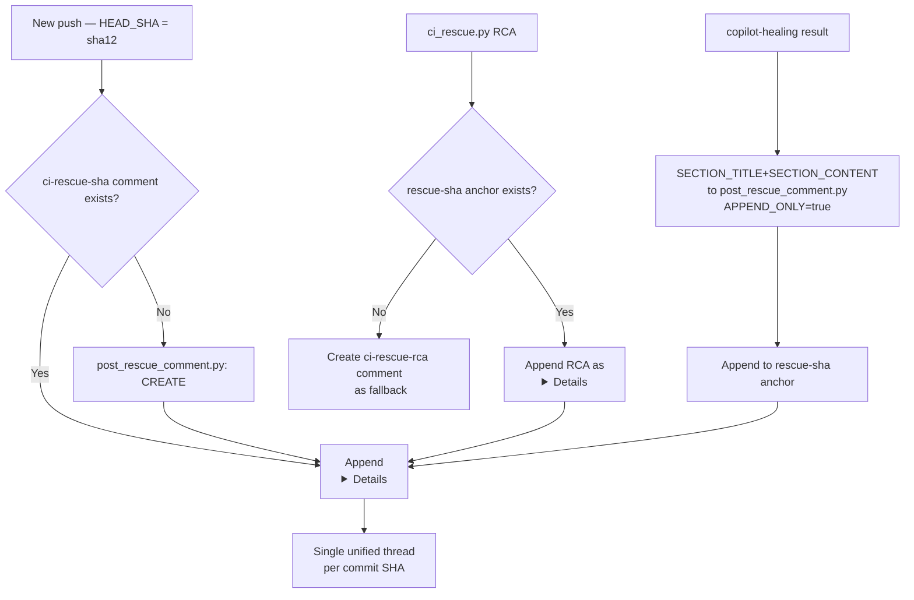
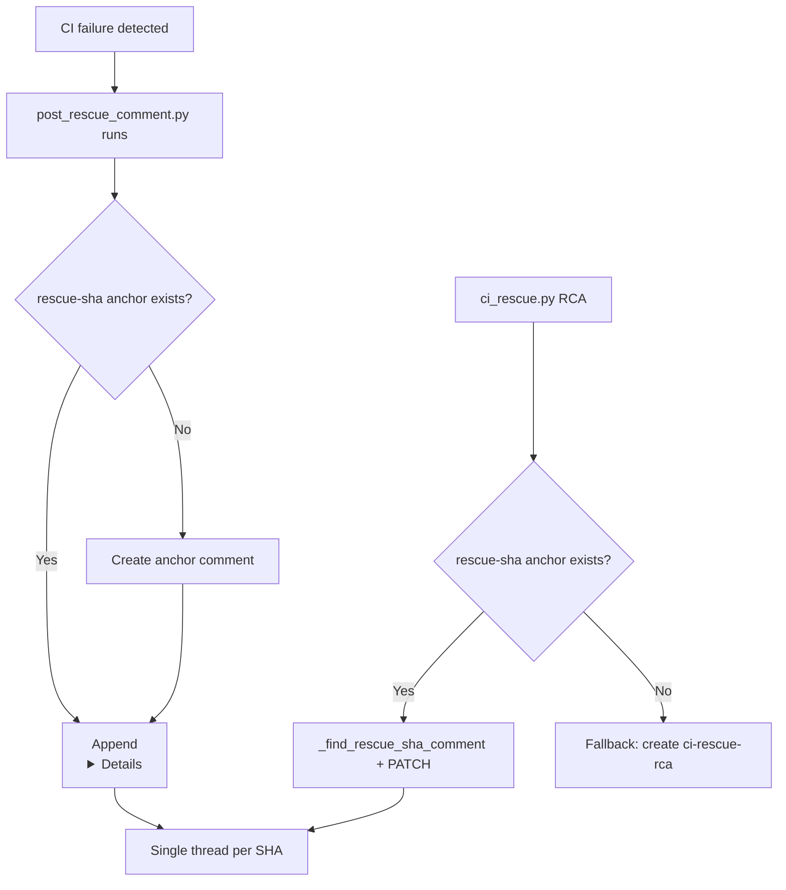
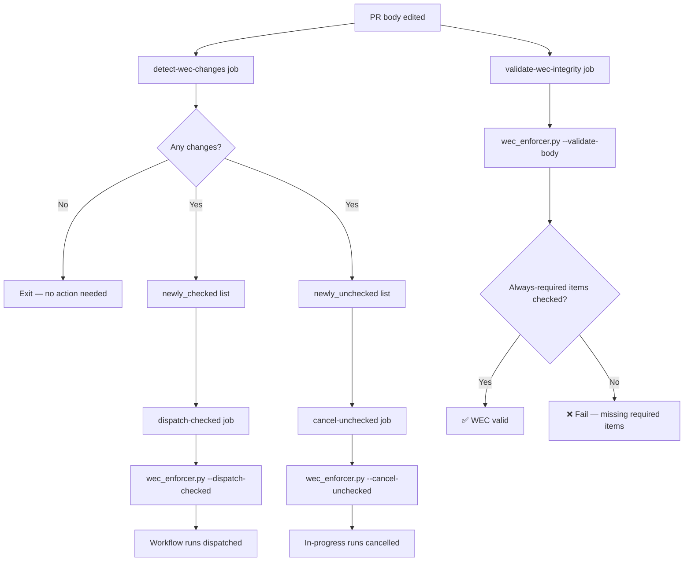

# PR Workflow Comment Plan

**Version:** 1.0.0  
**Date:** 2026-04-05  
**Purpose:** Unified architecture plan for consolidating per-SHA PR comments and
implementing WEC checkbox-driven workflow trigger/cancel lifecycle.

---

## Section 1 — SHA-Collision Analysis

Live data from PR #3876 showing multiple comments posted for the same HEAD_SHA:

| HEAD_SHA (12-char) | Comment markers found | Count |
|--------------------|-----------------------|-------|
| `1448b343b896` | `ci-rescue-sha`, `ci-rescue-rca`, `copilot-healing`, `compiled-bot-feedback`, `copilot-escalation` | 5 |
| `dd0ca326203d` | `ci-rescue-sha`, `ci-rescue-rca`, `session-done-retrigger` | 4 |
| `7a2069950366` | `comment-review-gate-checklist`, `ci-rescue-sha`, `ci-rescue-rca` | 3 |

**Problem:** Each workflow posts a separate comment under the same SHA, creating
noise and making it harder for agents to find a single source of truth.

**Solution:** A single SHA-digest anchor (`<!-- ci-rescue-sha:{pr}:{sha12} -->`)
acts as the canonical thread for a given commit. All other comment types append
`
` sections to it instead of creating independent comments.

---

## Section 2 — Unified SHA-Digest Architecture

---

## Section 3 — Complete Workflow Comment Inventory

| Workflow file | Comment marker(s) | Current behavior | SHA-scoped? | Target behavior | Status | Priority | CB/MCP method |
|---|---|---|---|---|---|---|---|
| `post_rescue_comment.py` | `ci-rescue-sha:{pr}:{sha12}` | Creates / appends | ✅ Yes | **Canonical anchor** — all others append here | ✅ Done | P1 | `SECTION_CONTENT` env var |
| `ci_rescue.py` | `ci-rescue-rca:{pr}:sha-{sha12}` | Creates new or appends | ✅ Yes | Prefer appending to `ci-rescue-sha` anchor | ✅ Done | P1 | `_find_rescue_sha_comment()` |
| `copilot-agent-session-done.yml` | `copilot-healing:{pr}:{sha12}` | Creates new | Partial | Use `APPEND_ONLY=true` + `SECTION_CONTENT` | 🔄 In Progress | P1 | `post_rescue_comment.py` |
| `compiled-bot-feedback.yml` | `compiled-bot-feedback:{pr}` | Creates new | ❌ No | Append to rescue-sha; fallback create | 📋 Planned | P2 | `post_rescue_comment.py` |
| `copilot-escalation.yml` | `copilot-escalation:{pr}:{sha12}` | Creates new | ✅ Yes | Use `APPEND_ONLY=true` + `SECTION_CONTENT` | 📋 Planned | P2 | `post_rescue_comment.py` |
| `session-done-retrigger.yml` | `session-done-retrigger:{pr}` | Creates new | ❌ No | Append to rescue-sha anchor | 📋 Planned | P2 | `post_rescue_comment.py` |
| `comment-review-gate.yml` | `comment-review-gate-checklist:{pr}` | Creates new | ❌ No | Keep separate (review gate ≠ failure) | 📋 Planned | P3 | N/A — different purpose |
| `workflow-execution-gate.yml` | `workflow-execution-gate:{pr}` | Upserts (no SHA) | ❌ No | Keep separate (plan summary ≠ failure) | 📋 Planned | P3 | N/A — different purpose |
| `post-pr-summary` (action) | `PR_STATUS_DASHBOARD_v1` | Upserts | ❌ No | Keep separate (dashboard ≠ failure) | 📋 Planned | P3 | N/A |
| `validate.yml` | `ci-rescue-sha` (via script) | Appends | ✅ Yes | Already correct | ✅ Done | P1 | `post_rescue_comment.py` |
| `resilient_validation.yml` | `ci-rescue-sha` (via script) | Appends | ✅ Yes | Already correct | ✅ Done | P1 | `post_rescue_comment.py` |
| `nox_gates.yml` | `ci-rescue-sha` (via script) | Appends | ✅ Yes | Already correct | ✅ Done | P1 | `post_rescue_comment.py` |
| `security-scanning-suite.yml` | `ci-rescue-sha` (via script) | Appends | ✅ Yes | Already correct | ✅ Done | P1 | `post_rescue_comment.py` |
| `pre-merge-validation.yml` | `ci-rescue-sha` (via script) | Appends | ✅ Yes | Already correct | ✅ Done | P1 | `post_rescue_comment.py` |
| `agent-auth-delegation.yml` | `ci-rescue-sha` (via script) | Appends | ✅ Yes | Already correct | ✅ Done | P1 | `post_rescue_comment.py` |

---

## Section 4 — WEC Trigger/Cancel Model

| Workflow filename | WEC Section | Check action (`[x]`) | Uncheck action (`[ ]`) | Cancel behavior | Implementation |
|---|---|---|---|---|---|
| `pre-merge-validation.yml` | Always Required | Auto-fires on push | N/A — cannot uncheck | N/A | N/A |
| `comment-review-gate.yml` | Always Required | Auto-fires on push | N/A | N/A | N/A |
| `deferral-language-gate.yml` | Always Required | Auto-fires on push | N/A | N/A | N/A |
| `agent-auth-delegation.yml` | Always Required | Auto-fires on push | N/A | N/A | N/A |
| `workflow-execution-gate.yml` | Always Required | Auto-fires on push | N/A | N/A | N/A |
| `copilot-agent-checkin.yml` | Always Active | Auto-fires on push | N/A | N/A | N/A |
| `copilot-agent-session-done.yml` | Always Active | Auto-fires via workflow_run | N/A | N/A | N/A |
| `copilot-iterative-self-healing.yml` | Always Active | Auto-fires via workflow_run | N/A | N/A | N/A |
| `cost-gate.yml` | Always Active | Auto-fires (called by agent-auth) | N/A | N/A | N/A |
| `validate.yml` | Opt-In Testing | `dispatch-checked` dispatches run | `cancel-unchecked` cancels in-progress | Immediate cancel | `wec_enforcer.py --dispatch-checked / --cancel-unchecked` |
| `resilient_validation.yml` | Opt-In Testing | `dispatch-checked` dispatches run | `cancel-unchecked` cancels in-progress | Immediate cancel | `wec_enforcer.py --dispatch-checked / --cancel-unchecked` |
| `test-rag.yml` | Opt-In Testing | `dispatch-checked` dispatches run | `cancel-unchecked` cancels in-progress | Immediate cancel | `wec_enforcer.py --dispatch-checked / --cancel-unchecked` |
| `nox_gates.yml` | Opt-In Testing | `dispatch-checked` dispatches run | `cancel-unchecked` cancels in-progress | Immediate cancel | `wec_enforcer.py --dispatch-checked / --cancel-unchecked` |
| `mypy-baseline.yml` | Opt-In Testing | `dispatch-checked` dispatches run | `cancel-unchecked` cancels in-progress | Immediate cancel | `wec_enforcer.py --dispatch-checked / --cancel-unchecked` |
| `coverage-with-timeout.yml` | Opt-In Testing | `dispatch-checked` dispatches run | `cancel-unchecked` cancels in-progress | Immediate cancel | `wec_enforcer.py --dispatch-checked / --cancel-unchecked` |
| `progressive-validation.yml` | Opt-In Testing | `dispatch-checked` dispatches run | `cancel-unchecked` cancels in-progress | Immediate cancel | `wec_enforcer.py --dispatch-checked / --cancel-unchecked` |
| `pre-flight-validation.yml` | Opt-In Testing | `dispatch-checked` dispatches run | `cancel-unchecked` cancels in-progress | Immediate cancel | `wec_enforcer.py --dispatch-checked / --cancel-unchecked` |
| `ci-checkpoint-validation.yml` | Opt-In Testing | `dispatch-checked` dispatches run | `cancel-unchecked` cancels in-progress | Immediate cancel | `wec_enforcer.py --dispatch-checked / --cancel-unchecked` |
| `data-quality-suite.yml` | Opt-In Testing | `dispatch-checked` dispatches run | `cancel-unchecked` cancels in-progress | Immediate cancel | `wec_enforcer.py --dispatch-checked / --cancel-unchecked` |
| `auth-tests.yml` | Opt-In Testing | `dispatch-checked` dispatches run | `cancel-unchecked` cancels in-progress | Immediate cancel | `wec_enforcer.py --dispatch-checked / --cancel-unchecked` |
| `pr-checks.yml` | Opt-In Testing | `dispatch-checked` dispatches run | `cancel-unchecked` cancels in-progress | Immediate cancel | `wec_enforcer.py --dispatch-checked / --cancel-unchecked` |
| `html_visual_regression.yml` | Opt-In Testing | `dispatch-checked` dispatches run | `cancel-unchecked` cancels in-progress | Immediate cancel | `wec_enforcer.py --dispatch-checked / --cancel-unchecked` |
| `security-scanning-suite.yml` | Opt-In Security | `dispatch-checked` dispatches run | `cancel-unchecked` cancels in-progress | Immediate cancel | `wec_enforcer.py --dispatch-checked / --cancel-unchecked` |
| `codeql-analysis.yml` | Opt-In Security | `dispatch-checked` dispatches run | `cancel-unchecked` cancels in-progress | Immediate cancel | `wec_enforcer.py --dispatch-checked / --cancel-unchecked` |
| `actionlint-audit.yml` | Opt-In Security | `dispatch-checked` dispatches run | `cancel-unchecked` cancels in-progress | Immediate cancel | `wec_enforcer.py --dispatch-checked / --cancel-unchecked` |
| `semgrep_sarif.yml` | Opt-In Security | `dispatch-checked` dispatches run | `cancel-unchecked` cancels in-progress | Immediate cancel | `wec_enforcer.py --dispatch-checked / --cancel-unchecked` |
| `documentation-link-checker.yml` | Opt-In Docs | `dispatch-checked` dispatches run | `cancel-unchecked` cancels in-progress | Immediate cancel | `wec_enforcer.py --dispatch-checked / --cancel-unchecked` |
| `auto-approve-workflows` | Auto-Approve | `dispatch-checked` dispatches run | `cancel-unchecked` cancels in-progress | Immediate cancel | `wec_enforcer.py --dispatch-checked / --cancel-unchecked` |

---

## Section 5 — Custom Copilot Agent Definitions

### Agent: `sha-digest-guardian`

**Description:** Manages SHA-digest comment consolidation. Ensures all CI failure
signals for a given commit SHA append to the single `<!-- ci-rescue-sha:{pr}:{sha12} -->`
anchor instead of spawning separate comments.

**Capabilities:**
- Scan PR comment threads for SHA-collision patterns
- Identify comments that should be merged into the digest anchor
- Invoke `post_rescue_comment.py` with `SECTION_CONTENT` / `SECTION_TITLE` env vars
- Detect stale `ci-rescue-rca` comments and merge them into the rescue-sha anchor

**Trigger conditions:**
- A new `ci-rescue-sha` comment is created on a PR
- More than 2 comments share the same 12-char SHA prefix
- `post_rescue_comment.py` fails to append (PATCH error)

**Tools used:**
- `post_rescue_comment.py` (SECTION_CONTENT mode)
- GitHub Issues API (list/update/delete comments)
- `ci_rescue.py._find_rescue_sha_comment()`

**Success criteria:**
- No PR has more than 1 comment per HEAD_SHA (excluding dashboard/review-gate comments)
- All RCA content appears inside the rescue-sha thread

---

### Agent: `wec-lifecycle-agent`

**Description:** Manages Workflow Execution Checklist (WEC) template integrity and
drives the checkbox-triggered workflow lifecycle (trigger on check, cancel on uncheck).

**Capabilities:**
- Validate that all always-required WEC items are `[x]` in every PR body update
- Detect WEC diff between `BODY_BEFORE` and `BODY_AFTER` on PR edits
- Dispatch workflow runs when opt-in items are newly checked
- Cancel in-progress runs when opt-in items are unchecked
- Restore accidentally-removed always-required items

**Trigger conditions:**
- `pull_request: edited` event fires in `workflow-execution-gate.yml`
- PR body is updated by any agent or human
- A WEC always-required item is found unchecked

**Tools used:**
- `wec_enforcer.py --detect-changes`
- `wec_enforcer.py --cancel-unchecked`
- `wec_enforcer.py --dispatch-checked`
- `wec_enforcer.py --validate-body`
- `session_wrapup_autofix._WEC_ITEMS` (canonical list)

**Success criteria:**
- Every PR body update preserves always-required `[x]` items
- Opt-in workflows are dispatched within 60 seconds of being checked
- In-progress opt-in workflow runs are cancelled within 60 seconds of being unchecked

---

## Section 6 — Implementation Checklist

- [x] **System 1**: Extend `post_rescue_comment.py` with `SECTION_TITLE`, `SECTION_CONTENT`, `APPEND_ONLY` env vars
- [x] **System 2**: Create `scripts/ci/wec_enforcer.py` with all 5 modes
- [x] **System 3**: Add `pull_request: [edited]` trigger + 4 new jobs to `workflow-execution-gate.yml`
- [x] **System 4**: Create this document (`docs/ci/PR_WORKFLOW_COMMENT_PLAN.md`)
- [x] **System 5**: Add 12 missing WEC items to `session_wrapup_autofix._WEC_ITEMS`; update slice indices
- [x] **System 6**: Update `ci_rescue.post_pr_comment()` to prefer appending RCA to rescue-sha anchor
- [ ] **Future P2**: Update `copilot-agent-session-done.yml` to use `APPEND_ONLY=true` + `SECTION_CONTENT`
- [ ] **Future P2**: Update `copilot-escalation.yml` to use `APPEND_ONLY=true` + `SECTION_CONTENT`
- [ ] **Future P2**: Update `compiled-bot-feedback.yml` to append to rescue-sha anchor
- [ ] **Future P2**: Update `session-done-retrigger.yml` to append to rescue-sha anchor
- [ ] **Future P3**: Investigate whether `comment-review-gate.yml` can be merged into a dashboard comment
- [ ] **Future P3**: Investigate `workflow-execution-gate.yml` gate summary scoping by SHA
