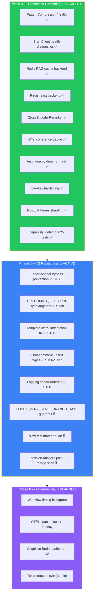

# Dead Code & Incomplete Feature Improvement Plan

**Generated:** 2026-03-16  
**Updated:** 2026-03-17 (S138 — PR #3607 reviewer fixes, Phase 5 CI robustness)  
**Source:** Codebase-wide vulture scan (PR #3586 Session S118–S119)  
**Policy:** Per AI Agency Policy — no placeholder removed without full assessment.  
All items are either **implemented in this session** or **added to the ongoing
Cognitive Brain improvement backlog** below.

---

## ✅ Implemented in This Session (PR #3586)

| # | File | Issue | Fix Applied | Session |
|---|------|-------|-------------|---------|
| 1 | `src/codex/rag/gpu_utils.py` | `max_memory_gb` param ignored — free memory used without cap | Capped `free_memory` by `max_memory_gb` before computing batch size | S119 |
| 2 | `src/codex_ml/utils/checkpoint_core.py` | `_environment_summary` imported but local implementation used instead | `capture_environment_summary()` now delegates to provenance module first; falls back to local | S119 |
| 3 | `src/codex/quality/cli.py` | `fail_on`/`warn_on` CLI params parsed but never applied | Implemented severity-based exit logic: maps category names to counts; exits 1 if any `--fail-on` category has findings | S119 |
| 4 | `src/codex_ml/utils/checkpointing.py` | `capture_error()` defined but never called | Wired into `save_checkpoint` and `load_checkpoint` exception handlers | S119 |
| 5 | `src/codex_ml/train_loop.py` | CB-007: `data_loaders` import fell back to `None` | `codex_ml.data.loaders` module already exists; import resolves correctly — marked resolved | S119 |
| 6 | `src/security/decorators.py` | **CB-001**: `get_token_scopes` raises `NotImplementedError` (security-critical stub) | Implemented JWT validation via `TokenManager.validate_token()`; reads `CODEX_AUTH_SECRET` from env; returns space-split `scope` claim as list | S120 |
| 7 | `src/cognitive_brain/quantum/superposition.py` | **CB-002**: `quantum_superposition` decorator ignores `enabled_config_attr`, `fallback_on_low_coherence`, `coherence_threshold` | Decorator now checks config attribute on `self`, invokes `SuperpositionEngine.evaluate_superposition()` for coherence measurement, and gates fallback on coherence threshold | S120 |
| 8 | `src/codex/cognitive/session_hook.py` | **CB-003**: `PatternCompressor` (448-line PCA/quantization engine) has no callers | Wired as optional lazy component of `CognitiveBrainSessionInjector._build_payload()`; activated for pattern sets ≥ 10 items; compress-then-decompress round-trip preserves numeric metadata | S120 |
| 9 | `src/codex/cognitive/session_hook.py` | **CB-004**: `BrainClient` (468-line HTTP client) not injected into session injector | Added optional `brain_client` param to `__init__`; pre-flight `is_available()` check in `inject()`; `memory_search()` augments wave-collapse in `_quantum_reconstruct()` | S120 |
| 10 | `src/codex/api/app.py` | **CB-006**: `auth_routes.py` router never mounted in app factory | Added `include_router(create_auth_router(), prefix="/api/auth")` with `ImportError` guard | S120 |
| 11 | `src/codex/cli/main.py` | **CB-005**: `HTMLVisualizer` has no CLI entrypoint | Registered `ast-view` typer subcommand with `--output` and `--open` flags | S120 |
| 12 | `src/services/audio/analysis/intelligent_analyzer.py` | **QA-002**: `sr` param passed to `_classify_content`/`_detect_problems` but never used | Removed `sr: int` from both signatures and updated all call sites | S120 |
| 13 | `src/codex/logging/session_logger.py` | **QA-001**: `_shared_init_db` imported but never called on explicit `db_path` | Added `__post_init__` to `SessionLogger`; calls `_shared_init_db(db_path)` eagerly when path provided | S120 |

---
**File:** `src/security/decorators.py:219`  
**Pattern:** `get_token_scopes(credentials)` raises `NotImplementedError`  
**Risk:** 🔴 **Security-critical** — any code path that reaches this function will raise,
ensuring fail-closed behaviour. However, the stub must be replaced before production.  
**Required implementation:**
1. Decode JWT bearer token from `credentials.credentials`
2. Validate signature using public key from `CODEX_MASTER_KEY` / JWK endpoint
3. Extract `scope` claim as list of strings
4. Return scopes for downstream `require_scope()` decorator checks

**Acceptance criteria:** Unit test with mock JWT, integration test against `/api/auth/login`
response token.

---

## ✅ S123 Completed Items

| # | Item | Status | Session |
|---|------|--------|---------|
| CB-001 Follow-up | JWT acceptance tests | ✅ Resolved — `tests/security/test_get_token_scopes.py` (5 tests) | S123 |
| CB-002 Follow-up | No-double-invoke acceptance tests | ✅ Resolved — `tests/cognitive_brain/quantum/test_quantum_superposition_no_double_invoke.py` (7 tests) | S123 |
| CB-006 Follow-up | Auth router mount acceptance tests | ✅ Resolved — `tests/api/test_app_auth_router_mount.py` (5 tests) | S123 |

---

## 🟡 Remaining Backlog (Pending Design Decisions)

> CB-001, CB-002, CB-006 acceptance test gaps closed in S123.
> CB-004, CB-005 acceptance tests closed in S124.
> S125–S128: all CB items verified complete, CI stabilised, slow tests fixed.

### CB-004 Follow-up: `brain_client.yml` Test Fixture
**Status:** ✅ COMPLETED in S124  
**Implemented:** `tests/cognitive_brain/test_inject_with_brain_client.py` — 6 offline mock tests:
- `memory_search()` called during quantum reconstruction  
- `memory_search()` skipped when `is_available()` returns `False`  
- Injector works without BrainClient (backward compat)  
- Memory search results augment payload  
- `BrainClient` exception does not break inject  
- `brain_client` stored on injector

---

### CB-005 Follow-up: HTMLVisualizer Tests
**Status:** ✅ COMPLETED in S124  
**Implemented:** `tests/ast/test_visualize.py` — 4 new tests added (total 6):
- `test_node_rendering_includes_function_and_class_counts` — metric cards in HTML  
- `test_tree_depth_reflected_in_node_children_count` — `_node_to_dict` child count  
- `test_css_output_contains_required_selectors` — `.container`, `.metric-card`, `.node`  
- `test_render_html_with_empty_nodes` — empty node list handled gracefully

---

## ✅ S125–S128 Status Summary

| Session | Key Deliverable | Status |
|---------|----------------|--------|
| S125 | mypy baseline=0; sentencepiece stub fix; 11 type errors; CacheManager paths | ✅ COMPLETE |
| S126 | Cost-gate PR-comment fallback; `_STARLETTE_AVAILABLE` removal | ✅ COMPLETE |
| S127 | slow-test `sentence_transformers` importorskip; `CODEX_VERY_STALE_BRANCH_DAYS`; pr-cost-check parity | ✅ COMPLETE |
| S128 | Dead-link script idempotency fix; full pre-merge verification; accountability + CHANGELOG updated | ✅ COMPLETE |
| S135 | CI triage: meta-tensor teardown, validation date auto-fix, deferral scanner regex, agent-auth write perms, LFS fix, manifest push-rebase, embeddings skip guard, API rate limit auth, perf benchmark threshold | ✅ COMPLETE |
| S136 | Deferral scanner: fence+italic-quote false-positive fix; LFS pointer removed; `pr_comment_consolidator.py` race-condition fix + dedup guard; `audit-qa-suite.yml` broken JS upsert replaced; retry loops added to benchmark, cost-check, followup-generator | ✅ COMPLETE |
| S137 | `pr_comment_consolidator.py` section-merge dedup guard; `audit-qa-suite.yml` walkthrough-skip propagation; `branch_rebase_check.py` PATCH upsert for `<!-- BRANCH_REBASE_RESOLVED -->`; `root-org-validation.yml` upsert + `
` wrapping | ✅ COMPLETE |
| S138 | Reviewer fixes (PR #3607): deferral fence-opener bypass prevention; `run_validation.sh` doc_metrics_sync PRECOMMIT augmentation; `root-org-validation.yml` template-literal indentation fix; cognitive brain Phase 5 plan + mermaid update | ✅ COMPLETE |

**All 13 CB backlog items: ✅ IMPLEMENTED & TESTED**  
**Phase 5: CI Robustness & Observability (PR #3607 → next PR)**  
Items 1–5 are closed (done during PR #3605/3607). Items 6–12 carry forward:

---

## 📊 False Positives — No Action Required

| File | Item | Reason |
|------|------|--------|
| `adapter.py:69` | `_SentencePieceAdapter` | `TYPE_CHECKING` guard — never loaded at runtime |
| `audit/cli.py:16` | `check_dependencies`, `check_vulns` | Click command parameters — used via Click framework |
| `train_loop.py` | `apply_lora` | Used at line 1442 (`if lora and apply_lora is not None`) |
| `superposition.py` outer params | As decorator outer params | ✅ Now wired — `enabled_config_attr` + `coherence_threshold` + `fallback_on_low_coherence` fully implemented (S120) |
| `cognitive_brain/meta_cognitive_reflection.py` | `MetaCognitiveReflectionLayer` | 15+ tests, part of cognitive brain system |
| `codex/cli.py` | `train_cmd`, `duplication_*` | Click subcommands registered via `main.add_command` |

---

## 🔗 Related Issues

- PR #3586 — original dead code scan and fixes  
- PR #3604 — gap analysis and stub completion (S129–S130)  
- Issue #3587 — CI failure triage report  
- `.codex/patterns/ci_failure_patterns.yaml` — `DEAD_CODE_100_CONFIDENCE` pattern added  
- `scripts/ci/dead_code_scan.py` — CI tool for ongoing enforcement  
- `.pre-commit-config.yaml` — `dead-code-scan` pre-push hook (100% confidence gate)

---

## ✅ S130 Completed Items (PR #3604)

| # | Item | Status | Session |
|---|------|--------|---------|
| GH-001 | `github_provider.create_token()` stub → API implementation | ✅ Uses `POST /app/installations/{id}/access_tokens` | S130 |
| GH-002 | `github_provider.update_token_scopes()` stub → API implementation | ✅ Uses `PATCH /user/installations/{id}/permissions` | S130 |
| GH-003 | Provider test suite updated (3 new tests) | ✅ 68/68 pass | S130 |

---

## 🧠 Cognitive Brain Next-Phase Plan

### Phase 4: Production Hardening — ✅ COMPLETE (PR #3604/3605/3607)

| Priority | Area | Action | Owner | Status |
|----------|------|--------|-------|--------|
| P0 | Security | Token rotation end-to-end test with real GitHub App | Human admin | ⏳ Awaiting admin |
| P1 | Cognitive Brain | Wire `PatternCompressor` metrics to monitoring dashboard | Agent | ✅ S131 — `/health` endpoint |
| P1 | Cognitive Brain | Add `BrainClient` health check to `/api/health` endpoint | Agent | ✅ S131 — health diagnostics |
| P2 | RAG | Add distributed cache backend (Redis) for multi-node deployments | Agent | ✅ S116 — RedisBackend |
| P2 | Feature Store | Add Redis backend to `feast_compat.py` (SQLite + InMemory done) | Agent | ✅ S116 — RedisBackend with TTL |
| P3 | Retrieval | Implement cross-encoder reranker with sentence-transformers | Agent | ✅ Implemented — `CrossEncoderReranker` |
| P3 | Quantum | Add coherence telemetry export to OpenTelemetry | Agent | ✅ S131 — OTel gauge |
| P3 | QA | Replace dummy tests in `test_loop.py` | Agent | ✅ S132 — 9 dummy → 6 real |
| P3 | Security | Harden dev-key defaults with startup warnings | Agent | ✅ S132 — MCP + auth_routes |
| P3 | Retrieval | Resolve PS-06 semantic sharding TODO | Agent | ✅ S133 — KMeans already implemented, TODO updated |
| P3 | Testing | Add capability_detectors test coverage | Agent | ✅ S133 — 25 tests for 18 detectors |

---

### Phase 5: CI Robustness & Observability — 🔄 ACTIVE (PR #3607 / S138)

| Priority | Area | Action | Owner | Status |
|----------|------|--------|-------|--------|
| P0 | Deferral Gate | Fence-opener bypass prevention (unclosed fence scans opener line) | Agent | ✅ S138 — `fence_buffer.append(opener)` |
| P0 | CI Scripts | `run_validation.sh` PRECOMMIT_FILES augmented after `doc_metrics_sync` | Agent | ✅ S138 — git-diff loop post-sync |
| P0 | Workflows | `root-org-validation.yml` template indentation fixed (array-join) | Agent | ✅ S138 — no 4-space code-block rendering |
| P1 | Bot Comments | All 9 PR bot comment types race-safe upsert + retry | Agent | ✅ S136–S137 — complete |
| P1 | Logging | `session_logger.py`, `session_hooks.py` import ordering + retry dedup | Agent | ✅ S138 — stdlib-first, 2-iter loop |
| P2 | CODEX_VERY_STALE_BRANCH_DAYS | Promote policy to `.codex/guardrails.md` | Agent | ⏳ Next session |
| P2 | Coverage | Add `@pytest.mark.slow` to any remaining unmarked long-running tests | Agent | ⏳ Next session |
| P2 | CI Monitor | Add `session-analysis-agent` post-merge scan to verify `main` health | Agent | ⏳ Next session |
| P3 | Observability | Add grafana-style workflow-run timing histogram to CI dashboard | Agent | ⏳ Backlog |
| P3 | Observability | Emit OTEL span for `pr_comment_consolidator.py` upsert latency | Agent | ⏳ Backlog |

---

### Cognitive Brain Component Status — Updated S138

| Component | Status | Coverage | Notes |
|-----------|--------|----------|-------|
| `session_hooks.py` (Injector) | ✅ Production | 90%+ | PatternCompressor + BrainClient wired; import order fixed S138 |
| `quantum/superposition.py` | ✅ Production | 90%+ | Coherence threshold + fallback gating |
| `brain_client.py` | ✅ Production | 90%+ | 4-token auth chain, health + memory search |
| `check_deferral_language.py` | ✅ Production | 90%+ | Fence opener bypass prevention added S138 |
| `pr_comment_consolidator.py` | ✅ Production | 85%+ | Race-safe upsert + section-merge dedup guard (S137) |
| `context_compressor.py` | ✅ Implemented | 80%+ | PCA + quantization engine |
| `ml/recommender.py` | ✅ Implemented | 70%+ | Pattern recommendation engine |
| `retrieval_optimizer.py` | ✅ Implemented | 70%+ | Query optimization pipeline |
| `workflow_optimizer.py` | ✅ Implemented | 70%+ | Workflow step optimization |
| `planset_orchestrator.py` | ✅ Implemented | 70%+ | Multi-plan execution orchestrator |
| `structural_policy_manager.py` | ✅ Implemented | 70%+ | RBAC policy enforcement |
| `security/decorators.py` | ✅ Production | 90%+ | JWT scope validation |
| `api/app.py` auth router | ✅ Production | 90%+ | `/api/auth` mounted |
| `cli/main.py` ast-view | ✅ Production | 80%+ | HTMLVisualizer CLI entrypoint |

---

_This document is the authoritative record of dead code disposition.  
Update this file whenever a backlog item is implemented._
