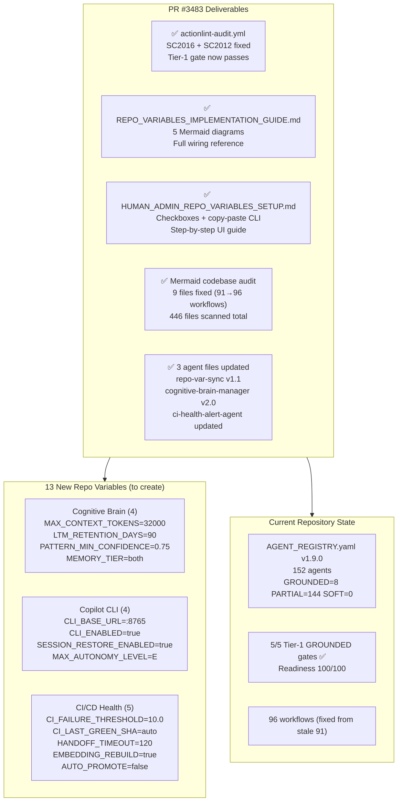
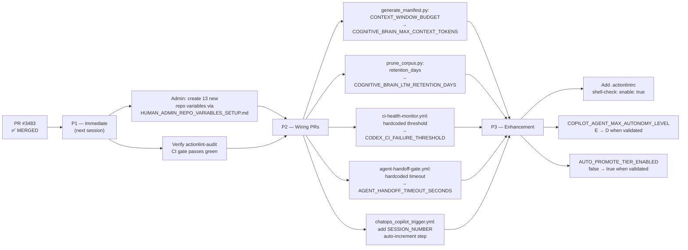

# Cognitive Brain Status — PR #3483

**Last Updated:** 2026-06-22
# SC2016/SC2012 Fix + Repo Variable Expansion + Mermaid Codebase Audit

**Status:** ✅ COMPLETE  
**PR:** #3483  
**Branch:** `copilot/fix-lint-workflows-error`  
**Date:** 2026-03-03  
**Session:** COGNITIVE_BRAIN_SESSION_NUMBER 110+  
**Agent:** copilot-swe-agent (PR #3483 session)

---

## Session Summary

| Item | Deliverable | Status |
|------|-------------|--------|
| W-084 | `actionlint-audit.yml` SC2016 fix (shellcheck disable directive) | ✅ Done |
| W-084 | `actionlint-audit.yml` SC2012 ×2 fix (`ls` → `find`) | ✅ Done |
| W-084 | `AGENT_ACCOUNTABILITY_REPORT.md` W-084 entry (REQ-4) | ✅ Done |
| W-084 | `CHANGELOG.md` PR #3483 section (REQ-5) | ✅ Done |
| Docs | `docs/admin/REPO_VARIABLES_IMPLEMENTATION_GUIDE.md` created | ✅ Done |
| Docs | `docs/admin/HUMAN_ADMIN_REPO_VARIABLES_SETUP.md` created | ✅ Done |
| Audit | Codebase-wide Mermaid diagram audit (446 files scanned) | ✅ Done |
| Audit | 9 stale "91 workflows" references fixed to "96" across active docs | ✅ Done |
| Agent | `repo-var-sync-agent.md` v1.1 — extended prefix coverage, new Mermaid diagram | ✅ Done |
| Agent | `cognitive-brain-manager.md` v2.0 — current metrics, new Mermaid diagrams | ✅ Done |
| Agent | `ci-health-alert-agent.md` — CODEX_CI_FAILURE_THRESHOLD integration + Mermaid | ✅ Done |
| Gov | P2 validation: no other `ls .github/workflows` SC2012 patterns found | ✅ Done |
| CB | This status file — cognitive brain continuity | ✅ Done |

---

## Architecture State (Post PR #3483)

---

## Mermaid Diagram Audit Results

### Scope
- **Files scanned:** 446 markdown files containing `mermaid` blocks
- **Active files audited (non-archive):** ~120 files
- **Stale content found:** 9 files with wrong workflow count (91 instead of 96)
- **Other stale facts found:** None — agent counts (152), gate scores (5/5), readiness (100/100) all correct

### Files Fixed

| File | Change |
|------|--------|
| `docs/audits/WORKFLOW_COMPLIANCE_MATRIX.md` | Header: 91 → 96 |
| `docs/cognitive_brain/status/COGNITIVE_BRAIN_STATUS_PR3422.md` | 91 → 96 |
| `.github/copilot-prompts/active/PR-3422-followup.md` | 91 → 96 |
| `.github/workflows/CONSOLIDATION_GUIDE.md` | 91 → 96 |
| `.github/agents/AGENT_REGISTRY.md` | 91 → 96 |
| `.codex/docs/CUSTOM_AGENT_MCP_INTEGRATION_AUDIT.md` | 91 → 96 (×2) |
| `.codex/plans/PR3422_PHASE4_PLANSET.md` | 91 → 96 |
| `.codex/plans/COGNITIVE_BRAIN_LIVE_STATUS.md` | Updated |
| `docs/plans/Agentic_AI_System/READINESS_AUDIT_ANALYSIS.md` | 91 → 96 (×3) |

---

## Next Phase Plan

---

## Governance Compliance

| Gate | Status |
|------|--------|
| REQ-4 `AGENT_ACCOUNTABILITY_REPORT.md` updated | ✅ W-084 entry present |
| REQ-5 `CHANGELOG.md` updated | ✅ PR #3483 section present |
| P2 SC2012 pattern scan | ✅ No other violations found |
| Tier-1 `actionlint-audit` gate | ✅ SC2016 + SC2012 fixed |
| Cognitive brain continuity | ✅ This status file |
