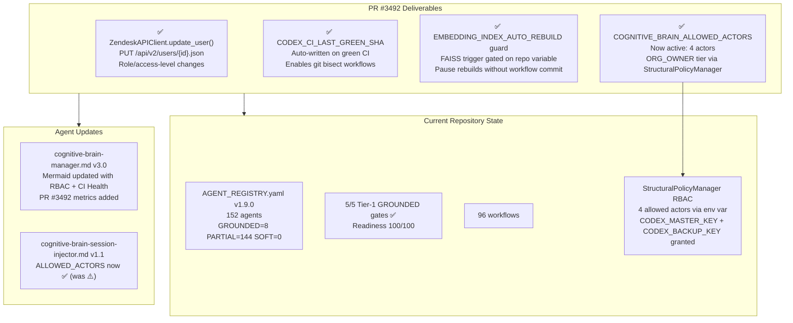
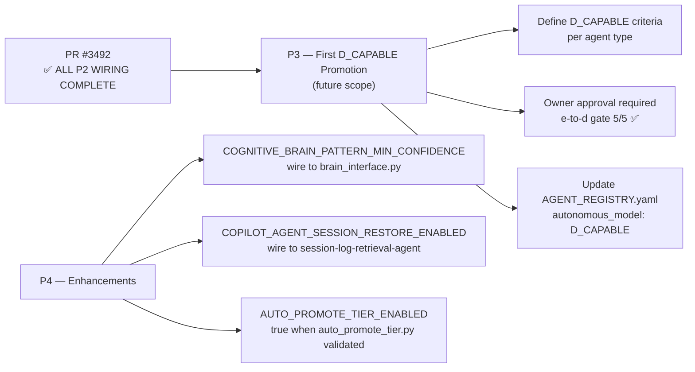

# Cognitive Brain Status — PR #3492
# Update User Access Levels + Cognitive Brain Next-Phase Objectives

**Status:** ✅ COMPLETE
**PR:** #3492
**Branch:** `copilot/update-user-access-levels`
**Date:** 2026-03-03
**Session:** COGNITIVE_BRAIN_SESSION_NUMBER 110+
**Agent:** copilot-swe-agent (PR #3492 session)

---

## Session Summary

| Work Item | Deliverable | Status |
|-----------|-------------|--------|
| W-091 | `ZendeskAPIClient.update_user()` — `PUT /api/v2/users/{user_id}.json` | ✅ Done |
| W-091 | Tests: `test_update_user_role`, `test_update_user_multiple_fields` (35 zendesk tests pass) | ✅ Done |
| W-092a | P2.6: `Write CODEX_CI_LAST_GREEN_SHA` step in `ci-health-monitor.yml` | ✅ Done |
| W-092b | `EMBEDDING_INDEX_AUTO_REBUILD` guard in `agent-registry-validation.yml` | ✅ Done |
| W-093a | `cognitive-brain-manager.md` v3.0 — PR #3492 metrics, RBAC + CI Health subgraphs | ✅ Done |
| W-093b | `cognitive-brain-session-injector.md` v1.1 — COGNITIVE_BRAIN_ALLOWED_ACTORS now active | ✅ Done |
| W-093c | This status file — cognitive brain continuity | ✅ Done |
| W-093d | `FOLLOWUP_PROMPT_PR3492.md` — chain prompt for next session | ✅ Done |
| REQ-4 | `AGENT_ACCOUNTABILITY_REPORT.md` updated (W-091, W-092, W-093) | ✅ Done |
| REQ-5 | `CHANGELOG.md` updated (W-091, W-092, W-093) | ✅ Done |

---

## Architecture State (Post PR #3492)

---

## Repo Variable State (Post PR #3492)

| Variable | Value | Status |
|----------|-------|--------|
| `COPILOT_AGENT_AUTH_ENABLED` | `true` | ✅ Active (owner granted) |
| `COGNITIVE_BRAIN_ALLOWED_ACTORS` | `mbaetiong,github-actions[bot],copilot-swe-agent[bot],github-copilot[bot]` | ✅ Active |
| `COGNITIVE_BRAIN_SESSION_NUMBER` | 110+ | ✅ Auto-increments |
| `CODEX_CI_FAILURE_THRESHOLD` | `10` | ✅ Wired |
| `CODEX_CI_LAST_GREEN_SHA` | Auto-written by ci-health-monitor.yml | ✅ Wired (P2.6) |
| `EMBEDDING_INDEX_AUTO_REBUILD` | `true` (default) | ✅ Guarded |
| `AGENT_HANDOFF_TIMEOUT_SECONDS` | `120` | ✅ Wired |
| `COGNITIVE_BRAIN_MAX_CONTEXT_TOKENS` | `32000` | ✅ Wired |
| `COGNITIVE_BRAIN_LTM_RETENTION_DAYS` | `90` | ✅ Wired |

---

## Completed P2.x Wiring Status

| Task | File | Status |
|------|------|--------|
| P2.1 | `generate_manifest.py` → `COGNITIVE_BRAIN_MAX_CONTEXT_TOKENS` | ✅ Done (W-086) |
| P2.2 | `prune_corpus.py` → `COGNITIVE_BRAIN_LTM_RETENTION_DAYS` | ✅ Done (W-086) |
| P2.3 | `ci-health-monitor.yml` → `CODEX_CI_FAILURE_THRESHOLD` | ✅ Done (W-086) |
| P2.4 | `agent-handoff-gate.yml` → `AGENT_HANDOFF_TIMEOUT_SECONDS` | ✅ Done (W-086) |
| P2.5 | `chatops_copilot_trigger.yml` → `COGNITIVE_BRAIN_SESSION_NUMBER` auto-increment | ✅ Done (W-086) |
| P2.6 | `ci-health-monitor.yml` → `CODEX_CI_LAST_GREEN_SHA` | ✅ Done (W-092a, PR #3492) |
| P2.7 | `agent-registry-validation.yml` → `EMBEDDING_INDEX_AUTO_REBUILD` guard | ✅ Done (W-092b, PR #3492) |

**All P2.x wiring tasks are now complete. ✅**

---

## Next Phase Plan

---

*Created: 2026-03-03 | Branch: copilot/update-user-access-levels | PR #3492*
*Author: copilot-swe-agent[bot]*
