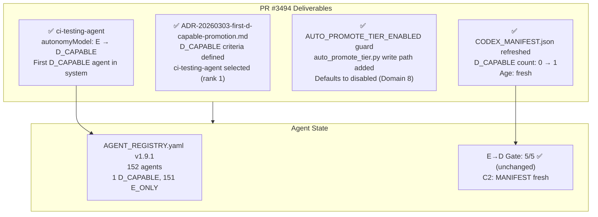

# Cognitive Brain Status — PR #3494
# First D_CAPABLE Promotion + AUTO_PROMOTE_TIER_ENABLED Write Path

**Status:** ✅ COMPLETE
**PR:** #3494
**Branch:** `copilot/continue-bec-objective`
**Date:** 2026-03-04
**Session:** COGNITIVE_BRAIN_SESSION_NUMBER 111+
**Agent:** copilot-swe-agent (PR #3494 session)

---

## Session Summary — BEC Objective (Becoming D_CAPABLE)

| Work Item | Deliverable | Status |
|-----------|-------------|--------|
| W-096a | ADR-20260303-first-d-capable-promotion.md — criteria + decision | ✅ Done |
| W-096b | AGENT_REGISTRY.yaml v1.9.1 — `ci-testing-agent` promoted to `D_CAPABLE` | ✅ Done |
| W-096c | `auto_promote_tier.py` — `AUTO_PROMOTE_TIER_ENABLED` guard + write path | ✅ Done |
| W-096d | CODEX_MANIFEST.json refreshed — D_CAPABLE count: 0 → 1 | ✅ Done |
| W-096e | This status file — cognitive brain continuity | ✅ Done |
| W-096f | FOLLOWUP_PROMPT_PR3494.md — chain prompt for next session | ✅ Done |
| REQ-4 | AGENT_ACCOUNTABILITY_REPORT.md updated | ✅ Done |
| REQ-5 | CHANGELOG.md updated | ✅ Done |

---

## Architecture State (Post PR #3494)



---

## E→D Gate State (Post PR #3494)

| Condition | Status |
|-----------|--------|
| C1: AGENT_REGISTRY.yaml valid | ✅ |
| C2: CODEX_MANIFEST.json < 24h | ✅ (just refreshed) |
| C3: SOFT count ≤ 2 (current: 2) | ✅ |
| C4: agent-handoff-gate.yml deployed | ✅ |
| C5: GROUNDED Tier-1 count ≥ 8 (current: 21) | ✅ |
| **Total** | **5/5** |

---

## D_CAPABLE Agent Roster (Post PR #3494)

| Agent | Tier | Rank | Promoted In |
|-------|------|------|-------------|
| `ci-testing-agent` | GROUNDED | 1 | PR #3494 |

---

## Completed Objective Map

```
PR #3492 (Merged) → P2.x All wiring complete ✅ · P3.1 MIN_CONFIDENCE ✅ · P3.2 SESSION_RESTORE ✅
PR #3494 (This PR) → Priority 2: BEC = Becoming D_CAPABLE ✅
                   → P3.3: AUTO_PROMOTE_TIER_ENABLED write path added ✅
```

---

## Next Phase Plan

| Priority | Item | Status |
|----------|------|--------|
| P4 | 2-sprint observation of ci-testing-agent D_CAPABLE behaviour | ⏳ In progress |
| P5 | Promote second D_CAPABLE agent (rank 2–3 candidate: workflow-ci-fixer or ci-emergency-response-agent) | 🔮 Future |
| P6 | Set AUTO_PROMOTE_TIER_ENABLED=true after Domain 8 owner sign-off | 🔮 Future |
| P7 | FAISS index freshness check (codex_index_meta.json age) | 🔮 Future |

---

*Created: 2026-03-04 | Branch: copilot/continue-bec-objective | PR #3494*
*Author: copilot-swe-agent[bot]*
