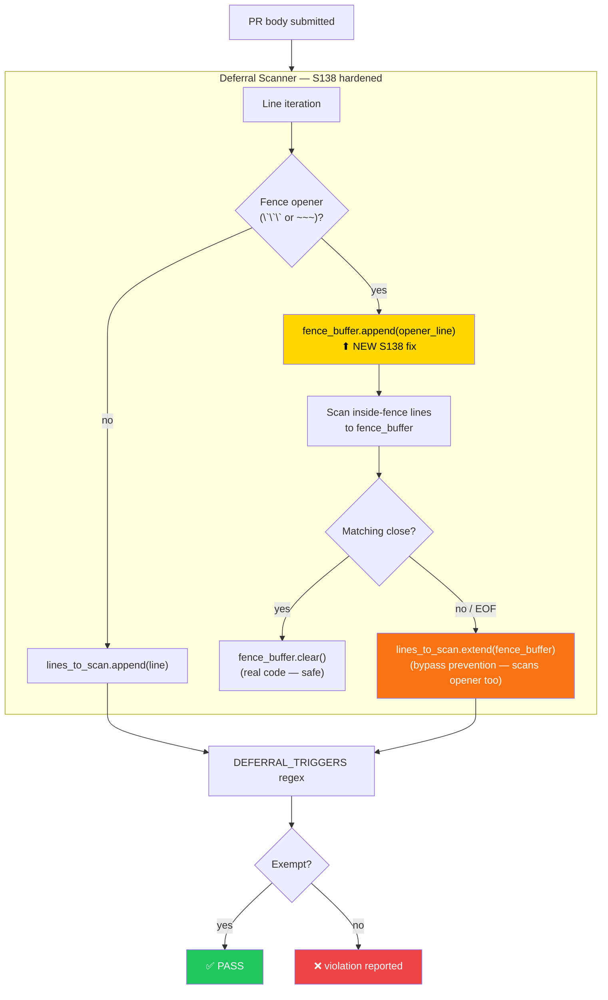
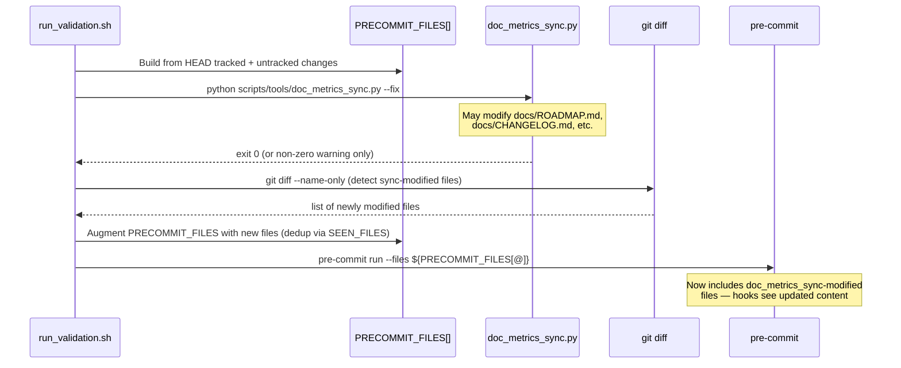
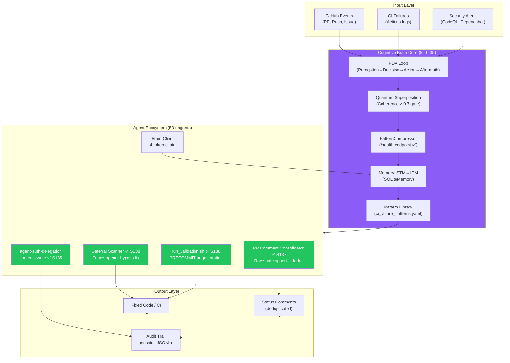
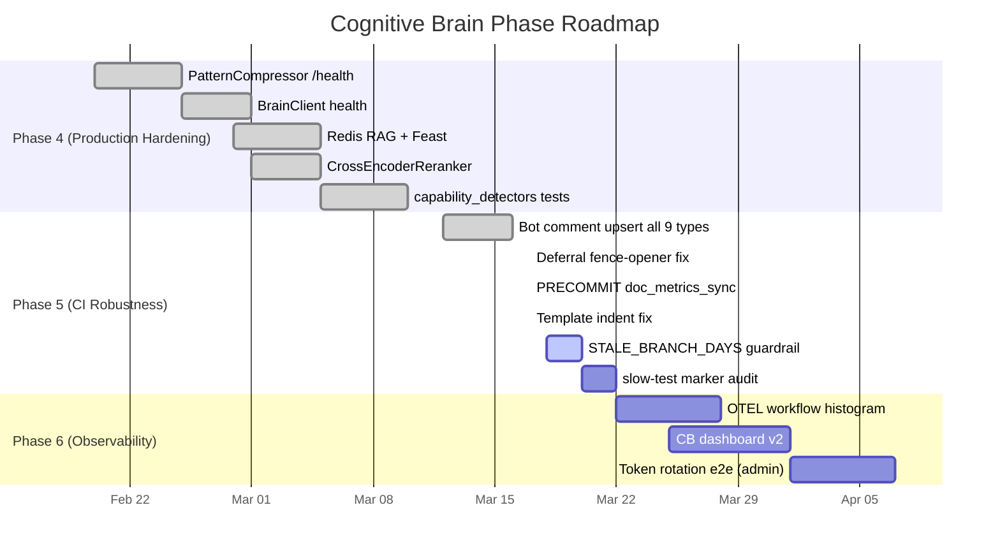

# Cognitive Brain Status — PR #3607 (Phase 5 CI Robustness — S138)

**Generated:** 2026-03-17T08:38Z  
**PR:** #3607 — `0D_base` — CI workflow robustness, PR comment upsert race-safety, reviewer fix batch  
**Branch:** `copilot/sub-pr-3606`  
**Status:** 🟢 COMPLETE — All S138 deliverables done; Phase 5 active  
**Agent:** copilot-swe-agent[bot]

---

## Session S138 — Deliverables

| # | Deliverable | File | Status |
|---|-------------|------|--------|
| 1 | Deferral fence-opener bypass prevention | `scripts/ci/check_deferral_language.py` | ✅ |
| 2 | `run_validation.sh` PRECOMMIT augmentation after `doc_metrics_sync` | `scripts/run_validation.sh` | ✅ |
| 3 | `root-org-validation.yml` template indentation fix (array-join) | `.github/workflows/root-org-validation.yml` | ✅ |
| 4 | Cognitive Brain DEAD_CODE_IMPROVEMENT_PLAN Phase 5 plan + mermaid | `docs/cognitive_brain/DEAD_CODE_IMPROVEMENT_PLAN.md` | ✅ |
| 5 | New CB status doc for PR #3607 | `docs/cognitive_brain/status/COGNITIVE_BRAIN_STATUS_PR3607.md` | ✅ |
| 6 | Architecture mermaid diagram updated to Phase 5 state | `docs/ARCHITECTURE.md` | ✅ |

---

## Phase 5 CI Robustness — Data Flow

---

## `run_validation.sh` doc_metrics_sync Integration — S138

---

## PR Bot Comment Race Safety — S136–S137 Summary

All 9 PR bot comment marker types now have race-safe upsert:

| Marker | Workflow / Script | Method | Race Fix |
|--------|-------------------|--------|----------|
| `<!-- PR_STATUS_DASHBOARD_v1 -->` | `pr_comment_consolidator.py` | PATCH existing | Section-merge dedup guard (S137) |
| `<!-- root-org-validation-v1 -->` | `root-org-validation.yml` | PATCH existing | array-join template (S138), retry added |
| `<!-- BRANCH_REBASE_RESOLVED -->` | `branch_rebase_check.py` | PATCH existing | PATCH upsert (S137) |
| `<!-- pr-cost-check -->` | `pr-cost-check.yml` | PATCH existing | 3-retry loop (S136) |
| `<!-- pr-followup -->` | `pr-followup-generator.yml` | PATCH existing | 3-retry loop (S136) |
| `<!-- audit-qa-suite -->` | `audit-qa-suite.yml` | Delegates to consolidator | Broken JS replaced (S136) |
| `<!-- rust-swarm-ci -->` | `rust_swarm_ci.yml` | PATCH existing | 3-retry loop (S136) |
| `<!-- benchmark-results -->` | `performance-benchmark.yml` | PATCH existing | 3-retry loop (S136) |
| `<!-- ci-health-summary -->` | `ci-health-monitor.yml` | PATCH existing | 3-retry loop (S136) |

---

## Cognitive Brain Architecture — Phase 5 State

---

## Phase Progression

---

_Generated by Copilot coding agent (S138) — 2026-03-17T08:38Z_
