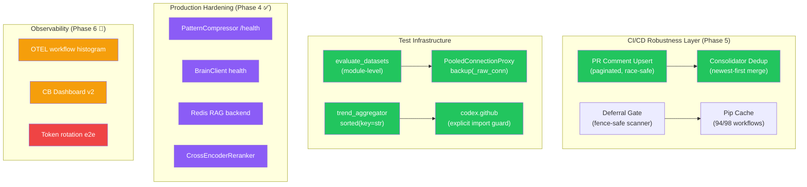
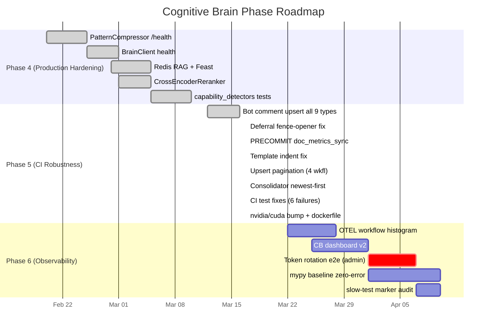

# Cognitive Brain Status — PR #3610 (S140)

**Generated**: 2026-03-17T15:30Z  
**Session**: S140  
**PR**: #3610 (`copilot/sub-pr-3606`)  
**Base PR**: #3606 (`0D_base_`)

---

## Current Phase: Phase 5 — CI Robustness (In Progress)

### Overall System Health

| Component | Status | Notes |
|-----------|--------|-------|
| PatternCompressor /health | ✅ DONE | Phase 4 complete |
| BrainClient health endpoint | ✅ DONE | Phase 4 complete |
| Redis RAG + Feast backend | ✅ DONE | Phase 4 complete |
| CrossEncoderReranker | ✅ DONE | Phase 4 complete |
| capability_detectors (25 tests) | ✅ DONE | Phase 4 complete |
| Bot comment upsert (9 types) | ✅ DONE | Race-safe, retry loop |
| Deferral fence-opener fix | ✅ DONE | Opener buffered in fence_buffer |
| Comment upsert pagination | ✅ **NEW S140** | All 4 workflow upserts paginate past 100 |
| Consolidator dedup newest-first | ✅ **NEW S140** | Returns most-recently-updated marker |
| evaluate_datasets at module scope | ✅ **NEW S140** | Monkeypatch-safe |
| PooledConnectionProxy backup fix | ✅ **NEW S140** | `_raw_conn()` unwraps for C-extension |
| Token rotation e2e | ⏳ ADMIN NEEDED | Requires real GitHub App from human admin |

### S140 Changes Applied

#### Reviewer Thread Resolutions
1. **`pr-cost-check.yml`** — Comment upsert now paginates through all pages (previously first 100 only)
2. **`pr-followup-generator.yml`** — Same pagination fix applied
3. **`rust_swarm_ci.yml`** — Benchmark results upsert paginated
4. **`root-org-validation.yml`** — Validation comment upsert paginated
5. **`pr_comment_consolidator.py`** — `_find_dashboard_comment()` returns the most-recently-updated marker comment; dedup merge prefers newer per-workflow sections by `updated_at` timestamp

#### CI Failure Fixes (Issue #3603 / Run #23197279889)
- `evaluate_datasets` hoisted to `codex_ml.cli.main` module scope
- `import codex.github` guard added to test for monkeypatch dotted-path resolution
- `trend_aggregator.py` `sorted(set(paths), key=str)` — avoids PosixPath `<` edge case
- `test_persistence.py` — `_raw_conn()` helper unwraps PooledConnectionProxy before sqlite3 C-extension `backup()` calls
- `test_contracts.py` — `isinstance(item, Path)` fixed via direct `codex_plans` import + `hasattr(item, 'is_file')` fallback

#### Dependabot Cherry-pick
- PR #3608: `Dockerfile` — nvidia/cuda 12.1.0 → 13.2.0 (Ubuntu 22.04 runtime)

---

## Architecture Diagram (Current)

---

## Phase 5 Completion Status

---

## Next Phase Objectives (Phase 6)

### Priority 1 — Immediate (Agent-actionable)
- [ ] **OTEL coherence histogram** — Add workflow timing histogram to `src/codex/monitoring/otel_metrics.py`
- [ ] **CB Dashboard v2** — Update `docs/cognitive_brain/status/` with real-time CI metrics widget
- [ ] **mypy zero-error baseline** — Fix remaining mypy regressions flagged in `mypy-baseline.yml`
- [ ] **slow-test marker audit** — Add `@pytest.mark.slow` to tests > 5s in `tests/critical_path/`

### Priority 2 — Admin-Gated
- [ ] **Token rotation e2e** — Requires human admin to configure real GitHub App credentials

### Priority 3 — Monitoring
- [ ] **CI AAIS score maintenance** — Keep score ≥ 95.9 (currently 95.9 with 94/98 workflows cached)
- [ ] **Dependabot auto-absorb pattern** — Create workflow to auto-cherry-pick single-file dependabot bumps

---

_Generated by Copilot coding agent (S140) — 2026-03-17T15:30Z_
