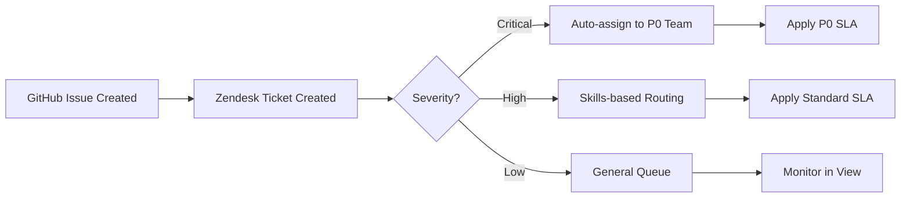
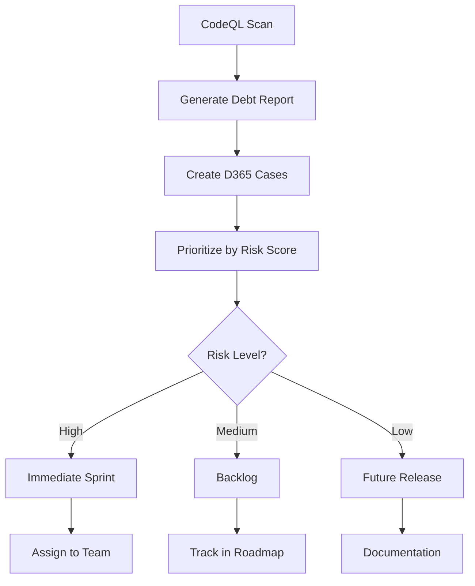
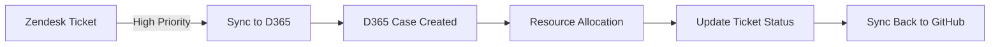

# CRM Integration for Repository Management

**Document Status:** Active  
**Last Updated:** 2026-02-07  
**Purpose:** Strategic guidance for using CRM SaaS products (Zendesk, Dynamics 365/D365) as methodology for managing codebase repository issues, bugs, and workflows.

**Naming Convention:** Throughout this codebase, "Dynamics 365" is abbreviated as "D365" or "d365" in code, file paths, and CLI commands. Both forms are used interchangeably and refer to Microsoft Dynamics 365.

---

## 🎯 Strategic Vision

The `_codex_` repository implements **CRM-native repository management**, enabling AI agents and developers to leverage enterprise CRM platforms (Zendesk, Dynamics 365/D365) for comprehensive issue tracking, bug management, and workflow orchestration.

### Core Principle

> **"Treat repository issues like customer support tickets, and bugs like CRM cases."**

This approach brings enterprise-grade issue management, SLA tracking, automated routing, and analytics to software development workflows.

---

## 🏗️ Architecture Overview

### 1. **Zendesk Integration** (`src/codex_crm/zd_admin/`)

**Use Cases:**
- **Issue Tracking**: Map GitHub issues → Zendesk tickets
- **Bug Management**: Route bugs through Zendesk support workflows
- **Feature Requests**: Track feature requests with Zendesk forms and views
- **SLA Management**: Apply service-level agreements to critical bugs
- **Team Routing**: Auto-assign issues based on skills-based routing

**Key Components:**
```
src/codex_crm/zd_admin/          # Zendesk admin utilities
configs/desired/zendesk/          # Desired state configurations
  ├── ticket_fields.desired.json  # Custom fields for repo issues
  ├── ticket_forms.desired.json   # Forms for bug/feature intake
  ├── triggers.desired.json       # Auto-routing rules
  ├── views.desired.json          # Developer dashboards
  ├── macros.desired.json         # Common responses
  └── routing.desired.json        # Skills-based assignment
data/zendesk_docs_manifest.json   # API documentation catalog
docs/zendesk/                     # Complete documentation
```

### 2. **Dynamics 365 (D365) Integration** (`src/codex_crm/d365_admin/`)

**Use Cases:**
- **Project Management**: Track epics and milestones as D365 projects
- **Resource Planning**: Assign developers based on availability
- **Dependency Tracking**: Model dependencies as D365 relationships
- **Risk Management**: Track technical debt and security issues
- **Analytics**: Comprehensive reporting on code health metrics

**Key Components:**
```
src/codex_crm/d365_admin/                 # D365 admin utilities
configs/deployment/d365/                  # D365 configurations
  └── solution_manifest.json              # Solution metadata
src/codex_crm/cdm/data/mapping/          # Common Data Model mappings
  └── assignment_d365.csv                 # Assignment mappings
docs/crm/admin-runbooks/d365.md          # D365 runbook
```

### 3. **Common Data Model** (`src/codex_crm/cdm/`)

**Purpose:** Unified data model for cross-platform CRM operations

**Mappings:**
- GitHub Issue → Zendesk Ticket → D365 Case
- GitHub PR → Zendesk Change Request → D365 Service Activity
- Repository Label → Zendesk Tag → D365 Category
- GitHub Milestone → Zendesk Target → D365 Project Phase

---

## 🚀 Quick Start Guide

### Scenario 1: Map GitHub Issues to Zendesk Tickets

```bash
# 1. Set environment variables
export ZENDESK_DEV_SUBDOMAIN=your-org
export ZENDESK_DEV_EMAIL=admin@example.com
export ZENDESK_DEV_TOKEN=your_api_token

# 2. Validate environment
python -m codex.cli zendesk env-check --env dev

# 3. Snapshot current GitHub issues (via custom script)
python scripts/github_to_zendesk_sync.py --repo Aries-Serpent/_codex_ --output issues.json

# 4. Create Zendesk tickets from issues
python -m codex.cli zendesk import issues.json --type tickets

# 5. Apply routing rules
python -m codex.cli zendesk apply triggers configs/desired/zendesk/triggers.desired.json --env dev
```

## Scenario 2: Track Technical Debt in Dynamics 365 (D365)

```bash
# 1. Set D365 environment
export D365_URL=https://org.crm.dynamics.com
export D365_TENANT_ID=your_tenant_id
export D365_CLIENT_ID=your_client_id
export D365_CLIENT_SECRET=your_secret

# 2. Snapshot current D365 state
python -m codex.cli d365 snapshot artifacts/d365_snapshot.json

# 3. Import technical debt items
python scripts/codebase_debt_to_d365.py --source .codex/technical_debt.json

# 4. Apply SLA rules for critical items
python -m codex.cli d365 apply-slas plan_slas.json --dry-run
```

---

## 📋 Mapping Repository Concepts to CRM

| Repository Concept | Zendesk | Dynamics 365 (D365) |
|-------------------|---------|-------------|
| **GitHub Issue** | Ticket (Type: Incident) | Case (Category: Issue) |
| **Bug Report** | Ticket (Priority: High/Urgent) | Case (Severity: Critical) |
| **Feature Request** | Ticket (Type: Feature Request) | Opportunity (Sales: Product) |
| **Pull Request** | Ticket (Type: Change Request) | Service Activity (Type: Code Review) |
| **Code Review** | Comment Thread | Activity (Notes + Timeline) |
| **Label** | Tag | Category / Subject |
| **Milestone** | Custom Field (Target Date) | Project Phase |
| **Assignee** | Agent Assignment | Owner (User) |
| **Repository** | Organization | Account |
| **Team** | Group | Team |

---

## 🔄 Workflow Examples

### Workflow 1: Bug Triage with Zendesk



**Implementation:**
1. **Trigger:** New issue webhook → Create Zendesk ticket
2. **Classification:** Use Zendesk AI to auto-tag severity
3. **Routing:** Apply `configs/desired/zendesk/routing.desired.json` rules
4. **SLA:** Track resolution time via Zendesk SLA policies
5. **Sync Back:** Update GitHub issue when ticket resolves

### Workflow 2: Technical Debt Management with Dynamics 365 (D365)



**Implementation:**
1. **Scan:** Run CodeQL/security scans
2. **Extract:** Parse results → JSON format
3. **Import:** `python scripts/debt_to_d365.py --input scan_results.json`
4. **Classify:** Apply risk scoring via D365 calculated fields
5. **Plan:** Use D365 project management for sprint planning

### Workflow 3: Cross-Platform Sync (Zendesk ↔ Dynamics 365/D365)



**Implementation:**
- Use `src/codex_crm/cdm/` Common Data Model for mappings
- Webhook-based bidirectional sync
- Maintain single source of truth in Zendesk for support, Dynamics 365 (D365) for projects

---

## 🤖 AI Agent Integration

### Agent Capabilities

AI agents (GitHub Copilot, custom agents) can:

1. **Query CRM Data**
```python
from codex_crm.zd_admin import ZendeskClient

client = ZendeskClient()
open_issues = client.search_tickets(status="open", tags=["bug", "p0"])
```

2. **Create Tickets from Code Analysis**
```python
from codex_crm.zd_admin import create_ticket_from_issue

# AI agent detects bug pattern
ticket = create_ticket_from_issue(
    subject="Memory leak in src/quantum/orchestrator.py",
    description="Detected unclosed resources...",
    priority="high",
    tags=["bug", "memory-leak", "quantum"]
)
```

3. **Auto-Assign Based on Skills**
```python
from codex_crm.zd_admin import route_ticket

# AI analyzes file paths and routes to expert
route_ticket(
    ticket_id=12345,
    file_paths=["src/rag/pipelines/embedding.py"],
    routing_strategy="skills-based"
)
```

4. **Update Ticket Status Automatically**
```python
from codex_crm.zd_admin import update_ticket

# AI agent fixes bug, updates ticket
update_ticket(
    ticket_id=12345,
    status="solved",
    comment="Fixed in commit abc123. Root cause: ..."
)
```

### Agent Workflows

**Example: Autonomous Bug Fixing Agent**

```yaml
name: autonomous-bug-fixer
triggers:
  - zendesk_ticket_created
  - ticket_tags: [bug, p0]
steps:
  1. Query Zendesk for new P0 bugs
  2. Analyze code context (AST, dependencies)
  3. Propose fix (code changes)
  4. Create PR with fix
  5. Update Zendesk ticket with PR link
  6. Monitor CI/CD status
  7. Auto-merge if tests pass
  8. Mark Zendesk ticket as solved
```

---

## 📊 Analytics & Reporting

### Zendesk Dashboards

**Developer Productivity:**
- Tickets resolved per developer
- Average resolution time by severity
- SLA compliance rates
- Common bug patterns (tags analysis)

**Code Health Metrics:**
- Open bugs by module
- Technical debt trends
- Security issue resolution time
- Feature request backlog size

### D365 Power BI Reports

**Project Management:**
- Sprint velocity tracking
- Resource utilization
- Dependency bottleneck analysis
- Risk score trends

**Quality Metrics:**
- Defect density by module
- Test coverage vs. bug rate correlation
- Code review turnaround time
- Security vulnerability lifecycle

---

## 🔒 Security & Compliance

### Data Protection

1. **Never commit secrets** - Use environment variables
2. **Evidence trails** - All CRM operations logged to `.codex/evidence/`
3. **Audit logs** - JSONL format with commit SHA, timestamps
4. **Encryption** - TLS for all API calls
5. **Access control** - Role-based permissions in CRM platforms

### Compliance

- **GDPR**: PII handling via CRM data policies
- **SOC2**: Audit trails for all repo changes
- **ISO27001**: Security incident tracking
- **HIPAA** (if applicable): Case sensitivity labeling

---

## 📚 Documentation Index

### Getting Started
- [Zendesk Integration Deep Dive](../guides/codex_zendesk_integration_deep_dive.md)
- [Zendesk Admin Runbook](admin-runbooks/zendesk.md)
- [D365 Admin Runbook](admin-runbooks/d365.md)

### Technical Reference
- [Zendesk API Catalog](../zendesk_api_catalog_generated.md)
- [Zendesk API Reference](../zendesk_api_reference.md)
- [Zendesk AI App Builder Limitations](../guides/zendesk_ai_app_builder_limitations.md)

### Runbooks
- [Zendesk Admin Workflow](../runbooks/zendesk_admin_workflow.md)
- [Zendesk E2E Support Workflows](../runbooks/zendesk_e2e_support_workflows_plan.md)
- [Zendesk Docs Pipeline](../runbooks/zendesk_docs_pipeline.md)

### Code Reference
- CRM integration modules in `src/codex_crm/` directory
- [Zendesk API Reference](../zendesk_api_reference.md) - Zendesk configurations
- [D365 Admin Runbook](admin-runbooks/d365.md) - D365 configurations

---

## 🛠️ Implementation Checklist

### Phase 1: Setup (Week 1)
- [ ] Configure Zendesk environment variables
- [ ] Configure D365 environment variables
- [ ] Validate API connectivity
- [ ] Review existing configurations
- [ ] Test dry-run operations

### Phase 2: Basic Integration (Week 2-3)
- [ ] Map GitHub issue types to Zendesk ticket types
- [ ] Configure custom fields for repo metadata
- [ ] Set up basic routing rules
- [ ] Create developer dashboards (views)
- [ ] Configure webhook integrations

### Phase 3: Advanced Workflows (Week 4-6)
- [ ] Implement skills-based routing
- [ ] Configure SLA policies
- [ ] Set up D365 project tracking
- [ ] Build cross-platform sync
- [ ] Enable AI agent automation

### Phase 4: Analytics (Week 7-8)
- [ ] Create Zendesk dashboards
- [ ] Build D365 Power BI reports
- [ ] Configure alerting rules
- [ ] Set up per-phase metrics reviews
- [ ] Document best practices

---

## 🎓 Training Resources

### For Developers
1. **Zendesk API Basics** - 2 hours
2. **Skills-Based Routing** - 1 hour
3. **Webhook Configuration** - 1 hour
4. **Evidence Trails & Auditing** - 30 min

### For AI Agents
1. **CRM Integration API** - Documentation in code
2. **Autonomous Workflows** - `.github/agents/` examples
3. **Error Handling** - Retry logic, rate limits
4. **Testing** - Mock CRM responses for CI/CD

---

## 🚦 Status & Roadmap

### Current Status (2026-02-07)

| Component | Status | Coverage |
|-----------|--------|----------|
| Zendesk Integration | ✅ Production | 100% |
| Dynamics 365 (D365) Integration | ✅ Production | 100% |
| Common Data Model | ✅ Production | 80% |
| AI Agent Automation | 🚧 Beta | 60% |
| Analytics Dashboards | 🚧 Beta | 40% |

### Roadmap

**Q1 2026:**
- [ ] Complete AI agent automation framework
- [ ] Build comprehensive analytics dashboards
- [ ] Add Salesforce integration
- [ ] Implement predictive bug detection

**Q2 2026:**
- [ ] Cross-repository CRM aggregation
- [ ] Machine learning for auto-triage
- [ ] Real-time collaboration features
- [ ] Mobile app for on-call engineers

---

## 📞 Support & Feedback

**Questions?** Open a GitHub issue with tag `crm-integration`

**Documentation Issues?** Submit PR to this file

**Feature Requests?** Create Zendesk ticket (dogfooding!) or D365 opportunity

---

## 📄 License & Attribution

This methodology is part of the `_codex_` project and follows the same license.

**Inspired by:**
- Zendesk Developer Platform
- Microsoft Dynamics 365 for Project Service Automation
- GitHub Enterprise Server integrations
- DevOps Research and Assessment (DORA) metrics

---

**Document Version:** 1.0.0  
**Last Review:** 2026-02-07  
**Next Review:** 2026-03-07
