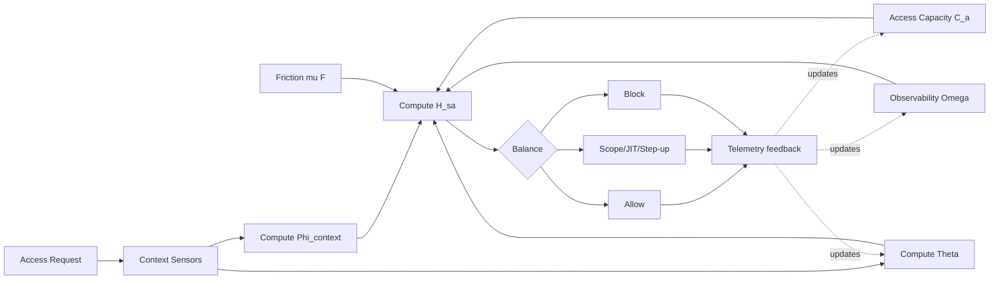
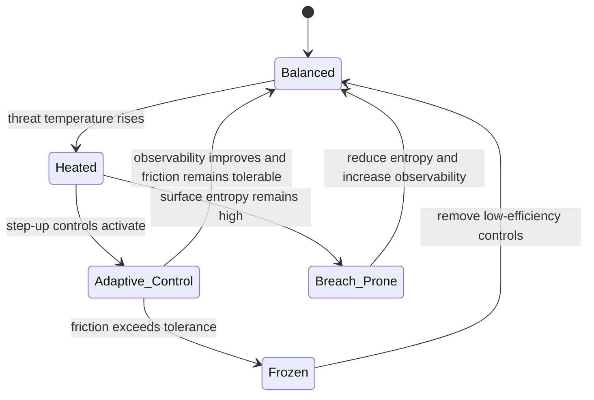

# Research Note 03 — Equation Variables, Mermaid Maps, and Calculation Templates

## 1. Canonical Variables

| Symbol | Name | Interpretation |
|---|---|---|
| $C_p$ | specific heat at constant pressure | thermodynamic energy required per kelvin |
| $T$ | absolute temperature | thermal intensity |
| $h$ | specific enthalpy | specific energy including flow work |
| $C_a$ | access heat capacity | ability to absorb access/control changes |
| $Θ$ | threat temperature | adversarial and operational intensity |
| $H_sa$ | security/access enthalpy | usable governed capability |
| $Φ_context$ | context multiplier | quality of identity/device/resource/time/behavior/network signals |
| $μF$ | friction burden | control cost to users and workflows |
| $Ω_obs$ | observability credit | value from measurement, audit, response |
| $κ$ | governance quantum | irreducible uncertainty floor |
| $η$ | control efficiency | risk reduction divided by friction added |

## 2. Formula Stack

```text
h = u + pv
C_p = (∂h/∂T)_p
Δh = ∫C_p(T)dT
Δh ≈ C_pΔT
h ≈ C_pT

H_sa = C_aΘ
H_sa = C_aΘΦ_context − μF + Ω_obs
F_trust = U + Ω_obs − ΘH_surface − μF
B* = ηF_trust / κ
```

## 3. Context Multiplier

```text
Φ_context = w_iI + w_dD + w_rR + w_tT_c + w_bB + w_nN
w_i + w_d + w_r + w_t + w_b + w_n = 1
```

| Component | Meaning |
|---|---|
| $I$ | identity confidence |
| $D$ | device posture |
| $R$ | resource-appropriate authorization |
| $T_c$ | time/location plausibility |
| $B$ | behavioral consistency |
| $N$ | network/session integrity |

## 4. Mermaid — CpT to Security/Access Mapping

```mermaid
flowchart TD
    Cp[Cp: heat capacity at constant pressure] --> H[h approx CpT]
    Temp[T: absolute temperature] --> H
    H --> DH[Delta h = integral Cp(T)dT]
    Ca[Ca: access heat capacity] --> HSA[H_sa = Ca Theta Phi - mu F + Omega]
    Theta[Theta: threat temperature] --> HSA
    Phi[Phi_context] --> HSA
    Friction[mu F: friction burden] --> HSA
    Obs[Omega_obs: observability] --> HSA
    HSA --> Decision{Decision band}
    Decision -->|high positive| Allow[Allow + audit]
    Decision -->|near zero| StepUp[Step-up / JIT / scope]
    Decision -->|negative| Deny[Deny or redesign]
```

## 5. Mermaid — Adaptive Heat Exchanger



## 6. Mermaid — State Machine



## 7. Calculation Template

```text
Inputs:
C_a = ___
Θ = ___
Φ_context = ___
μ = ___
F = ___
Ω_obs = ___

Formula:
H_sa = C_aΘΦ_context − μF + Ω_obs

Illustrative bands:
H_sa >= 0.50        allow with audit
0.10 <= H_sa < 0.50 allow with constraints
-0.10 < H_sa < 0.10 step-up boundary
H_sa <= -0.10       block or redesign access path
```

## 8. ASCII Chart

```text
Usable governed capability H_sa

 high |              adaptive ZTA band
      |           █████████████
      |        ███             ███
 zero |-------██----boundary-----██-------
      |     ██                     ██
 low  |  breach risk          paralysis risk
      +----------------------------------------
          open        balanced        locked
```
