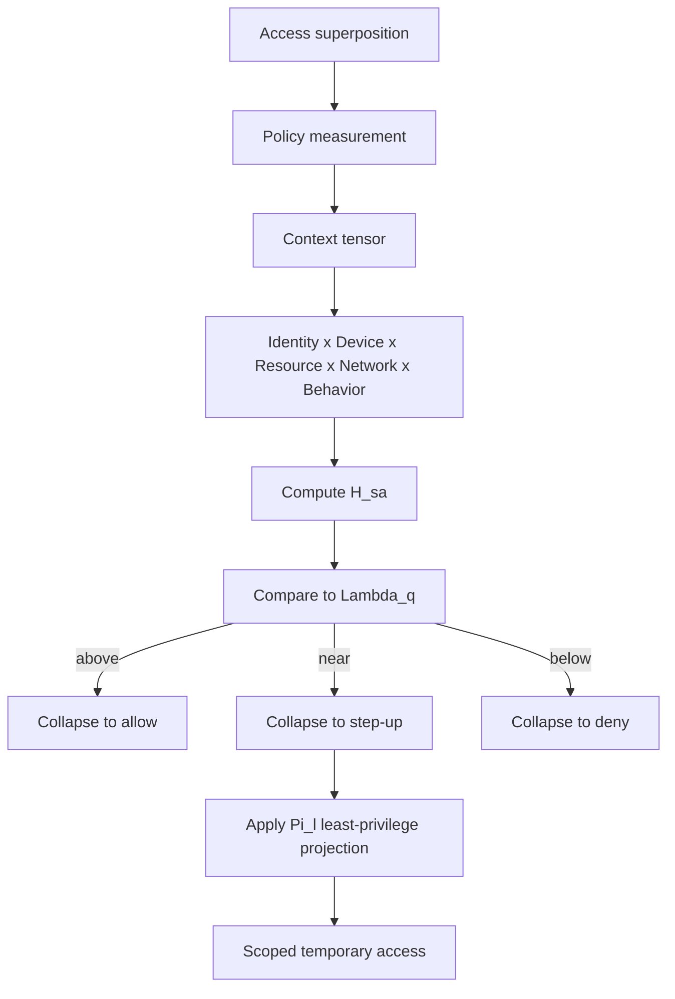

# Research Note 04 — Quantum and Physics-Inspired Expansion

## NotebookLM Metadata

- **Source type:** Research collection note
- **Topic:** Clearly labeled speculative variable expansion using quantum/physics-inspired logic
- **Note:** These are analogical models, not established physical laws of cybersecurity.

## 1. Access Wave Function

```text
|ψ_access⟩ = α|allow⟩ + β|deny⟩ + γ|step-up⟩ + δ|review⟩
|α|² + |β|² + |γ|² + |δ|² = 1
```

Zero-trust evaluation acts like measurement: it collapses a contextual request into allow, deny, step-up, or review.

## 2. Synthetic Variables

| Variable | Name | Meaning |
|---|---|---|
| $Λ_q$ | quantum uncertainty threshold | ambiguity before measurement |
| $χ_e$ | entanglement coefficient | coupling among identity, device, resource, network, behavior |
| $D_c$ | decoherence rate | speed at which cached trust decays |
| $τ_{trust}$ | trust half-life | time for trust confidence to halve |
| $Π_l$ | least-privilege projection | transforms broad request into minimum safe permission |
| $Σ_s$ | security entropy | disorder in permissions, resources, and ownership |
| $Γ_r$ | reversibility factor | ability to undo damage |
| $Ξ_b$ | blast-radius tensor | multidimensional damage potential |
| $Ω_o$ | observability operator | strength of logs, detection, response |
| $ρ_a$ | access density matrix | mixed state of many users/workflows |

## 3. Trust Decay

```text
Trust(t) = Trust_0 · e^(−λt)
λ = D_c · Θ · (1 − Ω_obs)
```

Trust decays faster when threat temperature is high, context changes rapidly, or observability is weak.

## 4. Entanglement Model

```text
|access⟩ = |identity⟩ ⊗ |device⟩ ⊗ |resource⟩ ⊗ |network⟩ ⊗ |behavior⟩
```

A compromised device changes the access state even if identity is valid. This is the physics-inspired rationale for not evaluating identity separately from device and behavior.

## 5. Least-Privilege Projection

```text
Π_l(Request_full) = Request_minimum_safe
```

Example:

```text
Π_l("permanent production admin") = "30-minute JIT admin for one service with session recording"
```

## 6. Creative Extended Equation

```text
H_sa^q = (C_aΘΦΩ_o)/(κ + Λ_q + Σ_s) − μF − Ξ_b(1 − Γ_r)
```

| Term | Meaning |
|---|---|
| $C_aΘΦΩ_o$ | productive governed capacity under context and observability |
| $κ + Λ_q + Σ_s$ | governance uncertainty, ambiguity, and entropy penalty |
| $μF$ | friction subtraction |
| $Ξ_b(1 − Γ_r)$ | blast-radius penalty reduced by reversibility |

## 7. Mermaid — Quantum Measurement Process



## 8. Summary

The quantum-inspired expansion treats access as a probabilistic context measurement. $C_pT$ contributes the energy-capacity metaphor; quantum terms add uncertainty, entanglement, trust decay, entropy, and projection into least privilege.
