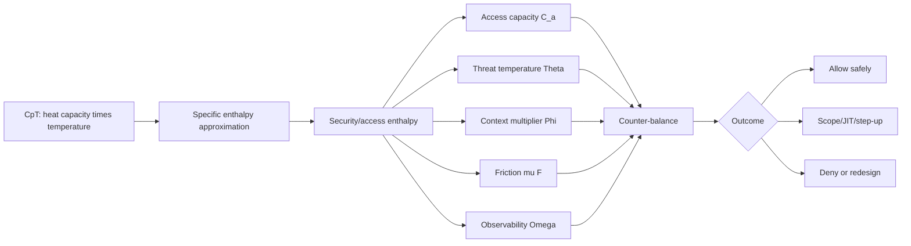

# Research Note 06 — Condensed Understanding

## NotebookLM Metadata

- **Source type:** Condensed synthesis note
- **Topic:** Final compact understanding of $C_pT$ and the security/access counter-balance

## 1. One-Sentence Summary

$C_pT$ means heat capacity multiplied by absolute temperature; as a security/access analogy, it describes how much governed access energy a system can carry under a given threat temperature before friction, entropy, or risk overwhelms useful work.

## 2. Core Thermodynamic Meaning

```text
C_p = (∂h/∂T)_p
dh = C_p dT
Δh = ∫C_p(T)dT
Δh ≈ C_pΔT
h ≈ C_pT under simplified reference assumptions
```

## 3. Core Security/Access Analogy

```text
H_sa = C_aΘΦ_context − μF + Ω_obs
```

| Term | Plain Meaning |
|---|---|
| $C_a$ | how much access/control energy the organization can absorb |
| $Θ$ | threat and operational temperature |
| $Φ_context$ | quality of identity, device, resource, time, behavior, network context |
| $μF$ | friction cost caused by controls |
| $Ω_obs$ | value added by observability, detection, logging, and response |

## 4. Final Mermaid Diagram



## 5. Final Formula Stack

```text
Thermodynamics:
Δh = ∫C_p(T)dT
Δh ≈ C_pΔT
h ≈ C_pT under simplified reference assumptions

Security/access:
H_sa = C_aΘΦ − μF + Ω
F_trust = U + Ω − ΘH_surface − μF
B* = ηF_trust / κ

Speculative quantum-inspired extension:
H_sa^q = (C_aΘΦΩ_o)/(κ + Λ_q + Σ_s) − μF − Ξ_b(1 − Γ_r)
```

## 6. Final Takeaway

The counter-balance between security and unfettered access is an adaptive energy-management problem. Mature systems with high access heat capacity and strong observability can run hotter, faster, and more openly without losing control. Immature systems must lower threat temperature, reduce access entropy, increase access capacity, or add carefully targeted controls.
