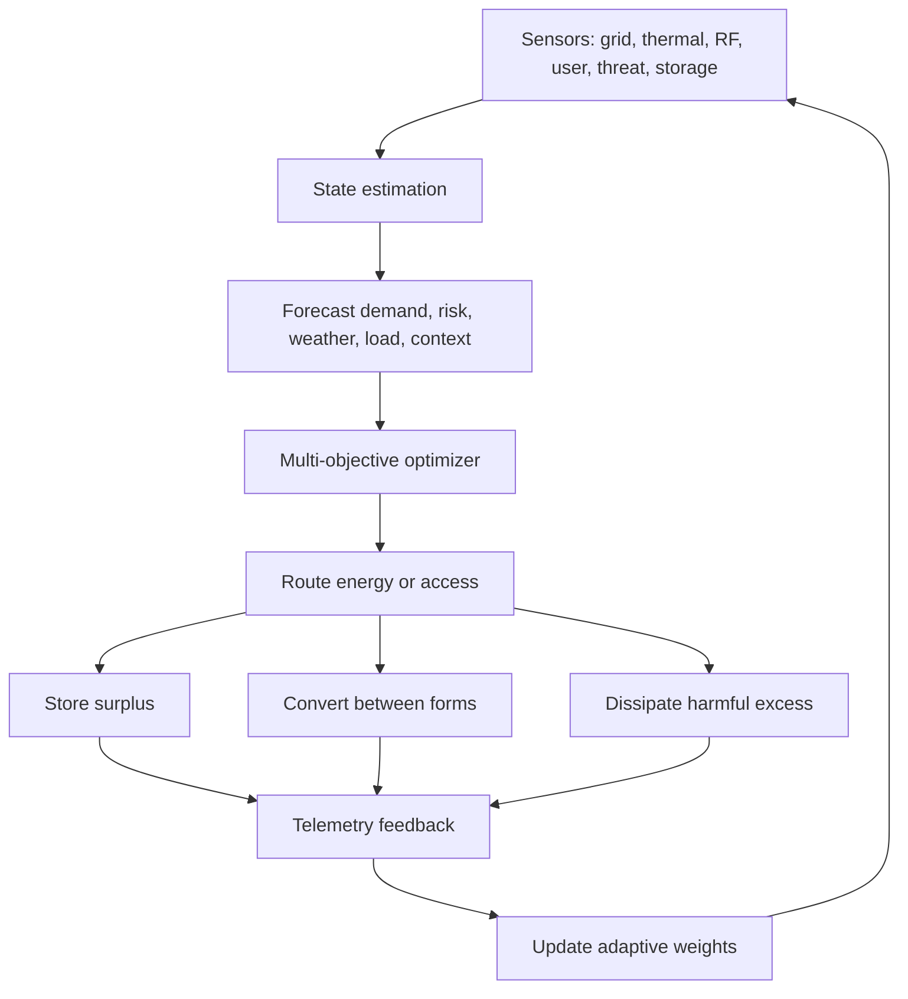

# Research Note 07 — Adaptive Energy-Management Across Energy Spectra

## NotebookLM Metadata

- **Source type:** Research collection note
- **Topic:** Adaptive energy-management as a cross-domain control problem spanning thermal, electrical, electromagnetic, chemical, mechanical, informational, and security/access energy.
- **Connection to prior notes:** Extends the $C_pT$ enthalpy model into broader energy-storage, conversion, routing, and dissipation regimes.
- **Current-data anchors:** IEA smart grids, 2024–2025 smart-grid reviews, 2025 AI/IoT adaptive energy-management research, 2024 RF harvesting review, wireless power transfer literature.

---

## 1. Core Thesis

Adaptive energy-management is the practice of sensing a system state, forecasting near-future demand or risk, routing energy through the safest and most efficient channel, storing surplus, dissipating harmful excess, and learning from feedback.

The prior packet used:

```text
Thermodynamic enthalpy: h ≈ C_pT
Security/access enthalpy: H_sa = C_aΘΦ_context − μF + Ω_obs
```

This extension generalizes the same shape:

```text
Adaptive energy state: E_adapt = C_domain · I_context · η_transfer − L_loss − R_risk + S_storage
```

where capacity, intensity, transfer efficiency, loss, risk, and storage appear in every energy domain.

---

## 2. Current Web-Research Anchors

Recent and authoritative sources describe adaptive energy-management as increasingly digital, distributed, and AI-assisted:

| Anchor | Current finding | Relevance |
|---|---|---|
| International Energy Agency smart-grid overview | Smart grids use digital communication, automation, monitoring, and control to manage electricity flows from generation through end use. | Confirms the control-loop framing for adaptive energy-management. |
| Scientific Reports 2025 deep-learning/IoT framework | AI and IoT frameworks are being applied for real-time adaptive grid optimization, load forecasting, and operational-cost reduction. | Supports predictive and feedback-driven control variables. |
| 2024 smart-grid and energy-storage reviews | Storage, DERs, AMI, SCADA, and automation are central to renewable integration and grid resilience. | Supports the storage and dispatch terms in the model. |
| 2025 microgrid optimization literature | Microgrids coordinate renewables, EVs, storage, and demand response. | Supports multi-agent, local optimization framing. |
| 2024 RF harvesting and WPT for IoT review | Ambient radio, TV, Wi-Fi, cellular, and dedicated RF sources can power ultra-low-power devices through rectennas. | Expands energy spectrum beyond heat/electricity into EM harvesting. |
| Wireless power transfer reviews | Inductive, resonant, RF, optical, and acoustic transfer differ by range, efficiency, safety, and alignment requirements. | Supports spectrum-specific transfer regimes and edge cases. |

Source URLs captured during web search:

- IEA Smart Grids: `https://www.iea.org/energy-system/electricity/smart-grids`
- Scientific Reports 2025 AI/IoT grid framework: `https://www.nature.com/articles/s41598-025-02649-w`
- Energies 2024 smart-grid review: `https://www.mdpi.com/1996-1073/17/16/4128`
- Sensors 2024 RF energy harvesting and WPT for IoT: `https://www.mdpi.com/1424-8220/24/23/7567`
- Wireless Power Transfer systems/circuits/standards/use cases: `https://pmc.ncbi.nlm.nih.gov/articles/PMC9371050/`
- Inductive coupling for WPT and NFC: `https://link.springer.com/article/10.1186/s13638-021-01994-4`
- NIST wireless power transfer and energy harvesting: `https://tsapps.nist.gov/publication/get_pdf.cfm?pub_id=927310`

---

## 3. Spectrum of Energy Domains

| Domain | Carrier | Storage Form | Control Lever | Failure Mode |
|---|---|---|---|---|
| Thermal | molecular kinetic energy | heat capacity, phase material | insulation, heat exchange, flow rate | overheating, freezing, thermal shock |
| Electrical | voltage/current | batteries, capacitors, grid inertia | dispatch, demand response, converters | overload, blackout, frequency instability |
| Electromagnetic near-field | inductive/resonant magnetic coupling | resonant fields, coils, capacitors | frequency tuning, alignment, coupling coefficient | detuning, heating, interference |
| Electromagnetic far-field | RF/microwave/optical radiation | rectenna DC output, photovoltaic carriers | beam steering, rectification, spectral matching | low power density, exposure limits, path loss |
| Chemical | bonds, fuels, electrochemistry | hydrogen, hydrocarbons, batteries | reaction rate, catalysts, state of charge | leakage, degradation, runaway |
| Mechanical | motion, pressure, vibration | flywheels, springs, compressed fluids | damping, pressure balancing, load shifting | resonance, fatigue, cavitation |
| Informational | entropy reduction and decision confidence | models, logs, memory, priors | prediction, compression, observation | hallucination, stale context, overfitting |
| Security/access | governed capability | trust cache, roles, JIT grants | least privilege, observability, step-up | breach, paralysis, privilege sprawl |

---

## 4. Unified Adaptive Energy Equation

```text
E_adapt,d = C_d · I_d · Φ_d · η_d − L_d − R_d + S_d − D_d
```

| Symbol | Meaning |
|---|---|
| $E_adapt,d$ | adaptive usable energy in domain $d$ |
| $C_d$ | domain capacity: heat capacity, battery capacity, trust capacity, channel capacity |
| $I_d$ | intensity: temperature, voltage, field strength, demand, threat level |
| $Φ_d$ | context multiplier: alignment, weather, identity, device state, resource state |
| $η_d$ | transfer/control efficiency |
| $L_d$ | losses: resistive, thermal, path, conversion, friction, user burden |
| $R_d$ | risk penalty: safety, cyber, reliability, blast radius |
| $S_d$ | storage/reserve available for buffering |
| $D_d$ | degradation and drift: battery aging, permission entropy, model decay |

This equation is synthetic, but each term corresponds to real engineering patterns.

---

## 5. Repository Content Bridge

The repository already uses physics-inspired control metaphors:

| Repo source | Relevant concept | Connection |
|---|---|---|
| `docs/ADVANCED_PHYSICS_GUIDE.md:130-153` | Electromagnetic fields route agents along field lines using potential, gradient, and force equations. | Maps attention/influence routing to EM-field routing. |
| `docs/PHYSICS_TECHNICAL_REFERENCE.md:101-116` | Poisson potential and electric-field gradient are documented for `EMFieldRouter`. | Supports field-potential notation for adaptive energy routing. |
| `docs/COGNITIVE_BRAIN_QUANTUM_INTEGRATION.md:481-492` | Adaptive energy weights are learned from feedback. | Supports meta-learning of energy weights across domains. |
| `docs/deep_research/2026_04_27/06_condensed_understanding.md` | Security/access is framed as adaptive energy-management. | This note extends that final takeaway across physical energy spectra. |

---

## 6. Adaptive Control Loop



---

## 7. Design Principle

A resilient adaptive energy-management system does not maximize one energy form. It balances:

```text
usable output + resilience + safety + reversibility − loss − harmful coupling − unmanaged entropy
```

In the security/access domain, this means using observability, least privilege, and adaptive step-up controls. In the physical-energy domain, it means using storage, demand response, DER coordination, WPT safety limits, spectral matching, and predictive dispatch.
