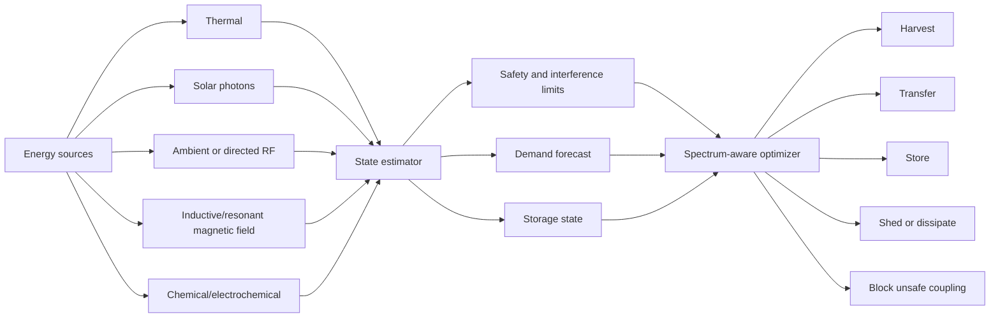

# Research Note 08 — Sustained Electromagnetism, Wireless Power, and Spectrum-Aware Control

## NotebookLM Metadata

- **Source type:** Research collection note
- **Topic:** Sustained electromagnetism and broader electromagnetic-spectrum energy as an adaptive energy-management substrate.
- **Scope:** Near-field coupling, far-field RF/optical energy, photovoltaics, rectennas, safety constraints, losses, and control variables.

---

## 1. Core Distinction: Sustained Field vs Sustained Useful Power

A sustained electromagnetic field is not the same as sustained useful power.

```text
Useful harvested power = incident energy × coupling × conversion efficiency − losses − safety/risk constraints
```

A field can be continuously present but practically low-value if power density is low, alignment is poor, conversion is inefficient, or exposure/interference limits constrain operation.

---

## 2. Electromagnetic Energy Modes

| Mode | Typical Range | Mechanism | Strength | Constraint |
|---|---|---|---|---|
| Inductive near-field | very short range | magnetic coupling between coils | efficient when aligned and close | rapid distance decay, heating, coil alignment |
| Resonant near-field | short to mid range | tuned resonators exchange energy | better tolerance than simple inductive coupling | detuning, safety, foreign-object heating |
| RF far-field | longer range | antennas capture radiated waves | useful for ultra-low-power sensors | low power density and rectifier efficiency limits |
| Microwave beaming | directed far-field | focused EM beam | targeted power delivery | exposure, tracking, atmospheric/path loss |
| Optical/laser | line-of-sight | photons converted by PV/photodiode | high directionality | eye/skin safety, weather, occlusion |
| Photovoltaic solar | broad EM spectrum from sun | photons create electron-hole pairs | mature renewable energy source | intermittency, spectral/weather dependence |

---

## 3. Current Literature Anchors

The web research surfaced several useful anchors:

- Wireless power transfer reviews classify coupled approaches such as inductive and resonant coupling, and uncoupled approaches such as RF and optical transfer.
- RF harvesting literature emphasizes rectennas, ambient RF, Wi-Fi, cellular, radio, and TV sources for ultra-low-power IoT devices.
- Safety frameworks for WPT and EM exposure commonly refer to ICNIRP, IEEE C95.1, IEC/IEEE 63184, IEC TR 63377, FCC-style compliance, and device-specific regulatory constraints.
- Photovoltaic systems are the most mature large-scale electromagnetic-energy harvesting pathway, converting solar photons rather than relying on anthropogenic RF.

Useful URLs:

- WPT systems/circuits/standards/use cases: `https://pmc.ncbi.nlm.nih.gov/articles/PMC9371050/`
- RF energy harvesting and WPT for IoT: `https://www.mdpi.com/1424-8220/24/23/7567`
- Inductive coupling for WPT/NFC: `https://link.springer.com/article/10.1186/s13638-021-01994-4`
- NIST WPT and energy harvesting: `https://tsapps.nist.gov/publication/get_pdf.cfm?pub_id=927310`
- AirFuel wireless-power safety overview: `https://airfuel.org/is-wireless-power-transfer-safe/`

---

## 4. Field Equation Analogy

The repo physics docs use a potential-field model:

```text
φ(r) = Σ q_i / |r − r_i|
E = −∇φ
F = qE
```

For adaptive energy-management, translate this as:

```text
Energy potential at node r = supply potential − demand sink − risk penalty
Energy flow direction = negative gradient of unmet demand and risk-adjusted cost
Control force = policy priority × available field gradient
```

This fits microgrids, agent routing, and security/access routing.

---

## 5. Spectrum-Aware Equation

```text
P_useful(λ,f,t) = P_incident(λ,f,t) · A_eff(λ,f) · η_capture · η_convert · Φ_align − P_loss − P_safety_margin
```

| Symbol | Meaning |
|---|---|
| $P_useful$ | usable harvested/transferred power |
| $λ$ | wavelength |
| $f$ | frequency |
| $t$ | time |
| $P_incident$ | incident spectral power |
| $A_eff$ | effective aperture or coupling area |
| $η_capture$ | capture efficiency |
| $η_convert$ | conversion efficiency |
| $Φ_align$ | alignment/tuning/context multiplier |
| $P_loss$ | resistive, path, thermal, mismatch losses |
| $P_safety_margin$ | power withheld due to safety/regulatory/interference limits |

---

## 6. Mermaid — Spectrum-Aware Energy Router



---

## 7. Practical Interpretation

Sustained electromagnetism is most useful when treated as a managed channel, not a magic energy source. The adaptive manager must continuously answer:

1. Is the field present?
2. Is it coupled to the receiver?
3. Is the receiver tuned?
4. Is conversion efficient enough?
5. Are thermal and exposure limits respected?
6. Is the power sufficient for the load?
7. Would storage or duty cycling make the load feasible?
8. Does the electromagnetic channel interfere with communication, sensing, or human safety?

---

## 8. Security/Access Bridge

The security/access analogy becomes:

```text
P_access,useful = P_context · A_policy · η_decision · Φ_identity − friction − risk margin
```

Like WPT, access requires alignment. A strong user identity signal does not yield useful governed access if the device, resource, behavior, and blast-radius context are mismatched.
