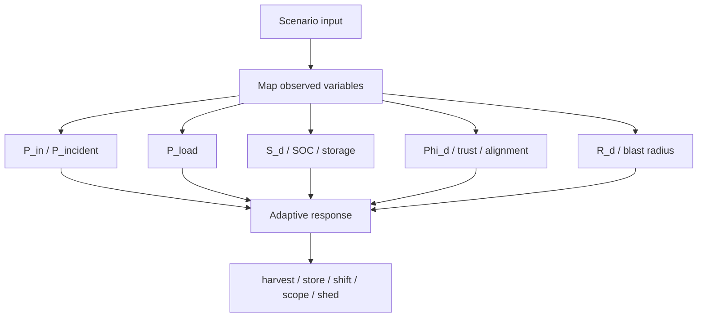

# Research Note 09 — Edge Cases and Synthesis for Adaptive Energy-Management

## NotebookLM Metadata

- **Source type:** Research collection note
- **Topic:** Edge cases, scenario iteration, and condensed synthesis for adaptive energy-management with sustained electromagnetism and broader energy spectra.

---

## 1. Edge Case Matrix

| Edge Case | Energy Domain | Failure Mechanism | Adaptive Response |
|---|---|---|---|
| High field, low coupling | EM near/far field | field exists but receiver captures little energy | retune, realign, increase aperture, reduce load |
| Ambient RF overestimated | RF harvesting | available power too low for continuous operation | duty cycle, add storage, lower-power electronics |
| Resonant detuning | WPT | frequency mismatch reduces transfer and increases loss | adaptive impedance matching and frequency tracking |
| Foreign-object heating | inductive/resonant WPT | unintended conductor absorbs energy | object detection and power throttling |
| Thermal runaway | battery/chemical/thermal | heat generation exceeds dissipation | derate, isolate, cool, disconnect |
| Solar intermittency | photovoltaic | weather/night cycles reduce input | forecast, store, shift load, diversify sources |
| Grid rebound peak | demand response | synchronized load return creates new peak | randomized restoration and staged control |
| Cyber-physical spoofing | smart grid/security | false sensor data misroutes energy | sensor fusion, anomaly detection, authenticated telemetry |
| Over-optimized efficiency | all domains | safety margin is removed | reserve constraints and fail-safe states |
| Access-energy overgrant | security/access | broad permission seems efficient but expands blast radius | least-privilege projection and JIT expiry |

---

## 2. Scenario A — Self-Powered Sensor Node

Goal: sustain an environmental sensor using solar plus RF harvesting.

```text
P_load_avg = 200 µW
P_solar_day_avg = 900 µW
P_rf_avg = 20 µW
η_storage = 0.85
night_duration = 14 h
```

Interpretation:

- Solar supplies the bulk energy.
- RF harvesting may support trickle charging or standby sensing but is unlikely to support continuous high-rate telemetry alone.
- Storage and duty cycling are required.

Adaptive response:

```text
sample faster when storage is high
sample slower when storage is low
transmit in bursts
prefer local inference over frequent radio transmission
```

---

## 3. Scenario B — Wireless Charging Pad

Goal: transfer power safely through inductive or resonant coupling.

Risks:

- coil misalignment,
- foreign-object heating,
- thermal buildup,
- electromagnetic interference,
- user exposure constraints.

Adaptive response:

```text
measure coupling coefficient
track temperature
detect foreign objects
throttle power
retune frequency
stop transfer on unsafe state
```

---

## 4. Scenario C — Smart Microgrid

Goal: coordinate solar, battery, EV charging, demand response, and critical loads.

Control variables:

```text
SOC_battery
solar_forecast
load_forecast
EV_departure_deadline
critical_load_priority
price_signal
grid_frequency
cyber_trust_score
```

Adaptive response:

```text
charge storage when renewable surplus exists
discharge during peaks
shift flexible loads
protect critical loads
island during grid instability
require authenticated telemetry for dispatch decisions
```

---

## 5. Scenario D — Security/Access as Energy Routing

Goal: route user capability without overheating risk.

```text
Access request = demand sink
User identity/device posture = coupling and alignment
Permission grant = transferred power
Audit logs = observability field
Least privilege = impedance matching
JIT expiry = duty cycling
Blast radius = unsafe field exposure
```

Adaptive response:

```text
grant scoped temporary access when coupling is good
add step-up when context is boundary-like
block when blast radius exceeds reversibility
learn energy weights from outcomes
```

---

## 6. Condensed Synthesis

Adaptive energy-management across thermal, electrical, electromagnetic, chemical, mechanical, informational, and security/access domains follows the same control pattern:

```text
sense → estimate → forecast → optimize → route/convert/store/dissipate → observe → learn
```

The electromagnetic spectrum adds a key lesson: sustained presence is not sustained usefulness. Energy must be coupled, converted, stored, and constrained safely. This maps directly back to access governance: a sustained identity session is not sustained trust; trust must be re-measured, context-coupled, scoped, logged, and decayed.

---

## 7. Final Combined Model

```text
E_total,useful = Σ_d [C_dI_dΦ_dη_d + S_d − L_d − R_d − D_d]
```

For electromagnetic channels:

```text
P_useful = P_incident · A_eff · η_capture · η_convert · Φ_align − P_loss − P_safety_margin
```

For security/access channels:

```text
H_sa = C_aΘΦ_context − μF + Ω_obs − Ξ_b(1 − Γ_r) − Σ_s
```

Unified rule:

```text
Useful adaptive energy is capacity times context-sensitive intensity, corrected by efficiency, storage, safety, loss, entropy, and reversibility.
```


### 7.1 Aligned Variable Mapping

| Scenario Variable | Shared Role | Related Equation |
|---|---|---|
| $P_load_avg$ | demand/load | continuity balance $P_load$ |
| $P_solar_day_avg$, $P_rf_avg$ | supply/input | $P_in$, $P_incident$ |
| $η_storage$ | efficiency | $η_d$ and storage reserve terms |
| `SOC_battery` | reserve state | $S_d$, $P_storage$ |
| `grid_frequency` | stability indicator | fluctuation and smart-grid control variable |
| `cyber_trust_score` | telemetry trust/context | $Φ_d$, $O_observe$ |
| `Blast radius` | risk penalty | $R_d$, $Ξ_b(1 − Γ_r)$ |



---

## 8. NotebookLM Closing Prompt Ideas

Ask NotebookLM:

1. "Compare $C_pT$ enthalpy with spectrum-aware adaptive energy-management."
2. "What edge cases distinguish sustained EM fields from sustained useful power?"
3. "How do smart-grid adaptive controls map to security/access controls?"
4. "Which variables should be measured before deciding whether to harvest, store, transfer, or dissipate energy?"
5. "How does least privilege resemble impedance matching or spectral alignment?"
