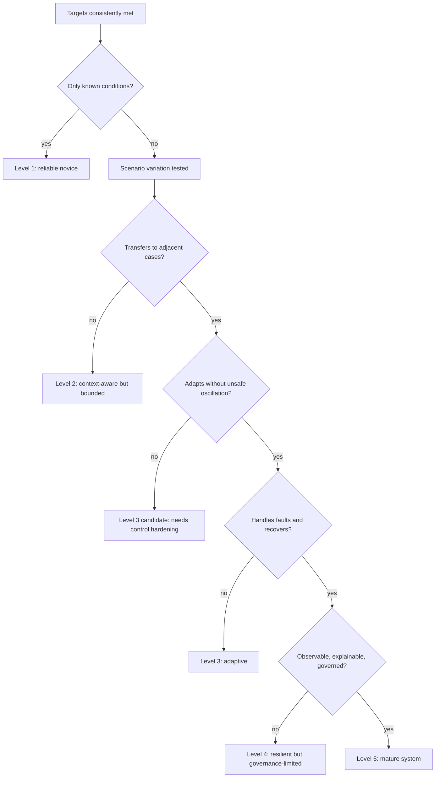

# Research Note 10 — Determining Maturity When Novice Systems Consistently Meet Targets

## NotebookLM Metadata

- **Source type:** Research collection note
- **Topic:** How to determine maturity of novice adaptive energy-management systems when their targets are consistently met.
- **Connection to prior notes:** Extends CpT/access-capacity and adaptive energy-management models by distinguishing short-term target attainment from mature, resilient, transferable capability.

---

## 1. Core Thesis

A novice system that consistently meets targets is not automatically mature. It may be mature, or it may be overfit to stable conditions, protected by hidden scaffolding, lucky under low variance, or achieving narrow metrics while accumulating fragility.

Maturity is determined by whether target attainment remains reliable when context shifts, constraints tighten, measurement improves, feedback delays appear, and safety/resilience requirements are included.

In adaptive-energy terms:

```text
Novice success = target output achieved under known conditions
Mature success = target output achieved with calibrated confidence, bounded risk, recoverability, and transfer across conditions
```

---

## 2. Target Attainment vs Maturity

| Dimension | Novice System Meeting Targets | Mature System Meeting Targets |
|---|---|---|
| Target scope | narrow and explicit | broad, contextual, multi-objective |
| Conditions | familiar, low-variance | changing, partially adversarial, noisy |
| Control | rule-based or supervised | adaptive, explainable, self-correcting |
| Energy margin | unknown or manually buffered | measured reserve and degradation margin |
| Failure response | escalates to operator or stalls | degrades gracefully and recovers |
| Observability | enough to report success | enough to explain, audit, predict, and improve |
| Transfer | works in training-like cases | works across adjacent domains and edge cases |
| Safety | assumed by environment | explicitly bounded and tested |
| Learning | local tuning | feedback-driven generalization |

---

## 3. Maturity Determination Formula

A synthetic maturity index:

```text
M_system = W_target · R_consistency · G_generalization · O_observability · S_safety · A_adaptivity · Q_quality / (F_fragility + D_drift + C_hidden)
```

| Symbol | Meaning |
|---|---|
| $M_system$ | system maturity index |
| $W_target$ | weighted target achievement across critical targets |
| $R_consistency$ | repeatability over time, operators, and conditions |
| $G_generalization$ | transfer to new but related scenarios |
| $O_observability$ | ability to measure internal state, decision basis, and energy flow |
| $S_safety$ | safety margin, exposure control, blast-radius limitation |
| $A_adaptivity$ | ability to adjust control policy without destabilizing |
| $Q_quality$ | quality of outputs, not just binary pass/fail |
| $F_fragility$ | sensitivity to small perturbations |
| $D_drift$ | degradation over time: battery aging, model drift, permission entropy |
| $C_hidden$ | hidden scaffolding: manual intervention, cherry-picked inputs, non-representative tests |

Interpretation: Maturity rises when target success is repeatable, explainable, safe, adaptable, and transferable. Maturity falls when success depends on narrow conditions or hidden support.

---

## 4. Novice-to-Mature Stage Ladder

| Stage | Description | Evidence Required to Advance |
|---|---|---|
| Level 0 — Demonstrator | target met once | reproducible result under same setup |
| Level 1 — Novice Reliable | target met consistently in known conditions | repeated runs, stable metrics, basic logs |
| Level 2 — Context-Aware | target met across planned variations | scenario matrix, context labels, bounded errors |
| Level 3 — Adaptive | adjusts to changing inputs without operator retuning | feedback loop, forecast response, controlled updates |
| Level 4 — Resilient | handles faults, noise, partial outages, and edge cases | graceful degradation, recovery time, safety margin |
| Level 5 — Mature | transfers across adjacent domains with governance and auditability | calibration, drift monitoring, policy controls, post-incident learning |

A novice system consistently meeting targets is usually Level 1. It becomes mature only after demonstrating Level 3–5 properties.

---

## 5. Energy-Management Maturity Signals

For adaptive energy-management with sustained electromagnetism or other energy spectra, maturity is determined by more than output power or target uptime.

| Signal | Novice Interpretation | Mature Interpretation |
|---|---|---|
| Power target met | load stayed powered | load stayed powered with known reserve and safe limits |
| Transfer efficiency high | good alignment in test | robust across distance, detuning, thermal drift, and interference |
| Storage sufficient | battery did not empty | state-of-charge forecast remains calibrated under weather/load uncertainty |
| RF harvesting works | sensor woke up | duty cycle, rectenna efficiency, and ambient variability are characterized |
| Smart-grid dispatch works | cost reduced | frequency, resilience, emissions, cyber trust, and rebound effects controlled |
| Safety threshold respected | no immediate unsafe reading | exposure, thermal, EMI, and failure-mode margins continuously monitored |

---

## 6. Security/Access Maturity Signals

The same maturity logic applies to security/access systems from the earlier notes.

| Signal | Novice Interpretation | Mature Interpretation |
|---|---|---|
| Access requests completed | users got access | users got least-privilege, time-bounded, auditable access |
| MFA pass rate high | authentication works | prompts are risk-based, fatigue-resistant, and phishing-resistant |
| Incidents low | system seems safe | low incidents plus tested detection, response, and red-team coverage |
| Tickets reduced | process is efficient | automation reduced toil without increasing privilege entropy |
| Policy followed | compliance achieved | compliance plus measurable risk reduction and explainable exceptions |

---

## 7. Calibration Tests for a Novice System That Meets Targets

To determine whether success is mature, run these maturity probes:

1. **Perturbation test:** vary load, threat, temperature, signal quality, user context, and demand timing.
2. **Transfer test:** apply the system to adjacent resources or conditions not used during tuning.
3. **Degradation test:** simulate battery aging, sensor drift, model drift, permission sprawl, or coil detuning.
4. **Recovery test:** disconnect a source, corrupt telemetry, add a false positive, or reduce observability.
5. **Safety-margin test:** verify bounded exposure, thermal headroom, cyber blast radius, and rollback paths.
6. **Operator-removal test:** remove hidden human intervention and check whether performance remains stable.
7. **Explainability test:** require the system to explain why it routed, stored, transferred, denied, or dissipated energy.
8. **Counterfactual test:** ask what would change the decision and whether the answer is physically and operationally plausible.

---

## 8. Maturity Decision Bands

```text
M_system < 0.30       novice / demonstration only
0.30 ≤ M_system < 0.55 reliable novice under known conditions
0.55 ≤ M_system < 0.75 context-aware and partially adaptive
0.75 ≤ M_system < 0.90 resilient and production-capable
M_system ≥ 0.90       mature, transferable, monitored, and continuously improving
```

These bands are illustrative. Each organization should calibrate them against safety requirements, regulatory obligations, mission criticality, and acceptable risk.

---

## 9. Mermaid — Maturity Gate for Target-Meeting Novice Systems



---

## 10. CpT Interpretation of Maturity

In the $C_pT$ metaphor:

```text
Novice system: has enough capacity to absorb expected heat
Mature system: has enough capacity, sensing, storage, and control to absorb unexpected heat without phase change
```

A novice access system can meet targets when threat temperature is stable. A mature access system stays balanced when threat temperature rises, context quality falls, observability is partial, or reversibility is low.

A novice electromagnetic energy system can meet targets when alignment and load are stable. A mature system remains safe and useful under detuning, interference, thermal drift, storage degradation, and changing demand.

---

## 11. Condensed Takeaway

Consistent target achievement is a maturity signal, not a maturity proof. Maturity is determined by repeatability, generalization, observability, safety margin, adaptive control, graceful degradation, recoverability, and absence of hidden scaffolding. A novice system becomes mature when it can keep meeting targets while conditions change and while its risks, losses, and degradation remain measured and bounded.
