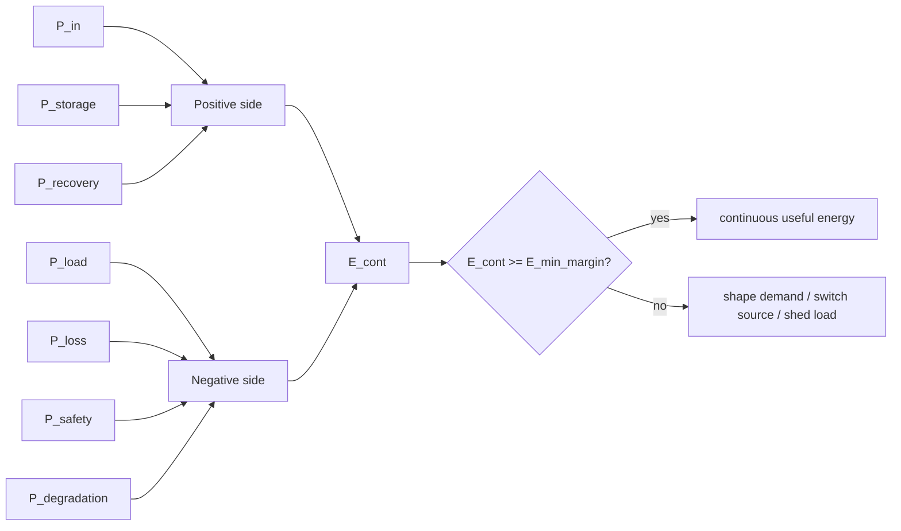
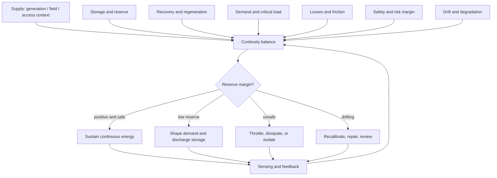

# Research Note 11 — Counter-Balance Required to Maintain Continuous Energy

## NotebookLM Metadata

- **Source type:** Research collection note
- **Topic:** What counter-balance maintains continuous usable energy across adaptive thermal, electrical, electromagnetic, storage, and security/access systems.
- **Connection to prior notes:** Extends $C_pT$, adaptive energy-management, sustained electromagnetism, novice-system maturity, and security/access counter-balance into a continuity model.

---

## 1. Core Thesis

Continuous energy is not maintained by constant generation alone. It is maintained by a counter-balance among supply, demand, storage, conversion efficiency, dissipation, safety margins, and adaptive feedback.

The simplest statement is:

```text
Continuous usable energy exists when inflow + stored reserve + recoverable conversion ≥ demand + losses + safety reserve + degradation.
```

A system fails continuity when any side of the balance becomes unmanaged:

- supply fluctuates faster than the system can compensate,
- demand spikes faster than storage or routing can respond,
- losses grow silently,
- storage degrades,
- conversion detunes,
- safety limits require throttling,
- feedback becomes delayed or untrusted.

---

## 2. Counter-Balance Equation

A general continuity balance:

```text
E_cont(t) = [P_in(t) + P_storage(t) + P_recovery(t)] − [P_load(t) + P_loss(t) + P_safety(t) + P_degradation(t)]
```

Continuity condition:

```text
E_cont(t) ≥ E_min_margin for all critical time windows
```

| Term | Meaning |
|---|---|
| $P_in(t)$ | real-time incoming power or capability |
| $P_storage(t)$ | available discharge from storage/reserve |
| $P_recovery(t)$ | recoverable energy from regeneration, waste heat, feedback, or reversible controls |
| $P_load(t)$ | required demand/load |
| $P_loss(t)$ | conversion, path, friction, thermal, leakage, or governance loss |
| $P_safety(t)$ | energy withheld to satisfy thermal, exposure, cyber, or blast-radius constraints |
| $P_degradation(t)$ | aging, drift, entropy, fouling, fatigue, battery degradation, permission sprawl |
| $E_min_margin$ | minimum reserve margin needed to avoid collapse or unsafe operation |


### 2.1 Aligned Variable Mapping

| Continuity Variable | Shared Role | Maps To Other Notes |
|---|---|---|
| $P_in(t)$ | input intensity | $I_d$, $P_incident$, $Θ$ |
| $P_storage(t)$ | reserve capacity | $S_d$, $R_reserve$, trust cache |
| $P_recovery(t)$ | recoverability | $Γ_r$, regeneration, waste-heat recovery |
| $P_load(t)$ | demand sink | access request, critical load, useful output target |
| $P_loss(t)$ | loss/friction | $L_d$, $μF$, path loss |
| $P_safety(t)$ | safety reserve | $R_d$, blast-radius and exposure margin |
| $P_degradation(t)$ | drift/degradation | $D_d$, $D_drift$, permission entropy |
| $E_min_margin$ | continuity threshold | required reserve for mature fluctuation handling |



---

## 3. The Counter-Balance Components

| Counter-Balance Component | Physical Energy Meaning | Security/Access Meaning |
|---|---|---|
| Supply diversity | solar, grid, battery, RF, chemical, thermal sources | multiple authenticated paths, break-glass, delegated fallback |
| Storage buffer | battery, capacitor, thermal mass, flywheel | trust cache, JIT grants, documented exception paths |
| Demand shaping | demand response, duty cycling, load shedding | least privilege, queueing, scoped access, rate limiting |
| Conversion efficiency | inverter, rectenna, converter, heat exchanger efficiency | decision efficiency, low-friction controls, automation |
| Dissipation channel | cooling, grounding, dumping excess load | incident containment, token revocation, session termination |
| Safety margin | exposure, thermal, voltage, current, SOC reserve | blast-radius limits, reversibility, auditability |
| Feedback loop | sensors, forecasting, control updates | observability, anomaly detection, policy telemetry |
| Degradation control | maintenance, recalibration, replacement | access review, drift detection, stale-role cleanup |

---

## 4. Continuous Energy Is Dynamic Equilibrium

Continuous energy is not static. It is a dynamic equilibrium:

```text
source variability ↔ storage reserve ↔ demand flexibility ↔ conversion losses ↔ safety boundaries ↔ feedback adaptation
```

If generation is high but storage is absent, continuity fails during interruptions. If storage is high but demand is unconstrained, continuity fails during spikes. If demand is controlled but feedback is false, continuity fails through misrouting. If safety margins are ignored, continuity may appear successful until it becomes unsafe.

---

## 5. Sustained Electromagnetism Counter-Balance

For sustained electromagnetic power transfer or harvesting:

```text
P_useful = P_incident · A_eff · η_capture · η_convert · Φ_align − P_path_loss − P_heat − P_safety_margin
```

Continuity requires:

```text
P_useful + P_storage ≥ P_load + P_startup + P_comm + P_margin
```

The counter-balance is:

| Need | Counter-Balance |
|---|---|
| Continuous field | continuous safe source and regulatory compliance |
| Continuous coupling | alignment, resonance tracking, impedance matching |
| Continuous conversion | rectifier/inverter efficiency and thermal control |
| Continuous load service | storage, duty cycling, and load prioritization |
| Continuous safety | exposure limits, thermal monitoring, foreign-object detection |
| Continuous reliability | fallback source if field collapses or detunes |

A sustained field without storage and control is only a condition. Sustained useful energy requires managed coupling plus reserve.

---

## 6. Smart-Grid Counter-Balance

For smart grids and microgrids:

```text
Continuous service = generation portfolio + storage + demand response + grid-forming control + protection + cyber-trusted telemetry
```

| Instability | Counter-Balance |
|---|---|
| renewable intermittency | storage, forecasting, flexible loads, geographic diversity |
| peak demand | demand response, price signals, staged restoration |
| frequency deviation | grid-forming inverters, reserves, fast dispatch |
| congestion | topology-aware routing and local DER dispatch |
| cyber-physical spoofing | authenticated telemetry and anomaly detection |
| battery degradation | state-of-health tracking and conservative dispatch |

---

## 7. Thermal $C_pT$ Counter-Balance

In the $C_pT$ frame:

```text
thermal continuity = heat capacity + heat input − heat losses − safety derating
```

High heat capacity buffers temperature changes, but continuous usable thermal energy still requires:

1. controlled input,
2. insulation or heat recovery,
3. heat exchange to avoid unsafe buildup,
4. reserve thermal mass,
5. phase-change or storage media when demand fluctuates.

The counter-balance is not simply more heat. It is heat plus capacity plus controlled dissipation.

---

## 8. Security/Access Counter-Balance for Continuous Capability

For security/access systems:

```text
H_cont = C_aΘΦ_context + Ω_obs + R_recovery − μF − Ξ_b(1 − Γ_r) − Σ_s − D_drift
```

Continuous governed capability exists when:

```text
H_cont ≥ H_min for each critical workflow
```

| Continuity Threat | Counter-Balance |
|---|---|
| user friction grows | automate approvals, improve UX, reduce low-value controls |
| threat temperature rises | increase context checks and observability |
| privilege entropy grows | periodic access review and least-privilege projection |
| identity confidence decays | trust half-life and re-authentication |
| blast radius grows | scoped JIT access and reversibility controls |
| telemetry weakens | deny risky access or instrument before granting |

Continuous access is not unfettered access. It is a sustained ability to act safely because permissions, observability, context, and revocation remain balanced.

---

## 9. Counter-Balance as a Control Law

A practical controller can follow:

```text
if reserve_margin low:
    reduce noncritical load
    increase storage discharge
    acquire alternate supply
elif safety_margin low:
    throttle transfer
    dissipate heat
    narrow permissions or reduce blast radius
elif forecasted demand rising:
    precharge storage
    preauthorize scoped access
    stage demand response
else:
    optimize efficiency and reduce degradation
```

This control law applies to batteries, RF sensors, microgrids, thermal systems, and access governance.

---

## 10. Mermaid — Continuous Energy Counter-Balance



---

## 11. Final Condensed Answer

The counter-balance to maintain continuous energy is **adaptive reserve management**: match variable supply to variable demand using storage, conversion efficiency, demand shaping, safe dissipation, observability, degradation control, and feedback. Continuous energy is sustained when the system preserves a positive reserve margin while staying inside safety limits and correcting drift before it becomes failure.
