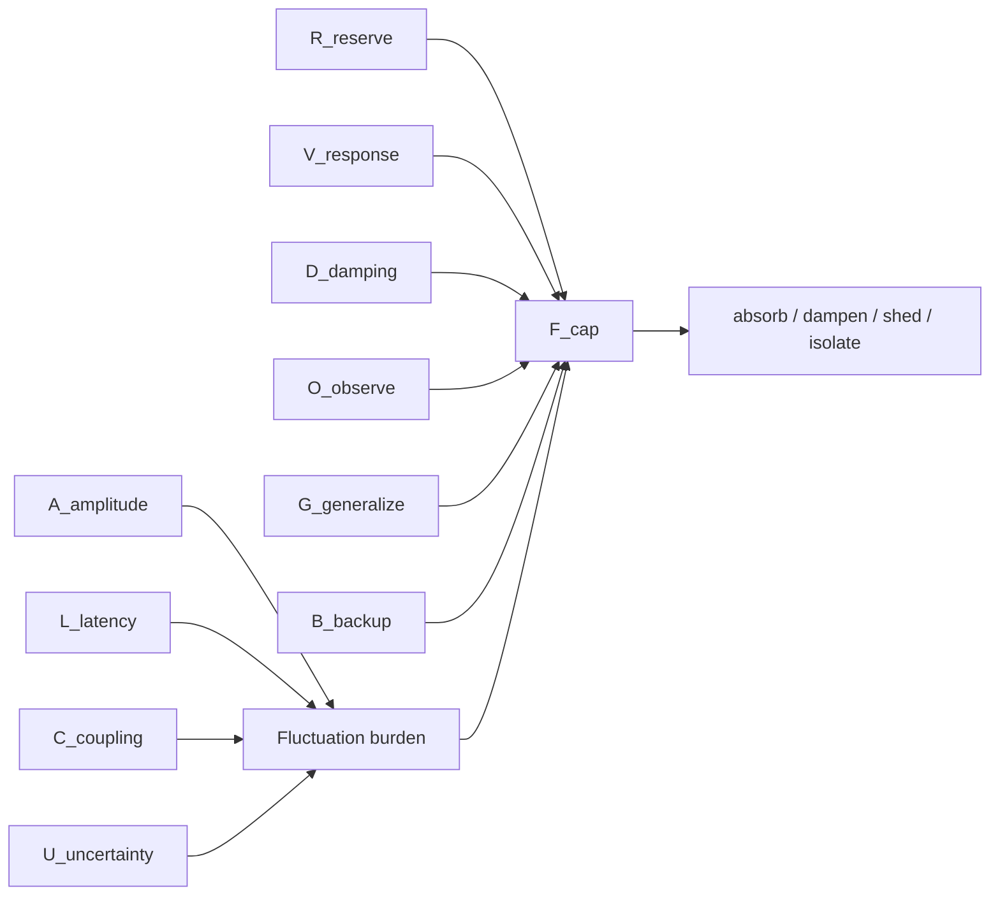
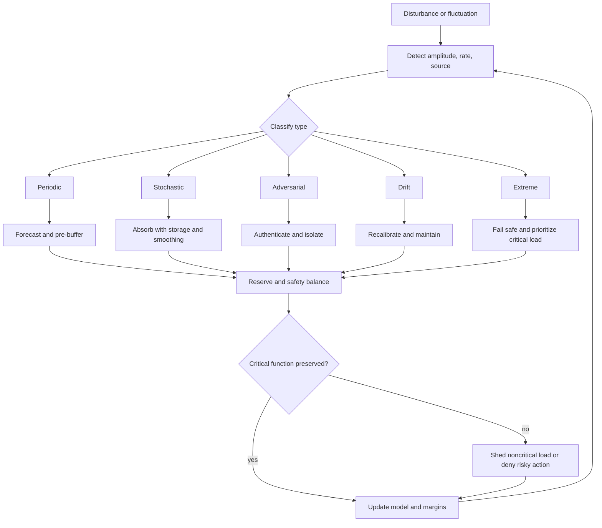

# Research Note 12 — Fluctuation-Handling Capability and Edge Cases

## NotebookLM Metadata

- **Source type:** Research collection note
- **Topic:** What makes an adaptive energy-management system capable of handling fluctuation, including edge cases across electromagnetic, smart-grid, thermal, storage, and security/access domains.
- **Connection to prior notes:** Extends continuous-energy counter-balance and novice-system maturity into disturbance tolerance, reserve margins, oscillation control, and edge-case recovery.

---

## 1. Core Thesis

A system is capable of handling fluctuation when it can absorb, predict, route around, dampen, or safely shed disturbances without losing critical function or violating safety limits.

In energy terms:

```text
Fluctuation capability = reserve + responsiveness + damping + observability + safe fallback + learning
```

In the $C_pT$ analogy, heat capacity buffers temperature fluctuation. In adaptive energy-management, the equivalent buffer is broader: storage, elasticity, control latency, redundancy, safety margin, and policy intelligence.

---

## 2. Fluctuation Capability Equation

```text
F_cap = (R_reserve · V_response · D_damping · O_observe · G_generalize · B_backup) / (A_amplitude · L_latency · C_coupling · U_uncertainty)
```

| Symbol | Meaning |
|---|---|
| $F_cap$ | fluctuation-handling capability |
| $R_reserve$ | reserve capacity: battery, thermal mass, trust margin, spare compute, alternate route |
| $V_response$ | response velocity: how fast controls react safely |
| $D_damping$ | damping ability: ability to prevent oscillation/ringing/rebound |
| $O_observe$ | observability of disturbance source and system state |
| $G_generalize$ | ability to handle unseen but related fluctuations |
| $B_backup$ | backup path availability |
| $A_amplitude$ | magnitude of fluctuation |
| $L_latency$ | sensing, decision, and actuation delay |
| $C_coupling$ | harmful coupling between subsystems |
| $U_uncertainty$ | uncertainty in forecast, measurement, or adversary behavior |

Capability is high when reserve, fast response, damping, observability, generalization, and backups dominate amplitude, latency, coupling, and uncertainty.


### 2.1 Aligned Variable Mapping

| Fluctuation Variable | Shared Role | Related Variable Family |
|---|---|---|
| $R_reserve$ | reserve capacity | $S_d$, $P_storage$, thermal mass, trust margin |
| $V_response$ | response velocity | control efficiency $η_d$, actuation speed |
| $D_damping$ | stability control | hysteresis, damping, oscillation suppression |
| $O_observe$ | observability | $Ω_obs$, telemetry trust, state estimation |
| $G_generalize$ | maturity transfer | $G_generalization$, scenario coverage |
| $B_backup$ | fallback supply/path | supply diversity, break-glass, alternate source |
| $A_amplitude$ | disturbance intensity | $I_d$, $Θ$, load spike, field fading |
| $L_latency$ | delay loss | sensing, decision, actuation, propagation delay |
| $C_coupling$ | harmful coupling | resonance, cascade, blast radius |
| $U_uncertainty$ | ambiguity | forecast error, adversarial uncertainty, sensor noise |



---

## 3. Fluctuation Types

| Fluctuation Type | Example | Primary Risk | Countermeasure |
|---|---|---|---|
| periodic | day/night solar cycle, business-hour access demand | predictable peaks | forecasting and scheduled storage |
| stochastic | cloud cover, RF fading, user bursts | noisy mismatch | probabilistic reserve and smoothing |
| adversarial | cyber spoofing, abuse spikes, jamming | intentional instability | authenticated telemetry and anomaly response |
| step change | sudden load connection, emergency access surge | shock/overshoot | fast reserve and staged ramping |
| drift | battery aging, permission entropy, sensor bias | hidden degradation | recalibration and review cycles |
| oscillation | demand-response rebound, controller hunting | instability | damping, hysteresis, randomized restoration |
| phase transition | incident mode, thermal runaway, islanding | qualitative regime shift | mode switch and fail-safe policy |
| rare extreme | storm outage, geomagnetic disturbance, cascading breach | correlated failures | black-start/fallback playbooks and isolation |

---

## 4. Edge Cases by Domain

### 4.1 Electromagnetic and Wireless Power

| Edge Case | Failure Mechanism | Required Capability |
|---|---|---|
| receiver misalignment | coupling drops suddenly | alignment sensing and adaptive tuning |
| resonance detuning | temperature or distance shifts frequency response | frequency tracking and impedance matching |
| RF fading | multipath and body shadowing reduce power | storage, diversity antennas, duty cycling |
| foreign-object heating | metal object absorbs field energy | object detection and automatic throttling |
| EMI conflict | power transfer disrupts communications/sensors | spectrum monitoring and channel avoidance |
| safety-limit throttling | exposure or thermal limit reached | alternate source or lower duty cycle |

### 4.2 Smart Grid and Microgrid

| Edge Case | Failure Mechanism | Required Capability |
|---|---|---|
| renewable ramp-down | clouds/wind drop generation | fast storage discharge and load shedding |
| EV charging cluster | simultaneous charging spike | staggered scheduling and price response |
| rebound peak | loads return at once after demand response | randomized restart and staged ramp |
| islanding event | grid disconnects suddenly | grid-forming inverter and priority loads |
| false telemetry | spoofed sensor data causes bad dispatch | sensor fusion and signed measurements |
| storage state error | SOC estimate wrong | conservative reserve and recalibration |

### 4.3 Thermal and Chemical Storage

| Edge Case | Failure Mechanism | Required Capability |
|---|---|---|
| thermal shock | rapid temperature swing stresses material | ramp limits and thermal mass |
| heat-soak delay | temperature rises after load drops | predictive cooling and cooldown margin |
| battery cold start | low temperature reduces power delivery | preconditioning and alternate source |
| thermal runaway | self-heating accelerates failure | isolation, cooling, disconnect, containment |
| phase-change saturation | latent storage fully melts/freezes | secondary storage or load reduction |

### 4.4 Security/Access and Information Energy

| Edge Case | Failure Mechanism | Required Capability |
|---|---|---|
| access request surge | many users need privilege at once | queueing, JIT automation, rate limits |
| incident-mode privilege spike | emergency requires rapid elevation | break-glass with audit and expiry |
| MFA fatigue spike | repeated prompts reduce security | risk-based prompts and phishing-resistant methods |
| telemetry blind spot | decisions made without visibility | deny high-risk action or instrument first |
| privilege drift | temporary grants become permanent | automatic expiry and access review |
| adversarial context injection | false context manipulates decisions | context authentication and cross-checking |

---

## 5. Fluctuation-Handling Control Pattern

```text
1. Detect amplitude, rate, source, and confidence.
2. Classify fluctuation: periodic, stochastic, adversarial, drift, oscillation, phase shift, extreme.
3. Select response: absorb, dampen, route, store, shed, isolate, or fail safe.
4. Preserve reserve margin.
5. Verify safety limits.
6. Observe recovery and update model weights.
```

---

## 6. Mermaid — Fluctuation Capability Controller



---

## 7. Maturity Tie-In

A novice system can meet targets in steady conditions but still fail fluctuation handling. A mature system proves capability by passing fluctuation probes:

```text
steady-state success + perturbation tolerance + recovery + safe degradation = maturity evidence
```

Test ladder:

1. same-condition repeatability,
2. bounded periodic variation,
3. random noise and missing data,
4. step changes and surge loads,
5. adversarial or spoofed inputs,
6. correlated failures,
7. recovery and post-event learning.

---

## 8. Continuous-Energy Tie-In

Continuous energy is preserved when fluctuation does not make the continuity balance negative:

```text
E_cont(t) = P_in + P_storage + P_recovery − P_load − P_loss − P_safety − P_degradation
```

During fluctuation, the system must keep:

```text
E_cont(t) ≥ E_min_margin
```

If not, the adaptive controller must shed noncritical load, switch sources, reduce duty cycle, narrow access scope, or isolate unsafe subsystems.

---

## 9. Condensed Answer

A system capable of handling fluctuation has enough reserve to absorb disturbance, enough observability to detect it, enough response speed to act before collapse, enough damping to prevent oscillation, enough safety margin to avoid harm, enough backup paths to preserve critical function, and enough learning to improve after each event. Edge cases test whether target success survives misalignment, drift, spikes, spoofing, detuning, intermittency, thermal runaway, and rare correlated failures.
