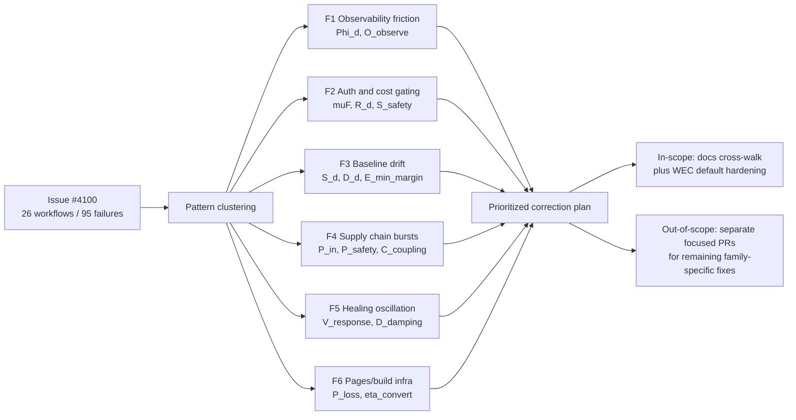

# Research Note 13 — CI Failure Triage (#4100) ↔ Adaptive-Energy Deep Research Cross-Walk

## NotebookLM Metadata

- **Source type:** Application/cross-walk note
- **Topic:** Operationalizing the adaptive-energy and CpT deep research packet against the live CI failure triage report (issue #4100, generated 2026-04-27).
- **Scope:** Repository explanation, failure-pattern mapping into the packet's variable grammar, and a prioritized correction plan.
- **In-scope correction for this PR:** documentation cross-walk plus WEC default/template hardening for the F2/F5 continuation-loop path. Broader workflow and branch-specific fixes still require focused PRs on the affected branches.

---

## 1. Repository Explanation (Operational Snapshot)

The `Aries-Serpent/_codex_` repository is a large, polyglot ML platform with strong governance and CI scaffolding. Key working areas:

| Area | Purpose | Representative Paths |
|---|---|---|
| Core ML platform | Training, evaluation, serving | `src/`, `codex_ml/`, `training/`, `models/` |
| Cognitive brain + agents | Decision engine, memory, 153+ specialized agents | `cognitive/`, `cognitive_app/`, `.github/agents/` |
| MCP ecosystem | Model Context Protocol adapters, workers | `src/mcp/`, `services/` |
| CI / governance | Workflows, gates, auto-fix, watchdogs | `.github/workflows/`, `scripts/ci/` |
| Deep research | NotebookLM-ready research packets | `docs/deep_research/<date>/` |
| Configs & policies | Hydra configs, allowlists, policies | `configs/`, `policies/`, `.codex/` |
| Tests | Pytest, nox, mutation, fragility | `tests/`, `noxfile.py`, `pytest.ini` |

CI is governed by a **Workflow Execution Checklist (WEC)** parsed from PR bodies. Five gates always fire (`pre-merge-validation`, `comment-review-gate`, `deferral-language-gate`, `agent-auth-delegation`, `workflow-execution-gate`); other workflows are opt-in. Auto-healing patterns are encoded in `scripts/ci/auto_fix_common_issues.py`, and tracked-file integrity is enforced by `scripts/ci/sync_tracked_files.py`. The deep research packet under `docs/deep_research/2026_04_27/` (notes 01–12) defines a unified variable grammar across thermal, electrical, electromagnetic, informational, and security/access energy.

## 2. How the Deep Research Becomes Immediately Applicable to CI

The adaptive-energy packet expresses every system as supply, capacity, context, efficiency, loss, risk, reserve, drift, and fluctuation. CI is a control system with the same shape: workflow throughput is "useful energy," failures are "loss," repeated retries are "fluctuation," reserves are "tracked-file baselines and caches," and observability is "logs/artifacts." The packet's equations therefore become a triage lexicon for `#4100`:

```text
CI useful throughput
  = (workflow capacity) · (input intensity) · (context alignment) · (efficiency)
  − (loss + risk + degradation)
  + (reserve recovery).
```

This lets every failing workflow be classified by the same axes used for adaptive energy-management (notes 07, 11, 12) and maturity (note 10).

## 3. Issue #4100 Failure Pattern Map

The 26 failing workflows in #4100 cluster into 6 packet-aligned families. The mapping uses variables defined in notes 03, 07, 09, 10, 11, and 12.

| Family | Failing Workflows in #4100 | Packet Variables | Primary Failure Class |
|---|---|---|---|
| F1 — Telemetry/observability friction | `Generate PR Follow-Up Prompt`, `QA Walkthrough Agent`, `Session Watchdog`, `Session Incremental Summary Reminder`, `🔍 Proactive CI Monitor`, `🔍 Issue Resolution Gate`, `Copilot Issue Triage` | $Φ_d$ (context), $O_observe$ (observability), $U_uncertainty$ | comment/posting/permissions-shaped failures; degraded $O_observe$ |
| F2 — Agent/auth and cost gating | `Agent Token Delegation`, `💰 PR Cost Check`, `Workflow Execution Gate`, `🚨 Deferral Language Gate`, `PR Comment Review Gate` | $μF$ (governed friction), $R_d$ (risk penalty), $S_safety$ | governance enthalpy mismatch / WEC parsing / token chain |
| F3 — Tracked-file & baseline drift | `🔐 Secrets Baseline Enforcer`, `Auto-Fix Common CI Issues`, `PR Auto-Fix Check`, `Pre-Merge Validation`, `Validation Pipeline`, `Resilient Validation Suite` | $S_d$ (reserve), $D_d$ / $D_drift$, $E_min_margin$ | reserve drift in baselines/manifests/auto-fix patterns |
| F4 — Dependency and supply chain | `Automatic Dependency Submission`, `Dependency Graph`, `📦 Dependabot Auto-Absorb`, `Security Scanning Suite (CodeQL python/js)`, `CodeQL` | $P_in(t)$ (supply), $P_safety$, $C_coupling$ | supply-side fluctuation and coupling under Dependabot bursts |
| F5 — Self-healing/iteration loops | `Iterative Self-Healing CI`, `Auto-Fix Common CI Issues` (loop dimension) | $V_response$, $D_damping$, $L_latency$ | oscillation and undamped retry under correlated fluctuation |
| F6 — Pages/build infra | `pages-build-deployment`, `Root Organization Validation` | $P_loss$, $η_convert$ | conversion/path loss in deploy/move steps |

Each family corresponds to a known packet failure mode (notes 09 §4 and 12 §3): RF fading and detuning ≈ F1, blast-radius and access surge ≈ F2, reserve depletion and drift ≈ F3, supply intermittency ≈ F4, oscillation/rebound ≈ F5, conversion/thermal ≈ F6.

## 4. Cross-Walk Diagram



## 5. Prioritized Correction Plan

Priority is assigned using the maturity equation (note 10) and continuity counter-balance (note 11): items that restore observability and reserve come first; cosmetic gates come last.

### Priority 1 — Restore reserve and prevent drift (F3)

- After any auto-merge that touches tracked files, run `python scripts/ci/sync_tracked_files.py --fix` and recommit. Drift in `.secrets.baseline`, `CODEX_MANIFEST.json`, or auto-fix scorecards causes Pre-Merge, Validation Pipeline, and Secrets Baseline Enforcer to fail in lockstep.
- Confirm `_WEC_NEVER_CHECK` continues to hold `auto-approve-workflows`, `copilot-iterative-self-healing.yml`, and `copilot-agent-session-done.yml` unchecked, preventing F5 oscillation.
- Keep `_WEC_ITEMS` aligned with the canonical 7 required gates only (5 always-required plus `copilot-agent-checkin.yml` and `cost-gate.yml`).

### Priority 2 — Stabilize agent/auth and cost gates (F2)

- Verify `GH_TOKEN` chain `CODEX_MASTER_KEY || CODEX_BACKUP_KEY || github.token` is used by `agent-auth-delegation.yml` and any variable/secret CRUD step. Bare `github.token` returns 403 on the variables/secrets API.
- Validate WEC parsing on the failing PR bodies: filenames in the checklist must match exactly, and gate-required items must remain checked.
- Confirm Deferral-Language Gate exemptions (`pre-?existing\s+errors?\s+visible\s+after`) are still authoritative and not overbroad.

### Priority 3 — Tame supply-chain bursts (F4)

- For Dependabot floods, throttle CodeQL and Security Scanning to the configured matrix only and ensure `actions/checkout` + dependency submission tokens are scoped correctly.
- Add coexistence policy: do not run heavy supply-chain workflows on every Dependabot bump simultaneously; prefer batched absorption via `📦 Dependabot Auto-Absorb`.

### Priority 4 — Damp self-healing oscillation (F5)

- Keep `CODEX_SKIP_PATTERN_NUMS=30` as a damping mechanism for the auto-fix loop's merge-readiness scorecard call.
- Treat repeated `🔄 Universal baseline sweep` failures on `main` as a signal to reduce concurrency and add hysteresis (delay before a re-run).

### Priority 5 — Restore telemetry/observability (F1)

- For `Generate PR Follow-Up Prompt`, `QA Walkthrough Agent`, `Session Watchdog`, and Copilot Issue Triage failures, verify GitHub App token scopes for `pull_requests:write` and `issues:write`, and confirm artifact download steps reference current run IDs.

### Priority 6 — Fix conversion/path loss (F6)

- For `pages-build-deployment` and `Root Organization Validation`, validate that move/comment steps respect repo write scopes and that the Pages source/target branches are configured per `.codex/AGENTIC_REPO_STATE.md`.

### Remaining Follow-On Fixes Beyond This PR

This PR now carries the cross-walk and the WEC default/template hardening that directly reduces F2/F5 governance and continuation-loop risk on `copilot/research-security-vs-access` → `main`. The remaining corrections in P1–P6 still span additional workflow YAML, dependabot branches, or branch-specific incidents, so they should continue as focused fixes keyed off this note's family map.

## 6. Maturity Verdict for the CI System (per Note 10)

Applying $M_system$ from note 10:

| Variable | Current Signal | Reading |
|---|---|---|
| $W_target$ | many gates pass on green PRs, but not consistently across Dependabot bursts | partial |
| $R_consistency$ | repeated identical failures on F3/F4 indicate weak repeatability under load | low |
| $G_generalization$ | gates work in steady state, fail under correlated stress | medium-low |
| $O_observability$ | strong: triage report itself + artifacts | high |
| $S_safety$ | safety gates remain enforced even when noisy | high |
| $A_adaptivity$ | self-healing exists but oscillates | medium |
| $Q_quality$ | code review and CodeQL remain effective when they run | medium-high |
| $F_fragility$ | high during Dependabot bursts | high |
| $D_drift$ | tracked-file drift recurs after auto-merge | medium-high |
| $C_hidden$ | some workflows depend on tokens/permissions not visible in PR body | medium |

**Conclusion:** the CI system is a "developing" system in note 10 terminology. It meets targets in steady state but loses repeatability under correlated supply-chain and self-healing stress. The plan above addresses fragility ($F_fragility$), drift ($D_drift$), and damping ($D_damping$) first, which is the same order recommended by the maturity model.

## 7. NotebookLM Use

When NotebookLM is asked about CI failures in this repo, this note should be cited together with notes 07, 09, 10, 11, and 12. The cross-walk gives NotebookLM a stable mapping from real run URLs to the packet's variable grammar, so explanations remain consistent across sessions and across triage cycles.
