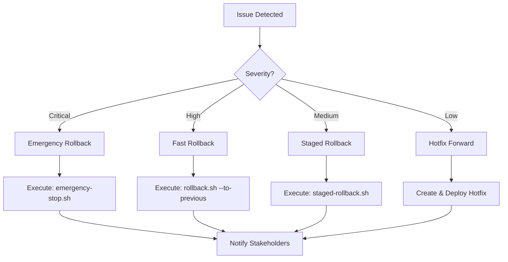

# Rollback Procedures

**Version:** 1.0.0  
**Created:** 2026-01-18  
**Phase:** 18.3 - Deployment Automation  
**Status:** ✅ Production Ready

---

## Overview

This document outlines rollback procedures for the Codex platform. Follow these steps to safely revert to a previous known-good state in case of deployment issues.

---

## Quick Reference

### Immediate Rollback (< 5 minutes)

```bash
# Option 1: Revert to previous deployment
./scripts/rollback.sh --to-previous

# Option 2: Revert to specific version
./scripts/rollback.sh --version 1.2.3

# Option 3: Emergency stop
./scripts/emergency-stop.sh
```

---

## Rollback Decision Tree



---

## Rollback Scenarios

### Scenario 1: Application Crash

**Symptoms:**
- 5xx errors increasing
- Service unresponsive
- Health checks failing

**Actions:**
```bash
# 1. Stop the problematic deployment
systemctl stop codex-api

# 2. Restore previous version
pip install codex==PREVIOUS_VERSION

# 3. Restart services
systemctl start codex-api

# 4. Verify health
curl http://localhost:8000/health
```

### Scenario 2: Database Migration Failure

**Symptoms:**
- Database connection errors
- Data integrity issues
- Migration incomplete

**Actions:**
```bash
# 1. Stop application
systemctl stop codex-api codex-worker

# 2. Rollback migration
python -m codex.cli migrate --rollback 1

# 3. Verify database state
python -m codex.cli db-check

# 4. Restart services
systemctl start codex-api codex-worker
```

### Scenario 3: Performance Degradation

**Symptoms:**
- Response times increasing
- High CPU/memory usage
- Request timeouts

**Actions:**
```bash
# 1. Scale down new instances
./scripts/scale.sh --replicas 0 --version NEW

# 2. Scale up old instances
./scripts/scale.sh --replicas 3 --version OLD

# 3. Verify performance
ab -n 1000 -c 10 http://localhost:8000/api/health
```

### Scenario 4: Security Vulnerability

**Symptoms:**
- Security alert triggered
- Unauthorized access detected
- Data breach suspected

**Actions:**
```bash
# 1. Emergency stop (isolate)
./scripts/emergency-stop.sh

# 2. Enable maintenance mode
./scripts/maintenance.sh --enable

# 3. Investigate and patch
# ... investigation steps ...

# 4. Deploy patched version
./scripts/deploy.sh --version PATCHED

# 5. Disable maintenance mode
./scripts/maintenance.sh --disable
```

---

## Rollback Checklist

### Before Rollback

- [ ] Confirm the issue is deployment-related
- [ ] Notify on-call team
- [ ] Document current state (logs, metrics)
- [ ] Identify rollback target version

### During Rollback

- [ ] Execute rollback procedure
- [ ] Monitor rollback progress
- [ ] Verify service restoration
- [ ] Check data integrity

### After Rollback

- [ ] Verify all health checks pass
- [ ] Confirm issue resolution
- [ ] Update incident timeline
- [ ] Notify stakeholders
- [ ] Schedule post-mortem

---

## Version History

Maintain a record of deployed versions for quick rollback reference:

| Version | Deploy Date | Status | Notes |
|---------|------------|--------|-------|
| 1.3.0 | 2026-01-18 | Current | Phase 14-18 Complete |
| 1.2.5 | 2026-01-15 | Available | Last stable |
| 1.2.4 | 2026-01-10 | Available | Security patch |
| 1.2.3 | 2026-01-05 | Archived | - |

---

## Communication Templates

### Initial Notification

```
🔴 INCIDENT: Rollback Initiated

Service: Codex Platform
Severity: [Critical/High/Medium]
Status: Rollback in progress

Current Version: X.Y.Z
Target Version: A.B.C

Timeline:
- HH:MM - Issue detected
- HH:MM - Rollback started

Updates: #incident-channel
```

### Resolution Notification

```
🟢 RESOLVED: Rollback Complete

Service: Codex Platform
Duration: XX minutes

Summary:
- Issue: [Brief description]
- Resolution: Rolled back to version A.B.C
- Impact: [Affected users/operations]

Next Steps:
- Post-mortem scheduled for [date]
- Hotfix in progress
```

---

## Testing Rollback Procedures

### Monthly Drill

1. Schedule rollback drill (non-production)
2. Execute full rollback procedure
3. Measure time to recovery
4. Document improvements

### Validation Criteria

| Metric | Target | Acceptable |
|--------|--------|------------|
| Time to Rollback | < 5 min | < 15 min |
| Data Integrity | 100% | 100% |
| Service Restoration | < 2 min | < 5 min |

---

**Owner:** Platform Engineering  
**Review Cadence:** Monthly  
**Last Updated:** 2026-01-18
